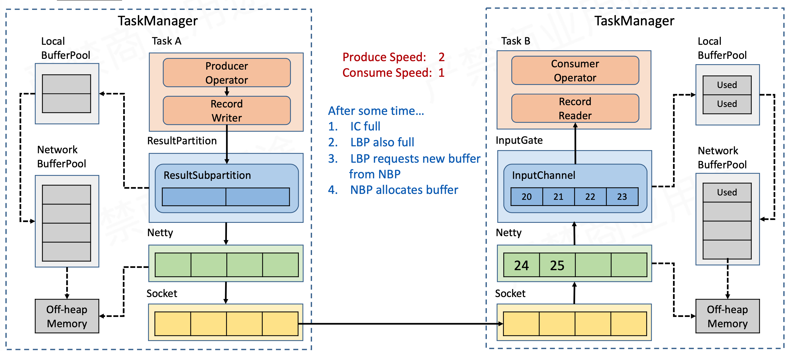

# Flink 反压

## 网络流控的概念与背景

### 为什么需要网络流控


如上图所示，producer 的生产速率是明显快于 consumer 的消费速率，速度差为 1 mb/s, 同时两端都有一个 buffer ，同时网络的吞吐率是 2mb/s， 5s 之后，接收端的buffer 将满，会面临 2 种情况：
  * 1、bounded receive buffer：有界阻塞buffer 队列，consumer 会丢弃新达到的数据
  * 2、unbounded receive buffer，buffer 持续扩张，耗尽 consumer 内存。

### 流控的实现：静态限速 VS 动态反馈/自动反压

#### 静态限速


为了解决上述问题，我们需要一个网络流控来解决上下游流控的速度差。传统的做法是比如说用一个 像 Guava RateLimiter 这一的基于令牌桶的一个限流算法，比如说 producer 的发送速率是 2mb/s, 但是经过 限流之后，发送到 send buffer 的数据就是 1MB/s ，这样上下游的速率一致，就不会导致下游的阻塞，但是限流算法有如下 2 个限制：
  * 1、通常无法事先预估 consumer 端能承受的最大速率
  * 2、consumer 承受能力通常会动态地波动

#### 动态反馈/自动反压


为了解决上述 2 个限制，我们需要 consumer 来实现自动的 feedback，也可以叫做自动反压，从 consumer 端返回给 producer 端正负的反馈：
  * 1、负反馈：接收速率小于发送速率时产生
  * 2、正反馈：接收速度大于发送速率时产生

通俗点讲就是，负反馈就是告诉 producer，我已经承受不住了，你需要稍微降点速，正反馈就是说，我的速度又恢复了，producer 可以慢慢把速度提上来，通常来说，我们常说的反压是指狭义的负反馈，而真正的反压机制其实是要正负反馈都要发送的

storm 的反压机制如下图所示：


### Flink 1.5 之前的反压机制

flink 1.5 之前为什么没有此类的反压机制？ flink 的流控图如下所示：


Flink 的网络发送，首先经过 Flink 自己的 Network Stack，有自己的 Network Buffer ，在通过网络发送的时候，Flink 会使用 Netty 作为网络通信，Netty 也会有自己的 ChannelOutbound Buffer 和 ChannelInBound Buffer，在 Socket 层也有自己的 Buffer，经过这 3 级的 Buffer，数据才会被发送出去。了解 TCP 协议的话，我们知道，Tcp 协议本身是带有 流控机制的，这里给出如下结论：

TCP 传输协议天然具有 feedback 流控机制，Flink 基于它来实现反压

## TCP 流控机制


上图是 TCP 协议数据包的格式。上图中我们比较关心的有3个：
1、Sequence Number，是指多每一个 Packet 都会进行编号 
2、Acknowledge Number 。 Ack 机制，TCP 是可靠的传输协议，一定需要 consumer 端给 sender 端一个 ack number
3、还有一个比较重要的是 Window Size, Consumer 端在每次回复消息的时候，会告诉 producer 端说我允许你还能发送多少数据。

下面我们来简单看下 TCP 的流控过程

### TCP 流控：滑动窗口


首先 TCP 的流控是基于一个滑动窗口的机制，如上图所示，我们有一个 socket 的发送者，一个 socket 的接收者，发送者每次发送 3 个数据包，接收者每次可以接收 1 个数据包。假设发送端的 window 是 3 ，接收端的 window 大小是 5。接下来的流程如下所示：


produder 发送 1,2,3 这 3 个 packet，receiver 接收到这 3 个packet。


receiver 的消费能力是 1，1 次消费一个 packet ，此时 reciever 的滑动窗口可以向前滑动1个，此时 的可接受数据包是 4、5、6，2 和 3 还在 Buffer 中，然后 receiver 给 sender 回复 ack=4，window=3  这样一个 ack 消息。

sender 接收到 ack 消息之后，发现 receiver 的 window 大小是 3，则向前滑动 3 个 packet，也就是说 4、5、6 是 sender 接下来要发送的窗口，如下所示：


如上图所示，接收端回收到 4、5、6 这 3 个pocket，并存储自己的 Buffer 中，然后 consumer 会进行消费 1 个 packet 并将滑动窗口向前移动一位，如下所示：


从上图中我们可以看到 ，receiver 端的 Buffer 空间现在只剩 1 个，因此这里的 ack消息就是 (ack = 7,window=1)

发送端接收到 接收端发送的 ack 消息之后，虽然返送端最多能发送 3 个 packet, 但是接收端告知它最多只能接收 1 个 packet，因此发送端下一次从 7 开始只发送一个 packet，这样就达到了一个限流的效果，如下图所示


发送端只能发送 7，接收端接收到 7 之后，如果此时接收端由于故障而处理不及时，会导致接收端回复的 ack 消息为 (ack=8,window=0)


这样就通过窗口机制逼迫 producer/sender 端的发送速率降为 0，达到反压的目的。如果此时 sender 不再给 consumer 发送消息，那如此此时 consumer 有可用的 Buffer 的话，是如何重新通知 produer 的那？TCP 是通过一个叫 ZeroWindowProbe 的探测消息实现的，Producer 会定期的发送一个探测的消息，假设此时 consumer 有可用的 buffer，其滑动窗口又可以向前移动，则会重新回复一个(Ack=8,window=1) 的 Ack 消息，如下图所示：


综上所述：TCP 就是通过这样一个不断滑动的滑动窗口机制，一旦下游接收端出现问题，可以把压力反向的推送给发送端，把发送端的速度给降下来

通过 TCP 的反压机制，Flink 是如何是实现自己的反压的那？

## Flink TCP-Based 反压机制(Before Flink 1.5)

下面给一个官网的最基本的示例：


该 Flink Job 最终被编译执行后的执行图，我们在讲 [runtime jobgraph](../runtime/runtime_jobgraph.md) 的时候提到过，在 Execution Graph 阶段 会通过 ResultSubPartition 发出和 InputGate/InputChannel 接收，那反压机制在这个过程中是如何体现的那？

### 问题拆解，反压传播的两个阶段


如上图所示，有 3 个 TM , InputGate 负责接收数据，ResultPartition 负责发送数据，上图就是一个最基本的数据传播通道， 如果考虑反压的话，分为 2 个阶段：

1、跨 TaskManager，反压如何从下游的 IC(InputChannel) 传播到 RS (ResultSubPartition)
2、TaskManager 内部，反压时如何从 RS 传播到进程内的 IC (反压的继续向上游传递)

### 跨 TaskManager 的反压传播



这里的图比上面的更加细节，Task Manager 的左半部分是其内存分配的一个模型，每个 ResultPartition 都有一个 LocalBufferPool，LocalBufferPool 中的 buffer 是从 Network BufferPool 中申请的，而 Network BufferPool 中的 Buffer 是 TaskManager 启动的时候向操作系统申请的堆外内存(这部分是直接内存)，因此 BufferPool 的申请和释放不需要 JVM 的管理，比如上图中 Task A 这个  task 通过 RecordWriter 向 ResultPartition 中写入 1,2 这两个消息。
在 Netty 的 NioEventLoop 中，Netty 会从 ResultSubpartition 中获取 Flink 的的 buffer，并将该 buffer 的数据(我认为是通过 zero copy 的方式)写入自己的 Buffer 中。

Produce Speed：2 ，同时  Consume Speed 的速度为 1
接下来我们看下这个反压过程：
1、InputChannel(IC) full，exclusive buffers of input channel are full
2、Local Buffer Pool(LBP) is  full
3、Local Buffer Pool(LBP) Request new buffer from Network Buffer Pool(NBP)
4、NBP allocates buffer

过了一段时间，我们会发现，InputGate 和 Local Buffer Pool 中都没有可用的 Buffer 可供使用，但是 Netty 仍然在 NioEventLoop 中不断向 InputChannel 的 buffer 写入数据，而此时 InputChannel 没有足够的 Buffer 可供使用，Netty 会将 其channel 的 autoRead 的属性 进行 disable，会导致 Netty 不再从 socket channel 中读取消息，然后会导致 socket 的也无 buffer 可用，导致 socket 通道阻塞，如下图所示：


上图的 socket 阻塞就是根据 TCP 的滑动窗口的流控机制，收到 window=0 的消息后，就会停止发送消息，也就是说这个通道就就停止工作，然后就会导致 sender 的 socket 的buffer 被写满，而 netty 的 output buffer 是基于链表结构的，不存在写满一说，但是 netty 有高低水位的说法，如下图所示，netty 检测到当前写入的数据超过 highWaterMark 之后，会将 netty socket channel 的 isWritable 设置为 false。ResultSubPartition(RS) 在写入之前会检查 netty 通道的 isWritable , 一旦检查到 isWritable == false，则 RS 就会停止写入，
此时的数据压力就会在 RS 内部的 buffer ，导致 RS 向 LBP 申请新的 Buffer，LBP 向 NBP 申请 Buffer，最终导致所有 Pool 的buffer 被消耗完毕


### TaskManager 内部的反压传播

如上图所示, TaskManager 内部的反压过程相对就比较简单， RecordWriter 被 block 之后，RecordReader 和 RecordWriter 在用一个线程中，由于线程被 block 了，因此也就没有办法及时读取数据 ，就会导致如下图所示的 block 情况


## Flink Credit-based 反压机制(Since Flink 1.5)

### Tcp-based 反压机制的弊端


1、单个 Task 导致的反压，由于 Flink 采用的是 Netty 的多路复用，其他 Task 的通信也会更被阻塞的 task 共用一个 Socket，因此会阻断整个 TM-TM 之间的 socket，导致数据处理变慢，甚至连 checkpoint barrier 也无法发出，导致 checkpoint 延时增大

2、反压的传播链太长，导致生效的延迟比较大
  经过 3 级buffer，传播链路长

### 引入 Credit-based 反压

在 Flink 层面实现类似 Tcp 流控的 feedback 机制，credit 可以类比 Tcp window

基于 credit-based 的反压示意图如下所示：


如上图所示，我们是在 Flink 层面，而非 TCP 层面做 feedback，其中的 send buffer & announce backlog size 请参考 [runtime network stack](../runtime/runtime_network_stack.md) 中的反压2 小节，接下来我们看一个例子，如下图所示：


如上图所示， Task A 将 8、9 发送给 TaskB，同时告知 TaskB 其 backlog 为 2。

假定过了一段时间，由于上下游速度不匹配，TaskB 再想申请新的 Buffer 而申请不到的时候，此时回复给 TaskA 的消息所携带的 credit 就等于 0，TaskA 的 SubPartition 接收到该消息之后，就会停止向 netty 中写入消息，相应的 channel 关闭，如下图所示：


可以看到，credit-based 的机制跟 tcp 的滑动窗口控制速率的机制很相似，其带来的好处是，反压的传递非常快，延迟比较小，其次是一个 subTask 被反压而不会影响整个 Socket 的网络通信。


## 总结与思考

### 总结

* 网络流控是为了在上下游速度不陪陪的情况下，如何防止下游出现过载
* 网络流控有静态限速和动态反压两种手段
* Flink 1.5 之前是基于 TCP 流控 + bounded buffer（有界 buffer） 来实现反压
* Flink 1.5 之后实现了自己托管的 credit-based 流控机制，在用用层模拟 TCP 流控机制


### 思考

有了动态反压，静态限速是不是完全没有作用了？

#### 反压不一定会触发

反压不是万能的，我们上面的讲述还漏了一个正要的Task ，就是 Sink ，如下图所示


从外部数据存储到 sink 的反压源头是否会触发反压？

Storage 存储到 Source 这个反压路径，Storage 是反压源头，那么 Storage 一定会触发反压吗？这不一定，需要根据 Storage 的具体实现来决定，比如说像 Kafka 内容通过自身的机制感知到反压，可以反馈 feedback 给 sink 节点。而 如果 storage 是 es 或者 mysql 的话，flink 的并发度非常高，
我们期望是 ES 扛不住的时候能够反压 Flink，让 Flink 降速下，但是并不会这样，导致 Flink 作业失败，经过日志排查，发现 ES 的 socket 都已经 timeout 了，也就是说 es 内部并没有一个很好的反压机制。
这种情况下，我们可以在 Source 端做一下限流，参考的交行 Sender 的分布式限流
同时 Flink 的 Kafka Consumer 也有设置限流的 API 

### 反压的影响

一般短短时间的反压并不会对实时任务太大影响，如果是持续性的反压就需要注意了，意味着任务本身可能存在瓶颈，可能导致潜在的不稳定或者数据延迟，尤其是数据量较大的情况下。
反压的影响主要体现在 Flink 中的 checkpoint 过程，主要包括如下 3 方面：

  * 反压出现时，Flink 相关数据流阻塞， 会使数据管道中数据处理速度变慢，造成流数据处理延迟，整体处理的 TPS 下降
  * 由于上述原因导致 间隔插入的 checkpoint barrier 也会被阻塞，进而增加 checkpoint 的时延，可能导致 checkpoint 超时，甚至失败。
  * 在对齐 checkpoint 的场景中，算子接收多个管道输入，输入较快的管道数据和 state 会被缓存起来，等待输入较慢的管道数据 barrier 对齐，这样由于输入较快的管道数据没被即使处理，一直积压可能导致 OOM 或者内存好景的不稳定问题。


# 反压监控

Flink Web 界面提供了一个选项卡来监控正在运行的 Job 反压行为。

## 反压

如果我们看到一个 Task 发生 **反压警告**(例如：High)，意味着它生产数据的速率比下游 Task 消费数据的速率要快。在工作流中数据记录是从上游到下游流动的(例如，从 source 到 sink)。反压沿着相反的方向传播，沿着数据流向上传播。

以一个简单的 Source -> Sink job 为例。如果看到了 Source 发生了警告，意味着 Sink 消费数据的速率比 Source 生产数据的速率要慢。Sink 正在向上游 Source 算子产生反压。

## 反压采样

通过不断地对每个 Task 的反压状态进行采样来进行反压监控。JobManager 会触发对 Task 的 Task.isBackPressured() 的重复调用。如下图所示：


Task **是否反压是基于输出 Buffer 的可用性判断**，如果一个用于数据输出的 buffer 都没有了，则表明 Task 被反压了。

默认情况下，JobManager 会触发 100 次采样，每次间隔 50ms 来确定反压。我们在 web 界面看到的比率表示在获得的样本中有多少表明 Task 正在被反压，例如：0.01 表示 100 个样本中只有 1 个被反压了。

  * **OK**: 0<= 比例 <= 0.10
  * **LOW**,0.10 <比例 <= 0.5
  * **HIGH**, 0.5< 比例 <=1

为了不因为 采样 导致 TaskManager 负载过重，Web 界面仅在每 60 秒后重新采样。

Flink Web UI 提供了 SubTask 级别的反压监控，1.13版本之前是通过周期性对 Task 线程的栈信息采样，得到线程被阻塞在请求 (输出)Buffer(意味着下游队列阻塞)的频率来判断该节点是否处于反压状态。

Flink 1.13 优化了反压检测的逻辑(使用基于任务的 MailBox 计时，而不是基于堆栈采样)，并且重新实现了作业的 UI 展示，后面的示例会给出新版本的背压下的 Web UI 。

## 配置参数(Flink 1.11)

我们可以使用以下配置项类配置 JobManager 的样本数:
* web.backpressure.refresh-inteval: 有效的反压结果被废弃并重新进行采样的时间(默认 60000,1 min)。
* web.backpressure.num-samples: 用于确定反压采样的样本数(默认：100)
* web.backpressure.delay-between-samples: 用于确定按压采样的时间间隔（默认 50, 50 ms)

## Task 性能指标（新版 Flink 1.18)

Task(SubTask) 的每个并行实例都可以用在三个一组的指标评价：

  * backpressureTimeMsPerSecond，subtask被反压的时间
  * idleTimeMsPerSecond，subtask 等待某类处理的时间
  * busyTimeMsPerSecond，subtask 实际工作时间 在任何时间点，这三个指标相加都约等于 1000 ms。

这些指标每两秒更新一次，上报的值表示 subtask 在最近两秒被反压(或闲或忙)的平均时长。当你的工作符合是变化的时候尤其要引起注意。比如，一个以恒定 50% 负载工作的 subtask 和另一个每秒钟在满载和闲置奇幻的 subtask 的 busyTimeMsPerSecond 值相同，都是 500ms。

在内部，反压根据输出的 buffers 的可用性来进行判断的。如果一个 task 没有可用的输出 buffers，那么这个 task 就被认定是存在反压。相反，如果有可用的输入(参考下面的 InPoolUsage 和 OutPoolUsage 的讲解)，则被认定为闲置。

## 示例

### Flink 1.11

我们可以在 Job 的 Overview 选项卡后面找到 Back Pressure

#### 采样进行中

这意味着 JobManager 对正在运行的 Task 出发了反压采样。默认情况下，大约需要 5 秒完成采样。
注意，点击改行，可触发概算自所有 SubTask 的采样


### Flink 1.18

WebUI 集合了所有 subTasks 的反压和繁忙指标的最大值，并在 JobGraph 中将集合的值进行显示。除了显示原始的值，tasks 也用颜色进行了标记，使检查更加容易。


闲置的 tasks 为蓝色，完全被反压的 tasks 为黑色，完全繁忙的 tasks 被标记为红色。中间的所有值都表示为这三种颜色之间的过渡色。


## 反压状态

### Flink 1.11

如果你看到 Task 的状态为 **OK** 表示没有反压。**HIGH**表示这个 Task 被反压。


### Flink 1.18

在 Job Overview 旁的 Back Pressure 选项卡中，我们可以找到更多的细节指标


如果我们看到 subtasks 的状态为 **OK** 表示没有反压。**HIGH**表示这个 subtask 被反压。状态用如下的定义：

  * **OK**: 0% <=反压比例 <=10%
  * **LOW**: 10% < 反压比例 <= 50%
  * **HIGH**: 50% <反压比例 <= 100%

除此之外，我们还可以找到每一个 subtask 被反压、闲置或者繁忙的时间百分比

## 背压的指标监控

### 常用的 Metrics 指标

监控反压时会用到 Metrics  主要和 Channel 接收端的 Buffer 使用率相关，最有用的是以下几个指标

| Metrics | 描述 | 
| --------- | -----     | 
| outPoolUsage | 发送端 buffer 使用率。An estimate of the output buffers usage. The pool usage can be > 100% if overdraft buffers are being used. |
| inPoolUsage  | 接收端 buffer 使用率。An estimate of the input buffers usage. (ignores LocalInputChannels)   |
| inputFloatingBuffersUsage(1.9 及以上) | 接收端 floating Buffer 的使用率。An estimate of the floating input buffers usage.    |
| inputExclusiveBuffersUsage(1.9 及以上)  | 接收端 exclusive buffer 的使用率。An estimate of the exclusive input buffers usage.    |
| inputQueueLength(1.9 及以上)  | The number of queued input buffers.   |
| outQueueLength(1.9 及以上)  | The number of queued output buffers.   |
| 注意事项 | 其中 inPoolUsage  = inputFloatingBuffersUsage + inputExclusiveBuffersUsage   |

下表总结了 inPoolUsage + outPoolUsage 的所有组合解释。但请记住，背压可能是次要的或者临时的(也就是无需查看)，或者只出现在特定的通道上，或者由特定 TaskManager 上的其他 JVM 进程(例如 GC、同步、I/O、资源短缺等)引起的，源头不是某个任务。

|  | outPoolUsage low | outPoolUsage high | 
| --------- | -----     |  -----     | 
| inPoolUsage low | 正常 | 被下游反压，处于临时情况(还没传递到上游)<br/><font color='red'>可能是反压的根源，一条输入多条输出的场景</font> |
| inPoolUsage high | 如果上游任务的 outPoolUsage 都很低，则需要注意(还没传递到上游，可能最终会产生背压)<br/><font color='red'>如果任何上游的 outPoolUsage 变高，则存在问题(可能在上游导致背压，也可能是背压源头)</font> | 被下游反压状态 |

### Flink 1.9 及以上版本

* 如果 floatingBuffersUsage 还没到 100%, 那么就不太可能存在背压。如果它达到了 100% 且所有上游任务都在承受被压，说明这个输入正在单个、部分或者全部输入通道上承受背压。我们可以使用 exclusiveBuffersUsage 来却分这 3 种情况：
  * 假设 floatingBuffersUsage 接近 100%，则 exclusiveBuffersUsage 越高，输入通道承受的压力越大。在 exclusiveBuffersUsage 接近 100% 的极端情况下，所有通道都在承受压力。

下表总结了 exclusiveBufferUsage, floatingBufferUsage 和 上游任务的 outPoolUsage 之间的关系，还比上表多了一个 inPoolUsage = floatingBuffersUsage + exclusiveBuffersUsage:

|  | exclusiveBuffersUsage low |exclusiveBuffersUsage high | 
| --------- | -----     |  -----     | 
| floatingBuffersUsage low + 所有上游 outPoolUsage low | 正常 | [3] |
| inPoolUsage high | 如果上游任务的 outPoolUsage 都很低，则需要注意(还没传递到上游，可能最终会产生背压)<br/><font color='red'>如果任何上游的 outPoolUsage 变高，则存在问题(可能在上游导致背压，也可能是背压源头)</font> | 被下游反压状态 |
| floatingBuffersUsage low + 任一上游 outPoolUsage high | 问题(可能是网络瓶颈) | [3] |
| floatingBuffersUsage high + 所有上游 outPoolUsage low | 注意(最终只有一些输入通道存在背压) |注意(最终多数或者全部输入通道出现背压) |
| floatingBuffersUsage high + 任一上游 outPoolUsage high | 问题(只有一些输入通道在承受背压) | 问题(多数或者全部通道都在承受背压) |

[3] 不应该出现这种情况

# 反压处理

**注意：反压可能是暂时的，可能是由于存在负载高峰、Checkpoint 或作业重启引起的数据积压而导致反压。如果反压是暂时的，我们应该忽略它。请记住，断断续续的反压会影响我们分析和解决问题。**

定位到反压节点后，分析造成原因的主要办法是观察 Task Thread。按照下面的顺序，一步一步去排查。

## 系统资源

首先、我们应该检查受控及其的基本资源使用情况，如 CPU、网络或磁盘 I/O 等指标。如果某些资源再被大量或全部使用，我们可以执行一下操作：
 * 尝试优化我们的代码。此时代码分析器是很有用的
 * 调整这项资源的 Flink
 * 通过增加并行度/或增加集群中的计算机数量来扩展资源。

## CPU/线程瓶颈

如果 CPU 瓶颈来自于一个或几个线程，而整台机器的 CPU 使用率仍然相对较低，则 CPU 瓶颈可能就很难被发现了。
例如，48 核计算机上的单个 CPU 线程瓶颈只会带来 2％的 CPU 使用率。可以考虑使用代码分析器，因为它们可以显示每个线程的 CPU 使用情况，这样就能识别出热线程。

## 查看是否存在数据倾斜

在实践中，很多情况下的反压时由于数据倾斜造成的，这点我们可以通过 Web UI 各个 SubTask 的 Records Send 和 Records Received 来确认，另外 Checkpoint detail 里不同 SubTask 的 State Size 也是一个分析数据倾斜的有用指标。


## 2、使用火焰图分析

如果不是数据倾斜，最常见的问题可能是用户代码的执行效率问题(频繁被阻塞或者性能问题)，需要找到瓶颈算子中的哪部分计算逻辑消耗巨大。

最有用的办法就是对 TaskManager 进行 CPU profile，从中我们可以分析到 Task Thread 是否跑满一个 CPU 核？ 如果是的话，要分析 CPU 主要花费在哪些函数里面；如果不是的话，要看 Task Thread 阻塞在哪里，可能是用户函数本身有些同步的调用，可能是 checkpoint 或者 GC 等系统活动导致的系统暂停。

### 开启火焰图功能

```yaml
rest.flamegraph.enabled: true # 默认 false
```

### Web UI  分析查看火焰图


颜色没有特殊含义，具体查看：

 * 纵向是调用链，从下往上，顶部就是正在执行的函数。
 * 横向是样本出现的次数，可以理解为执行时长。

**看顶层的哪个函数占据的宽度最大。只要有 "高原"(plateaus) 存在，就表示该函数可能存在性能问题。**

## 分析 GC 情况

TaskManager 的内存以及 GC 问题也可能会导致反压，包括 TaskManager JVM 各区内存不合理导致的频繁 Full GC 甚至失联。通常建议使用默认的 G1 垃圾回收器。

可以通过打印 GC 日志(-XX:+PrintGCDetails), 使用 GC 分析器 (GCViewer 工具)来验证是否处于这种情况

### 在 Flink 提交脚本中，设置 JVM 参数，打印 GC 日志

```sh
-Denv.java.opts="-XX:UseG1GC -XX:PrintGCDetails -XX:PrintGCDateStamps"
```

### 下载 GC 日志

如果是 on yarn 模式，运行的节点一个个地找比较麻烦。可以打开 WebUI，选择 JobManager 或者 TaskManager，点击 Stdout，即可看到 GC 日志，点击下载安娜即可将 GC 日志通过 HTTP 的方式下载下来。

### 分析 GC 日志

通过 GC 日志分析单个 Flink TaskManager 堆总大小、年轻代、老年代分配的内存空间，Full GC 后老年代剩余大小等。

最终要的指标是 Full GC 后，老年代剩余大小这个指标，按照 《Java 性能优化权威指南》这本书 Java 堆大小计算规则，设 Full GC 后老年代剩余大小空间为 M，那么堆的大小建议为 3~4 倍M，新生代为 1 ~1.5倍 M，老年代为 2~3倍 M。

## 外部组件交互

如果发现 Source 端读取数据性能比较低或者 Sink 端写入性能比较差，需要检查第三方组件是否遇到瓶颈，还要就是做维表 join 时的性能问题。

**例如**：

Kafka 集群是否需要扩容，Kafka 连接器是否并行度过低，HBASE 的 rowkey 是否遇到热点问题，是否请求处理不过来，ClickHouse 并发能力较弱，是否达到瓶颈。。。

关于第三方组件的性能问题，需要结合具体的组件来分析，常用的思路：

  * 异步IO + 热缓存来优化读写性能
  * 先赞一批再读写

