# Checkpoints

## 背景

在 Flink 状态管理这个章节中, 我们介绍了 Flink 状态都是基于本地的，而 Flink 又是一个部署在多节点的分布式引擎，分布式系统经常出现进程被杀，节点宕机或者网络中断等问题，那么本地的状态在遇到故障时如何保证不丢失？Flink 定期保存状态数据到存储上，故障发生后从之前的备份中恢复，整个被称为 Checkpoint 机制，Checkpoint 使 Flink 的状态具有很好的容错性，通过 Checkpoint 机制，Flink 可以对作业的状态和计算位置进行恢复，同时它为 Flink 提供了 Exactly-Once 的投递保障。本文将介绍 Flink 的 Checkpoint 机制的原理。

## 相关名词解释


## Checkpoint 的执行流程

1、Checkpoint 是由 存储在 JobManager 的 Checkpoint Coordinator 发起的, 首先它会向所有的 Source 节点去 Trigger Checkpoint(Checkpoint Coordinator 会向 所有的 Source Task 发送 CheckpointTrigger)

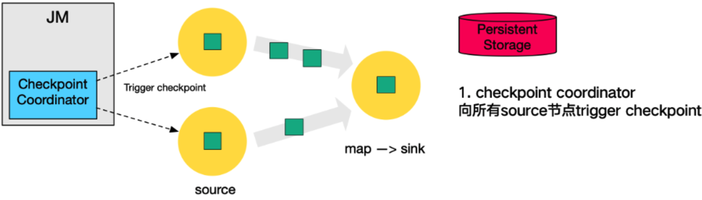

2、当 Task 收到所有的 barrier 之后(这里的 Barrier 被称为屏障，后面会详聊到，我们暂且知道 Barrier 是由 Source 节点产生)，会执行快照，向自己的输出(下游)继续传递 barrier，将自己的状态(异步地)写入持久化存储中，也就是下图中的红色的三角，这里的 持久化存储可以理解为 Hdfs 分布式存储系统

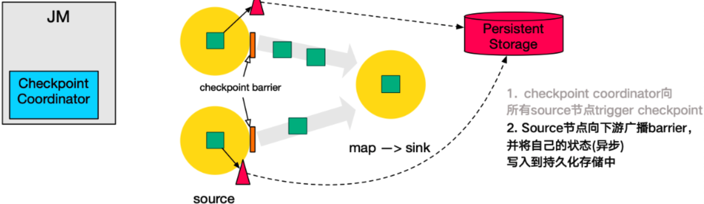

3、当 Source 节点做完 checkpoint (也就是异步完成状态写入 hdfs)，会将备份数据的地址(state handle)通知给 checkpoint coordinator
如下图所示，这是告诉 checkpoint coordinator 当前节点 已经做完了自己部分的 checkpoint ，并将元数据信息告知它，同时 barrier 继续在 channel 中向下游流动

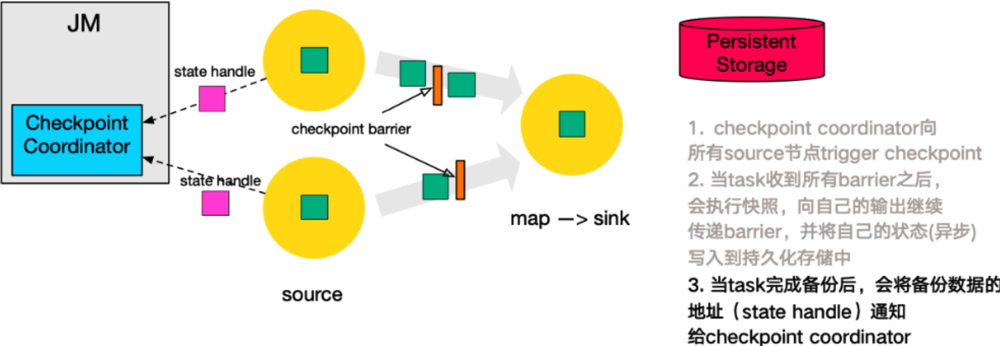

4、当最后一个节点，也就是 sink 节点接收到 barrier 之后，它同样会执行 checkpoint。下图中的 sink 节点的 statebackend 假设是一个 RocksDBStateBackend，该 statebackend 有一个增量 checkpoint 机制，首先它会在收集齐 barrier 之后，会执行一次 RocksDBCheckpoint，也就是下图中红色的大三角，所谓增量 checkpoint 就是对于 Flink 而言，上传的数据是增量的，Flink 在 State 里面记录了之前上传成功的 checkpoint 信息，它可以做一些过滤，将之前没有上传过的文件筛选出来，也就是下图中紫色的 delta 小三角，将这些文件上传到持久化文件系统中

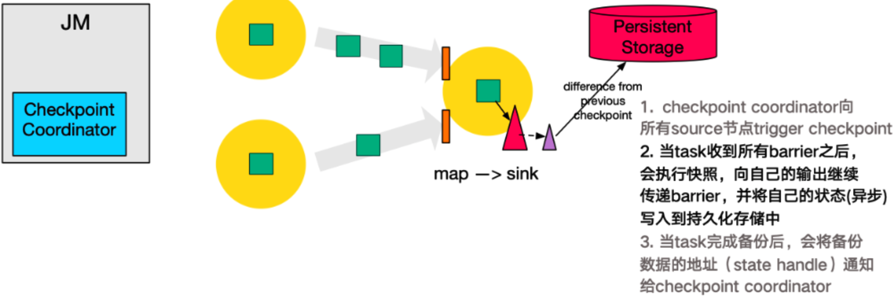

5、同样地，sink 节点在执行完持久化之后，需要将 state handle 告知 coordinator。如下图所示

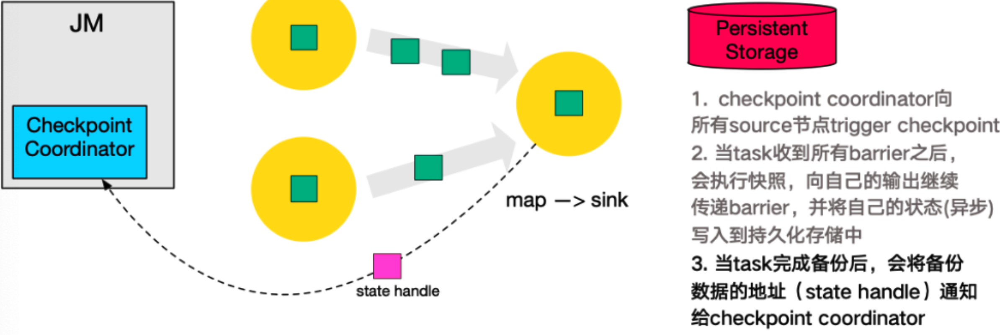

6、此时 coordinator 已经搜集齐了所有 3 个 task 的 state handle，对于整个 flink 集群来说，这次 checkpiont 就算成功了，如下图所示，coordinator 会将 已完成的 state handle 转化成一个 completed checkpoint 对象，该对象包含了整个 checkpoint meta 信息的文件，将这些数据再次写入到持久化存储的文件中，这样整个 checkpoint 就完成

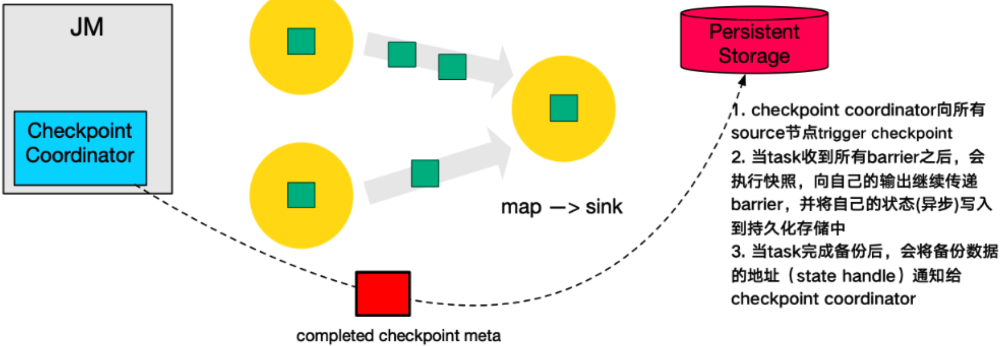

## Checkpoint Barrier & Checkpoint Barrier 对齐

### Checkpoint Barrier

Flink 使用 [Chandy-Lamport algorithm](https://en.wikipedia.org/wiki/Chandy-Lamport_algorithm) 算法的一种变体，称为异步 barrier 快照(asynchronous barrier snapshotting）

当 checkpoint coordinator(job manager 的一部分)指示 taskmanager 开始 checkpoint 时，它会让所有的 sources 记录他们的偏移量，并将编号的 checkpoint barriers 插入到它们的流中。这些 barriers 经过 job graph ,标注每个 checkpoint 前后的流部分，如下图所示：

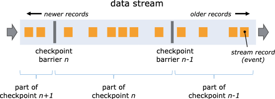

Checkpoint n 将包含每个 operator 的 state，这些 state 是对应的 operator 消费了 **严格在 checkpoint barrier n 之前的所有事件, 并不包括在此(checkpoint barrier n) 后的任何事件**后而生成的状态。

### Checkpoint Barrier 对齐

当 job graph 中的每个 Operator 接收到 barriers 时，它就会记录下自身状态。拥有两个输入流的 operators（例如 CoProcessFunction） 会执行 barrier 对齐(barrier alignment) 以便当前快照能够包含消费两个输入流 barrier 之前(但不超过)的所有 events 而产生的状态。如下图所示：

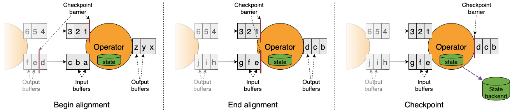

上图是官方示意图，看着可能懵逼，没关系，可以仔细参考如下 2 幅图所示，下面我们将对齐的过程分为 4 步来详细描述下：

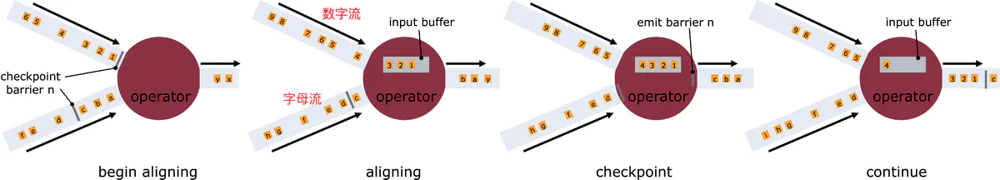
<center>图1 官方</center>

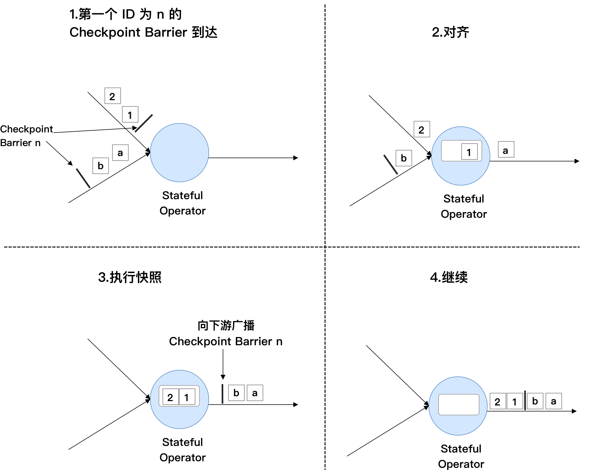
<center>图2 手绘</center>

如上图所示，对齐分为 4 步骤

* 1、算子子任务在某个输入通道中收到第一个 ID 为 n 的Checkpoint Barrier，但是其他输入通道中 ID 为 n 的 Checkpoint Barrier 还未到达，该算子子任务开始准备对齐，此时它不能处理来自该流的任何数据记录，直到它从其他所有输入接收到 barrier n 为止。否则的话，**它会混合属于快照 n 的记录和 n+1 的记录**

* 2、算子子任务将第一个通道的数据缓存下来，同时继续处理其他输入通道的数据，这个过程被称为对齐。接收到 barrier n 的流暂时被搁置，从这些流中接收到的记录不会被处理，而是放入缓冲区
  * 上面的两幅图的图中的第 2 个图，虽然数字流对应的 barrier 已经到了，但是 barrier 之后的 1、2、3这些数据只能放到 buffer 中，等待字母流的 barrier 到达

* 3、一旦最后所有输入流都接收到 barrier n, Operator 就会把 checkpoint barrier n 发往下游(向下游的所有输出通道广播)，再然后还会对自身进行快照，将状态写入 state backend

* 4、对于这个算子子任务，快照执行结束后，继续处理各个通道中的新流入数据，在处理来自流的记录之前，先处理来自缓冲区的记录。

数据流图中的每个算子子任务都要完成一遍上述的对齐、快照、确认的工作，最后当所有的 Sink 算子确认完成快照之后，说明 ID 为 n 的 Checkpoint 执行结果，Checkpoint Coordinator 向 State Backend 写入一些本次 Checkpoint 的元数据。

### 什么是 barrier 不对齐

* 上述官方图的图 2 中，当还有其他输入流的 barrier 还没有到达时，会把已到达的 barrier 之后的数据 1、2、3 放在缓冲区，等待其他流的 barrier n 到达之后才能处理
* barrier 不对齐就是指当还有其他流的 barrier 还没到达时，为了不影响性能，也不用理会，直接处理 barrier 之后的数据。等到所有流的 barrier 都到达之后，就可以对该 operator 做 checkpoint 了。
  
### 为什么要进行 barrier 对齐，不对齐到底行不行？

* **Exactly Once 时必须要 barrier 对齐，如果 barrier 不对齐就变成了 At Least Once**
  * 后面 Exactly Once 会专门讨论这个问题
* Checkpoint 的目的是就是为了保存快照，如果不对齐，At Least Once 可能会出现重复记录。举个栗子，在 chk-100 快照之前，已经处理了一些 chk-100 对应的 offset 之后的数据，当程序从 chk-100 恢复任务的时候，chk-100 对应的 offset 之后的数据还会被处理一次，所以就出现了重复。后面会有案例讨论。

### 快照性能优化方案

前面讨论了一致性快照的具体流程，这种方式保证了数据的一致性，但有一些潜在的问题：

1、每次进行 Checkpoint 前，都需要暂停处理新流入数据，然后开始执行快照，假如状态比较大，一次快照可能长达几秒甚至几分钟。
2、Checkpoint Barrier 对齐时，必须等待所有上游通道都处理完，假如某个上游通道处理很慢，这可能造成整个数据流堵塞(先到的数据流的缓冲块用完)。

针对这些问题 Flink 已经有了一些解决方案，并且还在不断优化中

针对第一个问题，Flink 提供了异步快照（Asynchronous Snapshot) 的机制。当实际执行快照时，Flink 可以立即向下广播 Checkpoint Barrier，表示自己已执行完自己部分的快照。同时，Flink 启动一个后台线程，它创建本地状态的一份拷贝，这个线程用来将本地状态的拷贝同步到 State Backend 上，一旦数据同步完成，再给 Checkpoint Coordinator 发送确认信息(State Handle)。拷贝一份数据肯定占用更多内存，这时可以利用 Copy-on-Write 的优化策略。这里的 Copy-on-Write 指的是，如果这份内存数据没有任何修改，那么没必要生成一份拷贝，只需要有一个指向这份数据的的指针，通过指针将本地数据同步到 State Backend 上；如果这份内存数据有一些更新，那再去申请额外的空间并维护两份数据,一份是快照时的数据，一份是更新后的数据。

对于第二个个问题，Flink 允许跳过对齐这一步，后者说一个算子子任务不需要等待所有上游通道的 Checkpoint Barrier，直接将 Checkpoint Barrier 广播，执行快照并继续处理后续流入数据。为了保证数据的一致性，Flink 必须将哪些较慢的数据流中的元素也一起快照，一旦重启，这些元素会被重新处理一遍。

## Exactly-Once 语义

### Exactly-Once 语义的实现

经过上面的分析，我们知道 barrier 对齐就实现了 Exactly Once，为什么 barrier 不对齐就是 At Least Once？

* 到底什么时候会出现 barrier 对齐？
  * 首先设置了 Flink 的 checkpoint 语义是：Exactly Once
  * Operator 实例必须有多个输入流才会出现 barrier 对齐。barrier 对齐其实是上游多个流配合使得数据对齐的过程，如果 Operator 只有一个输入流，就根本不存在 barrier 对齐，自己跟自己永远都是对齐的。

下面就 Exactly Once 的三个存疑的地方进行描述

1、第一种场景计算 PV，kafka 只有一个 partition, 精确一次和至少一次就没有区别？

答：如果只有一个 partition, 对应 flink 任务的 Source Task 并行度只能是 1，确实没有区别，不会有至少一次的存在，肯定是精确一次。因为只有**barrier 不对齐才有可能重复处理，这里并行度都是1，默认就是对齐的**，<font color='red'>只有当上游有多个并行度的时候，多个并行度发到下游的 barrier 才需要对齐，单并行度并不会出现 Barrier 不对齐，所以必然精确一次</font>。其实还是需要理解 Barrier 对齐就是 Exactly Once ，不对齐就是 At Least Once 可能重复消费，单并行度的情况下不存在 barrier 不对齐，所以不会存在至少一次的语义。

举个栗子(ps，这个例子我想了好久，大概有2个小时左右)，假设第一次做 checkpoint 的时候,简称 chk1, kafka 的 partition1(简称 p1) 的 offset 是 100，p2 的 offset 是 105, 当 barrier 流转到 sink 节点的时候，p2 由于处理的快且没有对齐，此时流中的数据可能是 p1 还是 100, p2 是 110。
然而 checkpoint 持久化完毕的时候是将 source 中 offset=100 的 p1 和 offset=105 的 p2 以及其他算子的 状态全部持久化。
持久化成功后，在下次 checkpoint 全部成功之前， 某个 task 奔溃需要重启，flink 会使用本次 checkpoint 的数据做恢复，会把 kafka 的 offset 分别 seek 到 100 和 105， 并且会把各个算子的的状态进行重置到 chk1 的快照状态，此时消费 p2 数据流的算子的状态数据是消费到 offset=110 的结果；注意此时 kafka 的 p2 的数据开始从 offset=105 开始，但是有的算子的状态数据是从 offset=110  的地方恢复的，此时就会出现重复消费 kafka 的 p2 分区的 105-110 之间的数据。这就是不对齐造成的(第二次看，很容易想到呀)。

2、为了下游尽快做Checkpoint，所以会先发送 barrier 到下游，自身再同步/异步进行快照；这一步，如果向下发送 barrier 后，自己同步快照怎么办？下游已经同步好了，自己还没同步完成？

答：可能会出现下游比上游还早的情况，但是这不影响快照结果，只是下游快照的更及时了，我只要保证下游把 barrier 之前的数据都处理完了，并且不处理 barrier 之后的数据，然后做快照，那么下游也同样支持精确一次。这个问题你不要从全局思考，你单独思考上游和下游的实例，你就会发现上游和下游的状态都是准确的，既没有丢，也没有重复计算。这里需要注意一点，如果有一个 Operator 的 Checkpoint 失败了或者因为 Checkpoint 超时也会导致任务失败，那么 JobManager 会认为整个 Checkpoint 失败，失败的 Checkpoint 不能用来恢复任务的，必须所有的算子的 Checkpoint 都成功，那么这次 Checkpoint 才能认为是成功的，才能用来恢复任务。

3、我程序中 Flink 的Checkpoint 语义设置了 Exactly Once，但是我的 Mysql 中看到了重复数据！程序设置了 1 分钟 1 次Checkpoint，但是  5 秒向 mysql 写一次数据，并 commit。(这个案例跟 SF 的短信发送有异曲同工之妙)

答：Flink 要求 end to end 的精确一次都必须实现 TwoPhaseCommitSinkFunction。如果你的 chk-100 成功了，过了 30 秒，由于 5s 一次 commit , 所以实际上已经写入了 6 批数据进入 mysql，但是突然程序挂了，flink 从 chk-100 处恢复，这样的话，之前提交的 6 批数据就会重复写入，所以出现了重复消费。Flink 的精确一次有两种情况：
* ① 一个是flink 内部的精确一次
* ② 一个是端对端的精确一次，我们上述讨论的都是关于 Flink 内部的精确一次，下面我们可能会讨论端到端的精确一次是如何实现的。

### Exactly Once 语义小节

* 为了实现 Exactly Once 语义，Flink 通过一个 input buffer 将在对齐阶段收到的数据缓存起来，等对齐完成之后再进行处理
* 对于 At Least Once 语义，无需缓存收到的数据，会对后续直接处理，所以导致 restore 时，数据可能会被多次处理。
* Flink 的 Checkpoint 机制只能保证 Flink 的计算过程可以做到 Exactly Once，end-to-end 的 Exactly Once 需要 Souce 和 Sink 支持。

## Checkpoint 存储

启用 Checkpoint 后，managed state 将被持久化，来确保故障后 Flink Job 恢复的一致性。Checkpoint 期间 State 存储的位置取决于所选的 **Checkpoint 存储**。

### 可选的 Checkpoint 存储类型

Flink 提供了两种开箱即用的 Checkpoint 存储类型：
* JobManagerCheckpointStorage
* FileSystemCheckpointStorage

> 如果配置了 Checkpoint 目录，将使用 FileSystemCheckpointStorage，否则使用 JobManagerCheckpointStorage

#### JobManagerCheckpointStorage

JobManagerCheckpointStorage 将 Checkpoint 快照存储在 JobManager 的堆内存中

可以将其配置为超过一定大小时使 Checkpoint 失败，以避免 JobManager 出现 OOM。要设置此功能，用户可以实现具有相应大小的 JobManagerCheckpointStorage：

```java
new JobManagerCheckpointStorage(MAX_MEM_STATE_SIZE);
```

JobManagerCheckpointStorage 的限制：

* 默认情况下，每个 State 的大小限制为 5 MB。可在 JobManagerCheckpointStorage 的构造函数中修改大小
* 无论配置的最大 State 大小如何，状态都不能大于 Pekka(Pekko 是 Akka 项目的一个分支) 框架的大小(我目前使用的 Flink 1.11.* 还是 Akka 框架)
* 聚合后的状态大小必须小于 JobManager 的内存上限。

鼓励在以下场景下使用 JobManagerCheckpointStorage

* 本地开发和调试
* 使用很少状态的作业，例如仅包含每次仅存储一条记录(Map,FlatMap,Filter...)的作业。Kafka 消费者需要很少的 State。

#### FileSystemCheckpointStorage

FileSystemCheckpointStorage 配置中包含文件系统 URL (类型、地址(host+port)、路径)，例如 "hdfs://namenode:40010/flink/checkpoints" 或者 "file:///data/flink/checkpoints"。

Checkpoint 时，Flink 会将 State 快照写到配置的文件系统(hdfs)或目录的文件中。最少的元数据存储在 JobManager 的内存中(或者，高可用模式下存储在 Checkpoint 的元数据中)。

如果指定了 Checkpoint 目录，FileSystemCheckpointStorage 将用于保存 Checkpoint 快照。

鼓励使用 FileSystemCheckpointStorage 的场景：

* 所有高可用的场景。


### 保留 Checkpoint 

Checkpoint 在默认情况下仅用于恢复失败的作业，并不保留，当程序取消时 Checkpoint 就会被删除。当然，你可以通过配置来保留 Checkpoint，这些被保留下来的 Checkpoint 在作业失败或者取消时不会被删除。这样，你就可以使用 checkpoint 来恢复失败的作业。开发人员在开发和调试的时候可以打开此选项(参考下方配置详情)

```java
CheckpointConfig config = env.getCheckpointConfig();
config.setExternalizedCheckpointCleanup(ExternalizedCheckpointCleanup.RETAIN_ON_CANCELLATION);
```

ExternalizedCheckpointCleanup 配置项定义了当作业取消时，对作业 checkpoint 的操作：
* RETAIN_ON_CANCELLATION: 当作业取消时，保留作业的 Checkpoint。注意，这种情况下，需要手动清除该作业保留的 Checkpoint
* DELETE_ON_CANCELLATION：当作业取消时，删除作业的 checkpoint。仅当作业失败时，作业的 checkpoint 才会被保留。

## Checkpoint 目录结构

与 savepoints 相似，Checkpoint 由元数据文件、数据文件(与 state backend 相关)组成。可通过配置文件中的 "state.checkpoints.dir" 配置项来指定数据文件和元数据文件的存储路径，另外也可以在代码中针对单个作业特别指定该配置项

当前的 Checkpoint 目录结果如下所示：

```text
/user-defined-checkpoint-dir
    /{job-id}
        |
        + --shared/
        + --taskowned/
        + --chk-1/
        + --chk-2/
        + --chk-3/
        ...        
```
其中 **SHARED** 目录保存了可能被多个 checkpoint 引用的文件，**TASKOWNED** 保存了不会被 JobManager 删除的文件，**EXCLUSIVE** 则保存了那些仅对单个 checkpoint 引用的文件。

### 通过配置文件全局配置

```yaml
state.checkpoints.dir: hdfs:///checkpoints/
```

### 创建 StateBackend 对单个作业进行配置
```java
Configuration config = new Configuration();
config.set(StateBackendOptions.STATE_BACKEND, "rocksdb");
config.set(CheckpointingOptions.CHECKPOINT_STORAGE, "filesystem");
config.set(CheckpointingOptions.CHECKPOINTS_DIRECTORY, "hdfs:///checkpoints-data/");
env.configure(config)
```

### 从保留的 Checkpoint 中恢复状态

与 savepoint 一样，作业可以从 Checkpoint 的元数据文件恢复运行。注意，如果元数据文件中的信息不充分，那么 JobManager 就需要使用相关的数据文件来恢复作业。数据文件的目录结构参考上文的目录结果示意图(就像 mysql 一样， dump 备份文件恢复全量部分，其余增量部分用 binlog 恢复)。

```sh
$ bin/flink run -s :checkpointMetaDataPath [:runArgs]
```

## Checkpoint 的配置

### CheckpointConfig 对象的配置

默认情况下， Checkpoint 机制是关闭的，需要调用 `env.enableCheckpoint(n)` 来开启，每隔 n 毫秒进行一次 Checkpoint。Checkpoint 是一种负载较重的任务，如果状态比较大，同时 n 值又比较小，那可能一次 checkpoint 还没完成，下次 Checkpoint 已经被触发，占用太多本该用于正常处理作业的资源。增大 n 值意味着一个作业的 Checkpoint 次数减少，整个作业用于 Checkpoint 的资源更少，可以将更多的资源用于正常的流数据处理。同时，更大的 n 值意味着重启后，整个作业需要更长的 Offset 开始重新处理数据。

此外，还有其他一些参数需要配置，整体封装在 CheckpointConfig 对象中

```java
StreamExecutionEnvironment env = StreamExecutionEnvironment.getExecutionEnvironment();

// 每 1000ms 开始一次 checkpoint
env.enableCheckpointing(1000);

// 高级选项：

// 设置模式为精确一次 (这是默认值)
env.getCheckpointConfig().setCheckpointingMode(CheckpointingMode.EXACTLY_ONCE);

// 确认 checkpoints 之间的时间会进行 500 ms
env.getCheckpointConfig().setMinPauseBetweenCheckpoints(500);

// Checkpoint 必须在一分钟内完成，否则就会被抛弃
env.getCheckpointConfig().setCheckpointTimeout(60000);

// 允许两个连续的 checkpoint 错误
env.getCheckpointConfig().setTolerableCheckpointFailureNumber(2);
        
// 同一时间只允许一个 checkpoint 进行
env.getCheckpointConfig().setMaxConcurrentCheckpoints(1);

// 使用 externalized checkpoints，这样 checkpoint 在作业取消后仍就会被保留
env.getCheckpointConfig().setExternalizedCheckpointCleanup(
        ExternalizedCheckpointCleanup.RETAIN_ON_CANCELLATION);

// 开启实验性的 unaligned checkpoints
env.getCheckpointConfig().enableUnalignedCheckpoints();
```

默认的 Checkpoint 配置是支持 Exactly-Once 投递的，这样能保证在重启恢复时，所有算子的状态对已数据只处理一次。用上文的 Checkpoint 原理来说，使用 Exactly-Once 就是进行了 Checkpoint Barrier 对齐，因此会有一定的延迟。

`setCheckpointTimeout` 是说如果一次 Checkpoint 超过一定时间仍未完成，直接将其终止，以免占用过多资源

`setMinPauseBetweenCheckpoints` 如果两次 Checkpoint 之间的间歇时间太短，那么正常的作业可能获取的资源较少，更多的资源用在了 Checkpoint 上。对这个参数进行合理配置能保证数据流的正常处理。比如，设置这个参数为 60 秒，那么前一次 Checkpoint 结束后 60 秒内不会再启动新的 Checkpoint。这种模式只在整个作业最多允许 1 个 Checkpoint 时适用。

`setMaxConcurrentCheckpoints`, 默认情况下一个作业只允许 1 个 Checkpoint 执行，如果某个 Checkpoint 正在执行，另外一个 Checkpoint 被启动，新的 Checkpoint 需要挂起等待。
如果这个参数大于 1，将与前面提到的最短间隔相冲突。

`setExternalizedCheckpointCleanup(ExternalizedCheckpointCleanup.RETAIN_ON_CANCELLATION);`, Checkpoint 的设计初衷是用来进行故障恢复，如果作业因为异常而失败，Flink 会将状态数据保存远程存储上；如果开发者自己取消了作业，远程存储上的作业都会被删除。如果开发者希望通过 Checkpoint 数据进行调试，自己取消了作业，同时希望将远程数据保存下来，需要上面的设置。
`RETAIN_ON_CANCELLATION` 模式下，用户需要自己手动删除远程存储上的 Checkpoint 数据。

### flink-conf.yaml 中有关 checkpoint 和 savepoint 的配置

| Key | Default |  Type  | Description |
| --------- | -----     | ------| --------- |
| **state.backend.incremental** | false | Boolean | 重要的参数之一，是否创建增量Checkpoint。增量 Checkpoint 只存储跟上一个 checkpoint 不同的状态数据<br>而不是整个 checkpoint 状态数据 |
| state.backend.local-recovery | false | Boolean | 是否允许状态后端本地恢复。默认本地恢复是没有激活的。本地恢复目前仅仅支持 Keyed StateBackend(包括 EmbeddedRocksDBStateBackend 和 HashMapStateBackend) |
| state.checkpoint-storage | (none) | String | 上面已经描述过这个参数的用途。可用的名称有 "filesystem" 和 "jobmanager"。当然我们也可以配置为实现了 CheckpointStorageFactory 的全限定类名 |
| state.checkpoint.cleaner.parallel-mode | true | Boolean | 传入状态清理器的线程池 ExecutorService 中的参数，表明是否要并行地清理 checkpoint 的状态 |
| **state.checkpoints.dir** | (none) | String | 最重要的参数之一。checkpoint 的状态数据和元数据的远程存储路径。配置了这个参数，则 storage 默认使用 "filesystem" |
| state.checkpoints.create-subdir | true | Boolean | 在 {state.checkpoints.dir} 配置的路径下，flink 是否自动创建相关子文件夹 |
| state.checkpoints.num-retained | 1 | Integer | flink 持有的最大数目的已完成的 checkpoint |
| state.savepoints.dir | (none) | String | savepoint 路径 |
| state.storage.fs.memory-threshold | 20 kb | MemorySize | 状态数据文件在内存中的最小尺寸。(应该是 >= 改尺寸的就会被持久化到文件系统)。该项配置的最大内存尺寸是 1MB |
| state.storage.fs.write-bufer-size | 4096 | Integer | checkpoint 写入文件系的写缓冲的默认大小。比如上面的配置 20kb，这个 4kb，也就是写缓冲块的个数达到 5 个就可以批量写入磁盘 |
| taskmanager.state.local.root-dirs | (none) | String | 本地恢复的文件基地址 |

## 部分任务结束后的 Checkpoint

### 背景介绍
从版本 1.14 开始 ，Flink 支持在部分任务结束后继续进行 Checkpoint。如果一部分数据源是有限数据集，那么久可以出现这种情况。从 1.15 开始，这一特性被默认打开。
```java
Configuration config = new Configuration();
config.set(ExecutionCheckpointingOptions.ENABLE_CHECKPOINTS_AFTER_TASKS_FINISH, true);
StreamExecutionEnvironment env = StreamExecutionEnvironment.getExecutionEnvironment(config);
```
在这种情况下，结束的任务不会参与 Checkpoint 过程。

为了支持部分任务结束后的 Checkpoint 操作，我们调整了 任务的生命周期 并且引入了 StreamOperator#finish 方法。 在这一方法中，用户需要写出所有缓冲区中的数据。在 finish 方法调用后的 checkpoint 中，这一任务一定不能再有缓冲区中的数据，因为在 finish() 后没有办法来输出这些数据。 在大部分情况下，finish() 后这一任务的状态为空，唯一的例外是如果其中某些算子中包含外部系统事务的句柄（例如为了实现恰好一次语义）， 在这种情况下，在 finish() 后进行的 checkpoint 操作应该保留这些句柄，并且在结束 checkpoint（即任务退出前所等待的 checkpoint）时提交。 一个可以参考的例子是满足恰好一次语义的 sink 接口与 TwoPhaseCommitSinkFunction

### 对 operator state 的影响

在部分 Task 结束后的checkpoint中，Flink 对 UnionListState 进行了特殊的处理。 UnionListState 一般用于实现对外部系统读取位置的一个全局视图（例如，用于记录所有 Kafka 分区的读取偏移）。 如果我们在算子的某个并发调用 close() 方法后丢弃它的状态，我们就会丢失它所分配的分区的偏移量信息。 为了解决这一问题，对于使用 UnionListState 的算子我们只允许在它的并发都在运行或都已结束的时候才能进行 checkpoint 操作。

ListState 一般不会用于类似的场景，但是用户仍然需要注意在调用 close() 方法后进行的 checkpoint 会丢弃算子的状态并且 这些状态在算子重启后不可用。

任何支持并发修改操作的算子也可以支持部分并发实例结束后的恢复操作。从这种类型的快照中恢复等价于将算子的并发改为正在运行的并发实例数。

### 任务结束前最后一次 Checkpoint

为了保证使用两阶段提交的算子可以提交所有的数据，任务会在所有算子都调用 finish() 方法后等待下一次 checkpoint 成功后退出。需要注意的是，这一行为可能会延长任务运行的时间，如果 checkpoint 周期比较大，这一延迟会非常明显。极端情况下，如果 checkpoint 的周期被设置为 Long.MAX_VALUE ，那么任务永远不会结束，因为下一次 checkpoint 不会进行。

## Checkpoint 使用建议

### Checkpoint 的时间间隔不要太短

* 一般 5min 级别足够
* Checkpoint 会与 Record 处理共抢一把锁，Checkpoint 的同步阶段会影响 record 的处理。
  * 如果频繁进行 checkpoint ，作业的 TPS 肯定受到影响。

### 合理设置超时时间

* 默认的超时时间是 10min，如果 state 规模过大或者出现反压的时候，则需要合理配置
  * 如果你发现 checkpoint 经常会失败，失败的原因是 expire 超时了，我们可以观察下整个 state 的大小，可以把超时时间调整长些。如果经常超时，导致生成 超时 checkpoint 的速度大于删除速度，可能会导致磁盘空间不够用

### FsStateBackend 可以考虑文件压缩

* 对于刷出去的文件可以考虑使用压缩来减少 Checkpoint 的体积
  * 目前只支持 snapp 压缩(之所以只支持 snapp，个人感觉跟 levelDb 来自 google, 只提供 snappy 压缩有关)
  * 压缩对 CPU 有开销，但是是异步的，对作业处理影响不大

```java
ExecutionConfig config = new ExecutionConfig();
config.setUseSnapshotCompression(true);
```


## Checkpoint 调优

### 概述

Flink 应用要想在大规模场景下可靠地运行，必须满足如下两个条件：

  * 应用程序需要能够可靠地创建 checkpoints
  * 在应用故障后，需要有足够的资源追赶数据数据流。

第一部分讨论如何大规模获取良好性能的 checkpoints。后一部分 关于要规划使用多少资源的最佳实践可以参考 State Backend 章节中有关 RocksDB 调优小节(因为大状态最好使用 RocksDB 存储)

### 监控状态和 Checkpoints

监控 Checkpoint 行为的最简单的方法时通过 UI 的 checkpoint 部分。[监控 checkpoint](checkpont_monitor.md) 文档说明了如何查看可用的 checkpoint 指标

从两个 Task 级别的指标 checkpointStartDelayNanos 和 checkpointAlignmentTime 可以获取如下信息：

  * 算子收到第一个 checkpoint barrier 的时间。当触发 checkpoint 的耗费时间一直很高时，这意味着 checkpoint barrier 需要很长时间才能从 source 到达 operators。这通常表明系统处于反压下运行

  * Alignment Duration ，为处理第一个和最后一个 checkpoint barrier 之间的时间(??)。在 unaligned checkpoints 下，exactly-once 和 at-least-once checkpoints 的 subtasks 处理来自上游 subtasks 的所有数据，并且没有任何中断。然后，对于 aligned exactly-once checkpoints，已经收到 checkpoint barrier 的通道被阻止继续发送数据，直到剩余所有的通道都赶上并接受他们的 checkpoint barrier(对齐时间)

理想情况下，这两个值都应该很低 - 较高的数值意味着 由于存在反压(没有足够的资源拉处理传入的记录)，导致 checkpoint barrier 在作业中移动速度较慢，这也可以通过观察处理记录的端到端延迟时间在增大来判断。请注意，在出现瞬时反压，数据倾斜或者网络问题时，这些数值偶尔会很高。

Unaligned checkpoints 可用于加快 checkpoint barriers 的传播。但是请注意，这并不能解决导致反压的根本问题。

### Checkpoint 调优

应用程序可以配置定期触发 Checkpoints。当 Checkpoint 完成时间超过 Checkpoint 间隔时，在正在进行的 Checkpoint 完成之前，不会触发下一个 checkpoint。默认情况下, 一旦正在进行的 checkpoint 完成，将立即触发下一个 checkpoint。

当 checkpoints 完成的时间经常超过 checkpoints 的基本间隔时(例如，因为状态比计划的更大，或者访问 checkpoints 所在的存储系统暂时变慢)，系统不断地进行 checkpoints (一旦完成，新的 checkpoints 就会立即启动)。这可能意味着过多的资源被不断地束缚在 checkpointing 中，并且 checkpoint 算子进行得缓慢。此行为对使用 checkpointed 状态的流式应用的影响较小，但仍可能对整体应用程序性能产生影响。

为了防止这种情况，应用程序可以定义 checkpoints 之间的 *最小等待时间*：

```java
env.getCheckpointConfig().setMinPauseBetweenCheckpoints(milliseconds);
```

此持续时间是指从最近一个 checkpoint 结束到下一个 checkponit 开始之间必须经过的最小时间间隔。下图对此进行了说明

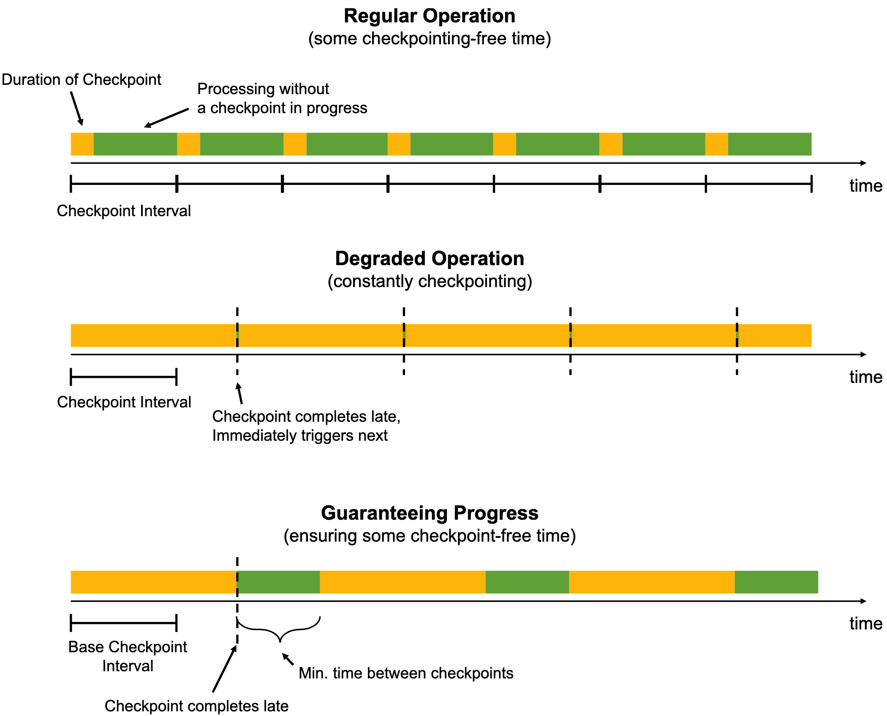

> 注意：之前提过多次，该参数仅适用于 checkpoint 的并发数为 1 的情况，也就是 `env.getCheckpointConfig().setMaxConcurrentCheckpoints(1)` 或者不配置采用默认的情况下才起作用。同时，多并发的 checkpoint 对于状态比较大的程序来说，通常会使用过多的资源到 checkpoint

当 手动触发 savepoint 时，它可能与正在进行的 checkpoint 同时运行。


### Checkpoint 失败的常见原因

* **用户代码逻辑没有对异常处理，让其直接在运行中抛出**。比如解析 json 异常， 没有捕获，导致 checkpoint 失败，或者调用 Dubbo 超时异常等等。
* **依赖外部存储系统，在进行数据交互的时候，出错，异常没有处理。** 比如输出数据到 Kafka、Redis、Hbase 等，客户端抛出了超时异常，没有进行捕获，Flink 容错机制会再次重启。
* **内存不足，频繁 GC，超出 GC 负载的限制。** 比如 OOM 异常
* 网络问题，机器不可用问题等。


## RocksDB 的调优

请参考 [flink state-backend](flink-state-backend.md) 中有关 RocksDB 调优的描述

