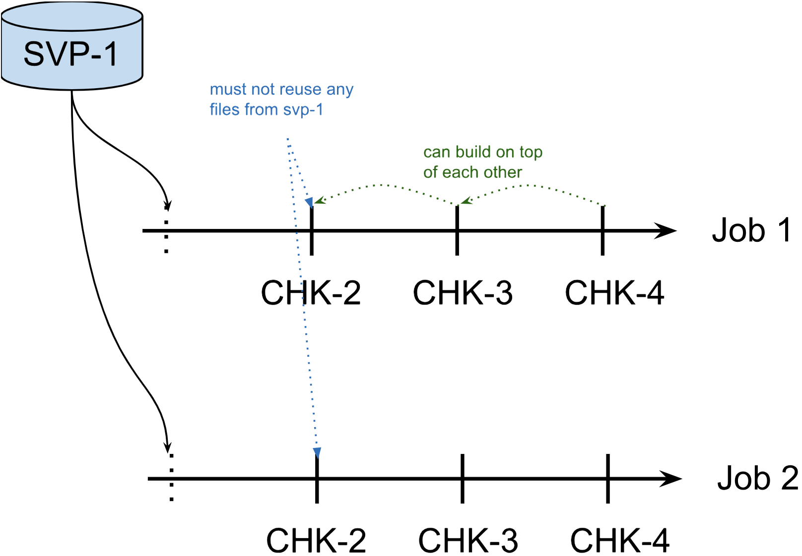
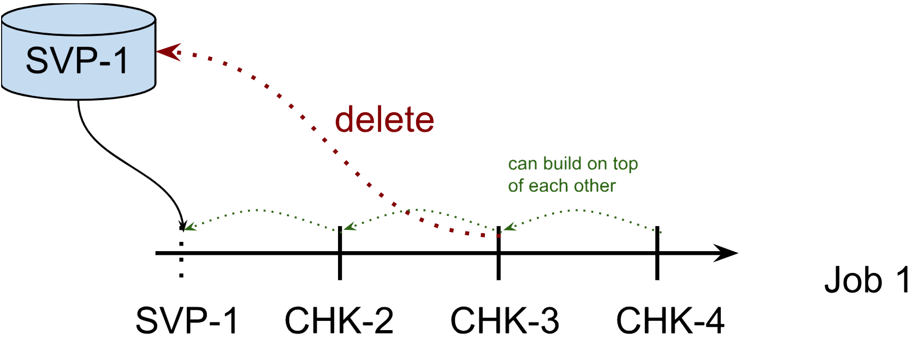

# SavePoint

## 什么是 Savepoint

Savepoint 是依据 Flink checkpointing  机制所创建的流式作业执行状态的一致镜像。你可以使用 Savepoint 进行 Flink 作业的停止与重启、fork 或者更新。 Savepoint 由两部分组成：稳定存储(列入 HDFS，S3, ...)上包含二进制文件的目录(通常非常大)，和元数据文件(相对较小)。稳定存储上的文件表示作业执行状态的数据镜像。Savepoint 的元数据文件以（相对路径）的形式包含指向稳定存储上的作为 Savepoint 一部分的所有文件的指针

## 分配算子和 Savepoint 状态

### 分配算子 ID

**强烈建议**为每个算子分配算子 ID，以便将来能够升级你的程序。主要通过 **uid(string)** 方法手动指定算子 ID。这些 ID 将用于恢复每个算子的状态。

```java
DataStream<String> stream = env.
  // Stateful source (e.g. Kafka) with ID
  .addSource(new StatefulSource())
  .uid("source-id") // ID for the source operator
  .shuffle()
  // Stateful mapper with ID
  .map(new StatefulMapper())
  .uid("mapper-id") // ID for the mapper
  // Stateless printing sink
  .print(); // Auto-generated ID
```

如果不手动指定 ID, 则会自动生成 ID。只要这些 ID 不变，就可以从 Savepoint 自动恢复。自动生成的 ID 取决于程序的结构，并且对程序的更改很敏感。因此，强烈建议手动分配这些 ID。

### Savepoint 状态

你可以将 Savepoint 想象成为每个有状态的算子保存一个映射 "算子 ID->状态"：

```text
Operator ID | State
------------+------------------------
source-id   | State of StatefulSource
mapper-id   | State of StatefulMapper
```

在上面的示例中，print sink 是无状态的，因此不是 savepoint 状态的一部分。默认情况下，我们尝试将 Savepoint 的每个条目映射回新程序。

## Savepoint 的触发，恢复和删除

我们可以使用命令行客户端来 *触发 Savepoint，触发 Savepoint 并取消作业，从 Savepoint 恢复，删除* 以及 *删除* Savepoint。

从 Flink 1.2.0 开始，还可以使用 webui 从 Savepoint 恢复。

### 触发 Savepoint

#### 简介
当触发 Savepoint 时，将创建一个新的 Savepoint 目录，其中存储数据和元数据。我们可以通过配置文件的配置项(state.savepoints.dir) 或者 命令行的参数来控制该目录的位置。

以 FsStateBackend 和 RocksDBStateBackend 为例：

```sh
# Savepoint base 目录
/savepoint/

# Savepoint 目录
/savepoint/savepoint-:shortjobid-:savepointid/

# Savepoint 文件包含 Checkpoint元数据
/savepoint/savepoint-:shortjobid-:savepointid/_metadata

# Savepoint 状态
/savepoint/savepoint-:shortjobid-:savepointid/...
```

从 1.11.0 开始，我们可以通过移动(拷贝) savepoint 目录到任意地方，然后再进行恢复

> 和 savepoint 不同，checkpoint 不支持任意移动文件，因为 checkpoint 可能包含一些文件的绝对路径

如果你使用 MemoryStateBackend 的话，metadata 和 savepoint 的数据都会保存在 _metadata 文件中，因此不要因为没看到目录下没有数据文件而困惑。

> **注意：** 不建议移动或者删除正在运行作业的最后一个 Savepoint，因为这可能干扰故障恢复。因为为了确保精确一次的语义，如果在最后一个 Savepoint 之后没有 Checkpoint，那么作业将使用 Savepoint 进行恢复

#### Savepoint 格式

我们可以在 savepoint 的两种格式之间进行选择：

* 标准格式：一种在所有 state backends 间统一的格式，允许你使用一种状态后端创建 savepoint 后，使用另一种后端恢复这个 savepoint。这是最稳定的格式，旨在与之前的版本、模式、修改等保持最大的兼容性。

* 原生格式：标准格式的缺点是它的创建和恢复速度通常很慢(相反，原生格式的savepoint，创建和恢复速度快)。原生格式以特定的状态后端的格式创建快照(例如 RocksDB 的 SST 文件)。

> 以原生格式创建 savepoint 的能力在 Flink 1.15 中引入，在那之前 savepoint 都是以标准格式创建的。

#### 触发 Savepoint

```sh
$ bin/flink savepoint :jobId [:targetDirectory]
```
这将触发 ID 为 :jobID 的作业的 Savepoint，并返回创建的 savepoint 路径。我们需要此路径来恢复和删除 checkpoint。你也可以指定创建 Savepiont 的格式。如果没有指定，会采用标准格式创建 Savepoint。

```sh
$ bin/flink savepoint --type [native/canonical] :jobId [:targetDirectory]
```
使用上述命令触发 Savepoint 时，client 需要等待 Savepoint 的制作完成，因此当任务状态较大的时候，可能会导致 client 出现超时的情况。在这种情况下可以使用 detach 模式来触发 savepoint

```sh
$ bin/flink savepoint --type [native/canonical] :jobId [:targetDirectory] -detached
```
使用该命令时，client拿到本次 savepoint 的 trigger id 后立即返回，可以通过 Rest API 来监控本次 savepoint 的制作情况。

#### 使用 YARN 触发 Savepoint

```sh
$ bin/flink savepoint :jobId [:targetDirectory] -yid :yarnAppId
```
这将触发ID 为 :jobId 和 YARN 应用程序 ID: yarnAppId 的作业的 Savepoint，并返回创建的 Savepoint 的路径。

PS: Flink on Yarn 获取 jobId 的方式如下：
1、查看正在运行的flink on yarn 程序，获取applicationID：yarn app -list
2、根据applicationID获取Flink JobID：flink list -yid :yarnAppId

#### 使用 savepoint 停止作业

```sh
$ bin/flink stop --type [native/canonical] :jobId [:targetDirectory]
```

这将自动触发 ID 为 :jobId 的作业的 Savepoint ，并停止该作业。此外，你可以指定一个目标文件系统目录来存储 Savepoint。该目录需要能够被 JobManager(s) 和 TaskManager(s) 访问。你也可以指定创建 Savepoint 的格式。如果没有指定，会采用标准格式创建 Savepoint。

如果你想用 detach 模式触发 Savepoint，可以在命令行后添加选项 -detached 即可。

### 从 Savepoint 恢复

```sh
$ bin/flink run -s :savepointPath [:runArgs]
```

这将提交作业并指定要从中恢复的 Savepoint。你可以给出 Savepoint 路径或者 _metadata 文件的路径。

#### 跳过无法映射的状态恢复

默认情况下，resume 操作将尝试将 Savepoint 的所有状态映射回你要还原的程序。如果删除了某个算子，则可以通过 --allowNonRestoredState（short -n）选项来跳过无法映射到新程序的状态。

#### Restore Mode

Restore 模式决定了在 restore 之后谁拥有 Savepoint 或者 externalized checkpoint 的文件的所有权。在这种语境下 Savepoint 和 externalized checkpoint 的行为相似。这里我们将它们都称为 "快照"，除非另有明确的说明。

如前所述，restore 模式决定了谁来接管我们从中恢复的快照文件的所有权。快照可被用户或者 Flink 自身拥有。如果快照归用户所有，Flink 不会删除其中的文件，而且 Flink 不能依赖该快照文件的存在，因为它可能在 Flink 的控制之外被删除。

每种 restore 模式都有特定的用途。尽管如此，我们仍认为默认的 NO_CLAIM 模式在大多数的情况下是一个很好的折中方案，因为它在提供明确的所有权归属的同时只给恢复后第一个 checkpoint 带来比较小的代价。

我们可以通过如下方式指定 restore 模式：

```sh
$ bin/flink run -s :savepointPath -restoreMode :mode -n [:runArgs]
```

##### NO_CLAIM(默认的)

在 *NO_CLAIM* 模式下，Flink 不会接管快照的所有权。它会将快照文件置于用户的控制之中，并且永远不会删除其中的任何文件。该模式下可以保证从同一个快照上启动多个作业。

为保证 Flink 不会依赖于该快照的任何文件，它会强制第一个(成功的) checkpoint 为全量 checkpont 而不是增量的。这仅对 state.backend: rocksdb 有影响，因为其他 state backend 总是创建全量 checkpoint。

一旦第一个全量的 checkpoint 完成后，所有后续的 checkpoint 会照常创建。所以，一旦一个 checkpoint 成功制作，就可以删除原 savepoint 快照。在此之前不能删除原快照，因为没有任何完成的 checkpoint，flink 会在故障时尝试从初始的快照恢复。



##### CLAIM

另一种可选的模式是 CLAIM 模式。在该模式下 Flink 将声称又有快照的所有权，并且本质上将其作为 checkpont 对待：控制生命周期并且可能会在其永远不会用用户恢复的时候删除它。因此，手动删除快照和从同一个快照文上启动两个作业都是不安全的。Flink 会保持配置数量(state.checkpoints.num-retained, 默认为 1)的 checkpoint。



> **注意：**
>   1. Retained checkpoints 被存储在 <checkpoint_dir>/<job_id>/chk-xx 这样的目录中。Flink 不会接管 <checkpoint_dir>/<job_id> 目录的所有权，而只会接管 chk-xx 的所有权。Flink 不会删除旧作业(比如作业 terminated 或者挂了)的目录。
>   2. Native 格式支持增量的 RocksDB savepoints。而对这些 savepoints，Flink 将所有的 sst 存储在 savepoints 目录中。这意味着这些 savepoints 是自包含和目录可移动的。然后，在 CLAIM 模式下恢复时，后续的 checkpoints 可能会用一些 sst 文件，这反过来会阻止在 savepoints 被清理时删除 savepoints 目录。FLink 之后运行期间可能会删除复用的 sst 文件，但不会删除 savepoints 目录。因此，在 CLAIM 模式下恢复，Flink 可能会留下一个空的 savepoints 目录。

### 删除 Savepoint

```java
$ bin/flink savepoint -d :savepointPath
```
这将删除存储在 :savepointPath 中的 savepoint。

请注意，我们还可以通过常规的文件系统操作手动删除 Savepoint，(yarn 或者 本地磁盘都可以用文件系统的删除命令)，而不会影响其他 savepoint 或者 checkpoint (请记住，每个 savepoint 都是自包含的)。

### 配置

我们可以通过 state.savepoints.dir 配置 savepoint 默认目录。触发 savepoint 时，将使用此目录来存储 savepoint。我们也可以通过命令行参数来自定义目标目录来覆盖缺省值

```sh
# 默认 Savepoint 目录
state.savepoints.dir: hdfs:///flink/savepoints
```

如果即未配置缺省值也未指定自定义目标目录，则触发 Savepoint 将失败。

## F.A.Q

**我应该为我作业中的所有算子分配 ID 吗？**

根据经验，是的。严格来说，仅通过 uid 方法给有状态的算子分配 ID 就足够了。Savepoint 仅包含这些有状态的算子的状态，无状态算子不是 Savepoint 的一部分。

在实践中，建议给所有的算子分配 ID, 因为 flink 的一些内置算子 (如 window 算子)也是有状态的，而内置算子是否有状态并不明显。如果我们完全可以确定算子是无状态的，则可以跳过 uid 方法。

**如果我在作业中添加了一个需要状态的新算子，会发生什么**

当你向作业添加新算子时，它将在没有任何状态的情况下进行初始化。Savepoint 包含每个有状态的算子的状态。无状态算子根本不是 Savepoint 的一部分。新算子的行为类似于无状态算子。

**如果从作业中删除了有状态的算子会发生什么**

默认情况下，从 Savepoint 恢复时将尝试将所有的状态分配给新作业。如果有状态的算子被删除，则无法从 Savepoint 中恢复。
我们可以使用 run 命令设置 --allownNonRestoredState(简称 -n) 来允许删除有状态的算子：

```sh
$ bin/flink run -s :savepointPath -n [:runArgs]
```

**如果我作业中重排序了有状态算子，会发生什么？**

如果给这些算子分配了 ID，它们将像往常一样恢复。

如果没有分配 ID，则有状态的算子自动生成的 ID 很可能在重排序后发生更改。这将导致你无法从以前的 Savepoint 恢复。

**如果我添加、删除或重排序作业中没有状态的算子，会发生什么？**

如果将 ID 分配给有状态的算子，则无状态算子不会影响 Savepoint 恢复

如果没有分配 ID，则有状态的算子自动生成的 ID 很可能在重排序后发生更改。这将导致你无法从以前的 Savepoint 恢复。

**当我在恢复时改变程序的并行度会发生什么？**

如果你的 Flink 版本 >= 1.2.0 且你没有使用向 Checkpointed 这样 Deprecated 的接口 API ，那么你可以简单地从 Savepoint 中恢复程序并指定新的并行度。

**我们可以将 Savepoint 文件移动到文档存储上吗？**

必须可以呀。从 Flink 1.11.0 版本可开始，savepoint 是自包含的，你可以按需迁移 savepoint 文件后进行恢复。


# Savepoint 与 Checkpoint

## 概述

从概念上讲，Flink 的 savepoints 与 checkpoints 的不同之处类似于传统数据库系统中的备份与恢复日志之间的差异。
(ps：这句话的意思，我理解为 mysql 中的 mysqldump 文件与 binlog 文件之间的差异，为此，我专门找到了[这篇文章](https://zhuanlan.zhihu.com/p/396005871)来详细查看 他们之间的差别)

Checkpoints 的主要目的是为了意外失败的作业提供恢复机制。Checkpoint 的生命周期由 Flink 管理，即 Flink 创建，管理和删除 Checkpoint - 无需用户交互。由于 Checkpoint 被经常触发，且被用于作业恢复，所以 Checkpoint 有两个设计目标：i) 轻量级的创建和 ii)尽可能快速地恢复。可能会利用某些特定的属性来达到这个目标，例如，作业的代码在尝试执行时不会改变。

> * 用户在终止作业后，会自动删除 Checkpoint (除非明确配置为保留的 checkpoint)。
> * Checkpoint 以状态后端特定的（原生的）数据格式存储（有些状态后端可能是增量的）

尽管 savepints 在内部使用与 checkpoints 相同的机制创建，但他们在概念上有所不同，并且 savepoint 生成和恢复的成本可能会更高些。
Savepoints 的设计更侧重于可移植性和操作灵活性，尤其是在 job 变更方面。Savepoint 的用例是针对计划中的，手动的运维。例如，可能是更新你的 Flink 版本，更改你的 Flink 作业图等。

> * Savepoint 仅由用户创建、拥有和删除。这意味着 Flink 在终止后和恢复后都不会删除 Savepoint
> * Savepoint 以状态后端独立的(标准的)数个格式存储(从 Flink 1.15 开始，Savepoint 也可以使用特定的原生格式存储，这种格式创建和恢复的速度更快，但有一些限制；比如 RocksDB StateBackend 的作业，在生成 Savepoint 的时候可以使用 rocksdb 的原生 sst 文件)。


## 功能和限制

下标概述了各种类型的 savepoint 和 Checkpoint 的功能和限制

* ✓ - flink 完全支持这种类型的快照
* x - flink 不支持这种类型的快照
* ! - 虽然这些操作目前有效，但 Flink 并未正式保证对它们的支持，因此它们存在一定程度的风险

| 操作 | 标准 Savepoint | 原生 Savepoint | 对齐 Checkpoint | 非对齐 Checkpoint |
| --------- | -----     | ------| --------- | --------- |
| 更换状态后端 | ✓   | x | x | x |
| State Processor API (写) | ✓ | x | x | x |
| State Processor API (读) | ✓ | ! | ! | x |
| 自包含和可移动 | ✓ | ✓ | x | x |
| Schema 变更 | ✓ | ! | ! | ! |
| 任意 job 升级 | ✓ | ✓ | ✓ | x |
| 非任意 job 升级 | ✓ | ✓ | ✓ | ✓ |
| Flink 小版本升级 | ✓ | ✓ | ✓ | x |
| Flink bug/patch 版本升级 | ✓ | ✓ | ✓ | ✓ |
| 扩缩容 | ✓ | ✓ | ✓ | ✓ |


* 更换状态后端 - 配置预创建快照时使用的不同的状态后端
* State Processor API （写)- 通过 State Processor API 增删改快照的能力
* State Processor API （读)- 通过 State Processor API 从该类型的现有快照中读取状态的能力
* 自包含和可移动 - 快照目录包含从该快照恢复所需的所有内容，并且不依赖其他快照，这意味着如果需要的话，它可以轻松移动到另一个地方。
* Schema 变更 - 如果使用支持 Schema 变更的序列化器(例如 POJO 和 Avro 类型)，则可以更改*状态*的数据类型
* 任意 job 升级 - 即现有算子的 [partitioning 类型](https://nightlies.apache.org/flink/flink-docs-master/zh/docs/dev/datastream/operators/overview/#%e7%89%a9%e7%90%86%e5%88%86%e5%8c%ba)(rescale, rebalance,map 等) 或运行中的数据类型已经更改，也可以从该快中恢复。
* 非任意 job 升级 - 如果作业图拓扑和运行中的数据类型保持不变，则可以使用变更后的 operator 恢复快照
* Flink 小版本升级 - 从更旧的 Flink 小版本创建的快照恢复（1.x → 1.y）
* Flink bug/patch 版本升级 - 从更旧的 Flink 补丁版本创建的快照恢复（1.14.x → 1.14.y）
* 扩缩容-使用与快照制作时不同的并发度从该快照恢复 