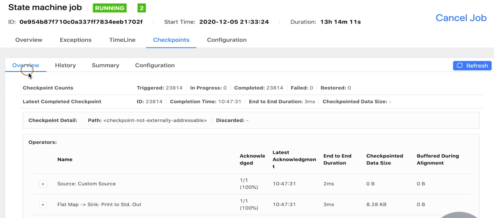
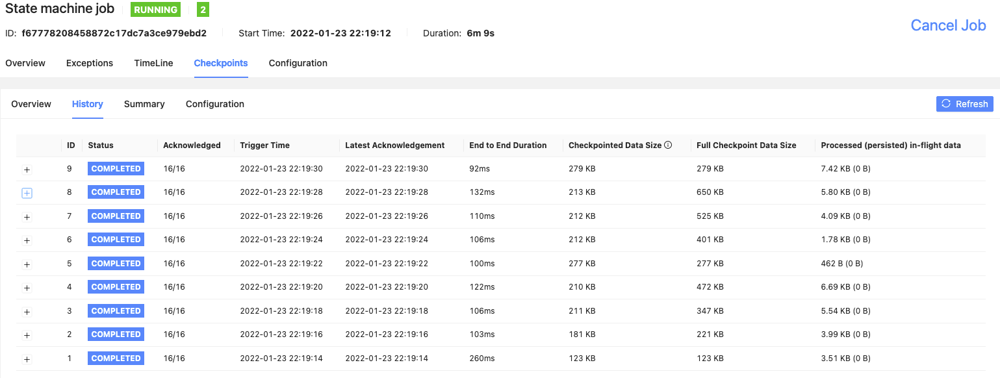
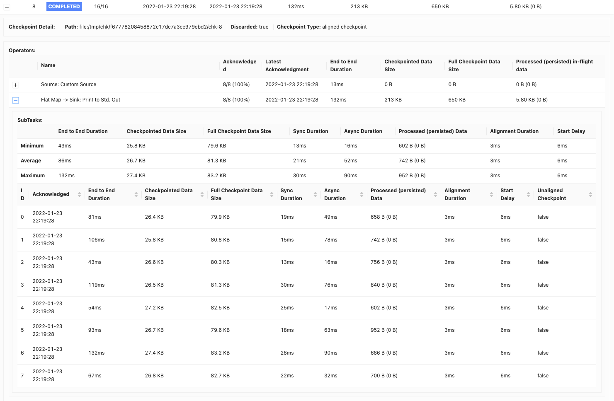
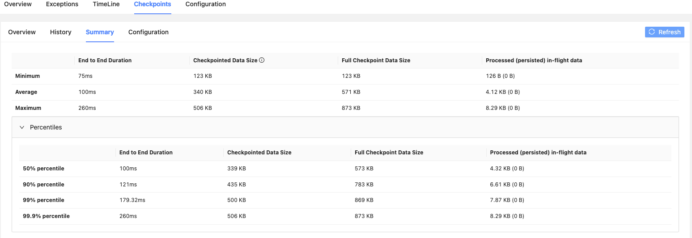
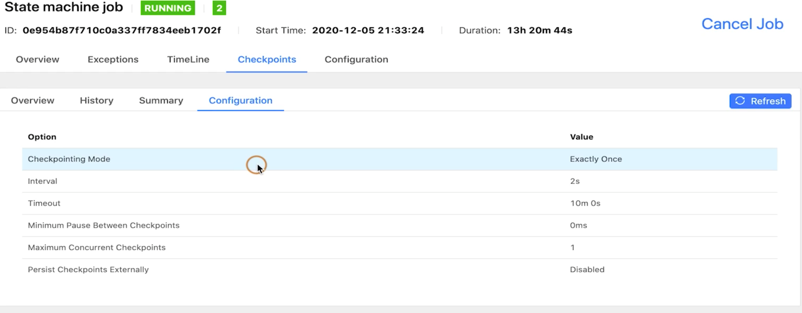
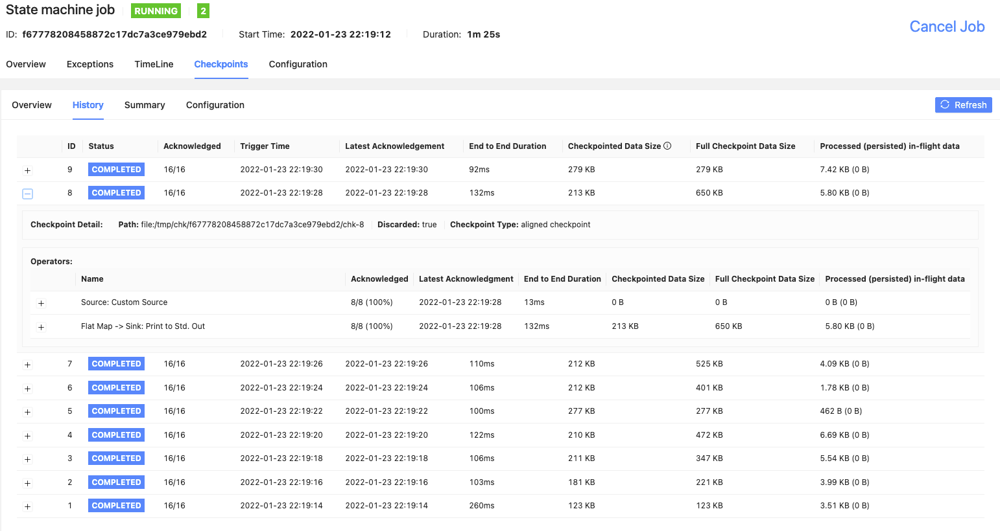
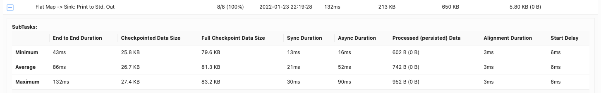
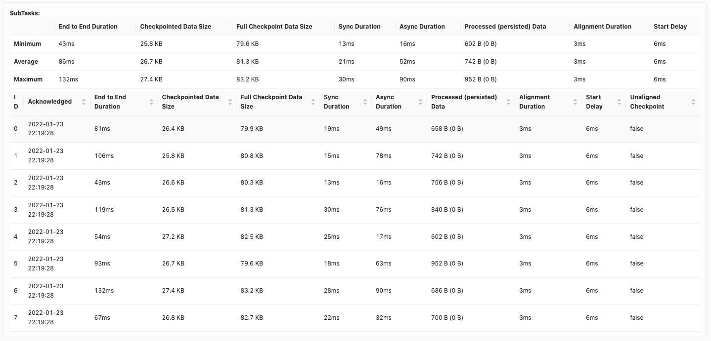

# 监控 Checkpoint

## 概览(Overview)

Flink 的 Web 界面提胸了选项卡/标签(tab) 来监视作业的 Checkpoint 信息。作业终止后，这些统计信息仍然可用。有 4 个不同的选项卡可显示有关 Checkpoint 的信息：概览(Overview), 历史记录(History), 摘要信息(Summary) 和 配置信息(Configuration)。下面我们将一次讨论这些内容。

## 监控(Monitoring)

### 概览(Overview) 选项卡

概览选项卡列出了以下统计信息。请注意，这些统计信息在 JobManager 丢失时无法保存，如果 JobManager 发生故障转移，这些统计信息将重置。如下图所示：



   * **Checkpoint Counts**
     * Triggered:自作业开始以来触发的 checkpoint 总数。
     * In Progress：当前正在进行的 checkpoint 数量
     * Completed：自作业开始以来完成的 checkpoint 总数
     * Failed：自作业开始以来失败的 checkpoint 总数
     * Restored：自作业开始以来进行的恢复操作次数。这还表示自提交以来重启的次数。请注意，带有 savepoint 的初始提交次数也算作一次恢复，如果 JobManager 在此操作过程中丢失，则该统计将重新计数。
  * **Lastest Completed Checkpoint** 最新(最近)成功完成的 Checkpoint。点击 More Details 可以得到 subtask 级别的详细统计信息。
  * **Latest Failed Checkpoint:** 最新失败的 Checkpoint。点击 More Details 可以得到 subtask 级别的详细统计信息。
  * **Latest Savepoint:** 最新触发的 savepoint 及其外部路径。点击 More Details 可以得到 subtask 级别的详细统计信息。
  * **Latest Restore：** 有两种类型的恢复操作
    * Restore from Checkpoint：从 checkpoint 恢复
    * Restore from Savepoint： 从 savepoint 恢复。


### 历史记录(History) 选项卡

Checkpoint 历史记录保存有关最近触发的 Checkpoint 的统计信息，包括当前正在进行的 Checkpoint。
注意，对于失败的 Checkpoint，指标偶会尽最大努力进行更新，但是可能不准确



* **ID:** 已触发 Checkpoint 的 ID。每个 checkpoint 的 Id 都会递增，从 1 开始
* **Status**：checkpoint 的当前状态，可以是正在进行(In Progress)、*已完成(Completed)* 或*失败(Failed)*。 如果触发的检查点是一个 savepoint ，你将看到一个符号。
* **Acknowledged**: 已确认完成的子任务数量与总任务数量。
* **Trigger Time**：在 JobManager 上发起 checkpoint 的时间
* **Latest Acknowledgement**：JobManager 接收到任何 subtask 的最新确认时间(如果尚未收到确认，则不适用)。
* **End to End Duration**: 从触发时间(Trigger Time) 到最后一次确认的持续时间(如果尚未收到确认，则不适用)。完整的 Checkpoint 的端到端持续时间由确认 checkpoint 的最后一个 subtask 确定。这个时间通常大于单个 subtask 实际 Checkpoint state 所需的时间。
* **Checkpointed Data Size**：在此次 Checkpoint 的 sync 和 async 阶段中持久化的数据量。如果启用了增量 checkpoint 或者 changelog，则此值可能会与全量 checkpoint 数据量产生却别。
* **Full Checkpoint Data Size：** 所有已确认的 subtask 的 checkpoint 的全量数据大小(看了下，应该也是此次的)。
* **Processed(persisted) in-flight data:** 在 checkpoint 对齐期间(从接收第一个和最后一个 checkpoint barrier 之间的时间)所有已确认的 subtask 处理/持久化的大约字节数。如果启用了 unaligned checkpoint， 持久化的字节数可能会大于 0。

对于 subtask，还有两个更信息的统计信息可用



* **Sync Duration**：Checkpoint 同步部分的持续时间。这包括 Operator 的快照时间，并阻塞 subtask 上的所有其他活动(处理记录、触发计时器等)。
* **Async Duration:** Checkpoint 的异步部分的持续时间。这将包括将 checkpoint 写入设置的文件系统所需的时间。对于 还没有对齐的 Checkpoint，还包括 subtask 必须等待最后一个 checkpoint barrier 到达时间(checkpointing alignment 持续时间)以及持久化数据所需的时间。
* **Alignment Duration：**处理第一个和最后一个 checkpoint barrier 之间的时间。对于 checkpoint alignment 机制的 checkpoint，在 checkpoint alignment 过程中，已经接收到 checkpoint barrier 的 channel 将阻塞并停止处理后续的数据(放入 channel 的缓存中)。
* **Start Delay**: 从 Checkpoint barrier 创建开始到 subtask 收到第一个 Checkpoint barrier 所用的时间(感觉比较重要)
* **Unaligned Checkpoint:** Checkpoint 完成的时候是否是一个 unaligned checkpoint。在 alignment 超时的时候，aligned Checkpoint 可以自动切换成 unaligned Checkpoint 。

### 历史记录的配置

我们可以通过一下减配置历史记录所保存的最近检查点的数量。默认为 10。

```yaml
web.checkpoints.history: 15
```

### 摘要信息(Summary) 选项卡

摘要计算了所有已完成 checkpoint 的端到端持续时间、增量/全量 Checkpoint 数据大小和 Checkpoint alignment 期间缓冲的字节数的简单 min/max/avg 统计信息



请注意，这些统计信息不全在 JobManager 丢失后无法保存，如果 JobManager 故障转移，将这些统计信息将重新计算。

### 配置信息(Configuration)选项卡



该配置选项卡累出了你指定的配置(streaming configuration):

* **Checkpointing Mode:** 恰好一次(Exactly Once) 或者至少一次(At Least Once)。
* **Interval**: 配置 Checkpoint 的触发间隔。在此期间触发 Checkpoint 。
* **Timeout**：超时之后，JobManager 取消 Checkpoint 并触发新的 Checkpoint
* **Minumum Pause Between Checkpoints**：Checkpoint 之间所需的最小暂停时间。Checkpoint 成功完成后，我们至少要等待这段时间才能再次触发下一个，这可能会延迟正常的间隔(影响 interval 呗)
* **Maximum Concurrent Checkpoints**，可以同时进行的最大 Checkpoint 个数
* **Persist Checkpoints External**：启用或禁用持久化 Checkpoint 到外部系统。如果启用，还会列出外部化 Checkpoint 的清理配置(取消时删除或保留)

### Checkpoint 详细信息

当你点击某个 checkpoint 的 more details 连接时，你将获取其所有的 operator 的 Min/Max/Avg 摘要信息，以及每个 subtask 单独的详细量化信息。



### 每个 Operator 的摘要信息

显示所有子任务的摘要信息：




### 所有 SubTask 的统计信息

显示当期算子的所有子任务(SubTask) 的统计信息。
比如通过 Checkpoint Data Size 我们可以看出当期算子的各个子任务是否差距巨大，如果存在很大的数据量差距，就需要去确认下是否有些 subtask 会比较大，有的比较小，进一步确认当前算子是否出现了数据倾斜的问题，比如在做 keyby 的时候，数据是不是 key 比较集中导致当前 subtask 中的数据状态比较大


