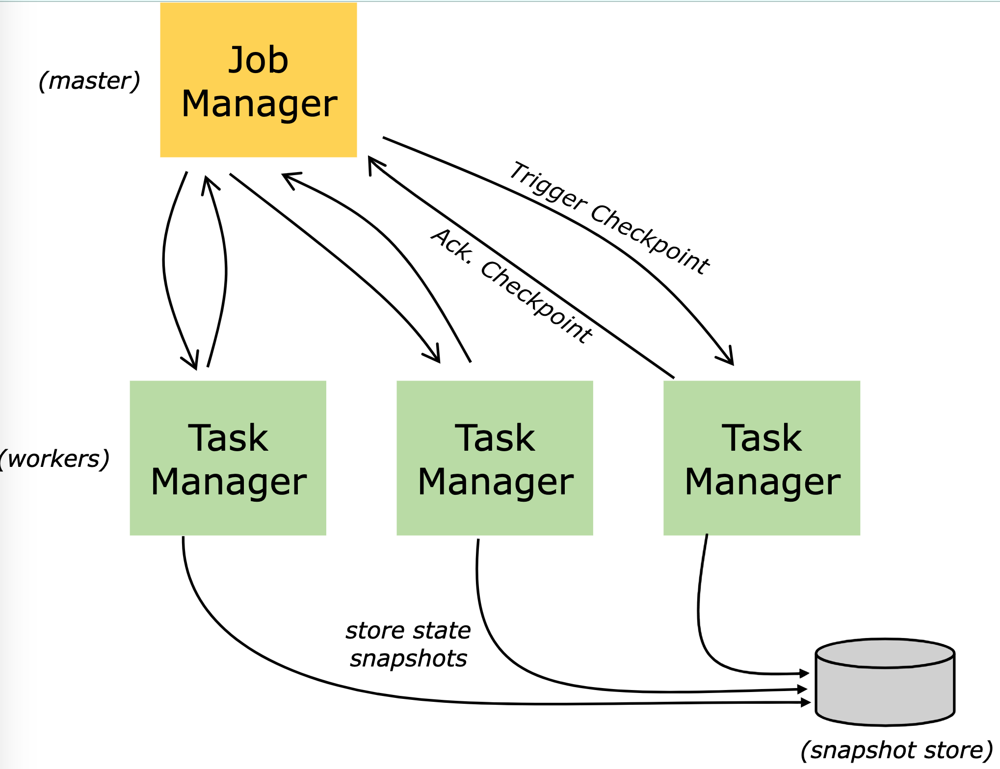
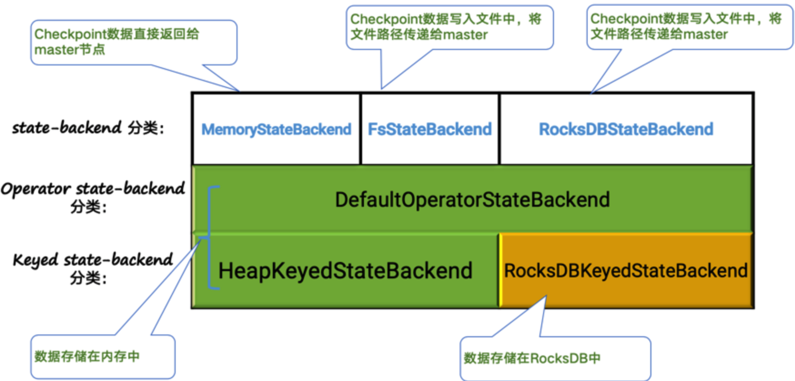
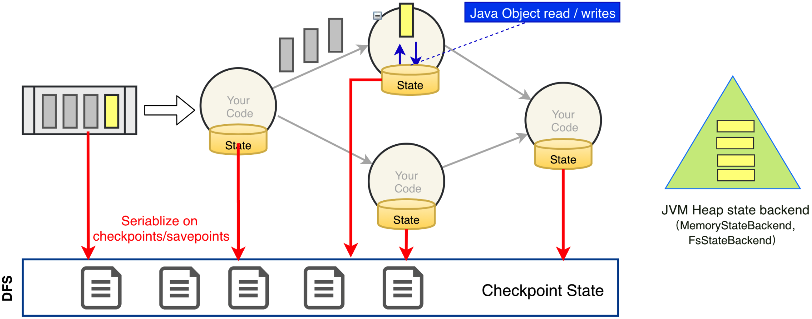
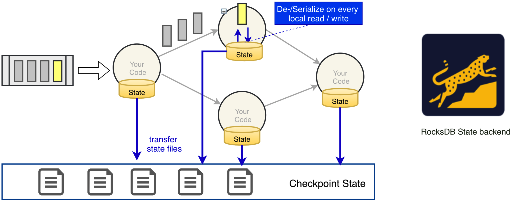
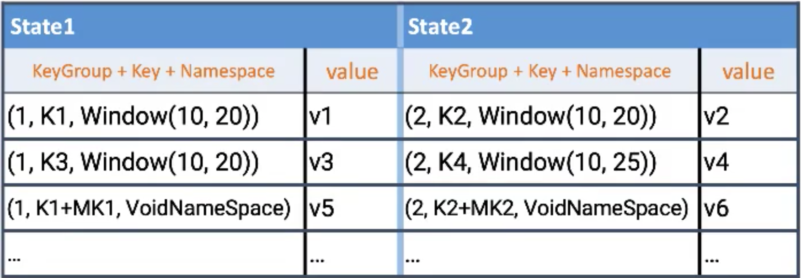
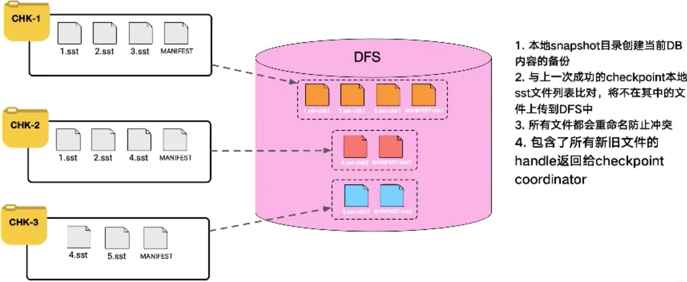

# State Backend 状态管理

## 背景

用 Data Stream API 编写的程序通常以各种形式保存状态：
  * 在 Window 触发之前要么收集元素，要么聚合
  * 转换函数可以使用 key/value 格式的状态接口来存储状态
  * 转换函数可以使用 CheckpointedFunction 接口，使其本地变量具有容错能力。

在启动 Checkpoint 机制时，状态会随着 Checkpoint 而持久化，以防止数据丢失、保证恢复时的一致性。状态内部的存储格式、状态在 Checkpoint 时如何持久化以及持久化在哪里均取决于选择的 **StateBackend**，通知书 checkpoint 存储在哪里取决于所配置的 **State Backend**(比如 JobManager Memory、file system、database)。


## 可用的 StateBackend

Flink 的 [checkpoint 机制](checkpoint-mechanism.md) 会将 timer 以及 stateful 的 operator 进行快照，然后存储下来，包括连接器 (connectors), 窗口(window) 以及任何用户[自定义的状态](flink-state.md)。

默认情况下，状态是保持在 TaskManagers 的内存中，checkpoint 保存在 JobManager 的内存中。为了合适地持久化大体量状态，Flink支持各种各样的途径去存储 checkpoint 状态到其他的 state backends 上。可以通过如下代码块来配置：

```java
Configuration config = new Configuration();
config.set(StateBackendOptions.STATE_BACKEND, "hashmap");
env.configure(config);
```

Flink 内置了一下这些开箱即用的 state backends:
  * MemoryStateBackend
  * FsStateBackend
  * RocksDBStateBackend

如果不设置，默认使用 MemoryStateBackend。


## State Backend 的分类



通过[ checkpoint 章节](checkpoint-mechanism.md) 我们知道，对于 Checkpoint 的触发过程中，JobManager 会触发相应的 Checkpoint
，然后在 SourceOperator 中进行 Checkpoint 触发。在每一个 Operator 中，会将每个 Operator 中的状态数据进行持久化，持久化的过程就是一次 snapshot，其对应的数据应该持久化到什么位置，就是通过 Statebackend 进行管理和控制的。



Checkpoint 的主要数据就是 State，State 就存储在每个 Operator 的 StateBackend 中，目前 Flink 社区支持如上图所示的三种 StateBackend，分别是 MemoryStateBackend、FsStateBackend、RocksDBStateBackend；每种 Statebackend 会创建出属于自己的 keyedStateBackend 和 Operator StateBackend，同时这三种 Statebackend 均会创建出同一类 Operator Statebackend——称之为 DefaultOperatorStateBackend，这是一个纯内存的；然后 Memory 和 Fs 的Statebackend 创建的 KeyedStateBackend 属于 HeapKeyedStateBackend  存储在内存中；对于 RocksDB 的 StateBackend 会创建 RocksDBKeyedStateBackend, 它会使用嵌入式的 RocksDB 数据库进行存储，属于磁盘和内存混合型，使用 Statebackend 的代码声明如下所示：

```java
StreamEnvironmentExecution env = StreamEnvironmentExecution.getExecutionEnvironment();
env.setStateBackend(new FsStateBackend("hdfs://namenode:40010/flink/checkpoints"));
// 关闭Asynchronous Snapshot
env.setStateBackend(new FsStateBackend(checkpointPath, false))
```

如果不配置，默认会创建一个 MemoryStateBackend，当我们需要 KeyedState 或者 Operator State 的时候，会由 Memory 提供。

从上图中看，如果看提示的话，我们看不出来 MemoryStateBackend 和 FsStateBackend 的区别，他们创建的 Keyed StateBackend 都是 HeapKeyedStateBackend ；区别其实是在于它们做 Checkpoint 的时候，Checkpoint 执行机制不同：
* 对于 MemoryStateBackend 来说，Checkpoint 数据是直接返回给 Master 节点，对于每个 Operator 来说，数据不落盘，返回给 Master 节点，存储在 JobManager 的 Heap 内存中；
* 对于 FsStateBackend 来说，checkpoint 数据是写入文件的，只需将文件路径(State Handle) 返回给 master

RocksDBStatebackend 也是将数据写入文件，不过写入的是 RocksDB 自带的 sst 文件格式，然后将文件路径发送给 JobMaster ；
绿颜色的都存储在内存中，黄颜色的数据存储在 RocksDB 中，也就是说这个数据是磁盘和内存混合的。

Flink 的 StateBackend 利用写时复制(copy-on-write) 机制允许当异步生成旧版本的状态快照时，能够不受影响地继续流处理。只有当快照被持久保存后，这些旧版本的状态才会被当做垃圾回收

### JVM Heap State Backend



#### 基本介绍

前面提到 MemoryStateBackend 以及 FsStateBackend 他们的 State 存储都是基于 JMV Heap StateBackend，也就说所有的 Operator 对象的状态数据都是通过本地的 JVM Heap 进行状态数据的存储，对应我们数据处理的过程中所有的 code 要进行状态数据获取的时候，都是通过本地的内存进行获取的，当我们触发了相应的 Checkpoint 的时候，会将我们本地 State 中的状态数据 进行序列化操作，转化成对应的二进制数据，写入指定的 checkpoint 路径中，如果是 FsStateBackend 就会写入指定的文件系统中；因此从整体上讲就是基于 JVM Heap 的 StateBackend

#### MemoryStateBackend

在 *MemoryStateBackend* 内部，数据以 Java 对象的形式存储在堆中。Key/Value 形式的状态和窗口算子持有存储着状态值、触发器的 hash table。

在 Checkpoint 时，State Backend 对状态进行快照，并将信息作为 Checkpoint 应答消息的一部分发送给 JobManager(master), 同时 JobManager 也将快照信息存储在自己的堆内存中。

MemoryStateBackend 能配置异步快照。强烈建议使用异步快照来防止数据流阻塞，注意，异步快照是默认开启的。用户可以在实例化 MemoryStateBackend 的时候，将相应布尔类型的构造参数设置为 false 来关闭异步快照（仅在 debug 的时候使用），例如：
```java
new MemoryStateBackend(MAX_MEM_STATE_SIZE, false);
```

* 构造方法
  
```java
// env 默认使用 MemoryStateBackend
env.setStateBackend(new MemoryStateBackend("file://" + baseCheckpointPath,null));
```
* 数据存储
  * State 数据存储在 TaskManager 内存中
  * Checkpoint 数据存储在 JobManager 内存中

* 容量限制
  * 单次 State maxStateSize 默认 5M
  * maxStateSize <= akka.framesize 默认 10M（因为要通过 akka rpc 传输）
  * 总大小不能超过 jobManager 的内存(因为所有 State 存储在 JobManager 的内存中) 

* 默认的后端状态存储管理器。

* 推荐场景
  * 本地测试
  * 状态比较少的作业。例如：由每次只处理一条记录的函数(Map,FlatMap,Filter等)构成的 Job。Kafka Consumer 仅仅需要很小的状态
* **<font color='red'>不推荐生产环境中使用</font>**
  * 在生产环境使用，会造成系统上的不稳定，以及状态丢失的问题，本身是不具有高度容错性的保障

建议同时将 managed memory 设置为 0(managed memory 的主要使用者是 rocksdb)，以保证将最大限度的内存分配给 JVM 上的用户代码

#### FsStateBackend

FsStateBackend 需要配置一个文件系统的 URL(类型、地址、路径)，例如: “hdfs://namenode:40010/flink/checkpoints” 或 "file://data/flink/checkpoints"

* 构造方法
```java
env.setStateBackend(new FsStateBackend("hdfs://namenode:40010/flink/checkpoints"));
```
* 数据存储
  * 状态数据：仍然在 TaskManager 的堆内存上
  * Checkpoint：外部文件系统(本地或者 HDFS)。
  * 少量的元数据信息存储到 JobManager 的内存中(高可用模式下，将其写入到 Checkpoint 的元数据文件)

* 容量限制
  * 单个 TaskManager 上 State 总量不能超过 TM 内存
  * 总数据大小不能超过文件系统容量
  
  * 推荐场景：
    * 常规状态作业
    * (key/value)状态比较大，窗口时间比较长， 如分钟级别窗口聚合(此时状态数据比较大)，Join 等
    * 需要开启 HA 的作业，能够保证算子中状态数据的持久化

* <font color='green'>可在生产环境中使用</font>

FsStateBackend 的本地状态仍然在 TaskManager 的内存堆上，直到执行 checkpoint 快照时数据会写入所配置的文件系统上。因此，这种方式能够享受本地内存的快速读写访问，也能保证大容量作业的故障恢复能力。

#### State 的存储

HeapKeyedStateBackend 存储格式
* 支持异步 checkpoint (默认)：CopyOnWriteStateTable<<font color='green'>K,N,S</font>>[], 整体相当于一个 map 


### RocksDB State Backend 

#### 基本介绍



RocksDBStateBackend 需要配置一个文件系统的 URL(类型、地址、路径)，例如: “hdfs://namenode:40010/flink/checkpoints” 或 "file://data/flink/checkpoints

RocksDBStateBackend 将正在运行的状态数据存储在 RocksDB 数据库中，RocksDB 数据库默认将数据存储在 TaskManager 的数据目录(TaskManager 的 log 目录？)。Checkpoint 时，整个 RocksDB 数据库被 Checkpoint 到配置的文件系统目录中。少量的元数据信息存储在 JobManager 的内存中(HA 模式下，将其存储到 Checkpoint 的元数据文件中)。

RocksDBStateBackend 只支持异步快照。

RocksDBStateBackend 跟 JVM Heap StateBackend 相比，提供了在内存中直接序列化和反序列化的操作，对于 KeyedState 来说，可以直接在 RocksDB 里面去进行相应的 K/V 的存储和获取，对于进行持久化的时候，可以把经过序列化之后的 state 文件进进行持久化，对于 statebacked 的话，就是做一个文件转移(transfer state file)，进而对一些 checkpoint 数据进行落地和存储。

对 RocksDBStateBackend 来说，也会使用 TaskManager 里面的内存资源，如果 TaskManager 挂掉的话，RocksDB 的数据也会丢失，因此必须借助于类似于 HDFS 这样的分布式文件系统来存储 RocksDB 中的数据

#### 使用方式

* 创建方法
  
```java
  env.setStateBackend(new RocksDbStateBackend("file://" + backCheckpointPath));
```

* 数据存储
  * State：TaskManager 中的 KV 数据库(嵌入式的，实际使用内存+磁盘，RocksDB 可用对内存和磁盘进行整合，提供更高效的 K/V 存储)。 
  * Checkpoint：外部文件系统(本地或HDFS)

* 容量限制
  * 单 TaskManager 上 State 总量不能超过其 内存 + 磁盘的大小
  * 单 key 最大容量 2G
  * 总大小不超过配置的文件系统容量

由于 RocksDB 的 JNI API 构建在 byte[] 数据结构之上，所以每个 key 和 value 最大支持 2^31 字节(大约 2GB)。
但是，RocksDB 合并操作的状态(例如: ListState) 累计数据可以大小超过 2^31 字节，但是会在下一次获取数据时是失败(是因为无法持久化？)。这是当前 RocksDB JNI 的限制。

* 推荐场景
  * 超大规模的状态作业，状态非常大，窗口非常长，key/value 状态非常大的 Job
  * 需要开启 HA 的作业
  * 对状态读写性能要求不高的作业
    * 如果是对状态数据读写要求高的话，还是基于 Heap 性能会好很多，因为 Heap 会减少很多序列化和反序列化的过程，而 RocksDB 的每次读写，因为底层是二进制的，必须将数据序列化成二进制才能写入 RocksDB，每次读取也同样需要反序列化；同时 RocksDB 的性能也不会差到哪去

* <font color='green'>生产环境可用</font>

RocksDB 是目前唯一支持增量 Checkpoint 的 State backend。


#### State 存储



RocksDBKeyedStateBackend 存储格式
每个 state 都存储在一个单独的 column family 内，每个 column family 是相互独立的。column family 可以区出不同的 compaction 和 不同的 sst 文件。每个 column family 使用独占 write buffer, 整个 DB 共享一个 block cache。

rocksDB 的 key 有 3 部分：KeyGroup，Key 和 Namespace 进行序列化存储在 DB 作为 key。
KeyGroup：当前 key 属于哪个 group，int 类型的值
key：用户定义的 keyby() 之后 需要 process 的 key
namespace: 默认情况下，namespace 是 VoidNameSpace ，即无任何内容，它的主要使用场景是在 Window 中，表示这个 key 属于哪个 window，window trigger 的时候，可以根据 namespace 把数据从 state 中取出。


### State Backend 的总结

上文说过，不建议生产环境选择 MemoryStateBackend

* FsStateBackend： 性能更好——这是因为 状态对象存储在堆中，相对于 RocksDB，不需要被序列化和反序列化；但是日常存储在堆内存中，面临着 OOM 的风险，且不支持增量 checkpoint。

* RocksDBStateBackend：除了要 序列化和反序列化，还要经过 jni 的调用。但是 无需担心 OOM 风险

RocksDBStateBackend 这种模式的状态存储在本地的 RocksDB 上。RocksDB 是一种嵌入式的 Key-Value 数据库，数据实际保存在本地磁盘上。比起 `FsStateBackend` 的本地状态存储在内存中，RocksDB 利用了磁盘空间，所以可存储的本地状态更大。然后，每次从 RocksDB 中读取数据都需要序列化和反序列化，因此读取本地状态的成本更高。快照执行时，Flink 将存储与本地的 RocksDB 的状态同步到远程的存储上，因此使用这种 State Backend 时，也需要配置分布式存储的地址。 Asynchronous Snapshot 在默认情况下也是开启的。

此外，这种 StateBackend 也允许增量快照(Incremental Checkpoint)。Incremental Checkpoint 非常适合超大规模的状态，快照的耗时明显降低，同时，它的代价是重启恢复的时间更长。默认情况下，Incremental Checkpoint 没有开启，需要我们手动开启，可以通过代码的方式开启，也可以通过下面所说的配置的方式开启，详情参加下方的 state Backend 配置一节。

相比 `FsStateBackend`, `RocksDBStateBackend` 能够支持的本地和远程状态更大，Flink 社区已经有 TB 级的案例。

除了上述三种以外，开发人员也可以自行开发 State Backend 的具体实现。


## State Backend 的配置

如果没有明确指定，将使用 JobManager 作为默认的 state backend。我们可以在 flink-conf.yaml 中为所有的 job 设置默认的 State Backend。但是 每以个 Job 的 State Backend 配置都会覆盖默认 state Backend 的配置，如下所示：

### flink-conf.yaml 全局配置
```yaml
# 可选配置 jobmanager, filesystem,rocksdb
state.backend: filesystem
state.checkpoints.dir: hdfs://namenode:8020/flink/checkpoints
```

state.backend 的可选值包括 jobmanager (MemoryStateBackend)、filesystem (FsStateBackend)、rocksdb (RocksDBStateBackend), 或者使用实现了 StateBackend 工厂 StateBackendFactory 的类的全限定名，例如：RocksDBStateBackend 的全限定名为 org.apache.flink.contrib.streaming.state.RocksDBStateBackendFactory

state.checkpoints.dir 选项指定了所有 State Backend 与 Checkpoint 数据和元数据文件的目录


### State Backend 代码中的配置

设置单个 Job 的 State Backend

```java
// 对应单个 job
StreamEnvironmentExecution env = StreamEnvironmentExecution.getExecutionEnvironment();
env.setStateBackend(new FsStateBackend("hdfs://namenode:40010/flink/checkpoints"))
```

### RocksDBStateBackend的配置

1、如果你想在 IDE 中使用 RocksDBStateBackend，或者需要在作业中通过编程方式动态配置 RocksDBStateBackend，必须添加以下依赖到 Flink 项目中。

```xml
<dependency>
    <groupId>org.apache.flink</groupId> 
    <artifactId>flink-statebackend-rocksdb_2.11</artifactId> 
    <version>1.11.1</version>
    <scope>provided</scope>
</dependency>
```
> 由于 RocksDB 是 Flink 默认分发包的一部分，所以如果你没在代码中使用 RocksDB，则不需要添加此依赖。而且可以在 flink-conf.yaml 文件中通过 state.backend 配置 State Backend。

2、使用 RocksDBStateBackend 的时候，建议使用增量 checkpoints, 配置方式如下：

* 在 flink-conf.yaml 中配置 
```yaml
state.backend.incremental: true
```
* 在代码中使用 RocksDBStateBackend 
```java
StateBackend rocksdbStatebackend = new RocksDBStateBackend("hdfs://namenode:8020/flink/checkpoints",true);
env.setStateBackend(rocksdbStatebackend);
```


## RocksDB State Backend 的调优


### 基于 RocksDB 的增量 checkpoint



RocksDBStateBackend 支持 *增量快照*。增量快照的核心思想是每次快照时只对发生变化的数据增量写到分布式存储上，而不是将所有的本地状态都拷贝过去，因此可以显著减少快照完成的耗时，减少 checkpoint 的时间；增量的 checkpoint 仅存储与之前完成的 checkpoint 不同的增量文件，而不是存储全量的数据备份。

一个增量快照时基于(通常多个)谦虚快照构建的。由于 RocksDB 内部在 compaction 机制对 sst 文件进行合并，Flink 的增量快照也会定期重新设立起点(rebase), 因此增量联调不会一直增长，旧快照包含的文件也会逐渐过期并被自动清理。

和基于全量快照的恢复时间相比，如果网络带宽是瓶颈，那么基于增量快照恢复可能会消耗更多时间，因为增量快照包含的 sst 文件之间可能存在数据重叠导致需要下载的数据量大；而当 CPU 或 IO 是瓶颈的时候，基于增量快照的恢复会更快，因为从增量快照恢复不需要解析 Flink 的统一格式来重建 RocksDB 数据表，而是可以直接基于 sst 文件加载。

增量 checkpoint 默认没有开启，需要手动开启，开启方式如上述配置所示。

需要注意的是，一旦启用了增量快照，网页上展示的 Checkpointed Data Size 只代表增量上传的数据量，而不是一次快照的完整数据量。


如上图所示的示例，示例中的 statebackend 做了 3 次 checkpoint。
第一次的时候，它包含的文件是 1.sst, 2.sst, 3.sst 和 MANIFEST。sst 文件是 LSM 数据库的一个概念，sst 文件生成之后就不可变，也就是说不管执行多少次 checkpoint, 只要我当前的 checkpoint 中和第一次的 checkpoint 中都有一个 1.sst 文件，这个文件其实都是一模一样的，flink 正是利用了这个机制才实现了增量的 checkpoint。
在第二次 checkpoint 的时候，包含的文件是 1.sst, 2.sst, 4.sst 以及 MANIFEST 文件，相比于第一次，如果第一次 checkpoint 做成功的话，我们只需要上传 4.sst 和 一个可变文件 MANIFEST, 因为 MANIFEST 是元数据文件，它一直是可变的，所以不管之前有没有上传成功，本次都必须上传

在第三次 checkpoint 的时候，包含了 4.sst, 5.sst 和 MANIFEST 文件，此时 5.sst 是个新文件，需要被上传，MANIFEST 文件同样需要上传。

如果整个 checkponit-2 失败的话，flink 会保证此次 checkpoint 中的数据是不可信，不可用的。当进行 checkpoint3 的时候，4.sst 文件相当于根本没有上传，此时 4.sst 和 5.sst 都会被上传。

### 内存管理

Flink 致力于控制整个进程的内存消耗，以确保 Flink 任务管理器（TM)有很好的内存使用，从而既不会在容器(Docker/K8s,Yarn) 环境中由于内存超用被杀掉，也不会有因为内存利用率过低导致不必要的数据罗盘或是缓存命中率下降，导致性能下降

为了达到上述目标，Flink 默认将 RocksDB 的可用内存配置为任务管理器的单槽(per-slot)托管的内存(就是runtime内存管理章节的 managed memory)。这将为大多数应用程序提供良好的开箱即用体验，即大多数应用程序不需要调整 RocksDB 配置，简单的增加 Flink 的托管内存(managed memory)即可改善内存相关性能问题。

当然，我们也可以不使用 Flink 自带的内存管理，而是手动为 RocksDB 的每个列族(ColumnFamily)分配内存(每个算子的每个 state 都对应一个列族)。这为专业用户提供了对 RocksDB 进行更细粒度的控制的途径，但同时也意味着用户需要自行保证总内存不会超过(尤其是容器)环境的限制。可以参考大状态调优章节

**RocksDB 使用的托管内存**

Flink 并不直接控制 RocksDB 的 native 内存分配，而是通过配置 RocksDB 来确保其使用的内存正好与 Flink 托管的内存预算相同。这是在任务槽(per-slot)级别上完成的(托管内存以任务槽位粒度计算)。如果想让 Flink 控制 RocksDB 的总内存使用量，需要打开如下配置(默认打开)，

```yaml
state.backend.rocksdb.memory.managed: true
```

为了设置 RocksDB 实例的总内存使用量，Flink 对同一任务槽上的所有 RocksDB 实例使用共享的 cahe 以及 write buffer manager。共享 cache 将对 RocksDB 中的内存消耗的三个来源(块缓存、索引&bloom过滤器(bloom filter)、MemTables)设置上限。

Flink 还提供了两个参数来控制*写路径*(MemTable) 和 *读路径*(索引及过滤器，读缓存)之间的内存分配。当你看到 RocksDB 由于缺少写缓冲内存(频繁刷新)或读缓存未命中而性能不佳时，可以使用这些参数调整读写间的内存分配。
  * state.backend.rocksdb.memory.write-buffer-ratio, 默认值 0.5, 即 50% 的给定内存会分配给写缓冲区使用。
  * state.backend.rocksdb.memory.high-prio-pool-ratio, 默认值 0.1, 即 10% 的 block cache 会优先分配给索引及过滤器。我们强烈建议不要将此设置为 0，以防止索引和过滤器被频繁提出缓存而导致性能问题。此外，我们默认将 RocksDB 的 Level0 级别的过滤器和索引将被固定到缓存中以提高性能。

> 注意，在上述机制(上述两个配置)开启时将覆盖用户在 PredefinedOptions 和 RocksDBOptionsFactory 中对 Block cache 和 write buffer 进行的配置(将覆盖用户在代码中的配置？)
> *仅面向专业用户*，若要手动控制内存，可以将 state.backend.rocksdb.memory.managed 设置为 false，并通过 ColumnFamilyOptions 配置 RocksDB。或者可以复用上述 cache/write-buffer-manager 机制，但将内存大小设置为与 Flink 的托管内存大小无关的固定大小(通过 state.backend.rocksdb.memory.fixed-per-slot 选项)。注意在这两种情况下，用户都需要确保在 JVM 之外有足够的内存可供 RocksDB 使用(肯定不能配置的内存大小超过机器本身的)。

### 计时器(内存 vs RocksDb)

计时器(Timer) 用于安排稍后的操作(基于事件时间或处理时间)，例如触发窗口或回调 ProcessFunction。

当选择 RocksDBStateBackend 时，默认情况下计时器也存储在 RocksDB 中。这是一种健壮且可扩展的方式，允许应用程序使用很多个计时器。另一方面，在 RocksDB 中维护计时器也会有一定的成本，因此 Flink 也提供了将计时器存储在 JVM 堆上而使用 RocksDB 存储其他状态的选项。当计时器数量较少时(没有窗口，且在 ProcessFunction 中不使用计时器)，基于堆的计时器可以有更好的性能。但是请谨慎使用此功能，因为基于堆的计时器可能会增加 checkpointing 时间，并且自然无法扩展到内存之外。

我们可以通过将 `state.backend.rocksdb.timer-service.factory` 配置为 heap(而不是默认的 rocksdb) 来将计时器存储在堆上。

> *在 RocksDBStateBackend 中使用基于堆的计时器的组合当前不支持计时器状态的异步快照。其他状态(如 keyed state) 可以被异步快照*

### 开启 RocksDB 的原生监控指标

我们可以选择使用 Flink 的监控指标系统来汇报 RocksDB 的原生指标，并且可以选择特定指标进行汇报，参阅 [configuration](https://nightlies.apache.org/flink/flink-docs-release-1.11/ops/config.html#rocksdb-native-metrics) 来了解详情

> 启用 RocksDB 的原生指标可能会对应用程序的性能产生负面影响。

### ColumnFamily 级别的预定于选项

该项功能应限于 *专家调优*或*故障处理*中使用。

使用预定义选项，用户可以子每个 RocksDB ColumnFamily 上应用一些预定义的配置，比如配置内存使用、线程、Compaction 设置等。目前每个算子的每个状态都在 RocksDB 中有一个专门的 ColumnFamily 存储

有两种方式可以选择要应用的预定义选项：

  * 通过 state.backend.rocksdb.predefined-options 配置项将各个选项名设置进 flink-conf.yaml
  * 通过程序设置 
  ```java
  RocksDBStateBackend.setPredefinedOptions(PredefinedOptions.SPINNING_DISK_OPTIMIZED_HIGH_MEM)
  ```

### 通过 RocksDBOptionsFactory 配置 RocksDB 选项

我们可以通过配置一个 RocksDBOptionsFactory 来手动控制 RocksDB 的选项。此机制可以使我们对 ColumnFamily 进行细粒度的控制，例如内存使用，线程，compaction 设置等。目前每个算子的每个状态都在 RocksDB 中有一个专门的 ColumnFamily 存储。

有两种方式可以将 RocksDBOptionsFactory 传递给 RocksDBStateBackend：

  * 通过 state.backend.rocksdb.options-factory 将选项工厂实现类的全限定名配置到 flink-conf.yaml
  * 通过程序设置，例如 RocksDBStateBackend.setRocksDBOptions(new MyOptionsFactory());

> 注意，通过程序设置的 RocksDBOptionsFactory 将覆盖 flink-conf.yaml 配置文件的设置，且 RocksDBOptionsFactory 的设置的优先级高于预定义选项(PredefinedOptions)
> RocksDB 是一个本地库，它直接从进程分配内存，而不是 JVM 分配内存。分配给 RocksDB 的任何内存都必须被考虑在内，通常需要将这部分内存从任务管理器（TM）的 JVM 堆中减去(JVM 堆的内存配置大小不应该包含 RocksDB 的这部分内存)。不这样做可能会导致 JVM 进程由于分配的内存超过申请值而被 YARN/Mesos 等资源管理框架终止。

**从 flink-conf.yaml 中读取列族选项**

一个实现了 ConfigurableRocksDBOptionsFactory 接口的 RocksDBOptionsFactory 可以直接从配置文件(flink-conf.yaml) 中读取设定
state.backend.rocksdb.options-factory 的默认配置是 org.apache.flink.contrib.streaming.state.DefaultConfigurableOptionsFactory
下面是一个自定义 ConfigurableRocksDBOptionsFactory 的一个示例
```java
public class MyOptionsFactory implements ConfigurableRocksDBOptionsFactory {

    private static final long DEFAULT_SIZE = 256 * 1024 * 1024;  // 256 MB
    private long blockCacheSize = DEFAULT_SIZE;

    @Override
    public DBOptions createDBOptions(DBOptions currentOptions, Collection<AutoCloseable> handlesToClose) {
        return currentOptions.setIncreaseParallelism(4)
               .setUseFsync(false);
        // increase the max background flush threads when we have many states in one operator,
        // which means we would have many column families in one DB instance.
        // return currentOptions.setMaxBackgroundFlushes(4);
    }

    @Override
    public ColumnFamilyOptions createColumnOptions(
        ColumnFamilyOptions currentOptions, Collection<AutoCloseable> handlesToClose) {
        return currentOptions.setTableFormatConfig(
            new BlockBasedTableConfig()
                .setBlockCacheSize(blockCacheSize)
                .setBlockSize(128 * 1024));            // 128 KB。下文的配置有默认的 4kb 说明

        // decrease the arena block size from default 8MB to 1MB. 减少 arena 区域的内存
        // return currentOptions.setArenaBlockSize(1024 * 1024);
    }

    @Override
    public RocksDBOptionsFactory configure(Configuration configuration) {
        this.blockCacheSize =
            configuration.getLong("my.custom.rocksdb.block.cache.size", DEFAULT_SIZE);
        return this;
    }
}
```

### RocksDB 内存调优

RocksDB State Backend 的性能在很大程度上取决于它可用的内存量。为了提高性能，增加内存会有很大的帮助，或者调整内存的功能。默认情况下，RocksDB StateBackend 将 Flink 的 Managed Memory 用于 RocksDB 的缓冲区和缓存(state.backend.rocksdb.memory.managed: true)。关于 RocksDB 内存 调优的性能问题，如下步骤可能会有帮助：

* 尝试提高性能的第一步应该是增加托管内存的大小。这通常会大大改善 RocksDB 性能问题，而不是通过调整 RocksDB 底层参数进而引入复杂性。尤其是在容器、进程规模较大的情况下，除非应用程序本身逻辑需要大量的 JVM 堆，否则大部情况下，分总内存通常都可以用于 RocksDB。默认的过关比例(taskmanager.memory.managed.fraction: 0.4)是保守的，当 TaskManager 进程的内存由很多 GB 时，通常是可以增加该托管内存的比例。

* 在 RocksDB 中，写缓冲区的数量取决于应用程序中所拥有的状态数量(即数据流中所有的算子状态，因为每个 state 都对应一个 column family, 它需要一个自己的 write buffer，二者成正比)。因此，具有多状态的应用程序通常需要更多需要更多的内存才能获得相同的性能。

* 你可以尝试设置 state.backend.rocksdb.managed.memory: false 来自定义使用 ColumnFamily 内存。与使用托管内存（固定内存池）相比，不使用托管内存意味着 RocksDB 分配的内存与应用程序中的状态数成比例（内存占用随应用程序的变化而变化）。根据经验，非托管模式（除非使用列族（ColumnFamily）RocksDB）的上限约为 “140MB * 跨所有 tasks 的状态 * slots 个数”。 计时器也算作状态！(不托管的话，状态越多，占用的内存越大，到最后可能出现内存超占而导致 flink job 被 container 杀掉或者 container 被 yarn/k8s 杀掉)

* 如果你的应用程序有许多状态，并且你通过观察日志之类的方式看到频繁的 MemTable 刷新，这表明出现了写端瓶颈，但是不能提供更多内存，此时我们可以增加写缓冲区的内存比例(state.backend.rockdb.memory.write-buffer-ratio: 0.5)

* 一些高级选项(*专家模式*)是通过 RocksDBOptionsFactory 来调整 RocksDB 的 Column Family 选项，以减少多种状态的 MemTable 的刷新次数，具体调整项目请参考上述 自定义 RocksDBOptionsFactory

### RocksDB 的调优配置

Flink 1.8 开始支持 ConfigurableOptionsFactory。之前只能通过代码实现。


| 配置项            |  说明   | 
| ---------        | -----     |
| state.backend.rocksdb.block.blocksize| 数据块大小，默认`4KB`.建议不要改动，增大的话，整体 index 就会减少，占用的内存就会减小，但是会影响读性能    | 
| state.backend.rocksdb.block.cache-size | 整个 DB 的 block cache 大小，默认 `8MB`. 建议调大，比如说 521MB 或 1GB |
| state.backend.rocksdb.compaction.level.use-dynamic-size| 如果使用 LEVEL compaction，在 SATA 盘上，建议配成 true，默认 false |
| state.backend.rocksdb.files.open | 打开文件最大数目，`-1` 意味着没有限制.默认 `5000`  | 
| state.backend.rocksdb.thread.num | 后台 flush 和 compaction 的线程数. 默认值 `1`, 建议调大 |
| state.backend.rocksdb.writebuffer.count | 每个 column family 的 write buffer 数目，默认为 `2`, 建议调大 |
| state.backend.rocksdb.writebuffer.number-to-merge | 写之前的 write buffer merge 数目，默认值 `1`, 建议调大 |
| state.backend.rocksdb.writebuffer.size | 每个 write buffer 的 size, 建议调大 |

rocksdb 最常见的就是分级的 Compaction （rocksdb 本身起家于 LevelDB，LevelDB 的有点它基本都保留，比如说最知名的分级的特点。）
level 0 在内存中，读的时候先从 Level 0 开始，然后 L1-L5 等，读到就返回。除了上述的原理简述之后，还可以参阅 rocksdb 的 github 上面的 tuning 的文档
上面的配置中，如果 writebuffer size 调大话，writebuffer count 也可以不用调大。
writebuffer merge 是说 write buffer 达到多少的时候，一定会触发一次 merge，一般认为可以调大些。比如说 内存比较大的时候，number-to-merge 可以配成 3，writebuffer.count 可以配成 4。

Configurable Option 是个接口，可以通过代码自定义配置

### 容量配置
本节讨论如何确定 Flink 作业应该使用多少资源才能可靠地运行。容量规划的基本经验法则如下：

  * 应该有足够的资源保障正常运行时不出现反压，如果检查应该用程序是否在反压下运行，倾向信息请参考 [反压监控](../backpressure/backpressure_monitor.md)
  
  * 在无故障时间内无反压的正常情况下运行程序所需资源之上还需要能够提供一些额外的资源。需要这些资源来"追赶"在应用程序恢复期间累计的输入数据。这通常取决于恢复操作需要多长时间(这取决于故障恢复时需要加载到新 TaskManager 中的状态大小)以及故障恢复的速度。
  * 瞬时/临时反压通常是允许的，在负载峰值，追赶阶段或外部系统(sink 到外部系统)出现临时减速时，这是执行流程控制的重要部分。

**重要提示**: 为了方便以后增加资源，请确保将流应用程序的 *最大并行度*设置为一个合理的数字。最大并行度定义了定扩缩容时(通过 savepoint ) 可以设置程序并行度的上限。

### 压缩

Flink 为所有 checkpoints 和 savepoints 提供可选的压缩(默认：关闭)。目前，压缩总是用 snappy 算法。压缩作用于 keyed state 下 key-groups 的粒度，即每个 key-groups 可以单独解压缩，这对于重新缩放(扩缩容)很重要。

可以通过 ExecutionConfig 来开启压缩：

```
ExecutionConfig executionConfig = new ExecutionConfig();
executionConfig.setUseSnapshotCompression(true);
```

> 注意：压缩选择对增量快照没有影响，因为他们使用的是 RocksDB 的内部格式，该格式始终使用开箱即用的 snappy 压缩。


## 参考文章

https://nightlies.apache.org/flink/flink-docs-master/zh/docs/concepts/stateful-stream-processing/
https://nightlies.apache.org/flink/flink-docs-master/zh/docs/ops/state/large_state_tuning/

https://www.zhihu.com/tardis/zm/art/104601440?source_id=1005
https://www.bilibili.com/video/BV1Vp4y1X7Yg/?p=3&spm_id_from=pageDriver&vd_source=5a931c15c89a0f0e403fd0e6003b1911