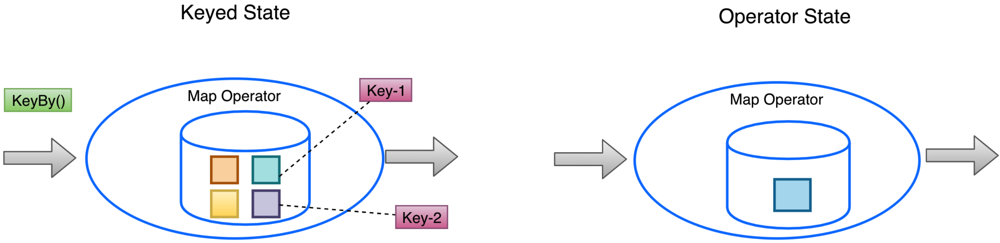

# Flink 状态 State

## State Overview


我们常说，流式计算就是瞬时计算，数据转瞬即逝，然而我们的真实业务场景的数据不可能都是静态的或者流失掉，无任何数据留下，而留下的数据就可以被称为 State，中文称之为状态，如图中所示，数据经过用户代码的产出，中间的状态会存储在 StateBackend 中，

## 状态类型及其应用

* Duplication
  * Record all primary key. 去重的场景中，根据 key 来进行
* Window Computing
  * Included but untriggered data 。window 计算的时候，对中间状态的结果进行存储，窗口中的数据存储，都可能会涉及到状态数据的应用
* Machine Learning / deep Learning
  * Training model and parameter。对机器学习中的参数以及中间运算结果进行状态存储，也会涉及到有状态计算
* History data access
  * Comparison with yesterday's data is required。历史状态数据的获取

上述场景在 Flink 作业中都是非常常见的，下面我看下 Flink 是如何对相应的状态进行支持的。

## Flink 状态分类

Flink 状态从整体上分为 2 类：Raw State 和 Managed State。Raw State 是原生状态，Managed State 是托管状态。原生状态中存储的是原生的数据流，所有的状态的管理都是由用户管理；
对于托管状态，是由 Flink 自己内部 Runtime 对状态进行相应的管理。
下面我们从几个角度去对比下 Managed State 和 Raw State 之间的区别

### Flink 不同状态的区别简介

#### 整体区分


* RawState
  * 基于用户自行管理，需要手工实现序列化操作以及数据的反序列化，都需要用户自定义实现
  * 状态数据类型的支持
    * 仅支持 Byte Array—— byte[]
  * 使用场景
      * 自定义 operator 需要去处理状态数据的场景，可以提供最大限度的灵活性给用户 

* Managed State
  * 所有的操作基本上都是基于 Flink Runtime 管理，自动化存储和恢复，内存优化的支持
  * 状态数据类型的支持
    * value，list，map，因此 Managed State 更加易于使用
  * 使用场景
    * 适应于大部分计算场景。比如我们可以定义不定数据结构类型的状态数据，能够满足我们大多数的计算场景
  * 根据是否进行了 keyby 或者 key 的操作做区分
    * Keyed State
      * 根据每个 Key 来进行状态的存储和获取
    * Operator State
      * 跟 key 无关，每个 Operator 里面有个 State 存储

下面的示意图以更加明细的角度来看 Keyed State 和 Operator State 的区别



如上图所示
Keyed State：
    算子在经过 keyby 之后，针对每一个 key 来讲，都有自己的 Keyed State，对每个 Operator 而言，可能会涵盖多个 Keyed State，Keyed State 的数量是根据当前 Operator 含有多少个 key 来计算，是一种更细粒度的状态
Operator State
    flink job graph 在 keyby 之前 如果遇到 map 算子，那么整个 map 的 operator 里面含有一个状态，这个状态是 operator 共享的，数据会在 operator 这个层面维护

#### 不同 Managed State 的区别列表

<table>
<tr style='background-color: #4472C4;'>
<th></th>
<th><font color='white'>Keyed State</font></th>
<th><font color='white'>Operator State</font></tg>
</tr>
<tr style='background-color: #CFD5EA;'>
<td>使用算子类型</td>
<td>只能被用于 Keyed Stream 中的<br>Operator 上</td>
<td>可以被用于所有 Operator <br>( 例如 FlinkKafkaConsumer ) </td>
</tr>
<tr style='background-color: #E9EBF5;'>
<td>状态分配</td>
<td>每个 key 对应一个状态，单个 Operator 中可能涵盖多个 keys</td>
<td>单个 Operator 对应一个 State</td>
</tr>
<tr style='background-color: #CFD5EA;'>
<td>创建和访问方式</td>
<td>重写 RichFunction，通过 RuntimeContext 对象获取</td>
<td>实现 CheckpointedFunction 或 ListCheckpointed 接口</td>
</tr>
<tr style='background-color: #E9EBF5;'>
<td>横向拓展</td>
<td>随着 key 自动在多个算子 Task 上迁移</td>
<td>有多种重新分配的方式：<br>
- 均匀分配<br>
- 将所有状态合并，再分发到每个实例上。
</td>
</tr>
<tr style='background-color: #CFD5EA;'>
<td>支持数据类型</td>
<td>ValueState, ListState, MapState, ReducingState, AggregatingState</td>
<td>ListState, BroadcastState</td>
</tr>
<tr style='background-color: #E9EBF5;'>
<td>Current Key</td>
<td>KeyedState 的值总是与一个 current key 对应</td>
<td>OperatorState 没有 current key (当前键)概念 </td>
</tr>
<tr style='background-color: #CFD5EA;'>
<td>heap</td>
<td>KeyedState 有堆内存和 RocksDB 两种实现</td>
<td>OperatorState 只有堆内存一种实现</td>
</tr>
<tr style='background-color: #E9EBF5;'>
<td>snapshot</td>
<td>KeyedState 由 backend 实现，对用户透明；会自动帮用户存储和恢复</td>
<td>OperatorState 需要由用户手动实现 snapshot 和 restore 方法</td>
</tr>
<tr style='background-color: #CFD5EA;'>
<td>Size</td>
<td>KeyedState 一般是相对规模较大的</td>
<td>OperatorState 一般被认为规模比较小的 </td>
</tr>
</table>


## KeyedState 介绍与使用

### KeyedDataStream

如果你希望使用 Keyed State，首先需要为 DataStream 指定 Key(主键)。这个主键用于状态分区(也会给数据流中的记录本身分区)。你可以使用 DataStream API 中的 keyBy(KeySelector) 来指定 key。它将生成 KeyedStream，接下来允许使用 keyed state 操作。

Key selector 函数接收单条记录作为输入，返回该条记录的 key。该 key 可以是任何类型，但是它的计算方式必须是具备确定性的。

Flink 的数据模型不基于 key-value 对，因此是加上将数据集在物理上封装成 key 和 value 是没有必要的。 Key 是“虚拟”的。它们定义为基于实际数据的函数，可以操作分组算子。

最佳实践：使用 Key Selector 并解决好 Java 的 Lambda 表达式，我们可以方便地使用 KeySelector，如下示例代码所示：
```java
// some ordinary POJO
public class WC {
  public String word;
  public int count;

  public String getWord() { return word; }
}
DataStream<WC> words = // [...]
KeyedStream<WC> keyed = words
  .keyBy(WC::getWord);
```

### KeyedState 内部关系


* 单值更新的状态，使用 ValueState，特点是单一状态值
* MapState ，它和 java 中的 Map 接口保持一致，提供存储 K/V 类型的状态，可以通过 get/put 去操作中间状态结果
* AppendingState，支持一些 Appending 的操作，MergingState 又分为 ListState、ReducingState、AggregatingState；
  * ListState 跟我们常用的 JDK 的 List  数组其实是一样的，我们可以用 ListState 做一些累加或者累积的操作，它提供了 add 方法 和一些更新操作；
  * ReducingState 和 AggregatingState 做一些聚合类型的状态，比如说 sum ，min/max 可以用他们来完成。

KeyedState 数据结构相对来说还是比较丰富的，KeyedState 能够满足我们大多数的计算场景


### KeyedState 提供的操作方法

|   | State Data Type    | Access interface  |
| -------------------------------------- | ----------------------------| ------------      |
| ValueState | A Single value | update(T) / T value()     |
| MapState   | Map            | put(UK key, UV value) / putAll(Map\<UK,UV\> map) <br>remove(UK key) <br>boolean contains(UK key) / UV get(UK key) <br> Iterable<Map.Entry> entries() / iterator<Map.Entry> iterator() <br> Iterable\<UK\> keys / Iterable\<UV\> values() |
| ListState  | List            | add(T) / addAll(List\<T\>) <br>update(List\<T\>) / Iterable\<T\> get() |
| ReducingState            | A Single value    |   add(T) / addAll(List\<T\>) <br>update(List\<T\>) / T get()   |
| AggregatingState            | A Single value    |  add(IN) / OUT get()    |

* ValueState\<T\>: 保存一个可以更新和检索的值(如上所述，每个值都对应到当前的输入数据的 key, 因此算子接收到的每个 key 都可能对应一个值)。这个值可以通过 update(T) 机械能更新，通过 T value() 进行检索。

* ListState\<T\>:保存一个元素的列表。可以往这个列表中追加数据，并在当前的列表上进行检索。可以通过 add(T) 或者 addAll(List\<T\>) 进行添加元素，通过 Iterable<T> get() 获取整个列表。还可以通过 update(List\<T\>)覆盖当前列表

* ReducingState\<T\>: 保存一个单值，表示添加到状态的所有值的聚合。接口与 ListState 类似，但是用 add(T) 增加元素，会使用提供的 ReduceFunction 进行聚合

* AggregatingState<IN, OUT>: 保留一个单值，表示添加到状态的所有制的聚合。和 ReducingState 相反的是，聚合类型可能与添加到状态的元素的类型不同。接口与 ListState 类似，但是用 add(IN) 添加的元素会使用指定的 AggregatingFunction 进行聚合。

* MapState\<UK,UV\>: 维护了一个映射列表。你可以添加键值对到状态中，也可以获得反映当前所有影射的迭代器。使用 put(UK,UV) 或者 putAll(Map\<UK,UV\>)添加映射。使用 get(UK) 来检索特定 key。使用 entries(),keys() 和 values() 分别检索映射，键和值的可迭代视图。还可以通过 isEmpty() 来判断是否包含任何键值对。

所有类型的状态还有一个 clear() 方法，清除当前 key 下的状态数据，也即是当前输入元素的 key。


### KeyedState 使用示例


你必须创建一个 StateDescriptor ，才能获得对应的状态句柄。这保存了状态名称(必须就有唯一的名称才可以引用状态)，状态所持有的值的类型，并且可能包含用户指定的函数，例如 ReduceFunction。根据不同的类型，根据状态的不同，有不同的状态描述符：

* ValueStateDescriptor
* ReducingStateDescriptor
* ListStateDescriptor
* AggregatingStateDescriptor
* MapStateDescriptor

下图展示了 ValueState 的用法


定义好 StateDescriptor 之后，就可以通过 getRuntimeContext().getState(stateDescriptor) 通过状态描述符去注册一个状态，注册的过程是在 Local State Backend 中注册的
状态通过 RuntimeContext 进行访问，因此使用的时候需要继承或实现 RichFunction，在 RichFunction 里面提供了我们获取状态的 RuntimeContext 对象 这个对状态操作的入口，所有状态的注册和获取都是通过 RuntimeContext 完成的，普通的 MapFunction 没有操作状态的访问入口。RichFunction 中的 RuntimeContext 提供如下方法：

* ValueState\<T\> getState(ValueStateDescriptor\<T\>)
* ReducingState\<T\> getReducingState(ReducingStateDescriptor\<T\>)
* ListState\<T\> getListState(ListStateDescriptor\<T\>)
* AggregatingState<IN, OUT> getAggregatingState(AggregatingStateDescriptor<IN, ACC, OUT>)
* MapState<UK, UV> getMapState(MapStateDescriptor<UK, UV>)

在 map 方法中，我们看到有一个 read state 的调用，这里就是调用的上面列表中列出的 value() 方法。value() 方法返回给我们一个 state 中存储的中间的结果。


接下来就是一个写回 state 的 update 操作，把新的状态结果写回 ValueState 中，Local State Backend 就会维护最新的数据；整个 map 结束后，我们会将产生的结果传递下一个算子。

我们这个自定义的 Function 完成之后，就可以和 MapFunction 一样，在 DataStream API 里面的 map 方法中调用

下面来看一个官方示例：

```java
public class CountWindowAverage extends RichFlatMapFunction<Tuple2<Long, Long>, Tuple2<Long, Long>> {

    /**
     * The ValueState handle. The first field is the count, the second field a running sum.
     */
    private transient ValueState<Tuple2<Long, Long>> sum;

    @Override
    public void flatMap(Tuple2<Long, Long> input, Collector<Tuple2<Long, Long>> out) throws Exception {

        // access the state value
        Tuple2<Long, Long> currentSum = sum.value();

        // update the count
        currentSum.f0 += 1;

        // add the second field of the input value
        currentSum.f1 += input.f1;

        // update the state
        sum.update(currentSum);

        // if the count reaches 2, emit the average and clear the state
        if (currentSum.f0 >= 2) {
            out.collect(new Tuple2<>(input.f0, currentSum.f1 / currentSum.f0));
            sum.clear();
        }
    }

    @Override
    public void open(Configuration config) {
        ValueStateDescriptor<Tuple2<Long, Long>> descriptor =
                new ValueStateDescriptor<>(
                        "average", // the state name
                        TypeInformation.of(new TypeHint<Tuple2<Long, Long>>() {}), // type information
                        Tuple2.of(0L, 0L)); // default value of the state, if nothing was set
        sum = getRuntimeContext().getState(descriptor);
    }
}

// this can be used in a streaming program like this (assuming we have a StreamExecutionEnvironment env)
env.fromElements(Tuple2.of(1L, 3L), Tuple2.of(1L, 5L), Tuple2.of(1L, 7L), Tuple2.of(1L, 4L), Tuple2.of(1L, 2L))
        .keyBy(value -> value.f0)
        .flatMap(new CountWindowAverage())
        .print();

// the printed output will be (1,4) and (1,5)
```

这个例子实现了一个简单的计数窗口。 我们把元组的第一个元素当作 key（在示例中都 key 都是 “1”）。 该函数将出现的次数以及总和存储在 “ValueState” 中。 一旦出现次数达到 2，则将平均值发送到下游，并清除状态重新开始。 请注意，我们会为每个不同的 key（元组中第一个元素）保存一个单独的值。

### KeyedState 的使用建议

#### 如何清空当前 state ？

* state.clear() 只能清空当前 key 对应的 value 值。Keyed State 一定有一个当前 Key。
* 需要借助 KeyedStateBackend 的 applyToAllKeys 方法
  


上图中的方法在执行的时候，会调用 setCurrentKey, 获取当前 key 中保存的 state 对象，然后调用 state.clear()

#### 考虑 Value 值很大的极限场景(RocksDB)

* 受限于 JNI bridge api 的限制，单个 value 只支持 2^31 bytes(2G)
* 考虑使用 MapState 代替  ListState 或者 ValueState
  * 整个 list 或者 value 被序列化成二进制的字节存储在 RocksDB 的某个 key 的 value 中，受限于上述 value 的大小，如果说真有这样的场景，我们可以考虑使用 MapState 来替代，这是因为 MapState 的 MapEntry 的 value 有单个 key 的限制, 但是 MapEntry.key 存储在 rocksDB 的key 中，就大大扩展了整个 Map 所能包含的元素的大小

#### 如何知道当前 RocksDB的使用情况

* RocksDB 的日志目录下可以观察到一些 compaction 信息，默认存储位置在 flink-io 下，需要登录 TaskManager 或者登录 container 才能找到
* 考虑打开 RocksDB 的 native metrics

### 状态有效期

#### 有效期简介(TTL)

任何类型的 keyed stream 都可以有 *有效期*(TTL)。如果配置了 TTL 且状态值已过期，则会尽最大可能清除对应的值，这个在下面会详述。
所有状态类型都支持单元的 TTL。这意味着列表元素和映射元素将独立到期。（师从 redis）
在使用 TTL 之前，需要先构建一个 StateTtlConfig 配置对象，使用方式如下面的示例代码所示

```java
import org.apache.flink.api.common.state.StateTtlConfig;
import org.apache.flink.api.common.state.ValueStateDescriptor;
import org.apache.flink.api.common.time.Time;

StateTtlConfig ttlConfig = StateTtlConfig
    .newBuilder(Time.seconds(1))
    .setUpdateType(StateTtlConfig.UpdateType.OnCreateAndWrite)
    .setStateVisibility(StateTtlConfig.StateVisibility.NeverReturnExpired)
    .build();
    
ValueStateDescriptor<String> stateDescriptor = new ValueStateDescriptor<>("text state", String.class);
stateDescriptor.enableTimeToLive(ttlConfig);
```

TTL 配置有以下几项：newBuilder 的第一个参数表示数据的有效期，是必选项。
TTL 的更新策略（默认是 OnCreateAndWrite）：
* StateTtlConfig.UpdateType.OnCreateAndWrite - 仅在创建和写入时更新
* StateTtlConfig.UpdateType.OnReadAndWrite -读取时也更新
  

数据在过期但还未被清理时的可见性配置如下(默认为 NeverReturnExpired)：
* StateTtlConfig.StateVisibility.NeverReturnExpired - 不返回过期数据
* StateTtlConfig.StateVisibility.ReturnExpiredIfNotCleanedUp - 会返回过期但未清理的数据。

NeverReturnExpired 情况下，过期数据就像不存在一样，不管是否被物理删除。这对于不能访问过期数据的场景非常有用，比如敏感数据。ReturnExpiredIfNotCleanedUp 在数据被物理删除之前都会返回。

#### 注意事项
* 状态上次的修改时间会和数据一起保存在 state backend 中，一次你开启该特性(TTL)会增加状态数据的存储。 Heap StateBackend 会额外存储一个包括用户状态及时间戳的 Java 对象，RocksDB StateBackend 会在每个状态值(list 或者 map 的每个元素)序列化后增加 8 个字节
* 暂时只支持基于 processing time 的 ttl
* 尝试从 checkpoint/savepoint 进行恢复时，TTL的状态(是否开启)必须和之前保持一直，否则会遇到 "StateMigrationException"
* TTL 的配置并不会保存在 checkpoint/savepoint 中，仅对当期 job 有效
* 不建议 checkpoint 恢复前后将 state TTL 从短调长，这可能会产生潜在的数据错误。
* 当前开启 TTL 的 map state 仅在用户值序列化器支持 null 的情况下，才支持用户值为 null。如果用户值序列化器不支持 null, 可以使用 NullableSerializer 包装一层
* 启用 TTL 配置后，StateDescriptor 中的 defaultValue (已被标记为 deprecated)将会失效。这个设计的目的是为了确保语义更加清晰，在此基础上，用户需要手动管理哪些实际值为 null 或已过期的状态默认值

### 过期数据的清理

#### 配置了 state TTL，可能你的存储空间并没有减少

state TTL 可以帮助我们清理一些无用的过期数据，

* 默认情况下，只有在下次访问的时候才会触发清理那条过期的数据，例如 ValueState#value,如果那条数据不再访问，则也不会被清理, 同时会有后台线程定期清理(如果 StateBackend 支持的话)。可以通过关闭后台清理配置：

```java
import org.apache.flink.api.common.state.StateTtlConfig;

StateTtlConfig ttlConfig = StateTtlConfig
    .newBuilder(Time.seconds(1))
    .disableCleanupInBackground()
    .build();
```
可以按照如下的更细粒度的后台清理策略。当前实现中 HeapStateBackend 依赖增量数据清理，RocksDBStateBackend 利用压缩过滤器进行后台清理，后面有描述


* Flink 1.18 之后有如下图所示的 3 个方面的优化来减少存储空间
  * 1、在执行 FullSnapshot(全量 checkpooint) 的时候会清理 snapshot 的内容
  * 2、HeapStateBackend 的 State 的清理，也即是 Fs 或者 Memory 的，调用 builder 的 cleanupIncremental(10,false), 第一个参数是说需要访问多少条记录之后才会触发主动清理过期数据，第二个参数是标记位，含义是我即使不访问 state 记录，flink 在处理 Record 的时候，也会处理过期 state，详细解释参加下方的增量式清理描述

对 RocksDB 来说是借助了 RocksDB 本身 compaction 的特性，flink 自己定义了一个 compaction filter，在每次触发 compaction 的时候，会过滤掉这些过期数据

#### 全量快照时进行清理

我们可以如上图中第一种配置所示，启用全量快照时进行清理的策略，这可以减少整个快照的大小。当前实现中不会清理本地的状态，但从上次快照恢复时，不会恢复那些已经被删除的过期数据。配置方式参考上图中的 Full snapshot 清理配置。

这种策略在 RocksDBStateBackend 的增量 checkpoint 模式下无效(因为 该模式下无全量恢复作业)

**注意：**
  * 这种清理方式可以在任何时候通过 StateTtlConfig 启用或者关闭，比如在从 savepoint 恢复时。

#### 增量清理数据

另外可以选择增量式清理状态数据，在访问或处理时进行。如果某个状态开启了该清理策略，则会在存储后端保留一个所有状态的惰性全局迭代器。每次触发增量清理时，从迭代器中选择已经过期的数据进行清理。
该特性可以通过 StateTtlConfig 进行配置，如上图中的第二个配置所示，其源码如下：

```java
/** 
  * <p>Note: if no access happens to this state or no records are processed
  * in case of {@code runCleanupForEveryRecord}, expired state will persist.
  * @param cleanupSize max number of keys pulled from queue for clean up upon state touch for any key
	* @param runCleanupForEveryRecord run incremental cleanup per each processed record
 */
public Builder cleanupIncrementally(
			@Nonnegative int cleanupSize,
			boolean runCleanupForEveryRecord) {
			strategies.put(
				CleanupStrategies.Strategies.INCREMENTAL_CLEANUP,
				new IncrementalCleanupStrategy(cleanupSize, runCleanupForEveryRecord));
			return this;
		}
```

该策略有两个参数。第一个是每次状态访问时检查状态的条目数。第二个参数表示是否在处理每条记录时触发清理。Heap backend 默认会检查 5 条状态，并且关闭在处理每条记录时触发清理

**注意：**
  * 如果没有 state 访问，也没有处理数据，则不会清理过期数据。
  * 增量清理会增加数据处理的耗时
  * 现在仅在 Heap StateBackend 支持增量清理机制。在 RocksDB StateBackend 上启用该特性无效
  * 如果 Heap StateBackend 使用同步快照方式，则会保存一份所有 key 的拷贝，从而防止并发修改问题，因此会增加内存的使用。但不快照没有这个问题。
  * 对已有的作业，这个清理方式可以在任何时候通过 StateTtlConfig 启用或者禁用，比如从 savepoint 重启后。

#### 在 RocksDB 压缩时清理

如果使用 RocksDB StateBackend，则会启用 Flink 为 RocksDB 定制的压缩过滤器。RocksDB 会周期性的对数据进行合并压缩从而减少存储空间。Flink 提供的 RocksDB 压缩过滤器会在压缩时过滤掉已经过期的状态数据，该特性的可以通过上图中的第三种配置开启，也可以通过如下代码所示
```java
import org.apache.flink.api.common.state.StateTtlConfig;

StateTtlConfig ttlConfig = StateTtlConfig
    .newBuilder(Time.seconds(1))
    .cleanupInRocksdbCompactFilter(1000, Time.hours(1))
    .build();
```

Flink 处理一定条数的状态数据后，会使用当前的时间戳来检测 RocksDB 中的状态是否已经过期，你可以通过 StateTtlConfig.newBuilder(...).cleanupInRocksdbCompactFilter(long queryTimeAfterNumEntries) 方法指定处理状态的条数。时间戳更新的越频繁，状态的清理越及时，但由于压缩会有调用 JNI 开销，因此会影响整体的压缩性能。
RocksDB Backend 的默认后台清理策略会每处理 1000 条数据进行一次。

定期压缩可以加速过期状态条目的清理，特别是对于很少访问的状态条目。比这个值早的文件将会被选取进行压缩，并重新写入与之前相同的 Level 中。你可以通过 StateTtlConfig.newBuilder(...).cleanupInRocksdbCompactFilter(long queryTimeAfterNumEntries, Time periodicCompactionTime) 方法设定定期压缩的时间。定期压缩时间的默认值为 30 天。你可以将其设置为 0 以关闭定期压缩或者设置一个比较小的值以加快过期状态数据条目的清理，但它会触发更多的压缩

我们可以通过配置开启 RocksDB 过滤器的 debug 日志：log4j.logger.org.rocksdb.FlinkCompactionFilter=DEBUG

**注意：**
  * 压缩时调用 TTL 过滤器会降低速度。TTL 过滤器需要解析上次访问的时间戳，并对每个将参与压缩的状态进行是否过期检查。 对于集合型状态类型（比如 list 和 map），会对集合中每个元素进行检查。
  * 对于元素序列化后长度不固定的列表状态，TTL 过滤器需要在每次 JNI 调用过程中，额外调用 Flink 的 java 序列化器， 从而确定下一个未过期数据的位置。
对已有的作业，这个清理方式可以在任何时候通过 StateTtlConfig 启用或禁用该特性，比如从 savepoint 重启后。
定期压缩功能只在 TTL 启用时生效。


### RocksDB 使用建议

####  不要创建过多的 state

* 每个 state 占一个 column family,独占 write buffer, 过多的 state 会占据过多的 write buffer
* 根本上还是 RocksDB StateBackend 的 native 内存无法直接管理
我们可以大致上将 RocksDB 使用的内存分为如下 3 部分：

block cache + writebuffer_num *  writebuffer_size + index&filter

如果 native 内存比较大的话，导致内存超用，有可能导致 container 作业失败或者被 yarn 或者 k8s kill 掉。

最好是将一个 Function 里面创建的 多个 state 合并成一个 state。内存比较足的话，可以不用考虑。


## Operator State 使用

### Operator State 的定义

* Operator State 的定义
  * 单 Operator 具有一个状态，不区分 Key
  * State 需要支持状态重新分布
  * 不常用，主要用于 Source 和 Sink 节点，像 KafkaConsumer 中，维护 Offset、Topic 等信息
  * 实例：BufferSink

*Operator State* (或者非 keyed 状态)是绑定到一个并行算子实例的状态。Kafka Connector 是 Flink 中使用算子状态一个很有启发性的例子。
Kafka Consumer 每个并行实例维护了 topic partitions 和 偏移量的 map 作为它的算子状态。

当并行度改变的时候，算子状态支持将状态重新分发给各个并行算子实例。处理分发过程中有很多不同的方案。

在典型的有状态 Flink 应用中我们无需使用 Operator state。它大都作为一种特殊类型的状态使用。用于实现 source/sink, 以及无法对 state 进行分区而没有主键的这类场景中。

为什么要支持状态的重新分布？因为 Operator 的并行度发生了变化的时候，比如说有 3->1 ，Operator 里面的状态需要重新分布，原来三个 Operator 里面的状态需要路由到一个 Operator 中，此时 Operator State 需要重新分布。
另外用于 Source 和 Sink 节点中 Operator State 是与我们业务无关的，如果我们实现 BufferSink 的话，需要对此 Sink 节点的数据做缓冲，那么也是需要使用 Operator State 来完成一些功能或者定义。跟 KeyedState 比的话，KeyedState 更偏向于一些业务层的应用和处理

* 三种状态类型：
  * ListState
  * UnionListState
  * BroadcastState

* 两种定义方式：
  * 实现 CheckpointedFunction 接口定义
  * 实现 ListCheckpointed 接口定义(~~Deprecated~~)

### Operator State 的使用

用户可以通过实现 CheckpointedFunction 接口来使用 operator state

#### CheckpointedFunction

CheckpointedFunction 提供了访问 non-keyed state 的方法，需要实现如下两个方法
```java
void snapshotState(FunctionSnapshotContext context) throws Exception;

void initializeState(FunctionInitializationContext context) throws Exception;
```
再进行 checkpoint 时会调用 snapshotState()。用户自定义函数初始化时会调用 initializeState(), 初始化包括第一次自定义函数初始化和从之前的 checkpoint 恢复。因此 initializeState() 不仅是定义不同状态类型初始化的地方，也需要包括状态恢复的逻辑。

当前 operator state 以 list 的形式存在。这个状态是一个 *可序列化*对象的集合，彼此独立，方便在改变并发度后进行状态的重新分派。换句话说，这些对象是重新分配 non-keyed state 的最细粒度。根据状态的不同访问方式，有如下几种重新分配的模式：

* **Even-split redistribution:** 每个算子都保存一个列表形式的状态集合，整个状态由所有的列表拼接而成。当作业恢复或者重新分配的时候，整个状态会按照算子的并行度进行均匀分配。比如说，算子 A 的并行度为 1，包含两个元素 element1 和 element2, 当并发度增加为 2 时，element1 会被分发到并发 0 上，element2 会被分发到并发 1 上。

* **Union redistribution:** 每个算子保存一个列表形式的状态集合。整个状态由所有的列表拼接而成。当作业恢复或者重新分配的时候，每个算子都将获得所有数据。Do not use this feature if your list may have high cardinality. Checkpoint metadata will store an offset to each list entry, which could lead to RPC framesize or out-of-memory errors。需要你自己过滤掉

下面的例子中的 SinkFunction 在 CheckpointFunction 中进行数据缓存，然后统一发送到下游，这个例子演示了列表状态数据的 event-split-redistribution


#### Operator State 实例


从上面的代码可以看出，Checkpointed 接口的 initializeState 方法用来去注册或者初始化相关状态，该方法中的 context 不仅可以获取到 KeyedState 的相关入口，也能获取到 OperatorState 的相关入口。
countPerKey 是针对每个 key 来统计
countPerPartition 是用来针对每个分区来统计(一个并行度就是一个分区)。

```java
public class BufferingSink
        implements SinkFunction<Tuple2<String, Integer>>,
                   CheckpointedFunction {

    private final int threshold;

    private transient ListState<Tuple2<String, Integer>> checkpointedState;

    private List<Tuple2<String, Integer>> bufferedElements;

    public BufferingSink(int threshold) {
        this.threshold = threshold;
        this.bufferedElements = new ArrayList<>();
    }

    @Override
    public void invoke(Tuple2<String, Integer> value, Context contex) throws Exception {
        bufferedElements.add(value);
        if (bufferedElements.size() >= threshold) {
            for (Tuple2<String, Integer> element: bufferedElements) {
                // send it to the sink
            }
            bufferedElements.clear();
        }
    }

    @Override
    public void snapshotState(FunctionSnapshotContext context) throws Exception {
        checkpointedState.update(bufferedElements);
    }

    @Override
    public void initializeState(FunctionInitializationContext context) throws Exception {
        ListStateDescriptor<Tuple2<String, Integer>> descriptor =
            new ListStateDescriptor<>(
                "buffered-elements",
                TypeInformation.of(new TypeHint<Tuple2<String, Integer>>() {}));

        checkpointedState = context.getOperatorStateStore().getListState(descriptor);

        if (context.isRestored()) {
            for (Tuple2<String, Integer> element : checkpointedState.get()) {
                bufferedElements.add(element);
            }
        }
    }
}
```

initializeState() 方法接受一个 FunctionInitializationContext 参数，会用来初始化 non-keyed state 的 “容器”(就是 getListState(descriptor) 方法，会注册状态并返回该状态)。这些容器是一个 ListState 用于在 checkpoint 时保存 non-keyed state 对象。

注意这些状态时如何初始化的，和 keyed state 类似，StateDescriptor 会包括状态名字，以及状态类型相关信息。

调用不用的获取对象的接口，会使用不同的状态分配算法。比如 getUnionListState(descriptor) 会使用 union redistribution 算法，而 getListState(descriptor) 则简单地使用 even-split redistribution 算法。

而初始化好状态对象后，我们通过 isRestored() 方法判断是否从之前的故障中恢复过来，如果该方法返回 true 则表示从故障中进行恢复，会执行接下来的恢复逻辑。

正如代码所示，BufferSink 中初始化时，恢复回来的 ListState 的所有元素会添加到一个局部变量中，供下次 snapshotState() 时使用。然后清空 ListState, 再把当前局部变量中的所有元素写入 checkpoint 中。

另外，我们同样可以在 initializedState() 方法中使用 FunctionInitializationContext 初始化 keyed state。

#### 带状态的 Source Function

带状态的数据源要比其他的算子需要注意更多东西。为了保证更新状态以及输出的原子性(用于支持 Exactly-once 语义)，用户需要在发送数据之前获取数据源的全局锁。

```java
public static class CounterSource
        extends RichParallelSourceFunction<Long>
        implements CheckpointedFunction {

    /**  current offset for exactly once semantics */
    private Long offset = 0L;

    /** flag for job cancellation */
    private volatile boolean isRunning = true;
    
    /** 存储 state 的变量. */
    private ListState<Long> state;
     
    @Override
    public void run(SourceContext<Long> ctx) {
        final Object lock = ctx.getCheckpointLock();

        while (isRunning) {
            // output and state update are atomic
            synchronized (lock) {
                ctx.collect(offset);
                offset += 1;
            }
        }
    }

    @Override
    public void cancel() {
        isRunning = false;
    }

    @Override
    public void initializeState(FunctionInitializationContext context) throws Exception {
        state = context.getOperatorStateStore().getListState(new ListStateDescriptor<>(
            "state",
            LongSerializer.INSTANCE));
            
        // 从我们已保存的状态中恢复 offset 到内存中，在进行任务恢复的时候也会调用此初始化状态的方法
        for (Long l : state.get()) {
            offset = l;
        }
    }

    @Override
    public void snapshotState(FunctionSnapshotContext context) throws Exception {
        state.update(Collections.singletonList(offset));
    }
}
```

希望订阅 checkpoint 成功消息的算子，可以参考  org.apache.flink.api.common.state.CheckpointListener 接口。

### Operator State 最佳实践

#### 慎用非常长的 List


Operator State 大部分的数据格式就是 List，为什么要慎重使用长 List ？
是因为 Checkpoint 的时候，可能会造成一些可怕的后果，State 的 meta 文件中包含一个 上图所示 long[] 的数组，这个数组是整个 List 中的每个元素的一个 long 类型(长度为 8 字节)的偏移量，很多时候这个 long 数组比我们的元素本身的字节都大，比如我们的 Operator List 是 int[] 类型的，那就直接比我们的元素大小的 2 倍。
比如我们的 list 的整个 size 是 50MB，那这个 meta 文件就会是 100MB，由于 meta 文件是需要直接返回给 JobMaster 的，如果当期 Operator State 中的元素特别多，每个 Meta 文件都是 100MB，如果有 100 个Operator，那就是 10 GB, 【Task 是 Physical Graph 的节点。它是基本的工作单元，由 Flink 的 runtime 来执行。Task 正好封装了一个 Operator 或者 Operator Chain 的 parallel instance。Sub-Task 是负责处理数据流 Partition 的 Task。“Sub-Task"强调的是同一个 Operator 或者 Operator Chain 具有多个并行的 Task 。 真正运行的时候，Task会按照并行度分成多个Subtask，Subtask是执行/调度的基本单元 ； 每个Subtask需要一个线程（Thread）来执行 ）】。导致的后果就是可能会把 JobMaster 的内存撑爆，导致一些线上故障。
如果我们留意一下，社区代码的很多 Example 使用 Operator state 的 ListState ，它里面的元素只有一个，size 是 1。使用 List 的原因是能够对 List 进行 Rescalable。例如上面 Operator 实例 的截图中，就是使用示例，截图代码示例也展示了我们上面说的 Operator State 的 ListState 不宜使用过长的元素列表，这里就用了 1 个，符合最佳实践

#### Operator State resizing modes

Operator State 从数据重新分配的角度来看分为 3 种类型，如下所示


上图的示例为调整算子的并行度从 3 到 2。
对于 ListState 来说，它里面的元素会被平均第分配到所有的新的 Task 实例。
UnionList 有一个 Union 的过程，它会把原来 Operator State 中的所有元素进行合并，然后再通过广播的形式发送给新的的 Task。这里就是对原来的 ListState 进行合并，对于新并行度的 Task 来说，它就会收到原来 Task 中的所有 State 元素，因此新的 Task 需要有自己的过滤能力。UnionList 在 Flink Kafka Client 使用的比较多
* restore 后，每个 subTask 均恢复了与之前所有并发的的 state
* 目前 Flink 内部的使用都是为了获取之前的全局信息，在下一次 snapshot 时，仅使用其中的一部分做 snapshot
* 切勿在下一次 snapshot 时进行全局 snapshot
建议一般不使用这个 State，除非你知道它的真正意义或者你有它使用的场景


### Broadcast State

Broadcast State 被称为广播状态，一旦并行度发生变化，会把 原来的状态数据拷贝到新的Task 状态中，所有的 Task 中包含的状态数据都是一样的，引文它本身是一种广播形式的状态。


## RawState

### RawState(timer) 使用建议

Timer State 太大怎么办？

* 考虑存储到 RocksDB 中
  state.backend.rocksdb.timer-service.factory: ROCKSDB

* Trade Off
  * 存储在 Heap 中，面临 OOM 的风险，Checkpoint 的同步阶段耗时大
  * 存储到 RocksDB 中，影响 Timer 的读写性能(应该是轻微的) 