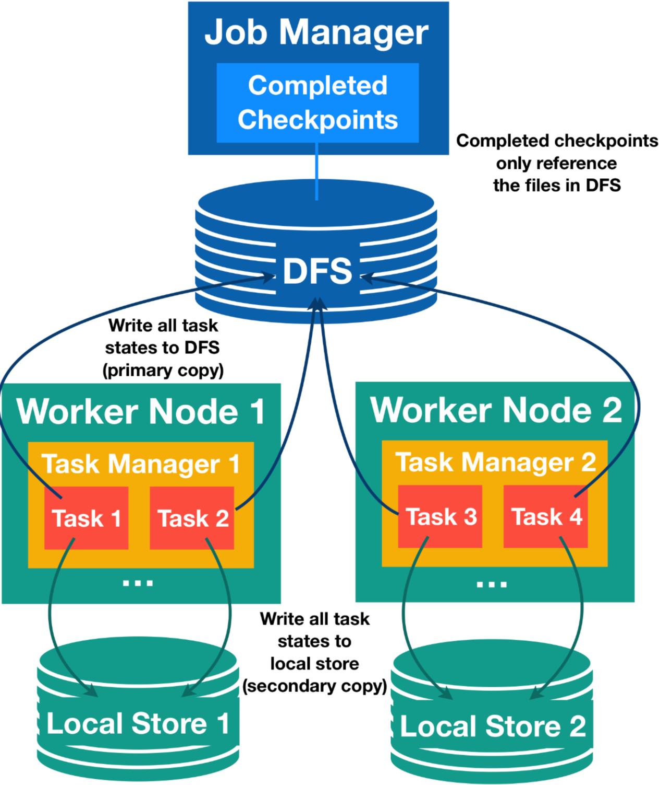

# Task 故障恢复

## Task 本地恢复

### 问题引入

在 Flink 的 checkpoint 中，每个有状态的 Task 都会生成其状态快照，然后将其写入分布式存储。每个 task 通过发送一个描述分布式存储中的位置状态的句柄，向 jobmanager 确认状态的成功写入。JobManager 反过来收集所有 tasks 的句柄并将它们捆绑到一个 checkpoint 对象中。

在恢复的情况下，JobManager 打开最新的 checkpoint 并将句柄发送回相应的 tasks，然后每个 task 可以从分布式存储中恢复它们的状态。使用分布式来存储状态有两个重要的优势。首先，存储是容错(fault-tolerence)的，其次，分布式存储中的所有状态都可以被所有节点访问，并且可以很容易地重新分配(例如，用于从新扩缩容)。

但是，使用远程分布式存储也有一个很大的缺点：所有 tasks 都必须通过网络从远程位置读取它们的状态。在许多场景中，作业恢复可能会将失败的 tasks 重新调度到与前一次运行相同的 taskmanager 中(当然也有像机器故障这样异常的恢复)，但我们仍然必须读取远程状态。这可能导致 *大状态*的长时间恢复，即使在一台机器上只有一个小故障(小故障遇到大状态恢复)。

### 解决办法

Task 本地状态恢复正是针对这个恢复时间长的问题，其主要思想如下：对每个 checkpoint, 每个 task 不仅将 task 状态写入分布式存储中，而且还要在 task 本地存储(例如本次磁盘或内存中)中保存状态快照的次要副本。请注意，快照的主存储仍然必须是分布式存储，因为本地存储不能确保节点故障下的持久性，也不能为其他节点提供重新分发状态的访问，所以这个功能仍然需要主副本(primary copy)。

然后，对于很多 task 可以从新调度到以前的位置进行恢复的 task, 我们可要从次要本地状态副本恢复，并避免远程读取状态的成本。考虑到*许多故障*不是节点故障，即使节点故障通常一次只影响一个或者非常少的节点，在恢复的过程中，大多数 task 很可能会重新部署到他们以前的位置，并发现他们的本地状态完好无损。这就是 task 本地恢复有效减少恢复时间的主要原因。

请注意，根据所选的 state Backend 和 checkpointing 策略，在么哥 checkpoint 创建和存储次要本地状态副本时，可能会有一些额外的成本。例如，在大多数情况下，实现只是简单地将对分布式存储的写操作复制到本地文件，如下图所示：




### 主要(分布式存储)和次要（task 本地）状态快照的关系

Task 本地状态始终被视为次要副本，checkpoint 状态始终以分布式存储中的副本为主。这对 checkpoint 和恢复期间的本地状态问题有影响：

  * 对于 checkpointing, 主副本 **必须** 成功，并且生成次要副本的失败不会使 *checkpoint* 失败（不一致）。如果无法创建主副本，即使已经成功创建次要副本，checkpoint 也会失败。

  * 只有主副本由 JobManager 确认和管理，次要副本属于 TaskManager ，并且它们的生命周期可以独立于它们的主副本。例如，可以保留 3 个最新的 checkpoint 的历史记录作为主副本，并且只保留最新 checkpoint 的 task 本地状态。

  * 对于恢复，如果匹配的次要副本可用，Flink 将始终首先尝试从 task 本地状态恢复。如果在次要副本恢复过程中出现任何问题，Flink 将透明地重试从主副本恢复 task。仅当主副本和次要副本都失败时，恢复才会失败。在这种情况下，根据配置，Flink 仍可能回退到旧的 checkpoint(因为有 3 个最近的 checkpoint 主副本)。

  * Task 本地副本可能仅包含 task 状态的一部分(这是最坑爹的，例如，写入一个本地文件是出现异常)。在这种情况下，Flink 会首先尝试在本地恢复本地部分，非本地状态从主副本恢复。主状态必须始终是完整的，并且是 task 本地状态的超集(checkpoint 机制来保障)。

  * Task 本地状态可以具有与主状态不同的格式，他们不需要相同字节。例如，task 本地状态甚至可能是在堆对象组成的内存中，而不是存储在任何文件中。

  * 如果 TaskManager 丢失，则其所有 task 的本地状态都会丢失。


 ### 配置 task 本地恢复

 Task 本地恢复 **默认禁用**，可以通过 Flink 的 CheckpointintOptions.LOCAL_RECOVERY 配置中指定的键 state.backend.local-recovery 来启用。此设置的值可以是 true 以启用或者 false (默认)以禁用本地恢复。(也是在 flink-conf.yaml 中配置)

 ### 不同 state Backend 的 task 本地恢复的详细介绍

 **限制**：目前，task 本地恢复仅涵盖 keyed state backends。Keyed State 通常是本地状态的最大部分。在不就的将来，flink 社区应会支持 Operator state 和 计时器(timers).

 一下 state backends 可以支持 task 本地恢复：
   * **HashMapStateBackend**: keyed state 支持 task 本地恢复。 该实现会将状态复制到本地文件。 这会引入额外的写入成本并占用本地磁盘空间。 未来，flink 社区可能还会提供一种将 task 本地状态保存在内存中的实现。

   * **EmbeddedRocksDBStateBackend**: 支持 keyed state 的 task 本地恢复。对于全量 checkpoints，状态被复制到本地文件。这会引入额外的写入成本并占用本地磁盘空间。对于增量快照，本地状态基于 RocksDB 的原生 checkpointing 机制。 这种机制也被用作创建主副本的第一步，这意味着在这种情况下，创建次要副本不会引入额外的成本。我们只是保留本地 checkpoint 目录， 而不是在上传到分布式存储后将其删除。这个本地副本可以与 RocksDB 的工作目录共享现有文件（通过硬链接），因此对于现有文件，增量快照的 task 本地恢复也不会消耗额外的磁盘空间(就是因为创建 主副本需要先创建本地副本，然后再上传，本来上传成功 后要删除本地副本，启用本地副本恢复后，就不需要删除增量副本了，多牛逼呀)。 使用硬链接还意味着 RocksDB 目录必须与所有可用于存储本地状态和本地恢复目录位于同一节点上，否则建立硬链接可能会失败（参见 FLINK-10954）。 目前，当 RocksDB 目录配置在多个物理设备上时，这也会阻止使用本地恢复。

### Allocation-preserving 调度

Task 本地恢复假设在故障下通过 allocation-preserving 调度  task。其工作原理如下：
每个 task 都会记住其先前的分配，并且请求完全相同的 slot 来重新启动恢复。 如果此 slot 不可用，task 将向 resourcemanager 请求一个 新的 slot。 这样，如果 taskmanager 不再可用，则无法返回其先前位置的 task 不会将其他正在恢复的 task 踢出其之前的 slot。 我们的理由是，只有当 taskmanager 不再可用时，前一个 slot 才会消失，在这种情况下，一些 tasks 无论如何都必须请求新的 slot 。 在我们的调度策略中，我们让绝大多数的 tasks 有机会从它们的本地状态中恢复，从而避免了从其他 tasks 处获取它们之前的 slots 的级联效应

## Task 故障与恢复策略

当 Task 发生故障时，Flink 需要重启出错的 Task 以及其他受到影响的 Task，以使得作业恢复到正常的执行状态。

Flink 通过重启策略和故障恢复策略来控制 task 的重启：重启策略决定是否可以重启以及重启的间隔；故障恢复策略决定了哪些 Task 需要重启。

### Restart Strategies

Flink 作业如果没有定义重启重启策略，则会遵循集群启动时加载的默认重启策略。如果提交作业是定义了重启策略，该策略将覆盖掉集群默认的策略。

通过 Flink 的配置文件 flink-conf.yaml 来设置默认的重启策略。配置参数 restart-strategy.type 定义了采用何种重启策略。如果没有启动 checkpoint，就采用 “不重启”策略。如果启用了 Checkpoint 且没有配置重启策略，那么就采用延时重启策略，此时最大尝试重启次数由 Integer.MAX_VALUE 参数设置。如下表所示

| Key | Default |  Type  | Description |
| --------- | -----     | ------| --------- |
| **restart-strategy.type** | (none) | String | Defines the restart strategy to use in case of failures. Accepted values are: <br /><b>none</b>,off,disable: No restart strartegy.<br/> <b>fixeddelay</b>,fixed-delay: Fixed delay restart Strategy<br/> failurerate, failure-rate:Failure rate restart strategy<br/> if checkpointing is disabled, the default value is `none`. If checkpointing is enabled, the default value is  fixed-delay with Integer.MAX_VALUE restart attempts and 1 s' delay |

每个重启策略都有自己的一组参数来控制其行为。这些参数在配置文件中设置。下文的描述中会介绍每种重启策略的配置项

除了定义默认的重启策略外，还可以为每个 flink 作业单独定义重启策略。通过 StreamExecutionEnvironment 对象上调用 setRestartStrategy 方法来设置。

#### Fixed Delay Restart Strategy

固定延时重启策略按照给定的次数尝试重启作业。如果尝试超过给定的最大次数，作业将最终失败。在连续的两次重启之间，重启策略等待一段固定长度的时间。在 flink-conf.yaml 中配置如下参数

```yaml
restart-strategy.type: fixed-delay
restart-strategy.fixed-delay.attempts: 3
reatart-strategy.fixed-delay.deay: 10 s
```

参数解释如下：

| Key | Default |  Type  | Description |
| --------- | -----     | ------| --------- |
| restart-strategy.fixed-delay.attempts| 1 | Integer | 重启尝试次数|
| restart-strategy.fixed-delay.delay| 1 s | Duration | 每次重启间隔时长|

固定延迟策略也可以在程序中设置：

```java
StreamExecutionEnvironment env = StreamExecutionEnvironment.getExecutionEnvironment();
env.setRestartStrategy(RestartStrategies.fixedDelayRestart(
  3, // 尝试重启的次数
  Time.of(10, TimeUnit.SECONDS) // 延时
));
```

#### Failure Rate Restart Strategy

故障率重启策略在故障发生之后重启作业，但是当**故障率**（每个时间间隔发生故障的次数）超过设定的限制时，作业会最终失败。在连续的两次重启尝试之间，重启策略等待一个固定长度的时间。

在 flink-conf.yaml 中设置如下配置参数，默认启用此策略

```yaml
restart-strategy.type: failure-rate
restart-strategy.failure-rate.max-failures-per-interval: 3
restart-strategy.failure-rate.failure-rate-interval: 5 min
restart-strategy.failure-rate.dealy: 10 s
```

参数解释如下：

| Key | Default |  Type  | Description |
| --------- | -----     | ------| --------- |
| restart-strategy.failure-rate.max-failures-per-interval | 1 | Integer | 每个统计周期内允许的最大重启次数 |
| restart-strategy.failure-rate.failure-rate-interval| 1 min | Duration | 每个统计周期时长 |
| restart-strategy.failure-rate.delay| 1 s | Duration | 每次重启间隔时长|

故障率重启次数也可以在程序中设置

```java
StreamExecutionEnvironment env = StreamExecutionEnvironment.getExecutionEnvironment();
env.setRestartStrategy(RestartStrategies.failureRateRestart(
  3, // 每个时间间隔的最大故障次数
  Time.of(5, TimeUnit.MINUTES), // 测量故障率的时间间隔
  Time.of(10, TimeUnit.SECONDS) // 延时
));
```

#### No Restart Strategy

作业直接失败，不尝试重启

```yaml
restart-strategy.type: none
```
```java
StreamExecutionEnvironment env = StreamExecutionEnvironment.getExecutionEnvironment();
env.setRestartStrategy(RestartStrategies.noRestart());
```

#### Fallback Restart Strategy

使用集群定义的重启策略。这对于启用 Checkpoint 的流处理程序很有帮助。如果没没有定义其他重启策略，默认选择固定延时重启策略。


### Failover Strategies 恢复策略/故障转移策略

Flink 支持多种不同的故障恢复策略，该策略需要通过 Flink 的配置文件 flink-conf.yaml 中的 jobmanager.execution.failover-strategy 配置项进行配置


| 故障恢复策略 | jobmanager.execution.failover-strategy | 
| --------- | -----     |
| 全图重启 | full | 
| 基于 Region 的局部重启| region(默认值) |

#### Restart All Failover Strategy

在全图重启故障恢复策略下，Task 发生故障时会重启作业中的所有 Task 进行故障恢复。

#### Restart Pipelined Region Failover Strategy

该策略会将作业中的所有 Task 划分成数个 Region。当有 Task 发生故障时，它会尝试找出进行故障恢复需要重启的最小 Region 集合。相比于全局重启故障恢复策略，这种策略在一些场景下的故障恢复需要重启的 Task 会更少。

DataStream/Table/Sql 作业中的数据交换形式根据 ExecutionConfig 中配置的 ExecutionMode 决定。处于 STREAM 模式时，所有数据交换都是 Pipelined；处于 BATCH 模式时，所有数据交换默认都是 Batch 形式。

需要重启的 Region 的判断逻辑如下：

    1. 出错的 Task 所在的 Region 需要重启
    2. 如果要重启的 Region 需要消费的数据有部分无法访问(丢失或损坏)，产出该部分数据的 Region 也需要重启
    3. 需要重启的 Region 的下游 Region 也需要重启。这是出于保障数据一致性的考虑，因为一些非确定性的计算或者分发会导致同一个 Result Partition 每次产生时包含的数据都不相同。
