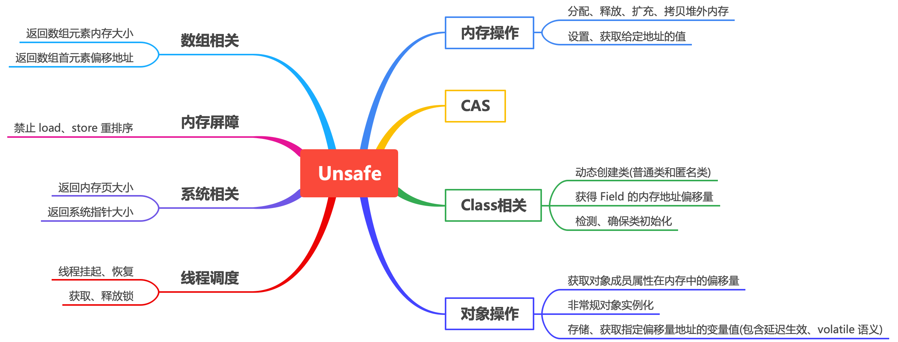
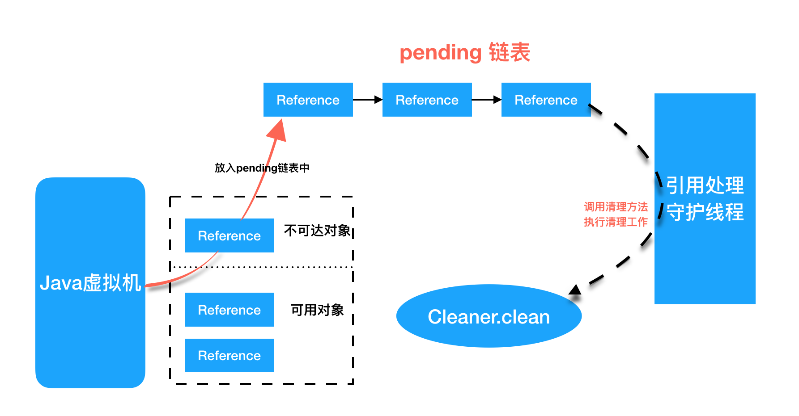
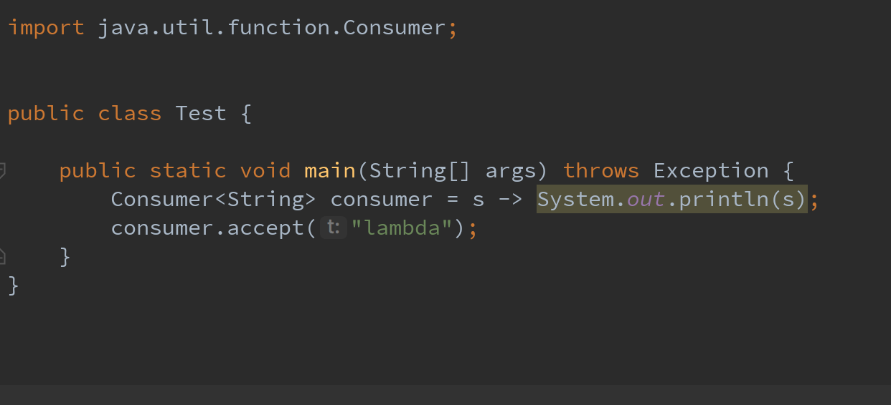

# Java 魔法类 Unsafe 应用解析

## 前言

Unsafe 是位于 sun.misc 包下的一个类，主要提供一些用于执行低级别、不安全操作的方法，如直接访问系统内存资源、自主管理内存资源等，这些方法在提升 Java 运行效率、增强 Java 语言底层资源操作能力方面起到了很大的作用。但是由于 Unsafe 类使 Java 语言拥有了类似 C 语言指针一样操作内存空间的能力，这无疑也增加了程序发生相关指针问题的风险。在程序中过渡、不正确使用 Unsafe 类会使得程序出错的概率变大，使得 Java 这种安全的语言变得不再“安全”，因此对 unsafe 的使用一定要慎重。

本篇章对 sun.misc.Unsafe 公共 API 功能即相关应用场景进行介绍

## 基本介绍

如下 Unsafe 源码所示，Unsafe 类为单一实例实现，

```java
public final class Unsafe {

    static {
        Reflection.registerMethodsToFilter(Unsafe.class, "getUnsafe");
    }

    private Unsafe() {}
    // 单例对象
    private static final Unsafe theUnsafe = new Unsafe();

    @CallerSensitive
    public static Unsafe getUnsafe() {
        Class<?> caller = Reflection.getCallerClass();
        // 仅在类加载器为`BootstrapClassLoader` 加载时才合法
        if (!VM.isSystemDomainLoader(caller.getClassLoader()))
            throw new SecurityException("Unsafe");
        return theUnsafe;
    }
}
// 下面是 JDK 11 的 sun.misc.unsafe 。作者仍然是 John R. Rose 这个大佬
public final class Unsafe {

    static {
        Reflection.registerMethodsToFilter(Unsafe.class, "getUnsafe");
    }

    private Unsafe() {}

    private static final Unsafe theUnsafe = new Unsafe();
    // 将外部所有对 unsafe 方法的调用委托给 theInternalUnsafe 实例
    private static final jdk.internal.misc.Unsafe theInternalUnsafe = jdk.internal.misc.Unsafe.getUnsafe();
    @CallerSensitive
    public static Unsafe getUnsafe() {
        Class<?> caller = Reflection.getCallerClass();
        if (!VM.isSystemDomainLoader(caller.getClassLoader()))
            throw new SecurityException("Unsafe");
        return theUnsafe;
    }
}   
```

那若想使用这个类，该如何获取其实例？有如下两个可行方案：

一：从 `getUnsafe` 方法的使用限制条件出发，通过 java 命令行命令 `-Xbootclasspath/a` 把调用 Unsafe 相关方法的类 A 所在的 jar 包追加到默认的 bootstrap 路径中，使得 A 被引导类加载器加载，从而通过 `Unsafe.getUnsafe` 方法安全地获取 Unsafe 实例。

```sh
java -Xbootclasspath/a: ${path}   // 其中path为调用Unsafe相关方法的类所在jar包路径
```

二：通过反射获取单例对象 theUnsafe
下面这段源码来自 Flink 的 org.apache.flink.core.memory.MemoryUtils

```java
public static final sun.misc.Unsafe UNSAFE = getUnsafe();
private static sun.misc.Unsafe getUnsafe() {
		try {
			Field unsafeField = sun.misc.Unsafe.class.getDeclaredField("theUnsafe");
			unsafeField.setAccessible(true);
			return (sun.misc.Unsafe) unsafeField.get(null);
		} catch (SecurityException e) {
			throw new Error("Could not access the sun.misc.Unsafe handle, permission denied by security manager.", e);
		} catch (NoSuchFieldException e) {
			throw new Error("The static handle field in sun.misc.Unsafe was not found.", e);
		} catch (IllegalArgumentException e) {
			throw new Error("Bug: Illegal argument reflection access for static field.", e);
		} catch (IllegalAccessException e) {
			throw new Error("Access to sun.misc.Unsafe is forbidden by the runtime.", e);
		} catch (Throwable t) {
			throw new Error("Unclassified error while trying to access the sun.misc.Unsafe handle.", t);
		}
	}
```

## 功能介绍



如上图所示，unsafe 提供的 API 大致可分为 内存操作、CAS、Class 相关、对象操作、线程调度、系统信息获取、内存屏障、数组操作等几类，夏敏将对其相关方法和应用场景进行详细介绍。

### 内存操作

这部分主要包含堆外内存的分配、释放、拷贝、给定地址值操作等方法。

```java
public long allocateMemory(long bytes) {
        allocateMemoryChecks(bytes);

        if (bytes == 0) {
            return 0;
        }

        long p = allocateMemory0(bytes);
        if (p == 0) {
            throw new OutOfMemoryError();
        }

        return p;
    }
    public void setMemory(Object o, long offset, long bytes, byte value) {
        setMemoryChecks(o, offset, bytes, value);

        if (bytes == 0) {
            return;
        }

        setMemory0(o, offset, bytes, value);
    }
    // 分配内存，相当于 C++ 的 malloc 函数
    private native long allocateMemory0(long bytes);
    // 扩充内存
    private native long reallocateMemory0(long address, long bytes);
    // 释放内存
    private native void freeMemory0(long address);
    // 在给定的内存块中设置值
    private native void setMemory0(Object o, long offset, long bytes, byte value);
    // 内存拷贝
    @HotSpotIntrinsicCandidate
    private native void copyMemory0(Object srcBase, long srcOffset, Object destBase, long destOffset, long bytes);
    //获取给定地址的值，忽略修饰符的访问限制。与此类似的操作还有：getInt, getDouble, getLong,getChar 等。
    public native Object getObject(Object o, long offset);

    /**
     * Stores a reference value into a given Java variable.
     * <p>
     * Unless the reference {@code x} being stored is either null
     * or matches the field type, the results are undefined.
     * If the reference {@code o} is non-null, card marks or
     * other store barriers for that object (if the VM requires them)
     * are updated.
     * @see #putInt(Object, long, int)
     * 为给定地址设置值，忽略特定修饰符的访问限制，与此类似的操作还有 putInt,putLong,putDouble,putChar 等
     */
    @HotSpotIntrinsicCandidate
    public native void putObject(Object o, long offset, Object x);

     public byte getByte(long address) {
        return getByte(null, address);
    }
      /** @see #getInt(Object, long) 
       * 获取给定地址的 byte 类型的值(当且仅当内存地址为 allocateMemory 分配时，此方法的结果为确定的)
      */
    @HotSpotIntrinsicCandidate
    public native byte    getByte(Object o, long offset);

    /** @see #putInt(Object, long, int) 
     * 为给定地址设置byte类型的值（当且仅当该内存地址为allocateMemory分配时，此方法结果才是确定的）
    */
    @HotSpotIntrinsicCandidate
    public native void    putByte(Object o, long offset, byte x);
```

通常，我们在 Java 中创建的对象都处于堆内存(heap)中, 堆内存是由 JVM 锁托管的 Java 进程内存，并且他们遵循 JVM 的内存管理机制，JVM 会采用垃圾回收机制统一管理堆内存。与之相对的是堆外内存，存在 JVM 管控之外的内存区域，Java中堆外内存的操作，依赖于 Unsafe 提供的操作堆外内存的 native 方法

#### 使用堆外内存的原因

* 对垃圾回收停顿的改善。由于堆外内存是直接受操作系统管理而不是 JVM，所以当我们使用堆外内存时，即可保持较小的堆内内存的开销。从而在 GC 时减少回收停顿对于应用的影响。
* 提升程序的 IO 性能。通常在 I/O 通信过程中，会存在堆内内存到堆外内存的拷贝操作，对于需要频繁进行内存键数据拷贝且生命周期较短的暂存数据，都建议存储到堆外内存。

#### 典型应用

DirectByteBuffer 是 java 用于实现堆外内存的一个重要类，通常用在通信过程中做缓冲池，如在 Netty、MINA 等 NIO 框架中应用广泛。DirectByteBuffer对于堆外内存的创建、使用、销毁等逻辑均由 Unsafe 提供的堆外内存 API 来实现。

下面为 DirectoByteBuffer 的源码，在构造函数中，创建 DirectByteBuffer 的时候，通过 Unsafe.allocateMemory 进行分配内存

```java
class DirectByteBuffer extends MappedByteBuffer
    implements DirectBuffer
{
    DirectByteBuffer(int cap) {                   // package-private

        super(-1, 0, cap, cap);
        boolean pa = VM.isDirectMemoryPageAligned();
        int ps = Bits.pageSize();
        long size = Math.max(1L, (long)cap + (pa ? ps : 0));
        Bits.reserveMemory(size, cap);

        long base = 0;
        try {
            // 分配内存，并返回基地址
            base = UNSAFE.allocateMemory(size);
        } catch (OutOfMemoryError x) {
            Bits.unreserveMemory(size, cap);
            throw x;
        }
        // 内存初始化
        UNSAFE.setMemory(base, size, (byte) 0);
        if (pa && (base % ps != 0)) {
            // Round up to page boundary
            address = base + ps - (base & (ps - 1));
        } else {
            address = base;
        }
        // 跟踪 DirectByteBuffer 对象的垃圾回收，以实现堆外内存的释放。注意这里传入的第二个参数 runnable 为 Deallocator，
        // 用来释放堆外内存
        cleaner = Cleaner.create(this, new Deallocator(base, size, cap));
        att = null;
    }

}
```

那么如何通过构建垃圾回收追踪对象 Cleaner 实现堆外内存的释放那？

Cleaner 继承自 Java 四大引用类型之一的虚引用 PhantomReference （众所周知，无法通过虚引用获取与之关联的对象实例，且当对象仅被虚引用引用时，在任何发生GC的时候，其均可被回收），通常 PhantomReference 与引用队列 ReferenceQueue 结合使用，可以实现虚引用关联对象被垃圾回收时能够进行系统通知，资源清理等功能。如下图所示，当某个被 Cleaner 引用的对象被回收时， JVM 垃圾接收集器会将此对象的引用放入到对象引用中的 pending 链表中，等待 Reference-Handler 进行相关处理。其中，Reference-Handler 为一个拥有最高优先级的守护线程，会不断循环地处理 pending 链表中的对象引用，执行 cleaner 的 clean 方法进行相关清理工作。



所以当 DirectByteBuffer 仅被 Cleaner 引用(即为虚引用)时，其可以在任意 GC 时段被回收。当 DirectByteBuffer 实例对象被回收时，在 Reference-Handler 线程操作中，会调用 Cleaner 的 clean 方法根据创建 Cleaner 时传入的 Deallocator 来进行堆外内存的释放

```java
public abstract class Reference<T> {
    static {
        ThreadGroup tg = Thread.currentThread().getThreadGroup();
        for (ThreadGroup tgn = tg;
             tgn != null;
             tg = tgn, tgn = tg.getParent());
        // 在 Reference 的静态代码块中启动 Reference Handler 线程
        Thread handler = new ReferenceHandler(tg, "Reference Handler");
        /* If there were a special system-only priority greater than
         * MAX_PRIORITY, it would be used here
         */
        handler.setPriority(Thread.MAX_PRIORITY);
        handler.setDaemon(true);
        handler.start();

        // provide access in SharedSecrets
        SharedSecrets.setJavaLangRefAccess(new JavaLangRefAccess() {
            @Override
            public boolean waitForReferenceProcessing()
                throws InterruptedException
            {
                return Reference.waitForReferenceProcessing();
            }

            @Override
            public void runFinalization() {
                Finalizer.runFinalization();
            }
        });
    }

private T referent;         /* Treated specially by GC */

    /* The queue this reference gets enqueued to by GC notification or by
     * calling enqueue().
     *
     * When registered: the queue with which this reference is registered.
     *        enqueued: ReferenceQueue.ENQUEUE
     *        dequeued: ReferenceQueue.NULL
     *    unregistered: ReferenceQueue.NULL
     */
    volatile ReferenceQueue<? super T> queue;

    /* The link in a ReferenceQueue's list of Reference objects.
     *
     * When registered: null
     *        enqueued: next element in queue (or this if last)
     *        dequeued: this (marking FinalReferences as inactive)
     *    unregistered: null
     */
    @SuppressWarnings("rawtypes")
    volatile Reference next;

    /* Used by the garbage collector to accumulate Reference objects that need
     * to be revisited in order to decide whether they should be notified.
     * Also used as the link in the pending-Reference list.  The discovered
     * field and the next field are distinct to allow the enqueue() method to
     * be applied to a Reference object while it is either in the
     * pending-Reference list or in the garbage collector's discovered set.
     *
     * When active: null or next element in a discovered reference list
     *              maintained by the GC (or this if last)
     *     pending: next element in the pending-Reference list (null if last)
     *    inactive: null
     */
    private transient Reference<T> discovered;


    /* High-priority thread to enqueue pending References
     */
    private static class ReferenceHandler extends Thread {

        private static void ensureClassInitialized(Class<?> clazz) {
            try {
                Class.forName(clazz.getName(), true, clazz.getClassLoader());
            } catch (ClassNotFoundException e) {
                throw (Error) new NoClassDefFoundError(e.getMessage()).initCause(e);
            }
        }

        static {
            // pre-load and initialize Cleaner class so that we don't
            // get into trouble later in the run loop if there's
            // memory shortage while loading/initializing it lazily.
            ensureClassInitialized(Cleaner.class);
        }

        ReferenceHandler(ThreadGroup g, String name) {
            super(g, null, name, 0, false);
        }
        // ReferenceHandler 线程的主要作用调用 Cleaner 对象的 clean 方法
        public void run() {
            while (true) {
                processPendingReferences();
            }
        }
    }

    /*
     * Atomically get and clear (set to null) the VM's pending-Reference list.
     */
    private static native Reference<Object> getAndClearReferencePendingList();

    /*
     * Test whether the VM's pending-Reference list contains any entries.
     */
    private static native boolean hasReferencePendingList();

    /*
     * Wait until the VM's pending-Reference list may be non-null.
     */
    private static native void waitForReferencePendingList();

    private static final Object processPendingLock = new Object();
    private static boolean processPendingActive = false;

    private static void processPendingReferences() {
        // Only the singleton reference processing thread calls
        // waitForReferencePendingList() and getAndClearReferencePendingList().
        // These are separate operations to avoid a race with other threads
        // that are calling waitForReferenceProcessing().
        waitForReferencePendingList();
        Reference<Object> pendingList;
        synchronized (processPendingLock) {
            pendingList = getAndClearReferencePendingList();
            processPendingActive = true;
        }
        while (pendingList != null) {
            Reference<Object> ref = pendingList;
            pendingList = ref.discovered;
            ref.discovered = null;
    
            if (ref instanceof Cleaner) {
                //调用 cleaner 的 clean 方法, 执行清理堆外内存的逻辑
                ((Cleaner)ref).clean();
                // Notify any waiters that progress has been made.
                // This improves latency for nio.Bits waiters, which
                // are the only important ones.
                synchronized (processPendingLock) {
                    processPendingLock.notifyAll();
                }
            } else {
                //非 Cleaner 对象的其他 Reference 对象，将 ref 加入到 ref 锁持有的 queue 引用队列对象中
                ReferenceQueue<? super Object> q = ref.queue;
                if (q != ReferenceQueue.NULL) q.enqueue(ref);
            }
        }
        // Notify any waiters of completion of current round.
        synchronized (processPendingLock) {
            processPendingActive = false;
            processPendingLock.notifyAll();
        }
    }

    // Wait for progress in reference processing.
    //
    // Returns true after waiting (for notification from the reference
    // processing thread) if either (1) the VM has any pending
    // references, or (2) the reference processing thread is
    // processing references. Otherwise, returns false immediately.
    private static boolean waitForReferenceProcessing()
        throws InterruptedException
    {
        synchronized (processPendingLock) {
            if (processPendingActive || hasReferencePendingList()) {
                // Wait for progress, not necessarily completion.
                processPendingLock.wait();
                return true;
            } else {
                return false;
            }
        }
    }
}

public class Cleaner
    extends PhantomReference<Object>
{

    // Dummy reference queue, needed because the PhantomReference constructor
    // insists that we pass a queue.  Nothing will ever be placed on this queue
    // since the reference handler invokes cleaners explicitly.
    //
    private static final ReferenceQueue<Object> dummyQueue = new ReferenceQueue<>();

    // Doubly-linked list of live cleaners, which prevents the cleaners
    // themselves from being GC'd before their referents
    //
    private static Cleaner first = null;

    private Cleaner
        next = null,
        prev = null;

    private static synchronized Cleaner add(Cleaner cl) {
        if (first != null) {
            cl.next = first;
            first.prev = cl;
        }
        first = cl;
        return cl;
    }

    // 线程安全的同步式的将 cl 对象从队列中移除
    private static synchronized boolean remove(Cleaner cl) {

        // If already removed, do nothing。
        // 对 DirectByteBuffer 的 cleaner 来说，重复执行意味着重复的释放这个地址的堆外内存，这是严重的 bug
        // 因此这里用链表的 next 是否等于它自身来做短路判断，这也是我看 cleaner 链表的源码觉得唯一起作用的地方
        // 但是通过读取 389-390 行的注释，我发现 cleaner 链表的第二个用途，就是阻止 cleaner 对象在他们所引用的对象被回收之前被 GC 掉
        // 因为这些对象都在以 first 这个静态元素为头结点的链表上，根据 GC 所用可达性分析算法，这些在链表中的元素不会被GC掉
        // 不能自动被 GC 干掉，只能通过调用 remove 方法，将 cleaner 对象从链表中摘除，此后 GC 才可能将其回收掉。
        // 所以目前来看链表的第二个用途更重要
        if (cl.next == cl)
            return false;

        // Update list
        if (first == cl) {
            if (cl.next != null)
                first = cl.next;
            else
                first = cl.prev;
        }
        if (cl.next != null)
            cl.next.prev = cl.prev;
        if (cl.prev != null)
            cl.prev.next = cl.next;

        // Indicate removal by pointing the cleaner to itself
        cl.next = cl;
        cl.prev = cl;
        return true;

    }

    private final Runnable thunk;

    private Cleaner(Object referent, Runnable thunk) {
        super(referent, dummyQueue);
        this.thunk = thunk;
    }

    /**
     * Creates a new cleaner.
     *
     * @param  ob the referent object to be cleaned
     * @param  thunk
     *         The cleanup code to be run when the cleaner is invoked.  The
     *         cleanup code is run directly from the reference-handler thread,
     *         so it should be as simple and straightforward as possible.
     *
     * @return  The new cleaner
     */
    public static Cleaner create(Object ob, Runnable thunk) {
        if (thunk == null)
            return null;
        return add(new Cleaner(ob, thunk));
    }

    /**
     * Runs this cleaner, if it has not been run before.
     */
    public void clean() {
// 将 Cleaner 对象从 Cleaner 链表中移除
        if (!remove(this))
            return;
        try {
// 调用 unsafe.freeMemeory 方法清理堆外内存，这里 ByteBuffer 传入的是 Deallocator 对象。Deallocator 对象的源码如下所示
            thunk.run();
        } catch (final Throwable x) {
            AccessController.doPrivileged(new PrivilegedAction<>() {
                    public Void run() {
                        if (System.err != null)
                            new Error("Cleaner terminated abnormally", x)
                                .printStackTrace();
                        System.exit(1);
                        return null;
                    }});
        }
    }
}

private static class Deallocator
        implements Runnable
    {

        private static Unsafe unsafe = Unsafe.getUnsafe();

        private long address;
        private long size;
        private int capacity;

        private Deallocator(long address, long size, int capacity) {
            assert (address != 0);
            this.address = address;
            this.size = size;
            this.capacity = capacity;
        }

        public void run() {
            if (address == 0) {
                // Paranoia
                return;
            }
            // 调用 unsafe 对象，释放堆外内存
            unsafe.freeMemory(address);
            address = 0;
            Bits.unreserveMemory(size, capacity);
        }

    }
```

### CAS 相关

#### 原理解析
如下面的释义所示(JKD11 Unsafe 源码)，这部分主要为 CAS 相关的操作方法。

```java
    public final native boolean compareAndSetObject(Object o, long offset,
                                                    Object expected,
                                                    Object x);
    @HotSpotIntrinsicCandidate
    public final native Object compareAndExchangeObject(Object o, long offset,
                                                        Object expected,
                                                        Object x);

    @HotSpotIntrinsicCandidate
    public final native boolean compareAndSetInt(Object o, long offset,
                                                 int expected,
                                                 int x);
    @HotSpotIntrinsicCandidate
    public final native int compareAndExchangeInt(Object o, long offset,
                                                  int expected,
                                                  int x);

    @HotSpotIntrinsicCandidate
    public final native boolean compareAndSetLong(Object o, long offset,
                                                  long expected,
                                                  long x);
    @HotSpotIntrinsicCandidate
    public final native long compareAndExchangeLong(Object o, long offset,
                                                    long expected,
                                                    long x);
```

compareAndSet 和 compareAndExchange 这两个方法有不同的返回类型。

compareAndSet 返回 boolean:

> true if successful. False return indicates that the actual value was not equal to the expected value.

compareAndExchange 返回一个 int:

> the witness value, which will be the same as the expected value if successful

即compareAndSet 指示变量的值是否已更新，而 compareAndExchange 返回变量的当前值，从而为您提供更多信息。

如果之前的值为 1，
compareAndSet(1,2) 会将原子整数的值设置为 2，并返回在这种情况下，true。否则，它将不会设置该值，并且将返回false。

如果之前的值为 1，
compareAndExchange​(1,2) 会将原子整数的值设置为 2，并且将在这种情况下返回1。如果先前的值不是 1，则不会设置该值，并返回当前(未更改的)值。

关于java - 原子整数的compareandexchange()与compareandset()，我们在Stack Overflow上找到一个类似的问题： https://stackoverflow.com/questions/60648557/

接上篇

什么是 CAS？即比较并替换，实现并发算法时常用的一种技术。CAS 操作包含三个操作数——内存位置(偏移量)，预期原值及新值。执行 CAS 操作的时候，将内存位置的值与预期原值比较，如果相匹配，那么处理器会自动将该位置更新为新值，否则，处理器不做任何操作。我们知道，CAS 是一条 CPU 的原子指令(cmpxchg 指令)，不会造成所谓的数据不一致问题，Unsafe提供的 CAS 方法(如compareAndSetXXX或者 compareAndExchangeXXX) 底层实现即为 CPU 指令 cmpxchg。

#### 典型应用

CAS 在 java.util.concurrent.atomic 相关类、Java AQS、ConcurrentHashMap 等实现上有非常广泛的应用。如下图所示，AtomicInteger 实现中，静态字段 VALUE 即为字段 value 的内存偏移地址，VALUE 的值通过调用 Unsafe#objectFieldOffset 进行初始化。在 AtomicInteger 中提供线程安全的方法，通过字段 VALUE 的值可以定位到 AtomicInteger 对象中的 value 的内存地址/偏移量，从而可以根据 CAS 实现对 value 字段的原子操作。
```java
public class AtomicInteger extends Number implements java.io.Serializable {
    private static final long serialVersionUID = 6214790243416807050L;

    /*
     * This class intended to be implemented using VarHandles, but there
     * are unresolved cyclic startup dependencies.
     * 直接使用 Internal Unsafe 而不是 sun.misc.Unsafe
     */
    private static final jdk.internal.misc.Unsafe U = jdk.internal.misc.Unsafe.getUnsafe();
    private static final long VALUE = U.objectFieldOffset(AtomicInteger.class, "value");

    private volatile int value;
}
```
下图为某个 AtomicInteger 对象自增操作前后的内存示意图，对象的基地址 baseAddress="0x110000", 通过 baseAddress+offset 得到value 的内存地址 valueAddress='0x11000c'; 然后通过 CAS 进行原子性的更新操作，成功则返回，否则继续重试，直到更新成功为止。


### 线程调度

#### 源码分析

```java
// 取消挂起线程
/**
     * Unblocks the given thread blocked on {@code park}, or, if it is
     * not blocked, causes the subsequent call to {@code park} not to
     * block.  Note: this operation is "unsafe" solely because the
     * caller must somehow ensure that the thread has not been
     * destroyed. Nothing special is usually required to ensure this
     * when called from Java (in which there will ordinarily be a live
     * reference to the thread) but this is not nearly-automatically
     * so when calling from native code.
     *
     * @param thread the thread to unpark.
     */
 @ForceInline
    public void unpark(Object thread) {
        theInternalUnsafe.unpark(thread);
    }
    // 挂起线程
    /**
     * Blocks current thread, returning when a balancing
     * {@code unpark} occurs, or a balancing {@code unpark} has
     * already occurred, or the thread is interrupted, or, if not
     * absolute and time is not zero, the given time nanoseconds have
     * elapsed, or if absolute, the given deadline in milliseconds
     * since Epoch has passed, or spuriously (i.e., returning for no
     * "reason"). Note: This operation is in the Unsafe class only
     * because {@code unpark} is, so it would be strange to place it
     * elsewhere.
     */
    @ForceInline
    public void park(boolean isAbsolute, long time) {
        theInternalUnsafe.park(isAbsolute, time);
    }
```
如上源码说明中，方法 park, unpark 即可实现线程的挂起与恢复，将一个线程进行挂起时通过 park 方法实现的，调用 park 方法后，线程将一直阻塞直到超时或者中断或者调用 unpark 等条件出现，使其恢复正常。

#### 典型应用

Java 锁和同步器(AQS)的核心类 AbstractQueuedSynchronizer，就是通过 `LockSupport.park()` 和 `LockSupport.unpark()` 实现线程的阻塞和唤醒的，而 LockSupport 的 park 和 unpark 方法实际上是调用 Unsafe 的 park 和 unpark 方法实现的。

### Class 相关

#### 源码解析

此部分主要提供 Class 和它静态字段的操作相关方法，包含静态字段内存定位，定义类、定义匿名类、检查&确保初始化等。

```java
/**
     * Reports the location of a given static field, in conjunction with {@link
     * #staticFieldBase}.
     * <p>Do not expect to perform any sort of arithmetic on this offset;
     * it is just a cookie which is passed to the unsafe heap memory accessors.
     *
     * <p>Any given field will always have the same offset, and no two distinct
     * fields of the same class will ever have the same offset.
     *
     * <p>As of 1.4.1, offsets for fields are represented as long values,
     * although the Sun JVM does not use the most significant 32 bits.
     * It is hard to imagine a JVM technology which needs more than
     * a few bits to encode an offset within a non-array object,
     * However, for consistency with other methods in this class,
     * this method reports its result as a long value.
     * @see #getInt(Object, long)
     * 获取给定静态字段的内存地址偏移量，这个值对于给定的静态字段是唯一且固定不变的
     */
    @ForceInline
    public long staticFieldOffset(Field f) {
        return theInternalUnsafe.staticFieldOffset(f);
    }

/**
     * Reports the location of a given static field, in conjunction with {@link
     * #staticFieldOffset}.
     * <p>Fetch the base "Object", if any, with which static fields of the
     * given class can be accessed via methods like {@link #getInt(Object,
     * long)}.  This value may be null.  This value may refer to an object
     * which is a "cookie", not guaranteed to be a real Object, and it should
     * not be used in any way except as argument to the get and put routines in
     * this class.
     * 获取一个静态类中给定字段的对象指针
     */
    @ForceInline
    public Object staticFieldBase(Field f) {
        return theInternalUnsafe.staticFieldBase(f);
    }

/**
     * Detects if the given class may need to be initialized. This is often
     * needed in conjunction with obtaining the static field base of a
     * class.
     * @return false only if a call to {@code ensureClassInitialized} would have no effect
     * 判断是否需要初始化一个类，通常在获取一个类的静态属性的时候(因为一个类如果没有初始化，它的静态属性也不会初始化)使用，
     * 当且仅当 ensureClassInitialized 方法不生效的时候返回 false
     */
    @ForceInline
    public boolean shouldBeInitialized(Class<?> c) {
        return theInternalUnsafe.shouldBeInitialized(c);
    }

    /**
     * Ensures the given class has been initialized. This is often
     * needed in conjunction with obtaining the static field base of a
     * class.
     * 检测给定的类是否已经初始化，通常在获取一个类的静态属性的时候(因为一个类如果没有初始化，它的静态属性也不会初始化)使用
     */
    @ForceInline
    public void ensureClassInitialized(Class<?> c) {
        theInternalUnsafe.ensureClassInitialized(c);
    }

//定义一个匿名类
    @ForceInline
    public Class<?> defineAnonymousClass(Class<?> hostClass, byte[] data, Object[] cpPatches) {
        return theInternalUnsafe.defineAnonymousClass(hostClass, data, cpPatches);
    }
```

#### 典型应用

从 JDK8 开始，JDK 使用 invokedynamic 及 VM  Anoymous Class 结合来实现 Java 语言层面上的 Lambda 表达式
* **invokedynamic**：invokedynamic 是 Java 7 为了实现在 JVM 上运行动态语言而引入的一条新的虚拟机指令，它可以实现在运行期动态解析出调用点限定符所引用的方法，然后再执行该方法，invokedynamic 指令的分派逻辑是由用户设定的引导方法决定。
* **VM Anonymous Class** ：可以看做是一种模板机制，针对程序动态生成很多结构相同、仅若干常量不同的类时，可以先创建包含常量占位符的模板类，然后通过 Unsafe.defindeAnonymousClass 方法定义具体类时填充模板的占位符生成具体的匿名类。生成的匿名类不显式挂载任何 ClassLoader 下，只要当该类没有存在的实例对象，且没有强引用来引用该类的 Class 对象时，该类就会被 GC 回收。故而 VM Anonymous Class 相比于 Java 语言底层的匿名内部类无需通过 ClassClassLoader 进行加载且更易回收。

在 Lambda 表达式实现中，通过 invokedynamic 指令调用引导方法生成调用点，在此过程中，会通过 ASM 动态生成字节码，而后利用 Unsafe 的 defineAnonymousClass 方法定义相应的函数式接口的匿名类，然后再实例化此匿名类，并返回与此匿名类中函数式方法的方法句柄相关联的调用点；而后可以通过次调用点实现调用相应 Lambda 表达式定义逻辑的功能。下面给出个 Test 类用来说明：



Test 类编译后的 class 文件反编译后的结果如下图所示(删除了部分说明无意义的部分)，我们可以从中看到 main 方法的指令实现，invokedynamic 指令调用的引导方法 BootstrapMethods、及静态方法 `lambda$main$0`(实现了 Lambda 表达式中字符串打印逻辑)等。在引导方法执行过程中，会通过 Unsafe.defineAnonymousClass生成如下图二所示的 Consumer 接口的匿名类。其中，accept 方法通过调用 Test 类中的静态方法 `lambda$main$0` 来实现 Lambda 表达式中定义的逻辑。而后执行语句 `consumer.accept("lambda")` 其实就是调用下图二 中所示的匿名类的 accept 方法


### 对象操作

#### 相关源码解析

此部分主要包含对象成员属性相关操作及非常规的对象实例化等相关方法

```java
    // 返回对象成员属性在内存地址相对于此对象的内存地址偏移量
    @ForceInline
    public long objectFieldOffset(Field f) {
        return theInternalUnsafe.objectFieldOffset(f);
    }
    /**
     * 获得给定对象的指定偏移量的值，与此类似的操作还有 getInt,getDouble,getLong,getChar 等
     * Fetches a reference value from a given Java variable.
     * @see #getInt(Object, long)
     */
    @ForceInline
    public Object getObject(Object o, long offset) {
        return theInternalUnsafe.getObject(o, offset);
    }

    /**
     * Stores a reference value into a given Java variable.
     * <p>
     * Unless the reference {@code x} being stored is either null
     * or matches the field type, the results are undefined.
     * If the reference {@code o} is non-null, card marks or
     * other store barriers for that object (if the VM requires them)
     * are updated.
     * @see #putInt(Object, long, int)
     * 根据给定对象的指定地址偏移量进行值的设置，与此类似的操作还有 putInt,putDouble,putLong,putChar 等。
     */
    @ForceInline
    public void putObject(Object o, long offset, Object x) {
        theInternalUnsafe.putObject(o, offset, x);
    }

    /**
     * Fetches a reference value from a given Java variable, with volatile
     * load semantics. Otherwise identical to {@link #getObject(Object, long)}
     * 从对象的指定偏移量处获取变量的引用，使用 volatile 语义。
     */
    @ForceInline
    public Object getObjectVolatile(Object o, long offset) {
        return theInternalUnsafe.getObjectVolatile(o, offset);
    }

    /**
     * Stores a reference value into a given Java variable, with
     * volatile store semantics. Otherwise identical to {@link #putObject(Object, long, Object)}
     * 存储变量的引用到指定的偏移量处，使用 volatile 语义
     */
    @ForceInline
    public void putObjectVolatile(Object o, long offset, Object x) {
        theInternalUnsafe.putObjectVolatile(o, offset, x);
    }
    // 有序、延迟版本的 putObjectVolatile 方法，不保证值的改变被其他线程立刻看到，只有在 field 被 volatile 修饰时才有效
    @ForceInline
    public void putOrderedObject(Object o, long offset, Object x) {
        theInternalUnsafe.putObjectRelease(o, offset, x);
    }
    /**
     * Allocates an instance but does not run any constructor.
     * Initializes the class if it has not yet been.
     * 绕过构造方法，初始化代码来创建对象
     */
    @ForceInline
    public Object allocateInstance(Class<?> cls)
        throws InstantiationException {
        return theInternalUnsafe.allocateInstance(cls);
    }
```
#### 典型应用

* **常规对象实例化**：我们通常的创建对象的方式，从本质上来说，就是通过 new 机制来实现对象的创建。但是，new 机制有个特点就是当类提供有参的构造函数且无显示生命无参的构造函数时，则必须使用有参的构造函数进行对象构造，而使用有参构造函数时，必须传递相应的参数才能完成对象实例化。
* **非常规的实例化方法**，而 Unsafe 中提供 allocateInstance 方法，仅通过 Class 对象就能创建此类的实例对象，而且不需要调用其构造函数、初始化代码、JVM 安全检查等。它抑制修饰符检测，也就是即使构造器是 private 修饰符的也能通过此方法实例化，只需提供类对象即可创建想象的对象。由于这种特性，allocateInstace 在 java.lang.invoke、Objenesis(提供绕过类构造器的对象生成方式)、Gson(反序列化时用到)都有相应的应用。

如下图所示，在 Gson 反序列化时，如果类有默认的构造函数，则铜鼓哦反射调用默认的构造函数创建实例，否则通过 UnsafeAllocator 来实现对象实例的构造，UnsafeAllocator 通过调用 Unsafe 的 allocateInstance 实现对象的实例化，保证在目标类无默认构造函数时，反序列化不受影响。


### 数组相关

这部分主要介绍与数据操作相关的 arrayBaseOffset 和 arrayIndexScale 这两个方法，两者配合起来使用，即可定位数组中的每个元素再内存中的位置。

#### 源码相关

```java
/**
     * Reports the offset of the first element in the storage allocation of a
     * given array class.  If {@link #arrayIndexScale} returns a non-zero value
     * for the same class, you may use that scale factor, together with this
     * base offset, to form new offsets to access elements of arrays of the
     * given class.
     *
     * @see #getInt(Object, long)
     * @see #putInt(Object, long, int)
     * 返回数组中第一个元素的偏移地址
     */
    @ForceInline
    public int arrayBaseOffset(Class<?> arrayClass) {
        return theInternalUnsafe.arrayBaseOffset(arrayClass);
    }
    // 返回数组中第一个元素加占用的大小
    @ForceInline
    public int arrayIndexScale(Class<?> arrayClass) {
        return theInternalUnsafe.arrayIndexScale(arrayClass);
    }
```

#### 典型应用

这两个方法与数据操作相关，在 atomic 包下 AtomicIntegerArray(可以实现对 Integer 数组中每个元素的原子性操作)中有典型应用，如下图 AtomicIntegerArray  源码所示，通过 Unsafe 的 arrayBaseOffset、arrayIndexScale 分别获取数组首元素的偏移量 base 地址及各个元素大小因子 scale。后续相关的原子性操作，均依赖与这两个值机械能数组中元素的定位，如下图二所示的 getAndAdd 方法即是通过checkedByteOffset 方法获取某数组元素的偏移地址，然后通过 CAS 实现原子性操作。
不过从JDK 11 的源码中看到，AtomicIntegerArray 的原子性相关操作依赖不依赖 Unsafe 对象的，转而依赖 VarHandle 了。但是其他第三方尅库还有可能依赖这 2 个方法。

```java
public class AtomicIntegerArray implements java.io.Serializable {
    private static final long serialVersionUID = 2862133569453604235L;
    // 获取用于管理数组的 VarHandle 
    // JDK 11 使用 VarHandle 代替 unsafe 来实现大部分操作。
    // 有关 VarHandle 的操作，还会有专门的 篇幅文章来描述
    private static final VarHandle AA
        = MethodHandles.arrayElementVarHandle(int[].class);
    private final int[] array;
    /**
     * Atomically adds the given value to the element at index {@code i},
     * with memory effects as specified by {@link VarHandle#getAndAdd}.
     *
     * @param i the index
     * @param delta the value to add
     * @return the previous value
     */
    public final int getAndAdd(int i, int delta) {
        return (int)AA.getAndAdd(array, i, delta);
    }
    public final int getAndDecrement(int i) {
        return (int)AA.getAndAdd(array, i, -1);
    }
}
public abstract class VarHandle {
public final native
    @MethodHandle.PolymorphicSignature
    @HotSpotIntrinsicCandidate
    Object getAndAdd(Object... args);
}
```

### 内存屏障

#### 源码解析

在 Java8 中引入，用于定义内存屏障(也成为内存栅栏，内存栅障，屏障指令等，是一类同步屏障指令，是 CPU 或者编译器在对内存随机访问的操作中的一个同步点，使得此点之前所有读写操作都执行后才可以开始执行此点之后的操作)，避免代码重排序。

```java
@ForceInline
    // 内存屏障，禁止 load 操作重排序。屏障前的 load 操作不能被重排序到屏障后，屏障后的 load 操作不能被重排序到屏障前
    public void loadFence() {
        theInternalUnsafe.loadFence();
    }
    //内存屏障，禁止 store 操作重排序。屏障前的 store 操作不能被重排序到屏障后，屏障后的 store 操作不能被重排序到屏障前
    @ForceInline
    public void storeFence() {
        theInternalUnsafe.storeFence();
    }
    //内存屏障，进制 load、store 操作重排序
    @ForceInline
    public void fullFence() {
        theInternalUnsafe.fullFence();
    }
```

#### 典型应用

在 Java8 中引入了一种锁的新机制——StampedLock，它可以看成是读写锁的一个改进版本。StampedLock 提供了一种乐观锁的实现，这种乐观锁类似于无锁的操作，完全不会阻塞写线程获取锁，从而缓解读多写少时写线程的“饥饿”现象（	因为 ReentrantLock 采用的是「悲观写」的策略，当第一个线程拿到锁之后，第二个，第三个读线程还可以拿到
读锁，使得写线程一直拿不到锁，可能导致写线程 “饿死”）。由于 StampedLock 提供的乐观锁不阻塞写线程获取读锁，当线程共享变量从主内存 load 到线程工作内存时，会存在数据不一致的问题，所以当使用 StampedLock 的乐观锁时，需要遵从如下图中使用的模式来确保数据的一致性


(注：上图中第 3 不的 validate 函数的判断逻辑是「是否一致」)

如上图用例所示的计算坐标 point 对象，包含点移动方法 move 及计算点到原点的距离方法 distanceFromOrigin。 在方法 distanceFromOrigin 中，首先，通过 tryOptimisticRead() 方法获取乐观读标记；然后从主内存中加载点的坐标 (x,y); 而后通过 StampLock 的 validate 方法校验锁的状态，判断坐标点(x,y)从主内存加载到线程工作内存过程中，主内存的值是否被其他线程通过 move 方法修改，如果 validate 方法返回 true，则证明 (x,y)的值未被修改，可以参与后续计算；否则，需要获取悲观读锁，再次从主内存加载(x,y)的最新值，然后在进行距离计算。其中，检验锁状态这步至关重要，需要判断锁状态是否发生改变，从而判断之前 copy 到线程国内工作内存的值是否与主内存的值存在不一致。

下面为 StampedLock。validate 方法的源码实现，通过锁标记与相关常量进行位移运算，来比较锁的状态，在校验逻辑之前，会通过 Unsafe 的 loadFence 方法加入一个 load 内存屏障，目的是避免上图用例中步骤②和 StampedLock.validate() 中的锁状态运算(「**(stamp & SBITS) == (state & SBITS)**」)发生重排序导致锁状态校验不准确的问题


```java
public class StampLockTest {

  /**
   * 例子使用官方的
   */
  class Point {
    public double x;
    public double y;
    private StampedLock stampedLock = new StampedLock();

    public void move(double deltaX, double deltaY) {
       // 使用写锁、独占操作
      long stamp = stampedLock.writeLock();
      try {
        x += deltaX;
        y += deltaY;
      } finally {
        stampedLock.unlockWrite(stamp);
      }
    }

    public double distanceFromOriginal() {
      // 使用乐观读。如果没有线程池持有写锁，则返回一个非 0 的 stamp 版本信息。
      long stamp = stampedLock.tryOptimisticRead();
      // 将共享变量拷贝到线程栈（方法栈），之后的具体操作都是基于方法栈的拷贝数据
      double currentX = x;
      double currentY = y;
      // 读的期间有其他线程修改数据，读到的是脏数据，则放弃，重新升级锁为悲观读锁
      if (!stampedLock.validate(stamp)) {
        stamp = stampedLock.readLock();
        try {
          currentX = x;
          currentY = y;
        } finally {
          stampedLock.unlockRead(stamp);
        }
      }
      return Math.sqrt(currentX * currentX + currentY * currentY);
    }
  }
}
/**
     * Returns true if the lock has not been exclusively acquired
     * since issuance of the given stamp. Always returns false if the
     * stamp is zero. Always returns true if the stamp represents a
     * currently held lock. Invoking this method with a value not
     * obtained from {@link #tryOptimisticRead} or a locking method
     * for this lock has no defined effect or result.
     *
     * @param stamp a stamp
     * @return {@code true} if the lock has not been exclusively acquired
     * since issuance of the given stamp; else false
     */
    public boolean validate(long stamp) {
        // JDK 11 通过 VarHandle 的静态方，最终仍然是调用了 UNSAFE 的 loadFence 方法。只是这里的 Unsafe 是 jdk.internal.misc.Unsafe 
        // 避免上图用例中步骤②和 StampedLock.validate() 中的锁状态运算(「**(stamp & SBITS) == (state & SBITS)**」)
        // 发生重排序导致锁状态校验不准确的问题，这里面的 state 变量是 volatile 的，是可以避免重排序的
        // 但是 stamp 是 long 型的参数，因此需要加一个 load 类型的屏障来保证上图中的 1-2-3 步骤不会发生重排序
        VarHandle.acquireFence();
        return (stamp & SBITS) == (state & SBITS);
    }
public abstract class VarHandle {
    @ForceInline
    public static void acquireFence() {
        UNSAFE.loadFence();
    }
}
```

### 系统相关

#### 源码说明

这部分包含获取两个系统相关信息的方法

```java
/**
     * Reports the size in bytes of a native pointer, as stored via {@link
     * #putAddress}.  This value will be either 4 or 8.  Note that the sizes of
     * other primitive types (as stored in native memory blocks) is determined
     * fully by their information content.
     * 返回系统指针的大小，返回为 4(32 位系统) 或 8(64位系统)
     */
    @ForceInline
    public int addressSize() {
        return theInternalUnsafe.addressSize();
    }

    /**
     * Reports the size in bytes of a native memory page (whatever that is).
     * This value will always be a power of two.
     * 内存页打下哦，此值为 2 的幂次方
     */
    @ForceInline
    public int pageSize() {
        return theInternalUnsafe.pageSize();
    }
    
    // internal unsafe 的方法
    public static final int ADDRESS_SIZE = theUnsafe.addressSize0();
    private native int addressSize0();
     public int addressSize() {
        return ADDRESS_SIZE;
    }
    
    public native int pageSize();
```

#### 典型应用

如下代码片段，为 java.nio.Bits 工具类中的计算待申请内存所需要内存页数量的静态方法，其依赖于 Unsafe 中的 pageSize 方法获取系统内存页大小实现后续计算逻辑

```java
class Bits {                            // package-private
private static int PAGE_SIZE = -1;

    static int pageSize() {
        if (PAGE_SIZE == -1)
            PAGE_SIZE = UNSAFE.pageSize();
        return PAGE_SIZE;
    }
    static int pageCount(long size) {
        return (int)(size + (long)pageSize() - 1L) / pageSize();
    }
}
```

## 结语

本文对 Java 中的 sun.misc.Unsafe 的用法及其应用场景进行了基本介绍，可以看到 Unsafe 提供了很多便捷、有趣的API方法。即便如此，由于 Unsafe 中包含大量自主操作内存的方法，如若使用不当，会对程序带来许多不可控的灾难。因此对它的使用我们需要慎之又慎。