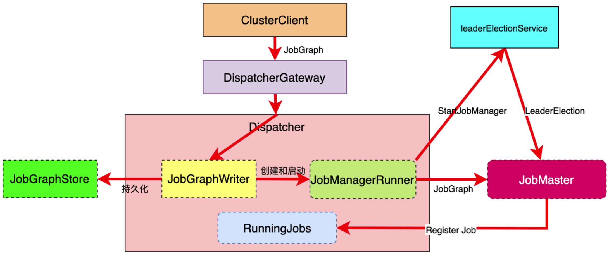

# Flink AM 组件之——Dispatcher

Flink AM 包括 Dispatcher / Resource Manager / JobManager

三个组件，其中前两个组件在每个 Flink 集群中是唯一的，而 JobManager 理论上可以有多个，每个 JobManager 对应到一个 JobGraph 表示的任务。

Dispatcher 类似于 API Gateway 的角色，主要处理 Client 的请求，把相关的命令或者数据采集请求转发给其他两个组件处理并返回结果。此外，可以接受 Client 提交的 JobGraph对象(DAG), 在内部生成 ExecutionGraph， 并创建对应的 Job Manager 实例。

## Dispatcher 任务调度

Dispatcher 的功能模块以及其和其他组件的交互如下图所示：


Dispatcher 的功能模块描述以及交互如下所示：

* 集群的重要组件之一，主要负责 JobGraph 的接收
* 根据 JobGraph 启动 JobManager
* RpcEndpoint 服务，接收 cluster client 的请求，还有在集群内部，我们通过 webui 去提交作业的话，webui 也是把作业提交到 Dispatcher 上面去运行起来
  * 主要是通过 DispatcherGateway 的 Rpc 堆外提供服务

* 从 ZK 中恢复 JobGraph (HA 模式)
```text
Dipatcher 内部有几个组件：
RuningJobRegistry，整个集群中处于 Running 的 Job 都会注册在 Dispatcher 里面
RecoveredJobs，Dispatcher 本身也是一个任务管理器，任务管理器的任务来源出来上述的通过 Endpoint 接收客户端提交过来的作业，在 开启 HA 的模式下，Dispatcher 会把作业的信息持久化到一些高可用的存储介质上，比如 ZK 。对于一些已经记录的 JobGraph，在启动集群的时候，需要进行恢复对应的作业，这些恢复的作业就会转化为 RecoveredJobs

ArchivedExecutionGraphStore 已经提交的作业，会产生一些 ExecutionGraph，会对这些已经产生的 ExecutionGraph 进行压缩，然后进行持久化，一旦出现问题，也可以对这些Archived的作业进行恢复。

JobManagerRunnerFactory，该组件就是用来创建 JobManager 来使用的。JobManager 并非直接创穿出来的，而是通过一个叫 JobManagerRunner 的组件创建出来，在整个 Flink 源码中有很多组件是通过 Runner 方式创建出来的并启动，可以把它理解为一个驱动类，甚至包括 Dispatcher 这个组件本身也有 DispatcherRunner 
```

* 保存整个集群的 Job 运行状态

最后 Dispatch而 也会跟 ResourceManager 进行交互，这个交互主要是给 JobManager 申请对应的资源，从而进行一些 Headbeat 的操作

### Dispatcher 组件核心成员


* jobManagerSharedServices JobManager 之间的共享服务，也就是多个 JobManager 之间会共享一些数据或者服务，是通过该 Service 控制
* blobServer Flink内部对象存储服务，比如我们提交的 jar 包或者用户提交的文件，这些文件得有个地方存储，blobServer 是一个对象存储的服务，它会帮你去存储一些相应的对象
* RunningJobRegistry ，这个之前提到了过，就是运行中的 job 的集合
* jobManagerRunnerFutures 异步启动 JobManagerRunner 集合
* historyServerArchivist 历史服务
* archivedExecutionGraphStore 这个上面也提到过，压缩存储 ExecutionGraph
* jobManagerRunnerFactory 负责创建 JobManagerRunner
* recoveredJobs 从 ZK 恢复出来的 job 信息

继续

* highAvailableService 高可用服务
* heartbeatService 心跳服务
* jobGraphWriter 向 ZK 中写入 JobGraph 信息，进行持久化，防止集群出现不稳定或者宕机的情况下，可以从 ZK 里面恢复 JobGraph
* resourceManagerGatewayRetriever—— Resource Manager 交互
* jobManagerMetricsGroup JobManager 统计信息
* metricsServiceQueryService 地址服务


### Dispatcher 的启动流程

启动流程如下图所示：


比如用户通过 start-cluster.sh 脚本启动，此时会通过一个 ClusterEntryPoint 的入口类，然后会创建一个 DefaultDispatcherResourceManagerComponent 实例，主要就是包含了 Dispatcher 和 ResourceManager，接下来就是创建我们上面提到的 DispatcherRunnerFactory，该 Factory 会 create and start DispatcherRunner。 DispatcherRunner 会创建一个 DispatcherLeaderProcess， 该 process 的作用是 去 JobStore(ZK) 里面去 recover 之前持久化存储的 job ，recover 后的 jobs 会传递给 Dispatcher 组件。Dispatcher 接收到 Recovered job 和 接收到 start 命令之后，就会把相关的作业进行恢复。

Dispatcher 启动之后，用户就可以往上面提交作业

### Dispatcher 接收任务

Dispatcher 接收任务的流程图如下所示：



首先，ClusterClient，也就是客户端会把 JobGraph 提交到 DispatcherGateway 里面，Gateway 会转发给 Dispatcher，Dispatcher 取到 JobGraph 之后，会首先调用 JobGraphWriter 进行落地和持久化，然后创建和启动 JobManagerRunner ，该 Runner 是通过 JobManagerRunnerFactory 创建出来的，JobManagerRunner 在调用 StartJobManager 的时候，同时也会启动一个 leaderElectionService，该 Service 是 FlinkRuntime 里面实现的一套高可用的选主机制。包括 ResourceManager,Dispatcher 和 JobManager 都会实现这样一个选主的接口。
Job master(JobMananger 的主要实现类) 完成启动和选主之后，就可以完成后续作业的调度和执行。此后，JobMaster 会把 job 信息注册回 Dispatcher 的 RunningJobRegistry 里面


## Dispatcher 源码解析

### Dispatcher 抽象类
Dispatcher 模块有一个专门的模块 org.apache.flink.runtime.dispatcher。另外 Dispatcher 本身也是一个抽象类
```java
public abstract class Dispatcher extends PermanentlyFencedRpcEndpoint<DispatcherId> implements DispatcherGateway {
}

public interface DispatcherGateway extends FencedRpcGateway<DispatcherId>, RestfulGateway {

	/**
	 * Submit a job to the dispatcher.
	 *
	 * @param jobGraph JobGraph to submit
	 * @param timeout RPC timeout
	 * @return A future acknowledge if the submission succeeded
	 */
	CompletableFuture<Acknowledge> submitJob(
		JobGraph jobGraph,
		@RpcTimeout Time timeout);

	/**
	 * List the current set of submitted jobs.
	 *
	 * @param timeout RPC timeout
	 * @return A future collection of currently submitted jobs
	 */
	CompletableFuture<Collection<JobID>> listJobs(
		@RpcTimeout Time timeout);
}
```
通过源码我们可以看到，Dispatcher 本身也是一个 Endpoint，同时实现了 Gateway 接口。Gateway 接口主要提供的方法有 submitJob, ListJob 等，从名字上就可以猜到这些方法的用途

### DispatcherRunner 驱动类

源码视图如下：


实现类 DefaultDispatcherRunner 的部分源码如下：

```java
public final class DefaultDispatcherRunner implements DispatcherRunner, LeaderContender {
    private static final Logger LOG = LoggerFactory.getLogger(DefaultDispatcherRunner.class);

	private final Object lock = new Object();

	private final LeaderElectionService leaderElectionService;

	private final FatalErrorHandler fatalErrorHandler;

	private final DispatcherLeaderProcessFactory dispatcherLeaderProcessFactory;

	private final CompletableFuture<Void> terminationFuture;

	private final CompletableFuture<ApplicationStatus> shutDownFuture;

	private boolean running;

    // 启动对应的 DispatcherLeaderProcess ，DispatcherLeaderProcess 会对持久化的作业进行恢复以及对 Dispatcher 生命周期的管理
	private DispatcherLeaderProcess dispatcherLeaderProcess;

	private CompletableFuture<Void> previousDispatcherLeaderProcessTerminationFuture;
}

interface DispatcherLeaderProcess extends AutoCloseableAsync {

	void start();

	UUID getLeaderSessionId();

	CompletableFuture<DispatcherGateway> getDispatcherGateway();

	CompletableFuture<String> getLeaderAddressFuture();

	CompletableFuture<ApplicationStatus> getShutDownFuture();
}

// JobDispatcherLeaderProcess 实现比较简单，因为它只对一个 jobGraph 负责
public class JobDispatcherLeaderProcess extends AbstractDispatcherLeaderProcess {
    private final JobGraph jobGraph;
    //...
}

// 而 Session 的实现就相对比较复杂
public class SessionDispatcherLeaderProcess extends AbstractDispatcherLeaderProcess implements JobGraphStore.JobGraphListener {
    private final JobGraphStore jobGraphStore;

	private final Executor ioExecutor;

    // 涉及到作业的恢复
    private JobGraph recoverJob(JobID jobId) {
		log.info("Trying to recover job with job id {}.", jobId);
		try {
			return jobGraphStore.recoverJobGraph(jobId);
		} catch (Exception e) {
			throw new FlinkRuntimeException(
				String.format("Could not recover job with job id %s.", jobId),
				e);
		}
	}

    // 以及将恢复的作业作为参数来创建 Dispatcher 进而启动待恢复的 job
    private void createDispatcherIfRunning(Collection<JobGraph> jobGraphs) {
		runIfStateIs(State.RUNNING, () -> createDispatcher(jobGraphs));
	}

	private void createDispatcher(Collection<JobGraph> jobGraphs) {

		final DispatcherGatewayService dispatcherService = dispatcherGatewayServiceFactory.create(
			DispatcherId.fromUuid(getLeaderSessionId()),
			jobGraphs,
			jobGraphStore);

		completeDispatcherSetup(dispatcherService);
	}
}
```


