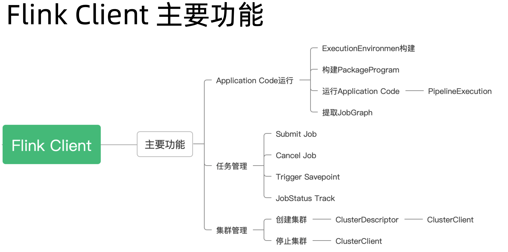
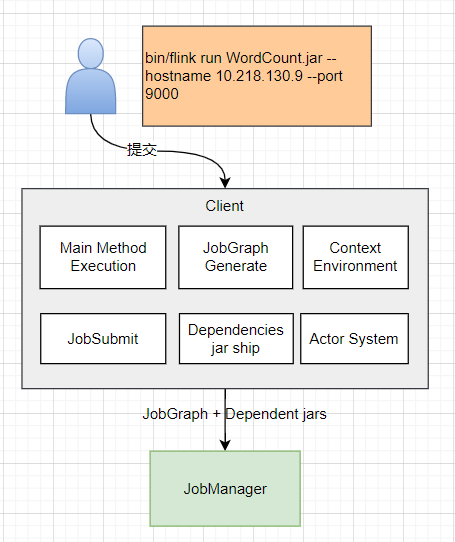
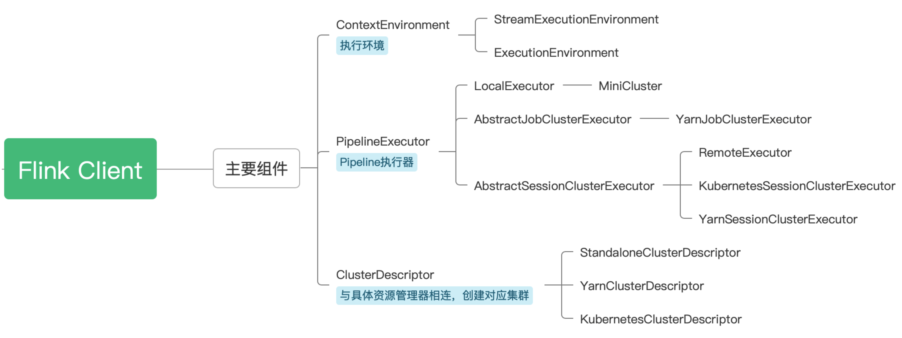
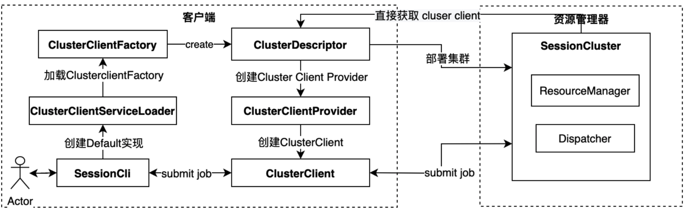
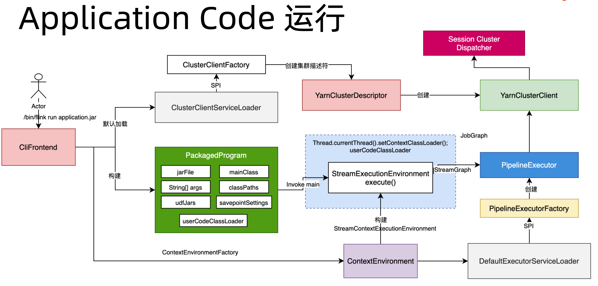
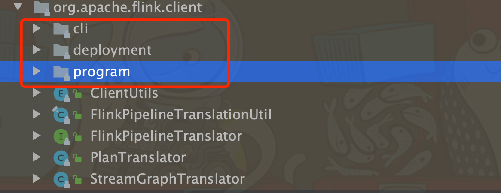
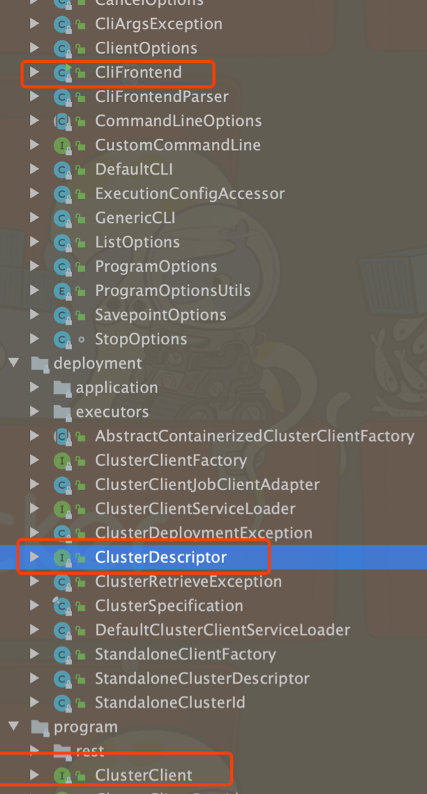
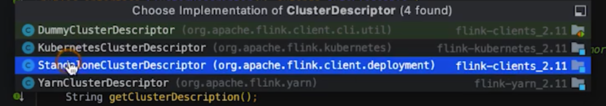
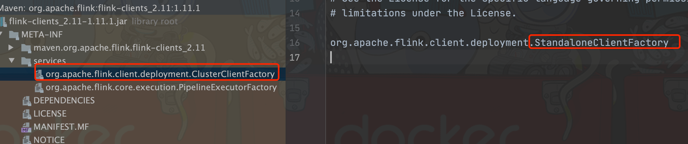
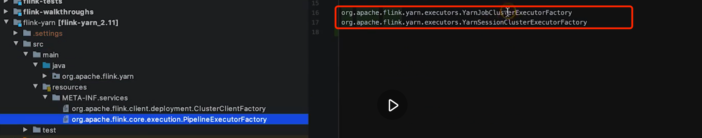

## Flink Client 实现原理

### 从流程上看——第一个流程，提交 Flink 应用。

其实这个流程里面有很多策略。如果是 JobCluster 或者 Application Cluster 的部署模式，其实这个流程里会把用户应用编译得到的 JobGraph 一并打包进行 Entrypoint 提交给 YARN 或者 Kubernetes 启动应用，并省略掉整体架构图中的第三个流程 Submit Job 的步骤。

对于 Streaming 作业来说，独占资源才是 long running 作业的最佳策略，因此抽象出 Dispatcher 和 ResourceManager 并期待服务多个 JobManager 的情况并不务实(但是对于 Standalone 的本地部署模式，确实非常适用的)

### 官方架构图之 Client 部分解释

Client 不是运行时和程序执行的一部分，而是用于准备数据流并将其发送给 JobManager。之后，客户端也可以断开连接(分离模式)，或保持连接来接受报告(附加模式)。客户端可以作为触发 Java/Scala 程序的一部分运行，也可以在命令行 ./bin/flink run ... 中运行。

可以通过多种方式启动 JobManager 和 TaskManager：直接在机器上作为 Standalone 集群启动、在容器中启动、或者通过 Yarn 等资源框架管理并启动。Task Manager 连接到 Job Manager，宣布自己可用，并被分配工作。

### 从功能上看——Flink Client 的主要功能

整体 Flink Client 功能如下图所示：

简洁版：

#### 一、Application Code 的运行：

##### 1、Application Code运行
 Application Code 就是我们写的 Flink 作业，包括 java ，python 和 flink sql 的作业，最终要的作用是提取 JobGraph. 只有提取出来 JobGraph 才能跟集群进行交互。

##### 2、ExecutionEnvironment 构建
 ExecutionEnvironment 构建在流式应用里面就是 StreamExecutionEnvironment，离线的话就是 BatchExecutionEnvironment ，ExecutionEnvironment 主要作用是构建 job 运行起来的一些环境信息，包括 checkpoint 配置，DataStream 的转换过程中产生的一些 Transformation 的操作 进行存储和构建的

##### 3、构建 PackageProgram

什么叫 PackageProgram？ 也即是我们会把我们写进来的程序进行一个 Package 打包，打包的过程中会构建其 Classpath 以及它的 ClassLoader ，比如我们依赖了 KafkaConnector，打包的时候会把 连接器这些 Dependency 都会放到 classpath 中，同时加载到 UserClassLoader 中，也就是用户代码的 ClassLoader ，这样我们的整个作业才具备运行起来的条件。

##### 4、运行 Application Code ———— PipelineExecution

这个步骤会借助下文提到的 PipelineExecutor 这样一个组件

##### 5、提取 JobGraph

Application Code 经过上述步骤之后，就会产生一个 JobGraph

然后提交到集群上，这就是整个 Application Code 的运行过程

#### Client 的任务管理功能

我们可以通过 client 进行 Submit Job，Cancel Job，Trigger SavePoint，JobStatus Track

#### Client 集群管理

比如我们可以通过 Yarn Session Client 的这样一个命令，去闯几年一个在 Yarn 上面的 Flink 集群，这也是在客户端做的，包括创建集群和停止集群。
这 2 个功能会用到我们下文讲到的 ClusterDescriptor 组件，该组件会创建一个 ClusterClient ，用于跟 Runtime 集群之间进行交互。

#### 小节
整个 Flink Client 基本就是上述三个主要部分

### 从组件上看——Flink Client 部分

Flink Client 的组件图如下：

该组件图更上面的功能图是匹配的。

#### ContextEnvironment 

ContextEnvironment 是为了构建我们执行的 ExecutionEnvironment 所使用的到的执行环境，为什么要叫  Context ，因为它本身具有上下文信息。Client 构建出来的 Environment 可以用用于多个作业的提交的。ContextEnvironment 可以用户构建不同作业的 ExecutionEnvironment 

#### PipelineExecutor

PipelineExecutor 对于像 DataStream 这些流式的作业，通过 DataStream API 转换，形成 Transformation ,Transformation 转换出来的其实是 StreamGraph，StreamGraph 实现了 Pipeline 的接口，在 Batch 里面叫做 Plan，StreamGraph 的执行是通过 PipelineExecutor 来实现的。

PipelineExecutor 实现类型主要有 3 种：
* LocalExecutor 对应就是 MiniCluster，也即是我们本地在 IDE 里面去执行的时候，此时用的是 LocalExecutor

* AbstractJobClusterExecutor 对于 Perjob 类型，用的就是这种 Executor，目前只有 YarnJobClusterExecutor 实现了该类

* AbstractSessionClusterExecutor 的实现类：
  * RemoteExecutor 对应的是远端的 Standalone 集群
  * KubernetesSessionClusterExecutor 对应的是 k8s session 
  * YarnSessionClusterExecutor 

#### ClusterDescriptor

PipelineExecutor 的作用是创建不同集群的连接，我们在做 Table API 的项目的时候，就用到了 Descriptor, 主要是获取各种 Connector 的时候会用到，比如 Kafka, FileSystem, ES 等 Connector。而 ClusterDescriptor 可以跟具体的资源管理器相连，比如上面我们所说的，如果是 native 模式，它就可以通过 Yarn 的连接器，Yarn 的Client 上面后者说 K8s 的客户端上面，

去申请 Application Master 也就是管理节点的资源，然后启动；如果是 K8s 的话，就启动 K8s 的docker 镜像，然后把我们的 Runtime 启动起来。

下面我们具体来看看 Session 集群的创建流程

#### Session 集群创建流程

客户端通过 Yarn Sesion client 命令创建一个集群的话，大概过程是这样的：
1、首先通过一个 ClusterClientServiceLoader 通过 Java SPI 去加载 ClusterClientFactory，ClusterClientFactory 会根据我们的不同环境，比如说 Yarn 或者 K8s or Mesos 。这里用那种类型的 Factory 是通过我们的参数参入，然后 Flink 进行匹配。
2、ClusterClientFactory 加载之后，就回去创建对应的 ClusterClientDescriptor ,通过 Descriptor 连接资源管理器，并部署集群 。如果资源管理器是 K8s 类型的话，就通过 K8s 的 Java 客户端 来创建 Session 集群。

3、上面的 Session 集群创建成功之后，会返回一个 Cluster Client，我们可以通过该 client 连接 Dispatcher 等，而 下一步的 创建 ClusterClientProvider 然后创建 ClusterClient，就是这里返回的 ClusterClient

4、我们通过 ClusterClient 就可以 实现 StreamGraph 的提交，而 StreamGraph 的生成是在集群创建完之后，同步构建出来的

下面我们将 Client 端的各个组件如何进行交互画成一幅图，更详细的观察客户端的提交流程。

### Flink Client 内部组件交互流程图

整体流程如如下所示：

#### 创建 ClusterClient
通过上图可以看到，./bin/flink run applicaiton.jar 这个命令内部是调用了 CliFrontend 这个入口类，如果是 Yarn 集群，此时 ClusterClientServiceLoader 会通过 SPI 加载 ClusterClientFactory，ClusterClientFactory 会创建集群描述符 YarnClusterDescriptor ，描述符进而创建 YarnClusterClient 。该执行过程是不存在 执行的集群环境情况会主动或者首先创建集群环境

#### 构建 JobGraph

首先构建 PackagedProgram ，PackagedProgram 包含了 jarFile, mainClass, String[] args, classPath, udfJars, savepointSettings，userCodeClassLoader。可以理解为就是 用户 Job 的运行环境，通过这样一个 PackagedProgram 就可以把我们洗的作业跑起来，通过反射调用 invoke main 方法，最终执行 StreamExecutionEnvironment.execute() 方法。

StreamExecutionEnvironment.execute() 方法的作用是生成 StreamGraph ,也就是会生成一个 Pipeline ，此时会发生一个Thread 上下文 Classloader 的切换，切换为 PackagedProgram 里面的 UserCodeClassLoader，也就是我们加载进来的 jar 包，切换对应的线程把用户的任务 Invoke 起来。StreamGraph 生成之后，会放到 PipelineExecutor 里面。

PipelineExecutor 是从哪里加载进来的？ 也是从 ContextEnvironment 加载过来的 DefaultExecutorServiceLoader, 该 loader 也是通过 SPI 技术加载 PipelineExecutorFactory ，不同的集群也有不同的 PipelineExecutorFactory ； PipelineExecutor 通过执行相关方法生成出来的就是一个 JobGraph 对象，executor 最终会调用 ClusterClient 对象 将 JobGraph 提交到 Application Master 的 Dispatcher 上面去。

ContextEnvironment 也是通过 ContextEnvironmentFactory 创建出来的，ContextEnvironment 的主要目的就是构建 StreamExecutionEnvironment。

### 从源码的角度去看 Flink Client 的实现

#### 源码的分类

总体上来看，源码分为 3 大部分：
cli 就是我们常用到的命令相关，CliFrontend 就是在该包下
所有的命令解析，提交都是通过 CliFrontend 来执行的。执行完成之后，就会启动相应的组件，这些组件包括比如说 program 包里面的 PackagedProgram。

program 包含了就是我们说的 PackagedProgram。
org.apache.flink.client.program.PackagedProgram#callMainMethod 就会对我们指定的 Class 的的 Main 方法进行 invoke，然后我们的 main 方法就可以执行起来。
program 包还包含了 ClusterClient 这个接口，该接口的实现类有 Mini 和 Rest 两个，Rest 就是实现对远程作业的提交

deployment 包中相应地包含了 ClusterDescriptor 这个接口
而 clusterDescriptor 这个接口的实现类就会根据具体的 Cluster 来通过 SPI 实现, 如下图所示

Executor 组件：

executor 组件中默认包含 LocalExecutor 和 RemoteExecutor，RemoteExecutor 默认创建一个 名为 "remote" 的 executor

相关 factory 的默认值：

org.apache.flink.client.deployment.ClusterClientFactory 默认为是 StandaloneClientFactory

org.apache.flink.core.execution.PipelineExecutorFactory 的默认是 
RemoteExecutorFactory 和 LocalExecutorFactory

而对于 Yarn 相关的 SPI Factory 则是由 flink-yarn 提供

### 总结

通过本章节的学习，我们从底层的角度去了解了下 Flink Runtime 中 Client 的一些实现，了解 Client里面 所涵盖的一些主要的组件，包括向 PipelineExecutor 和  PackagedProgram 以及 Cluster Client 等主要组件。

源码阅读请参考 
https://mp.weixin.qq.com/s?__biz=MzU5MTc1NDUyOA==&amp;mid=2247484256&amp;idx=1&amp;sn=777b44bd52d7c2069a6659a6948abc23&amp;chksm=fe2b672fc95cee39756cb67b1796209fa67c66d1a2a09d4ad1111f5100ca029127ba07da070d&amp;scene=21#wechat_redirect

下一章节我们学习 ResourceManager 组件以及其核心组成部分

