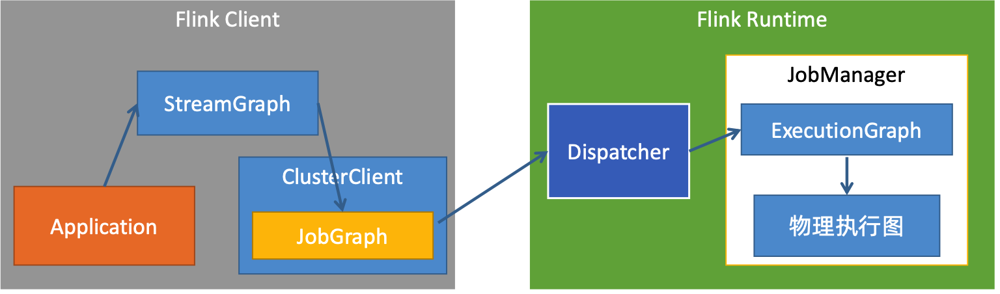
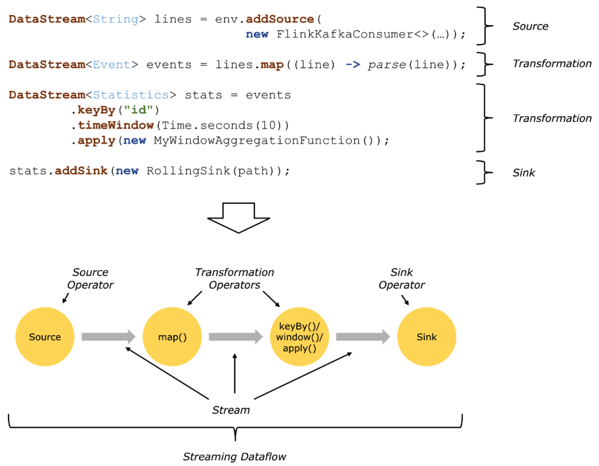
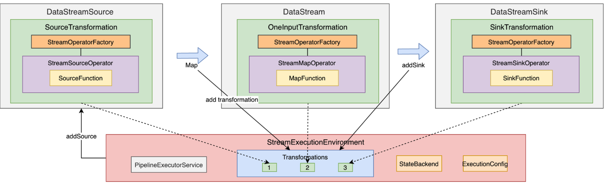
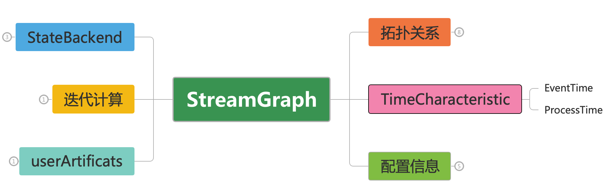
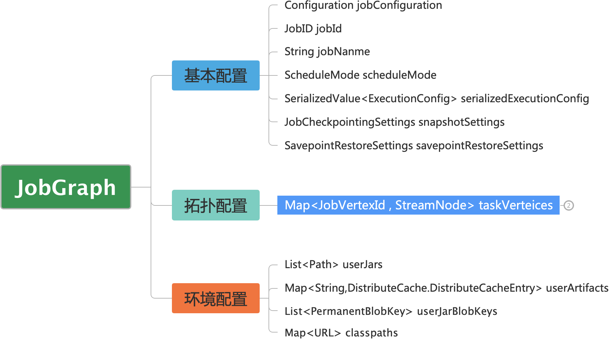
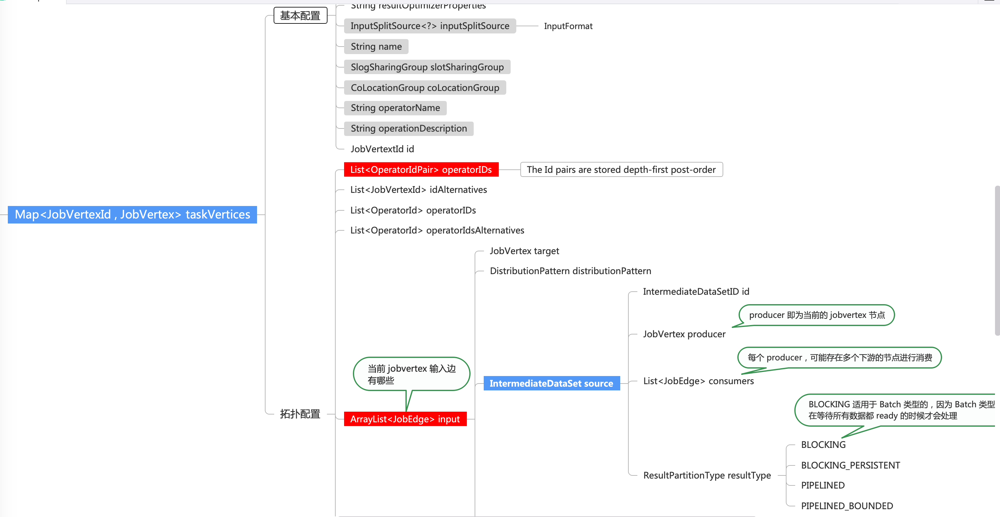
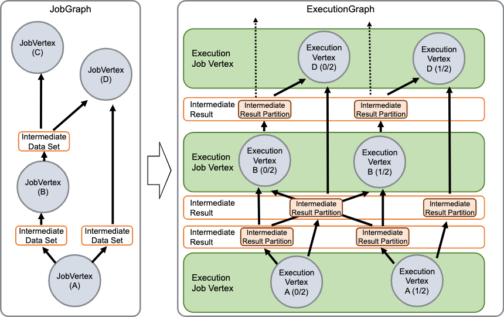
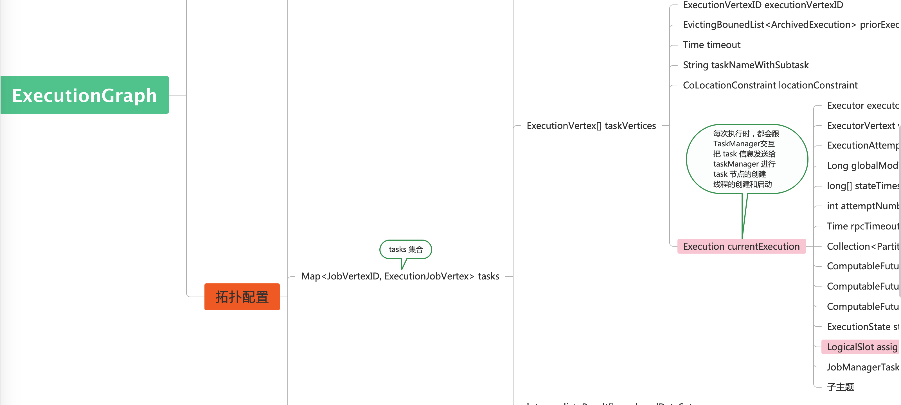
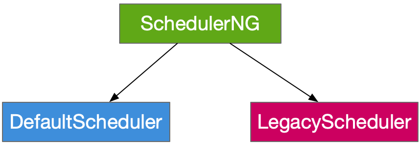

# Graph 的提交与运行

## Flink Graph 的转换位置

如下图所示：



从这张图中我们可以看到，对于 Flink Client 客户端来说，客户端可以是通过 Cli 的命令行或者通过 Rest API 的形式去提交上来的，这些都是一些客户端 。我们用户的 Application ，不管是用 Java API/Scala API/Python API 编写的可执行的作业， 这个作业都会在 Client 里面运行，生成对应的 StreamGraph(在流式模式下)， 
在前面的 Flink Client 中有讲到会创建一个Cluster Client， 将 StreamGraph 转换成 JobGraph，
同时和 Runtime 中的 Dispatcher 组件 进行 RPC 通信交互，用于将 JobGraph 提交到 Dispatcher 上面。

Runtime 这里主要是通过 Dispatcher 去接收 Client 提交的 Graph，接收完成之后，根据 JobGraph 去生成 JobManager ，其底层实现是 JobMaster， 并且将该 JobManager 运行起来，图中 JobManager 的运行可以理解为一个线程，其会在 RunTime 中一直运行，直到作业比如说终止了， 此时对应的 JobManager/JobMaster  其实就可以停止运行。与此同时，JobManager 也会接收 Client 传入的一些参数，在 JobManager 中会将 JobGraph 转换为 ExecutionGraph；ExecutionGraph 更偏向于底层的执行层面的相关的一些配置 ，比如说在执行过程中所依赖的一些环境信息，包括像会涉及到执行 Checkpoint 所涉及到的 Checkpoint Coordinator 协调器，这些组件都会在 ExecutionGraph 创建的时候，把这些组件给创建出来，最终的结果是将 ExecutionGraph 在 JobManager 里面调度起来，调度起来之后，会生成一个物理执行图，物理执行图最终会跟每一个 TaskManager 进行交互，最终形成作业，在 TaskManager 中运行起来 ，整体流程就涉及到上图中的几个核心组件 

## Flink 4 种 Graph 之间的转换

4 种 Graph 之间的转换整体转换图如下所示：


(图片来源 https://img.alicdn.com/5476e8b07b923/TB1tA_GJFXXXXapXFXXXXXXXXXX)

* 第一层：Program -> StreamGraph 
* 第二层：StreamGraph -> JobGraph
* 第三层：JobGraph ->ExecutionGraph
* 第四层：ExecutionGraph -> 物理执行计划


四种转换图的解读如下：

### Program -> StreamGraph 的转换

* **StreamGraph**:是根据用户通过 Stream API 编写的代码生成的最初的图。用来表示程序的拓扑结构(DAG 图)。
  * StreamNode: 用来表示 operator 的类，并具有所有相关的属性，如并发度，入边和出边等。
  * StreamEdge：表示连接两个 StreamNode 的边。
  
#### Program -> StreamGraph 的转换整体概览

Program -> StreamGraph 的转换图如下所示：



从图中我们可以得知，上图整体包含的是 Source->Transformation->Sink 这样的转换，Source 和 Sink 节点比较特殊。Source Operator 不会再通过网络的方式进行数据传输，也就是 Source 节点不会接收上游算子的输出。Source节点对整个 Stream DataFlow 来讲，都是第一个节点，是头结点。整体上来说 StreamGraph 是对整个作业的拓扑关系的描述

#### Program -> StreamGraph 的转换的组件详情

该层转换的组件级别的转换图如下：



DataStream 作业的 Source 节点我们生成的是 DataStreamSource ，对于 Transformation 生成成的是 DataStream, Sink 方法转换成的是 DataStreamSink。 
从图中我们可以看到，DataStreamSource 里面就是一个 SourceTransformation，SourceTransformation 使用到的节点就是一个 StreamSourceOperator， StreamSourceOperator 使用到的 Function 就是 SourceFunction, 而我们在之前的项目中使用的 SourceFunction比较多的是 RichSourceFunction ，实现一些外部数据源的接入，比如 mysql 之类，包括 jdbc 客户段的创建都是最终在 SourceFunction 中进行定义，最终被包裹成 SourceTransformation 存储在对应的 StreamExecutionEnvironment, 而 StreamExecutionEnvironment 就有一个 transformations 的集合，该集合最终会被转化成 StreamGraph。

#### StreamGraph 的主要组成

```java
public class StreamGraph implements Pipeline {

}
```

StreamGraph 底层实现了 Pipeline 的接口，该接口的底层实现之一的就是 StreamGraph。StreamGraph 主要有 6 个组成部分，如下图所示



* 1、StateBackend，
会涉及一些状态管理，主要包括使用了哪种StateBackend，是 Memory 还是 RocksDb ，都是在 StreamGraph 进行相应的设定，而我们在编写业务逻辑的时候，会进行 StateBackend 的设置，
* 2、userArtificats 
涉及到一些文件或者包，在 StreamGraph 中进行相应的存储。
* 配置信息
包括一些诸如 Checkpoint 的配置
* 3、TimeCharacteristic
时间特性的设置，eventTime 还是 ProcessTime
*4、最重要的还是里面的拓扑关系
它描述了整个作业的能够运行起来的算子之间的连接关系，包括了边和节点。 

##### StreamGraph 的拓扑关系

从上面的脑图中我么可以看到，拓扑关系中包含一个  Map<Integer,StreamNode> streamNodes 这样一个节点集合，有一个 Integer 的主键 Id
Source 和 Sink 节点是单独存储的，存储的就是一个 Id 的集合，还包括一些虚拟节点和 Sideoutput 节点，用于单独存储 Sideoutput 信息，
还有一些 partition 节点。以上这些信息就是存储在 StreamGraph 的拓扑关系中。

每个 StreamNode 节点中包含的信息如下：
* 1、配置信息 
包含当前节点使用到的 preferedResource，比如说当期那算子会用到 几核 CPU 或者 几个 G 的内存 。其他信息还有 算子名称-operatorName; 最大并行度参数。
* 2、拓扑关系 
拓扑关系主要有 2 个属性，第一个当前及节点的入节节点 List<StreamEdge> inEdges ，也称为图的入度，每个节点都有对应的输入节点和输入边；第二个就是输出边集合，也成为出度。每个节点除了有输入边还有输出边，输出边也是一个 StreamEdge 对象。InputFormat 和 outputFormat 比较独立的组成部分，使用 InputFormat 去接入数据的话，相对来说比较独立，不会使用 SourceFunction 这样的 operator 去接入数据。另外还有 outputSelctor 对应于存储 outputTag 数据？
* 3、状态配置 
包括 KeySelector，是每个 State 的 Partitioner。对当前节点类型来说，如果只有一个单数类型的???, 就只有一个 Partitioner，如果是多数类型，可能包含了 2 个 Partitioner ；TypeSerializer， 状态所使用的到的序列化器
* 4、算子配置 StreamOperatorFactory ，Stream Operator 所有的算子最终会封装成 StreamOperatorFactory，然后转换成对应的 StreamGraph；Class<? extends AbstractInvokable> jobVertexClass 就是当前节点所涉及到的 Stream Task 里面的用户编写的方法，对的，它会进行反射的方式 invoke，进而触发 task 中的配置的方法， class 名称就是这这里配置的

具体的参考脑图 StreamGraph.emmx 中的脑图详情

##### StreamGraph 的其他
* StateBackend  
主要是 3 中 Backend 的配置
* 迭代计算 
source 和 sink 节点的 K-V 配置，将迭代结算的输入节点和输出节点进行连接
* DistributedCacheEntry ?? 用户提交的的一些 Cache？

##### StreamGraph 总结

对于以上 StreamGraph 中的配置或者参数信息，会在 Client 里面打包生成 JobGraph。下面的小节，我们讨论了StreamGraph 到 JobGraph 的转换所涉及到的一些核心的参数上的转换以及结构上的转换

### StreamGraph -> JobGraph 的转换

StreamGraph -> JobGraph 的转换图如下所示：


* **JobGraph**: StreamGraph经过优化后生成了 JobGraph，提交给 JobManager 的数据结构。主要的优化为，将多个符合条件的节点 chain 在一起作为一个节点(称为 Operator Chain)，比如两个节点的连线 StreamEdge 是 Forward 类型的，就可以把两个节点合并，合并后的节点被称为 JobVertex，使得算子可以在同一个 Task 里面运行，也就是同一个线程里面运行，最终可以减少数据在节点在节点之间流动所需要的序列化/反序列化/传输消耗。
除此之外，DataStream 中还有将节点合并的显性的 chain 方法可以调用。
  * JobVertex: 经过优化后符合条件的多个 StreamNode 可能会 chain 在一起生成一个 JobVertex，即一个 JobVertext 包含一个或者多个 operator，JobVertex 的输入是 JobEdge, 输出是 IntermediateDataSet
  * IntermediateDataSet：表示 JobVertex 的输出，即经过 operator 处理产生的**中间数据集**。producer 是 JobVertex，consumer 是 JobEdge，是一个中间数据的缓冲
  * JobEdge：代表了 job graph 中的一条数据传输通道。source 是 IntermediateDataSet，target 是 JobVertex。即数据通过 JobEdge 由 IntermediateDataSet 传递给目标 JobVertex。

JobGraph 中对于 Operator Chain 节点构建的话，Source 节点其后的节点如果进行了物理上的切割，比如说中间会进行一些 Shuffle 或者 Hash 的一些操作，对于下游的节点，就会拆分成不同的 Operator Chain 

JobGraph 的思维导图如下：
```java
// 实现 Serializable 接口的目的是因为 JobGraph 涉及到网络传输，会从 Client 端提交到 Dispatcher，会进行序列化和反序列化
public class JobGraph implements Serializable {
}
```



从上图中我们可以看到 JobGraph 涉及 3 大部分：

* 基本配置
    主要包括 Job 的 Configuration 配置信息，jobId，jobName，ScheduleMode；ScheduleMode 是通过 StreamGraph 转换过来的；还有一些其他参数信息，比如 Checkpoint 配置和 Savepoint 配置都是从 StreamGraph 转换过来的
* 拓扑配置
在转换过程中会生成 JobVertex 节点，这些节点会放置到一个 Map 的 K-V 集合中。Key 是 JobVertexID，Value 是 JobVertex 节点。还有一些拓扑关系，经过重构和转换，生成 JobVertex 信息

* 环境配置

除了上述 拓扑配置描述 JobGraph 的拓扑关系之外，还需要一些环境配置，
比如用户所依赖的 jar 包 userJars，ClassLoader 的加载所依赖的 jar 包列表，比如我们所使用到的一些连接器的包，这个字段就是设置用户当前作业所依赖的一些外部信息，包括第三方的一些 jar 包
BlobKeys 会在 Runtime 中生成 BlobServer，是一个对象存储，而用户所依赖的 jar 包都会存储到这个一个 BlobServer 中，Task 所在的 TaskManager 会从 BlobServer 中将 jar 包拉取下来，有点像 Hadoop Yarn 上面去执行一些任务时，去 hdfs 上拉取对应的一个环境依赖的 Jar 包信息一样。同时在 Flink 集群中我们会看到有 BlobServer 这样一个配置，会指定一个文件夹，凡是我们作业所依赖的 jar 包信息，多会传递到这样一个文件夹中，然后再分发到每一个 TaskManager 中，启动的时候就可以通过这样一个文件中获取所依赖的 jar 包

其中拓扑配置的脑图参考如下：




### JobGraph -> ExecutionGraph 的转换

JobGraph -> ExecutionGraph 的转换 的官方示意图如下：



#### 名词解释

* **ExecutionGraph**: JobManager 根据 JobGraph 生成 ExecutionGraph。ExecutionGraph 是 JobGraph 的并行版本，是调度层最核心的数据结构。
  * ExecutionJobVertex：和 JobGraph 中的 JobVertex 一一对应。每一个 ExecutionJobVertex 都有和并发度一样多的 ExecutionVertex。
  * ExecutionVertex：表示 ExecutionJobVertex 的其中一个并发子任务，输入是 ExecutionEdge，输出是 IntermediateResultPartition。ExecutionVertex 会启动 TaskManager 中当前的 Vertex 所代表的 Task。
  * IntermediateResult：和 JobGraph 中的 IntermediateDataSet 一一对应。一个 IntermediateResult 包含多个 IntermediateResultPartition，其个数等于该 operator 的并行度。
  * IntermediateResultPartition：表示 ExecutionVertex 的一个输出分区，producer 是 ExecutionVertex， consumer 是若干个 ExecutionEdge。IntermediateResultPartition 是 ExecutionGraph 中每个 ExecutionVertex 节点的输出。假如该节点是 Source 节点，该节点输出给下游节点的数据并不是直接推送过去的，它的输出边 ExecutionEdge 要么不在同一个 TaskManager 中，这需要经过网络传输；如果在同一个 TaskManager 中，也会涉及到跨线程的调用，因此我们看到两个不同的节点之间存在 2 个组件，IntermediateResultPartition 就是对 ExecutionVertex 节点的输出 进行存储，如果看源码的话，实际上存储的就是 NetworkBuffer(buffer 缓冲池)，然后下游的算子去这个缓冲池中进行消费，然后再接入到自己的算子里面进行处理
  * ExecutionEdge：表示 ExecutionVertex 的输入，source 是 IntermediateResultPartition，target 是 ExecutionVertex。source 和 target 只能有一个。


#### 转换图流程解释：

在作业执行期间，JobManager 会持续跟踪各个 task, 决定何时调度下一个或一组 task，处理已完成的 task 或执行失败的情况。

JobManager 会接到收一个 JobGraph，用来描述由多个算子顶点( JobVertex )组成的数据流图，以及中间结果数据( IntermediateDataSet )。每个算子都有自己的可配置属性，比如并行度和运行的代码。除此之外，JogGraph 还包含算子代码执行所必须的依赖库。

JobManager 会将 JobGraph 转换成 ExecutionGraph。可以将 ExecutionGraph 理解成并行版本的 JobGraph，对于每个顶点 JobVertex，它的每个并行子 task 都有一个 ExecutionVertex。一个并行度为 100 的算子会有 1 个 JobVertex 和 100 个 ExecutionVertex。ExecutionVertex 会跟踪子 task 的执行状态。同一个 JobVertex 的所有 ExecutionVertex 都通过 ExecutionJobVertex 来持有(就是一个 JobGraph 中的 JobVertext 对应一个 ExecutionGraph 中的 ExecutionJobVertex)，并跟踪整个算子的运行状态。ExecutionGraph 除了这些顶点，还包含中间数据结果和分片情况 IntermediateResult 和 IntermediateResultPartition。前者跟踪中间结果的状态，后者跟踪每个分片的状态。

整体来看，ExecutionGraph 主要有 3 个组件：节点、ImmediateResult，ExecutionEdge 这样的边。不论这个图是如何的拓扑复杂，也主要是这 3 个组件的不同组合。在转换成执行图的时候，也是基于这 3 个部分进行转换。ExecutionVertex 的每个节点都会到 TaskManager 里面去启动一个 task。Task 就是在 TaskManager中的一个线程，这里就变成了物理执行的过程


从源码看的脑图如下所示：




### ExecutionGraph -> 物理执行图 的转换

#### 物理执行图解释

* **物理执行图**：JobManager 根据 ExecutionGraph 对 Job 进行调度后，在各个 TaskManager 上部署 Task 后形成的 “图”，并不是一个具体的数据结构。
  * Task：Execution 被调度后在被分配的 TaskManager 中启动对应的 Task。Task 包括了具有用户执行逻辑的 operator。
  * ResultPartition：代表一个 Task 的生成数据，和 ExecutionGraph 中的 IntermediateResultPartition 一一对应。
  * ResultSubpartition：是 ResultPartition 的一个子分区。每一个 ResultPartition 包含多个 ResultSubpartition，其数目要由下游消费 Task/算子的并行度数和 DistributionPattern 来决定
  * InputGate：代表 Task 的输入封装，和 JobGraph 中 JobEdge 一一对应(图中的第一个 InputGate 画的有问题，没有一一对应)。每个 InputGate 消费一个或者多个 ResultPartition
  * InputChannel：每个 InputGate 会包含一个以上的 InputChannel，和 ExecutionGraph 中的 ExecutionEdge 一一对应，也和 ResultSubpartition 一对一地连接，即一个 InputChannel 接收一个 ResultSubPartiton 的输出。InputChannel 在源码里面会分成 LocalInputChannel 和 RemoteInputChannel。如果是 LocalInputChannel ，则说明 上游的 Task 和下游的 Task 节点 在同一个 TaskManager 进程里面，使用一个本地的数据传输。如果是 RemoteInputChannel，则上下游的 Task 分布在不同的 TaskManager 中，这就会涉及到一个基于 Netty 的 tcp 的网络传输，也就会用到 Network Stack 网络栈进项上下游数据的传输

为什么 Flink 要设计这 4 张图那？其目的是什么？Spark 中也有多张图，数据依赖图以及物理执行的 DAG。 其目的都是一样的，就是解耦，每张图各司其职，每张图都应了 Job 的不同阶段，更方便做该做的事情。我们给出完整的 Flink Graph 的层次图。

#### ExecutionGraph 调度器

ExecutionGraph 的调度模块如下所示：



* ExecutionGraph 调度器的分类
  * DefaultScheduler
    * 默认调度器
    * 外部调度 ExecutionGraph
  * LegacyScheduler
    * 早期的一个调度版本
    * 基于 ExecutionGraph 内部调度

两个调度器都统一的实现了 SchedulerNG 这样一个接口，SchedulerNG 为 JobManager 调度 ExecutionGraph 提供了方法。DefaultScheduler 是一个外部调度器，如何理解？老版本的 Scheduler 和 ExecutionGraph 有耦合的地方，社区新增加了一个 DefaultScheduler 将 ExecutionGraph 的拓扑关系和它自身的调度进行了拆分， 未来版本，都会使用 DefaultScheduler 对 ExecutionGraph 进行调度

## 参考文档

https://nightlies.apache.org/flink/flink-docs-master/zh/docs/internals/job_scheduling/

https://wuchong.me/blog/2016/05/03/flink-internals-overview/

https://wuchong.me/blog/2016/05/10/flink-internals-how-to-build-jobgraph/

https://developer.aliyun.com/article/225618?spm=a2c6h.24874632.expert-profile.18.4acf54d5W8DoSo

https://blog.csdn.net/EdwardWong_/article/details/126980678?spm=1001.2014.3001.5502


https://blog.csdn.net/EdwardWong_/article/details/127037848


https://github.com/mickey0524/flink-streaming-source-analysis/blob/master/docs/flink-job-graph.md
