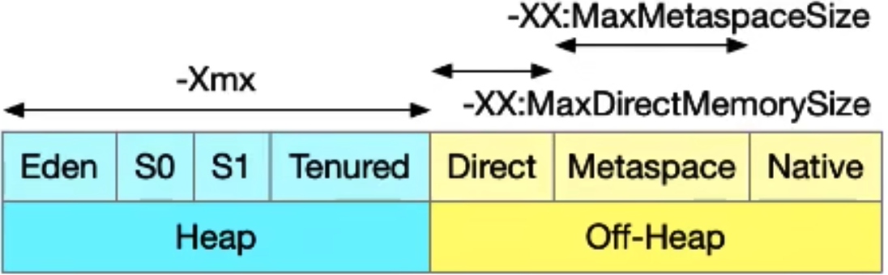
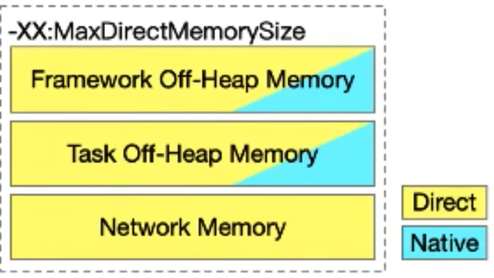
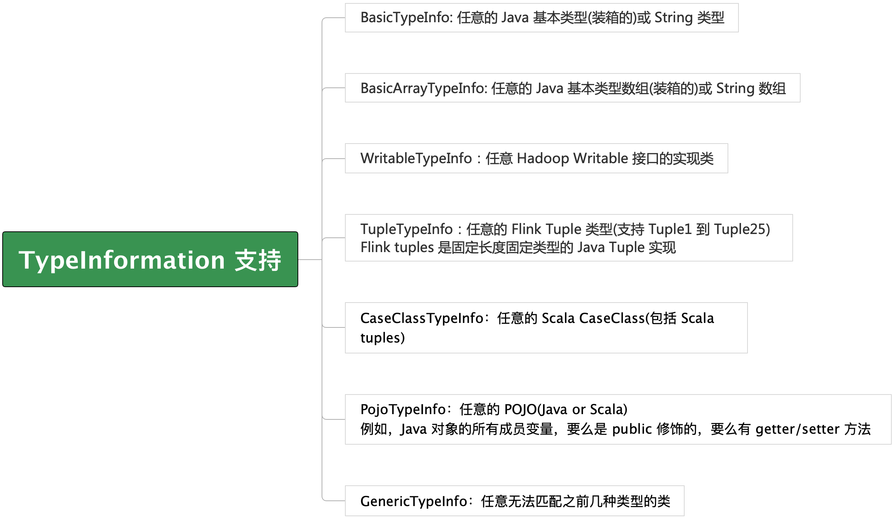
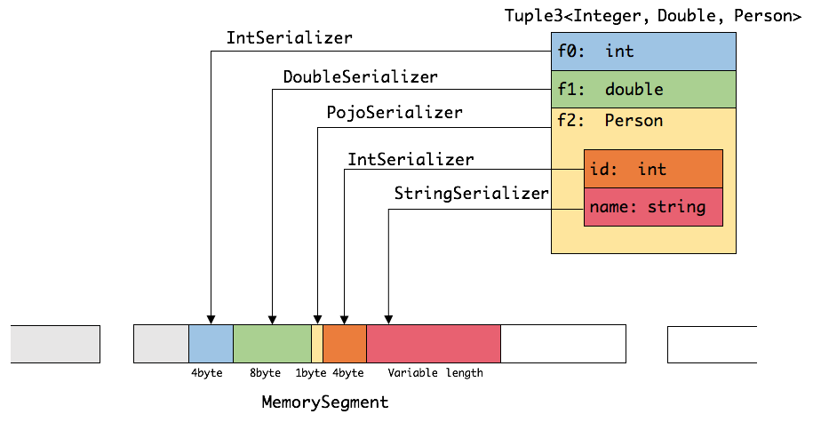
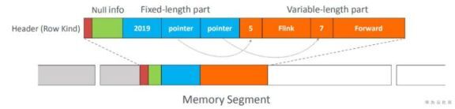
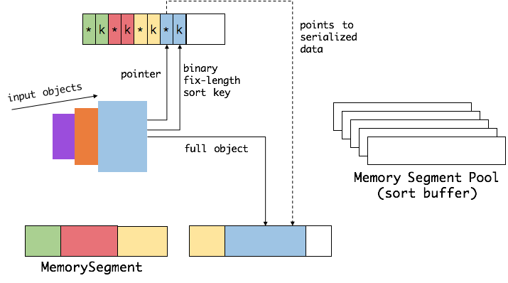
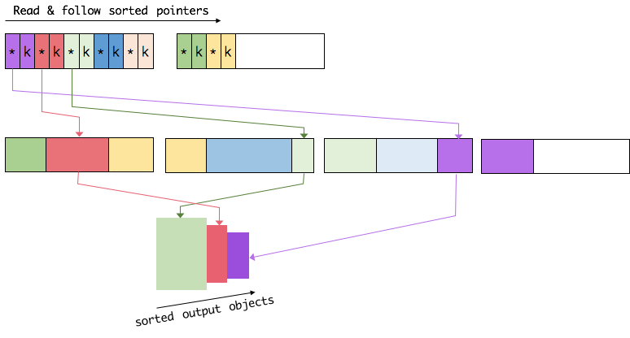
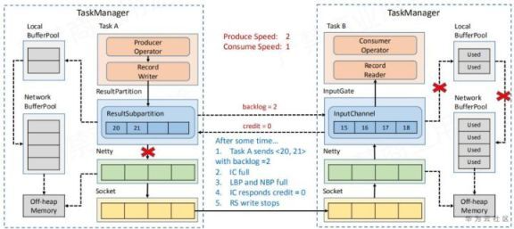

# Flink 的内存管理

目前大多数的计算框架都开始自己实现对于内存的管理，比如我学过的 Netty，Flink 框架，还有未学过的 Spark 和 Hbase 等。这些框架的最终目的就是希望和 C 语言一样能够进行对于直接内存的一些管理，避免像 OOM 之类异常的发生。本章节我们来讲述下，Flink 是如何做到对于 JVM 的内存管理，以及脱离 JVM 进行相应的内存管理，主要内容包括内存管理，定制的序列化工具、缓存友好的数据结构和算法、堆外内存、JIT 编译优化等。

## Backgroud 背景简介

### JVM 内存管理带来的问题

* **Java 对象存储密度低**：一个只包含 boolean 属性的对象至少占用了 16 字节内存：对象头占了 8 个，boolean 属性占用了 1 个，对齐填充占用了 7 个。而实际上只需要一个 bit （1/8 字节）就够了。这就造成了 java 的对象存储及其浪费存储空间，如果是基于 JVM 去处理大规模数据集的话，会造成内存空间的极大浪费。

* **Full GC 会极大地影响性能** ，尤其是为了处理更大数据而开了很大内存空间的 JVM 来说，GC 会达到秒级甚至分钟级。
FullGC 可能会影响整个作业的稳定性，对于 Flink 这样的大数据的框架，是非常致命的，

* **OOM 问题影响稳定性**：OutOfMemoryError 是分布式计算框架经常遇到的问题，当 JVM 中所有对象大小超过分配给 JVM 的内存大小时，就会发生 OutOfMemoryError 错误，导致 JVM 崩溃，分布式计算框架的健壮性和性能都会受到影响。

Flink 直接针对内存这一块进行了比较直接的管理，脱离了 JVM 所提供的的一些内存管理所带来的一些问题。
Flink 1.9 及其以前版本的 TaskExecutor 内存模型
* 逻辑复杂难懂
* 实际内存大小不确定
* 不同场景及模块计算结果不一致
* 批、流配置无法兼容

Flink 1.10 引入了 FLIP-49，对 TaskExecutor 内存模型及配置方法进行了统一的梳理和简化。

## Flink 内存的划分

<table>
<tr bgcolor="6A7CA8">
<th><font color="White">Memory Component</font></th>
<th><font color="White">Use Case</font></th>
<th><font color="White">Memory Type</font></th>
<th><font color="White">Limitation</font></th>
<th><font color="White">Configuration Options<br>(taskmanager.memory.*)</font></th>
<th><font color="White">Default</font></th>
</tr>
<tr>
<td><b>Framework Heap</b></td>
<td>All</td>
<td>Heap</td>
<td rowspan="2">Strict</td>
<td>framework.heap.size</td>
<td>Explicit Size</td>
</tr>
<tr>
<td><b>Task Heap</b></td>
<td>All,esp.HeapStateBackend</td>
<td>Heap</td>
<td>task.heap.size</td>
<td>None</td>
</tr>
<tr>
<td><b>Framework Off-Heap</b></td>
<td> All </td>
<td>Direct & Native</td>
<td rowspan="2">Loose</td>
<td>framework.off-heap.size</td>
<td>Explicit Size</td>
</tr>
<tr>
<td><b>Task Off-Heap</b></td>
<td>User codes & libraries</td>
<td>Direct & Native</td>
<td>task.off-heap.size</td>
<td>Explicit Size</td>
</tr>
<tr>
<td><b>Network</b></td>
<td> All </td>
<td>Direct</td>
<td>Strict</td>
<td>network.[min|max|fraction]</td>
<td>Explicit Range & Implict Fraction</td>
</tr>
<tr>
<td><b>Managed</b></td>
<td> -Batch Operators <br/> -RocksDBStateBackend </td>
<td>Native</td>
<td>Strict</td>
<td>managed.[size|fraction]</td>
<td>Implicit Fraction</td>
</tr>
<tr>
<td><b>JVM Metaspace</b></td>
<td>All,esp. loading many libraries </td>
<td>Metaspace</td>
<td>Strict</td>
<td>jvm.metaspace.size</td>
<td>Explicit Size</td>
</tr>
<tr>
<td><b>JVM Overhead</b></td>
<td>All</td>
<td>Native</td>
<td>None</td>
<td>jvm.overhead.[min|max|fraction]</td>
<td>Explicit Range & Implict Fraction</td>
</tr>
<tr>
<td><b>Total Process</b></td>
<td></td>
<td></td>
<td></td>
<td>process.size</td>
<td>None</td>
</tr>
<tr>
<td><b>Total Flink</b></td>
<td></td>
<td></td>
<td></td>
<td>flink.size</td>
<td>None</td>
</tr>

</table>

图表说明如下：

纵轴是一些不同的内存组成部分以及内存类型；横轴是内存的一些特点，包括使用场景，对应的 Java 内存类型，使用量是否有严格限制等相关的一些属性。

## Flink 内存类型及用途

### TaskExecutor 内存模型

<center class="half">


</center>

上图中，左边是设计图，右边是用户文档的图，这两张图内容一致。左边比较清晰，右边分类嵌套的比较深。下面分别解释如下：

* ProcessMemory，一个 TaskExecutor 进程使用的所有内存。这个尤其是在容器化的环境中是非常重要的一个特性，我们向 Yarn 或者 K8S 申请的每个容器都是有资源限定的，根据 yarn 或者 k8s 的配置不同，如果我们作业使用的内存超出了申请的内存用量，container 可能被 Yarn 或者 k8s 杀掉，所以我们要把 Process Memory 的大小配置到和我们申请到的内存一边大，这样我们才不会造成内存超用。

* Flink Memory ，我们可以看成把 JVM 自身的开销排除后，真正用户 Flink 作业的内存。前 4 项都很像，Framework & Task 跟 Heap 和 Off-head 组合形成的一个 2x2 的组合关系

下面我们逐一讨论

#### Framework vs. Task Memory


* 区别：是否计入 Slot 资源。
  * Framework 和 Task Memory 的一个最终要的区别是，内存是否计入 Slot 资源。一个 TaskManager 中会有一个或者多个 Slot 。每个 Slot 才是真正用于执行你的作业的计算任务的最小单位。官网定位为一个 TaskExecutor 的资源的子集。从图中可以看到，一个 Slot 能分到内存资源包括 Task Heap 、Framework Heap 、Network、Managed 这 4 项内存。

  * 即使一个 Slot 都没有分配，也需要留有内存给框架使用 

* 总用量受限。
  * '-Xmx'=FrameworkHeap + TaskHeap
  * '-XX:MaxDirectMemorySize'=...+Framework Off-Heap + Task Off-Heap。... 在这里代表了 network memory 等

* 无隔离
    * 并没有在 Slot 和 Framework 之间隔离，这是因为 TaskExecutor 是一个进程，我们不管进程中运行的是 Slot 也好还是框架的其他组件，都是线程级别的任务，对于 JMV 的内存来说，是不会在线程级别对内存的使用量进行限制的
* 为什么要有 Slot 和 Framework 的区别
  * 这是为了后续版本可以做到动态切割 Slot 资源。当前 TM 中不管有多少个 Slot，Slot 都是大小容量相近的，比如 TaskExecutor 分到 1gb 的内存，但是 framework 需要分配 200mb 内存，那么 slot 最多只能分配 800mb 的内存。
  不建议对 framework 的内存进行调整，最好还是保持其默认值 。Framework 内存大小是 Flink 团队在跑一个空的 Task 的情况下测量出来的一个估算值。Flink 后面的版本要做的做动态的资源管理工作，FLIP-56 对此有详细的描述。

#### Heap & Off-Heap Memory

* Heap
  * 绝大多数 Java 对象
  * HeapStateBackend
    * 如果我们的作业是流式作业，且使用了 HeapStateBackend，那么这是一个主要的 Heap 内存的 Consumer，如果我们的 State 对象是存储在 Heap 上，那么我们需要保证我们的 Java Heap 足够多才行

* Off-Heap
    * Direct
      * DirectByteBuffer
        * ByteBuffer.allocateDirect()
      * MappedByteByteBuffer
        * FileChannel.map()
    * Native
      * JNI，C/C++, Python, etc.
    * 不区分 Direct / Native

Off-Heap 的内存 Flink 中定义主要分为 Direct 和 Native 两种，Direct 在 Java 中叫直接内存，上述的 ByteBuffer.allocateDirect() 和 FileChannel.map() 方法的返回值都属于 Direct 的范畴

Native 内存，包括 JNI，C/C++, Python 这些不受到 JVM 管控的内存。

Flink 配置模型没有要求对 Direct 或者是 Native 进行区分，我们统一的叫 off-heap

#### Network Memory

* Direct Memory 
* 用于
  * 数据传输缓冲
* 特点
  * 同一个 TaskExecutor 的各 slot 之间是没有隔离
  * 需要多少是由作业拓扑决定，不足会导致运行失败

Network Memory 本质上使用的是 Direct Memory，在配置了指定大小之后，在 TaskExecutor 一旦启动之后，Flink 就会申请所配置的这个大小的内存，并且在 TaskExecutor shutdown 之前，不会去释放这个内存。所以对于 Network Memory 这个 Direct Memory 来说，考虑它用了多少，没用多少每多大意义，我们可以把 Network Memory 看做是一个常量，因此这里把 Network Memory 单独拆出来进行管理。

Network Memory 主要用户数据传输的 Buffer。其特点主要是 内部各个 Slot 之间没有隔离，并不存在比如说 3 个slot，每个 slot 最多只能用 1/3 的 network memory 这样的限制，只要整个 TaskExecutor 的 总的内存不超过分配给它的内存就行。到底一个作业需要多少 network memory，或者准确地说是一个 Task 需要多少 network memory，这是是由我们的作业拓扑结构决定，作业的 Physical Graph 需要多少 Network Memory 决定的，分配不足会导致作业运行失败 

* **Task 的网络内存计算**
  
  networkMemory = bufferSize<32KB> * (inputBuffers + outputBuffers)
  inputBuffers = remoteChannels * buffersPerChannel<2> + gates * buffersPerGate<8>
  outputBuffers = subpartitions + 1

上面的公式说明了作业拓扑是如何决定 Task 的网络内存使用量
remoteChannels - 不在当前 TM (不同的 TaskManager 的 shuffle 才会走网络，也可以理解成需要通信的网络的边的数量) 的上游 SubTask (Physical Graph Vertex) 数量
gates          - 上游 Task (不同的 TM 的上游 task 数量 + 同一个 TM 的上游 task 数量，Logical Graph Vertex) 数量
subpartitions  - 下游 Subtask 数量(不论是否经过网络，都会先写到 buffer 中)

#### Managed Memory

* Native Memory
* 用于
  * RocksDBStateBackend
  * Batch Operator
* 特点
  * 同一 TaskExecutor 的各 slot 之间严格隔离
  * 多点少点都能跑，与性能挂钩

TIPS HeapStateBackend or 无状态的作业不需要 Managed Memory，可以设为 0 避免浪费，尽量将内存留给 Java 的 Heap 来使用

Managed Memory 本质上用的是 Native Memory ，并不会受到 JVM Heap 或者 DirectMemory 大小的限制，但是 Flink 会对它进行管理。
其用途主要有 2 个，一个是用于 RocksDBStateBackend，RocksDB 本身是一个用 C/C++ 编写的 library，另外一个就是 Batch Operator，不管是 DataSet 还是 Flink SQL 的 table 都会用到 Managed Memory 去进行 cache 或者 排序之类的性能优化的操作。

Managed Memory 的特点：
同一 TaskExecutor 的各 slot 之间严格隔离，一个 slot 有多少 Managed memory，它一定没有办法超用。其次，内存多点少点，Managed Memory 都能用起来，并没有一个明显的最低限制，有的 Managed Memory 配置的多，也都能给用掉；有的配置的比较小，实际上也能跑，但是可能会对性能造成一些影响。比如 RocksDB 或者 Batch Operator 如果空间不够的话，就会涉及到频繁的对其中的数据进行落盘，就会对性能有影响。

* RocksDB 内存限制
  * state.backend.rocksdb.memory.managed(default:true)
  * 设置 RocksDB 使用的内存大小为 Managed Memory 大小
  * 目的：防止容器内存超用

 state.backend.rocksdb.memory.managed 配置项的含义为：RocksDB 的内存申请是在 RocksDB 自己的 library 内部完成，flink 无法进行直接的干预，但是我们可以通过设置这个参数  state.backend.rocksdb.memory.managed ，来让 rocksdb 申请的内存大小不超过 Managed memory 的大小，其主要目的是防止作业的 state 比较多，容器内存超用，从而造成作业的 Container 被 Yarn 或者 K8s 杀掉。

因此在 Standalone 模式下，可以显式关闭，这种情况下， RocksDB 用自己自带的默认算法去申请内存，可以尽量避免影响 RocksDB 的性能。

#### JVM Metaspace & Overhead

* JVM Metaspace 
  * 存放 JVM 加载的类的元数据
  * 加载的类越多，需要的空间越大
* TIPS 以下情况注意调大 JVM MetaSpace
  * 作业需要加载大量第三方库
  * 多个不同作业的任务运行在同一个 TaskExecutor 上

*  JVM Overhead
   *  Native Memory
   *  用去其他 JVM 开销
      *  Code Cache
      *  Thread Stack
之所以要把 JVM MetaSpace 和 JVM Overhead 拆开，是因为 MetaSpace 有一个明确的边界，也就是我们可以通过参数明确地控制 MetaSpace 的空间大小，而 其他的 JVM Overhead 比如栈空间或者 Code Cache 等其他的 JVM Overhead 并没有很好的特性，无法进行精细的管理

 ### Java 内存特性解读

 #### Java 内存类型



* 归根结底只有两种内存
  * Heap
    * 经过 JVM 虚拟化的内存
    * 实际存储地址可能随 GC 变化，上层应用无感知
  * Off-Heap
    * 未经 JVM 虚拟化的内存
    * 直接映射到本地 OS 内存地址

Heap 内存，经过 JVM 虚拟化的内存，一个 Java 对象，你的应用程序获取一个 Java 对象，可能并不需要关心对象的实际上存放在哪里，而这个内存实际上也没有一个固定的地址，熟悉 JVM 内存模型都知道，JVM 的 heap 空间也是分成上图中的 几种空间，Java 对象从 Eden 复制到 s0/s1, 然后在 s0/s1 之间来回复制，最终复制到的 Tenured 空间，这样一个机制造成的问题就是你的 Java 对象会在内存空间频繁进行复制拷贝。

Off-Heap 内存，内存地址是由操作系统来决定，当然也会有操作系统的换入换出等，但是我们认为这个内存地址是直接的。但是这个堆外内的好处是在将这块内存写入网络或者文件的时候，避免了堆外内存和堆内内存的拷贝，效率会更高一点。

Heap 的内存大小是由 -Xmx 决定的； 而 Off-Heap 部分， 有一些比如 Direct 部分， 虽然不是在堆内，但是 JVM 回去对自己申请多少 Direct Memory 进行计数和限制，如果设置了 -XX:MaxDirectMemorySize 这个参数，达到这个限制后，JVM 就不会申请新的内存，就可能导致 OOM 的异常，同样 -XX:MaxMetaSpaceSize 可是对 MetaSpace 的限制，剩下的其他的内心，在 Flink 中叫做 Native 内存。

什么是 JVM 内（外）的内存？这个问题取决于我们的分类标准
* 经过 JVM 虚拟化的内存称为 JVM 内的内存
  * Heap 
* 受 JVM 管理
  * 如果说我们的标准是受到 JVM 管控，包括如下：
    * 用量上限，申请、释放(GC) 等
    * Heap、Direct、MetaSpace，even some Native(e.g., Thread Stack 栈空间)

#### Heap Memory 特性

* 包括：
  * Framework Heap Memory
  * Task Heap Memory
* 用量上限受 JVM 严格控制
  * '-Xmx':
    * Framework Heap + Task Heap
  * 达到上限时触发垃圾回收（GC）
  * GC 后仍然空间不足，触发 OMM 异常并退出
    * OutOfMemoryError：Java heap space 

Heap 空间不管配置多少内存，慢慢地都会用完，只不过是 GC 的频率和每次 GC 所花费的时间不一样，对性能的影响不同

#### Direct Memory & MetaSpace 特性

* Direct Memory 
  * 包括
    * Framework Off-Heap Memory(部分)
    * Task Off-Heap Memory（部分）
    * Network Memory
  * 用量上线收到 JVM 严格控制
    * '-XX:MaxDirectMemorySize'
      * Framework Off-heap + Task Off-heap + Network Memory
    * 达到上线时触发 GC，GC 后仍然空间不足，触发 OOM 异常并退出
      * OutOfMemoryError：Direct buffer memory 

* Metaspace
* 用量上线受到 JVM 严格控制
  * '-XX:MetaSpaceSize'
  * 达到上限时触发 GC，GC 后仍然空间不足触发 OOM 异常并退出
    * OutOfMemoryError:Metaspace

为什么 Direct Memory 或者 MetaSpace 这些堆外内存是需要触发 GC 才会释放空间，这是因为这些空间内存使用这都有相应的 Java 对象引用着这些内存块，由于这些 Java 对象的类加载的生命周期已经结束了或者你的 Direct Memory Buffer 已经释放掉了，Java 对象其实已经没有使用的地方了，但是只有到 GC 的时候才会真正对 Java 对象进行释放，Java 对象释放之后，它所引用的 JVM 堆外内存才会释放，这方面可以参考我之前的有关 Cleaner 类的分析——Direct ByteBuffer 的释放正是靠 Cleaner 来实现的，因此 Direct 之类的堆外内存释放是依赖于 GC 活动的。

#### Native Memory 特性

* 包括
  * Framework Off-heap Memory(部分)
  * Task Off-Heap Memory(部分)
  * Managed Memory
  * JVM Overhead

* 用量上不受 JVM 严格控制
  * 唯一例外的是 Managed Memory 用量上受 Flink 严格控制

#### Framework / Task Off-Heap Memory



pros and cons: 缺点和优点

* 既包括 Direct 也包括 Native
  * Pros(好处)
    * 用户无需理解 Direct/Native 内存的区别并分别配置，减少配置项
* Cons（缺陷）
  * 无法严格控制 Direct 内存用量，可能导致超用。
* Assumption
  * 基于这样的假设，在绝大多数情况下
    * Flink 框架及用户代码不需要或只需要少量 Native 内存。
    * Heap 或者 MetaSpace 活动足够频繁，能够及时触发 GC 释放不需要的 Direct 内存
  * TIPS, 上述两种情况可能囊括了 99% 的情况，但是如果真的遇到了大量使用 native 内存，可以考虑增大 JVM Overhead(jvm overhead 的配置项上面有说明)，这部分本身也是增加了 Flink 预留的 Native Memory 大小，同时不会使得 MaxDirectMemorySize 的限制变宽

-XX:MaxDirectMemorySize 并不能真正反应出你的堆外内存使用量，从上图中可以看到，Off-Heap memory中会有 Native 的开销，MaxDirectMemorySize 参数的大小要比我们实际使用的堆外内存小， 导致 JVM 没有办法即使触发 GC 来回收内存，再加上 native memory 的套用，最终可能导致内存的超用

### 配置方法

下面我们对上面的部分配置项进行详细的说明：

#### Explict vs Implicit

* Explicit
  * Size，Min/Max 
  * 严格保证(包括默认值)
  * 配置不当可能引发冲突
* Implicit
  * Fraction
  * 非严格保证
  * 存在冲突的时候优先保证 Explict

什么叫严格保证，就是比若说你配置的是 100MB，那么 Flink 给这个内存向的大小就是严格的 100 MB，不会多也不会少，另外比如说 min-max的大小区间为 100MB-200MB，那么 Flink 配置给这个配置项的内存大小绝对在 100MB 和 200MB 之间；与之相对应的就是 Implicit，是非严格保证的，比如说是 Fraction，比如说我并不想配置 Managed Memory 到底多大，但是我们能够指定 Managed Memory 是 Flink Memory 的 20% 或 30%。
比如说 Flink Memory 此时配置的是 1024MB，Managed Memory 是能够算出来的，但是这个值是不严格保证的，实际的占比可能不是 20%, 而 20% 可能是一个 Hint 的作用。 

Default 列的值也是会被严格执行的， None 值除外。比如 Network， min/max 是严格的，而 Fraction 是非严格的；Managed 的 size 和 fraction 同时都配置的话，首先是满足 size ,不会考虑 Fraction，如果只是配置了 Fraction，需要考虑总的内存项是否配置。总结一句话就是 size,min/max 是严格的，fraction 是非严格的

#### 如何避免配置冲突

* 以下三项至少配置一项，不建议同时配置两项及以上
  * Total Process
  * Total Flink
  * Task Heap & Managed
* No Explicit Default
* Why？
  * 对所有内存部分能唯一确定其大小
  * 至少一个内存部分或总内存的大小是 implicit 的

如果一个都不配，TaskExecutor 是不知道要多少内存的。在默认的 flink.conf 文件中给出的是 total process 的配置。
为什么不建议同时配置 2 项以上？跟上面我们说的严格保证和非严格保证有关系，所有的配置中，只有 3 项是没有默认值的，还有一项 managed memory 是有默认值，但是只有一个 fraction 的默认值，size 没有默认值，所以它并没有一个严格保证的默认值，这意味着当我们什么配置都不配的话，其他的配置项都有一个强硬的要求配置多少或者什么范围，最终可能造成所有子项的配置冲突，避免冲突的方式是，不管是某个 component 大小还是总内存大小，至少要有一项是要有足够的自由度，只要要有一项是根据其他的内存大小来被动的计算出来，这样我们才能有效避免冲突

TIPS：配置Framework Heap 可以保证 JVM Heap 的最小值


### 资源与工具

参考官方文档 
https://nightlies.apache.org/flink/flink-docs-release-1.18/zh/docs/deployment/memory/mem_setup/

#### 内存计算工具

1、FLIP-49 memory calculations 这个官方的电子表格，可以用来自动计算各个组件的内存大小，帮助大家理解各项内存是什么，有多大

2、BashJavaUtils: bash-java-utils.jar

使用 java -jar 来配合使用

3、flink-memory-calculator

https://github.com/KarmaGYZ/flink-memory-calculator


### 小节

Flink 使用内存划分为堆内内存和堆外内存。按照用途可以划分为 task 所用内存、network memory、Managed memory 以及 framework 所用内存，其中 task、network、Managed 所用内存计入 slot 内存，framework 为 taskManager 公用。

**堆内存**包含用户代码所用内存(task-heap)，框架执行所用内存(framework-heap)、HeapStateBackend
**堆外内存** 是未经 jvm 虚拟化的内存，直接映射到操作系统的内存地址，堆外内存包含框架执行所用内存，jvm 堆外内存，Direct、native 等。
Direct memory 内存可用于网络传输缓冲；network memory 属于 Direct memory 的范畴，flink 可以借助于此进行 zero copy，从而减少内核态到用户态 copy 的次数，进而进行更高效的 io 操作。
jvm metaspace 存放 jvm 加载的类的元数据，加载的类越多，需要的空间越大，overhead 用于 jvm 的其他开销，比如 jvm native memory,code cache、thread stack 等。
Managed Memory 主要用于 RocksDBStateBackend 和批处理算子，也属于 native memory 的范畴，其中 RocksDBStateBackend 对应 rocksDB, rocksdb 是基于 lsm 数据结构实现，每个 state 对应一个列簇，占有独立的 writebuffer, rocksdb 占用 native 内存大小为 blockCache + writeBufferNum * writeBuffer + index, 同时堆外内存是进程间共享的，jvm 虚拟化大量 heap 内存耗时较久，使用堆外内存的话可以有效地避免该环节。但堆外内存也有一定的弊端，即监控调试相对复杂，对于生命周期较短的 segment 使用堆内内存的开销更低，flink 在一些情况下，直接操作二进制数据，避免一些反序列化的开销。如果需要处理的数据超过了内存的限制，则会将部分数据存储到磁盘上。


## Flink 内存的高效管理之法

### TypeInformation 支持的高效序列化框架




我们在使用接口去处理数据的时候，都知道需要使用 TypeInformation 来定义当前对象的类型，TypeInformation 有另外一个非常核心的作用，它提供了一套序列化和反序列化的能力。在 java 的生态圈现在提供了众多的序列化框架，Java 自身的 Serialization, Kyro, Apache Avro 等等，这些序列化框架虽然在一定程度上能够解决数据序列化和反序列化的问题，但是相对来说，Flink 为了能够满足自身的计算需要，实现了自己的一套序列化框架，这个序列化框架定义的地方就是在 TypeInformation 中。

因为在 Flink 中处理的数据流通常是同一类型，由于数据集对象的类型固定，对于数据集可以只保存一份对象 Schema 信息，节省大量的存储空间。
同时，对于大小固定的类型，也可以通过固定的偏移位置存取。当我们要访问某个成员变量的时候，通过定制的序列化工具，并不需要反序列化整个 Java 对象，而是直接通过偏移量，只是反序列化特定的成员变量。如果对象的成员变量比较多时，能够大大减少 Java 对象的创建开销，以及内存数据的拷贝大小。


Flink 支持任意的 java 或者 Scala 类型。Flink 的类型信息由 TypeInformation 类表示，TypeInformation 支持的类型如上图所示，

前 6 种类型基本可以满足绝大部分的 Flink 程序，针对前6种程序集，Flink 皆可自动生成对应的TypeSerializer，能非常高效地对数据集进行序列化和反序列化。对于最后一种数据类型，Flink 会使用 Kryo 进行序列化和反序列化。每个 TypeInformation 中，都包含了 serializer, 类型会指定通过 serializer 进行序列化，然后使用 Java Unsafe 接口写入 MemorySegments。对于可以用作 key 的数据类型，Flink 还同时自动生成 TypeCompartor，用来辅助直接对序列化后的二进制数据进行 compare、hash 等操作。对于 Tuple、CaseClass、POJO 等组合类型，其 TypeSerializer 和 TypeCompartor 也是组合的，序列化和比较时会委托给对应的 serializers 和 comparators。如下图所示展示了一个内嵌型的 Tuple3<Integer,Double,Person> 对象的序列化过程：




上图中，MemorySegment 是一个 32KB 的存储空间，
可以看出这种序列化方式存储密度是相当紧凑的。其中 int 只占 4 字节，double 占 8 字节，POJO 多一个字节的 header, PojoSerializer 只负责将 header 序列化进去，并委托每个字段对应的 serialzier 对字段进行序列化。

对于嵌套的数据类型，flink 从最内层的字段开始序列化，内存序列化的结果将组成外层序列化结果，反序列化时，从内存中顺序读取二进制数据，根据偏移量反序列化为 java 对象。Flink 自带的序列化机制存储密度很高，序列化的对应的类型值即可。

flink 中的 table 模块在 memorySegment的基础上使用了 BinaryRow 的数据结构，可以更好地减少反序列化的开销，需要反序列化时可以只反序列化相应的字段，无需反序列化整个对象。



Flink 的类型系统可以很轻松地扩展出自定义的 TypeInformation、Serializer以及 Comparator，来提升数据类型在序列化和比较时的性能。

同时你也可以注册子类型和自定义序列化器，对于 flink 无法序列化的类型，会交给 kyro 进行处理，如果 kyro 也无法处理，将强制使用 avro 来序列化，kyro 序列化性能相对 Flink 自带的序列化机制较低，开发时可以使用 env.getConfig().disableGenericeType() 来禁用 kyro，进行使用 flink 自带的序列化器对应的数据类型。

### Flink 如何直接操作二进制数据

Flink 提供了如 group、sort、join 等操作，这些操作都有要访问海量的数据。这里，我们以 sort 为例，这是一个 Flink 中使用非常频繁的操作。

首先，Flink 会从 MemoryManager 中申请一批 MemorySegment，我们把这批 MemorySegment 称作 sort buffer，用来存放排序的数据，如下图所示：



我们会把 sort buffer 分成两块区域。一个区域用来存放所有对象的完整二进制数据；另一个区域用来存放指向完整二进制数据的指针以及定长的序列化后的 key(key+pointer)。如果需要序列化的 key 是个变长类型，如String，则会取其前缀序列化。如上图所示，当一个对象要加到 sort buffer 中时，它的二进制数据会被加入第一个区域，指针(可能还有 key) 会被加到第二个区域。

将实际的数据和指针加定长 key 分开存放有两个目的。第一，交换定长块(key+pointer)更高效，不用交换真实的数据也用不移动其他 key 和 pointer(感觉是偷师 Mysql 的)。第二，这样做的好处是缓存友好的，因为 key 都是连续存储在内存中的，可以大大减少 cache miss。

排序的关键是比较大小和交换。在 Flink 中，会先用 key 比较大小，这样就可以直接用二进制的 key 比较而不需要反序列化出整个对象。因为 key 是定长的，所以如果 key  相同(或者没有提供二进制 key)，那么就必须将真实的二进制数据反序列化出来，然后再做比较。之后，只需要交换 key+pointer 就可以达到排序的效果，真实的数据不用移动，如下图所示：


最后，访问排序后的数据，可以沿着排好序的 key+pointer 区域顺序访问，通过 pointer 找到对应的真实数据，并写入内存或外部存储。

### 缓存友好的数据结构和算法

随着磁盘 IO 和网络 IO 越来越快，CPU 主键成为大数据领域的瓶颈。从 L1/L2/L3 缓存读取数据的速度比从主内存读取数据的速度快好几个数量级。通过性能分析可以发现，CPU 的时间中很大一部分都是浪费在等待数据从主内存过来上。如果这些数据可以从 L1/L2/L3 缓存过来，那么这些等待时间可以极大地降低，并且所有算法因此时而受益。

在上面讨论中我们谈到，Flink 通过定制的序列化框架将算法中需要操作的数据（如 sort 中的 key) 连续存储，而完整数据存储在其他地方。因为对于完整数据来说，key+pointer 更容易装进缓存，这大大提高了缓存命中率，从而提高了基础算法的效率。这对于上层应用是完全透明的，可以充分享受缓存友好带来的性能提升，如下图所示：





### 走向堆外内存

Flink 基于堆内存的内存管理机制已经可以解决很多 JVM 现存的问题了，为什么还要引入堆外内存？

1、启动超大内存(上百 GB)的 JVM 需要很长时间，GC 停留时间也会很长(分钟级)。使用堆外内存的话，可以极大地减小堆内存(只需要分配 Remaining Heap 那一块)，使得 TaskManager 扩展到上百GB内存不是问题。

2、高效的 IO 操作。堆外内存在写磁盘或者网络传输的时候可以使用 zero-copy, 而堆内存的话，只要要 copy 一次。

3、堆外内存是进程间共享的。也即是说，即使 JVM 进程崩溃也不会丢失数据，这可以用来做故障恢复(Flink 暂时没有利用这个特性)。

但是强大的东西总是会有其负面的一面，不然大家为何不都用堆外内存那？

1、堆内存的使用、监控、调试都要简单很多。堆外内存意味着更复杂更麻烦。

2、flink 有时需要分配短生命周期的 `MemorySegment`, 这个申请在堆上会更具有性价比。

3、有些操作在堆内存上会块一点点 。

Flink 使用 `ByteBuffer.allocateDirect(numBytes)` 来申请堆外内存，使用 `com.misc.Unsafe` 来操作堆外内存。

基于 Flink 优秀的设计，实现堆外内存是很方便的。Flink 将原来的 `MemorySegment` 变成了抽象类，并生成了两个子类：`HeapMemorySegment` 和 `HybridMemorySegment`。从字面意思上很容易理解，前者是采用分配堆内存的，后者是用来分配堆外内存**和堆内存**的。是的，你没有看错，后者既可以分配堆外内存又可以分配堆内存，如下图所示，为什么要这样设计那？


首先假设 `HybridMemorySegment` 只提供分配堆外内存。在上述堆外内存的不足的第二点谈到，Flink 有时需要分配生短命周期的 buffer，这些 buffer 用 `HeapMemorySegment` 会更高效。那么当使用堆外内存时，为了也满足堆内存的需要，我们需要同时加载两个子类。这就涉及到 JIT 编译优化的问题。因为以前 `MemorySegment` 是一个单独的 final 类，没有子类。JIT 编译的时候，所有要调用的方法是确定的，所有的方法调用都可以被去虚拟化(de-virtualized) 和内联(inlined), 这可以极大地提高性能(MemorySegement的使用相当频繁)。然而如果同时加载两个子类，那么 JIT 编译器就只能在真正运行的时候才知道是哪个子类，这样就无法提前做优化，实际测试的性能差距在 2.7 倍左右。

Flink 使用了两种方案：

**方案1：只能有一种 MemorySegment 实现被加载**

代码中所有的短生命周期和长生命周期的 MemorySegment 都实例化其中的一个子类，另一个子类根本没有实例化过(使用工厂模式来控制)。那么运行一段时间后，JIT 会意识到所有调用的方法都是确定的，然后会做优化。

**方案2：提供一种实现能同时处理堆内存和对外内存**

这就是 `HybridMemorySegment` 了，能同时处理堆与对外内存，这就不需要子类了。这里 Flink 优雅地实现了一份代码能同时操作堆和堆外内存。这主要归功于 `sun.misc.Unsafe` 提供的一些列方法，如 getLong 方法：

```java
sun.misc.Unsafe.getLong(Object reference, long offset)
```
* 如果 reference 不为空，则会取该对象的地址，家后面的 offset, 从相对地址取出 8 字节并得到 long。这对应了堆内存的场景。
* 如果 reference 为空，则 offset 就是要操作的绝对地址，从改地址取出数据。这对应了堆外内存的场景。

### Flink 内存管理源码分析

#### MemorySegment 源码分析

类似 OS 中的 page 机制，Flink 模拟了操作系统的机制，通过 page 来管理内存，flink 对应 page 的数据结构为 dataview 和 MemorySegment, MemorySegment 是 flink 内存分配的最小单元，默认为 32 kb，其可以在堆上，也可以在堆外，Flink 通过 MemorySegment 的数据结构来访问堆内外的内存，借助于 Flink 序列化机制，MemorySegment 提供了对二进制数据的读取和写入的方法，flink 使用 datainputview 和 dataoutputview 进行 MemorySegment 的二进制的读取和写入，Flink 通过 HeapMemorySegment 管理堆内存，通过 HybridMemorySegment 来管理堆内和堆外内存，MemorySegment 管理 jvm 堆内存时，其定义一个字节数据的引用指向内存端，基于该内部字节数组的引用进行操作 HeapMemorySegment。

这里我们从源码角度看下 `MemorySegment` 及其子类的实现

```java
@Internal
public abstract class MemorySegment {
    /**
	 * The heap byte array object relative to which we access the memory.
	 *
	 * <p>Is non-<tt>null</tt> if the memory is on the heap, and is <tt>null</tt>, if the memory is
	 * off the heap. If we have this buffer, we must never void this reference, or the memory
	 * segment will point to undefined addresses outside the heap and may in out-of-order execution
	 * cases cause segmentation faults.
     * 堆内存引用。如果为堆内存，则指向访问的内存的引用，否则若内存为非堆内存，则为 null
	 */
	protected final byte[] heapMemory;

	/**
	 * The address to the data, relative to the heap memory byte array. If the heap memory byte
	 * array is <tt>null</tt>, this becomes an absolute memory address outside the heap.
     * 字节数组的相对地址或者堆外内存的绝对地址
	 */
	protected long address;

    // 堆内内存的初始化
    MemorySegment(byte[] buffer, Object owner) {
		// 一些检查
        ...
		this.heapMemory = buffer;
		this.address = BYTE_ARRAY_BASE_OFFSET;
		...
	}

    // 堆外内存的初始化
    MemorySegment(long offHeapAddress, int size, Object owner) {
		// 一些检查
        this.heapMemory = null;
		this.address = offHeapAddress;
		this.addressLimit = this.address + size;
		this.size = size;
		this.owner = owner;
    }

    public final long getLong(int index) {
		final long pos = address + index;
		if (index >= 0 && pos <= addressLimit - 8) {
            // 这里是我们关注的地方，使用 Unsafe 来操作 on-heap 和 off-heap
			return UNSAFE.getLong(heapMemory, pos);
		}
		else if (address > addressLimit) {
			throw new IllegalStateException("segment has been freed");
		}
		else {
			// index is in fact invalid
			throw new IndexOutOfBoundsException();
		}
	}
}

@Internal
public final class HeapMemorySegment extends MemorySegment {
    	/**
	 * An extra reference to the heap memory, so we can let byte array checks fail by the built-in
	 * checks automatically without extra checks.
     * 指向 heapMemory 的额外引用，用来检查如数组越界的用的
	 */
	private byte[] memory;
    // 只能用来初始化堆内内存
    HeapMemorySegment(byte[] memory, Object owner) {
		super(Objects.requireNonNull(memory), owner);
		this.memory = memory;
	}

    @Override
	public final void get(DataOutput out, int offset, int length) throws IOException {
		out.write(this.memory, offset, length);
	}
}

@Internal
public final class HybridMemorySegment extends MemorySegment {
    /**
	 * The direct byte buffer that wraps the off-heap memory. This memory segment holds a
	 * reference to that buffer, so as long as this memory segment lives, the memory will not be
	 * released.
	 */
	@Nullable
	private ByteBuffer offHeapBuffer;
    
    //堆外内存的初始化
    HybridMemorySegment(@Nonnull ByteBuffer buffer, @Nullable Object owner) {
		super(getByteBufferAddress(buffer), buffer.capacity(), owner);
		this.offHeapBuffer = buffer;
	}

	/**
	 * Creates a new memory segment that represents the memory of the byte array.
	 *
	 * <p>The memory segment references the given owner.
	 *
	 * @param buffer The byte array whose memory is represented by this memory segment.
	 * @param owner The owner references by this memory segment.
     * 堆内存的初始化
	 */
	HybridMemorySegment(byte[] buffer, Object owner) {
		super(buffer, owner);
		this.offHeapBuffer = null;
	}

    /**
	 * 以上可以看出 HybridMemorySegment 即支持堆内存也支持堆外内存，flink 通过 jvm 的 unsafe 操作，如果对象 owner 不为 null, 为 On-Heap 场景，并且后面的地址或者位置是相对位置，那么会直接对当前对象(比如数组)的相对位置进行操作。如果对象 owner 为 null, 操作的内存块地址不是 JVM 堆内存，为 off-heap 场景，并且后面的地址是某个内存块的绝对地址，那么这些方法的调用也相当于对该内存块进行操作。
	 * checks automatically without extra checks.
     * 指向 heapMemory 的额外引用，用来检查如数组越界的用的
	 */

    @Override
	public ByteBuffer wrap(int offset, int length) {
		if (address <= addressLimit) {
			if (heapMemory != null) {
				return ByteBuffer.wrap(heapMemory, offset, length);
			}
			else {
				try {
					ByteBuffer wrapper = offHeapBuffer.duplicate();
					wrapper.limit(offset + length);
					wrapper.position(offset);
					return wrapper;
				}
				catch (IllegalArgumentException e) {
					throw new IndexOutOfBoundsException();
				}
			}
		}
		else {
			throw new IllegalStateException("segment has been freed");
		}
	}
}
```

可以发现，`HybridMemorySegment` 中的很多方法都下沉到了父类(MemorySegment)去实现。包括对内对外内存的初始化。 `MemorySegment` 中的 `getXXX/putXXX` 方法都是调用 unsafe 方法，可以说 `MemorySegment` 已经具备了 Hybrid 的意思了。 `HeapMemorySegment` 只调用了父类的 `MemorySegment(byte[] buffer, Object owner)` 方法，也就是只能申请堆内存。另外，阅读源码你会发现，许多方法(大量的 getXXX/putXXX) 都被标记为 final，两个子类也是 final 类型，为的是优化 JIT 编译器，会提醒 JIT 这个方法时可以被去虚拟化和内联的。


对于堆外内存，使用 `HybridMemorySegment` 能同时来代表堆和堆外内存。这样只需要一个类就能代表长生命周期的堆外内存和短生命周期的堆内存。既然 `HybridMemorySegment` 已经这么全能了，为啥还要方案1那？因为我们需要个工厂模式来保证只有一个子类被加载(为了更高性能)，而且 HeapMemorySegment 比 HybridMemorySegment 要快。

flink 通过 MemorySegmentFactory 来创建 MemorySegment，MemorySegment 是 flink 内存分配的最小单位。对于跨 memorySegment 的数据访问，flink 抽象出一个访问视图，数据读取 datainputView, 数据写入 dataOutputView。(这里我觉得也是师从 netty)

```java
/**
 * This interface defines a view over some memory that can be used to sequentially read the contents of the memory.
 * The view is typically backed by one or more {@link org.apache.flink.core.memory.MemorySegment}.
 */
@Public
public interface DataInputView extends DataInput {
    // view持有的MemorySegment的引用， 该组memorysegment可以视为一个内存页，flink可以顺序读取memorysegmet中的数据
    // 这个在 1.11.1 的源码中没有找到？？
    private MemorySegment[] memorySegments; 
    /**
	 * Reads up to {@code len} bytes of memory and stores it into {@code b} starting at offset {@code off}.
	 * It returns the number of read bytes or -1 if there is no more data left.
	 *
	 * @param b byte array to store the data to
	 * @param off offset into byte array
	 * @param len byte length to read
	 * @return the number of actually read bytes of -1 if there is no more data left
	 * @throws IOException
	 */
	int read(byte[] b, int off, int len) throws IOException;
}
```

dateoutputView 是数据写入的视图，outputView 持有多个 memorySegment 的引用, Flink 可以顺序写入 segment。(这个在代码 1.11.1 上没有看到，应该是新版本把这个逻辑优化掉了)

```java
/**
 * This interface defines a view over some memory that can be used to sequentially write contents to the memory.
 * The view is typically backed by one or more {@link org.apache.flink.core.memory.MemorySegment}.
 */
public interface DataOutputView extends DataOutput {
private final List<MemorySegment> memory; // memorysegment的引用?? todo:1.11.1 源码没有找到
/**
	 * Copies {@code numBytes} bytes from the source to this view.
	 *
	 * @param source The source to copy the bytes from.
	 * @param numBytes The number of bytes to copy.
	 *
	 * @throws IOException Thrown, if any I/O related problem occurred, such that either the input view
	 *                     could not be read, or the output could not be written.
	 */
	void write(DataInputView source, int numBytes) throws IOException;
}
```

#### managed memory 源码分析

上一小节中讲到 managed memory 内存部分，flink 使用 memorymanager 来管理该内存，managed memory 只使用堆外内存，主要用于批处理中的 sorting、hashing、以及 caching(根据社区规划，未来流出来也会用到该部分内存)，在流计算中作为 rocksDbStateBackend 的部分内存。 MemoryManager 通过 memorypool 来管理 MemorySegment。

```java
/**
 * The memory manager governs the memory that Flink uses for sorting, hashing, caching or off-heap state backends
 * (e.g. RocksDB). Memory is represented either in {@link MemorySegment}s of equal size or in reserved chunks of certain
 * size. Operators allocate the memory either by requesting a number of memory segments or by reserving chunks.
 * Any allocated memory has to be released to be reused later.
 *
 * <p>The memory segments are represented as off-heap unsafe memory regions (both via {@link HybridMemorySegment}).
 * Releasing a memory segment will make it re-claimable by the garbage collector, but does not necessarily immediately
 * releases the underlying memory.
 */
public class MemoryManager {
    /**
	 * Allocates a set of memory segments from this memory manager.
	 *
	 * <p>The total allocated memory will not exceed its size limit, announced in the constructor.
	 *
	 * @param owner The owner to associate with the memory segment, for the fallback release.
	 * @param target The list into which to put the allocated memory pages.
	 * @param numberOfPages The number of pages to allocate.
	 * @throws MemoryAllocationException Thrown, if this memory manager does not have the requested amount
	 *                                   of memory pages any more.
	 */
	public void allocatePages(
			Object owner,
			Collection<MemorySegment> target,
			int numberOfPages) throws MemoryAllocationException {

    }

    private static void freeSegment(MemorySegment segment, @Nullable Collection<MemorySegment> segments) {
		segment.free();
		if (segments != null) {
			segments.remove(segment);
		}
	}

    /**
	 * Frees this memory segment.
	 *
	 * <p>After this operation has been called, no further operations are possible on the memory
	 * segment and will fail. The actual memory (heap or off-heap) will only be released after this
	 * memory segment object has become garbage collected.
	 */
	public void free() {
		// this ensures we can place no more data and trigger
		// the checks for the freed segment
		address = addressLimit + 1;
	}

}
```

#### Network Memeory 主要源码

对于上一小节中提到的 NetworkMemory 的内存，flink 使用 networkBuffer 做了一层 buffer 封装。buffer 的底层也是 MemorySegment。 flink 通过 bufferpool 来管理 buffer, 每个 taskmanager 都有一个 network bufferpool，该 tm 上的各个 task 共享 network buffer pool，同时 task 对应的 localbufferpool 所需的内存需要从 network buffer pool 中申请而来，它们都是 flink 申请的堆外内存。

上游算子向 resultpartition 写入数据时，申请 buffer 资源，使用 bufferbuilder 将数据写入 memorysegment，下游算子从 resultsubpartition 消费数据时，利用 bufferconsumer 从 memorysegment 中读取数据，bufferbuilder 和 bufferconsumer 一一对应。同时这一流程也和 flink 的反压机制相关。如下图所示：



```java
/**
 * A buffer pool used to manage a number of {@link Buffer} instances from the
 * {@link NetworkBufferPool}.
 *
 * <p>Buffer requests are mediated to the network buffer pool to ensure dead-lock
 * free operation of the network stack by limiting the number of buffers per
 * local buffer pool. It also implements the default mechanism for buffer
 * recycling, which ensures that every buffer is ultimately returned to the
 * network buffer pool.
 *
 * <p>The size of this pool can be dynamically changed at runtime ({@link #setNumBuffers(int)}. It
 * will then lazily return the required number of buffers to the {@link NetworkBufferPool} to
 * match its new size.
 */
class LocalBufferPool implements BufferPool {
    @Nullable
	private MemorySegment requestMemorySegment(int targetChannel) throws IOException {
		MemorySegment segment = null;
		synchronized (availableMemorySegments) { // arrayDeque
			returnExcessMemorySegments();

			if (availableMemorySegments.isEmpty()) {
				segment = requestMemorySegmentFromGlobal();
			}
			// segment may have been released by buffer pool owner
			if (segment == null) {
				segment = availableMemorySegments.poll();
			}
			if (segment == null) {
				availabilityHelper.resetUnavailable();
			}

			if (segment != null && targetChannel != UNKNOWN_CHANNEL) {
				if (subpartitionBuffersCount[targetChannel]++ == maxBuffersPerChannel) {
					unavailableSubpartitionsCount++;
					availabilityHelper.resetUnavailable();
				}
			}
		}
		return segment;
	}
}

/**
 * A result partition for data produced by a single task.
 *
 * <p>This class is the runtime part of a logical {@link IntermediateResultPartition}. Essentially,
 * a result partition is a collection of {@link Buffer} instances. The buffers are organized in one
 * or more {@link ResultSubpartition} instances, which further partition the data depending on the
 * number of consuming tasks and the data {@link DistributionPattern}.
 *
 * <p>Tasks, which consume a result partition have to request one of its subpartitions. The request
 * happens either remotely (see {@link RemoteInputChannel}) or locally (see {@link LocalInputChannel})
 *
 * <h2>Life-cycle</h2>
 *
 * <p>The life-cycle of each result partition has three (possibly overlapping) phases:
 * <ol>
 * <li><strong>Produce</strong>: </li>
 * <li><strong>Consume</strong>: </li>
 * <li><strong>Release</strong>: </li>
 * </ol>
 *
 * <h2>Buffer management</h2>
 *
 * <h2>State management</h2>
 */
public class ResultPartition implements ResultPartitionWriter, BufferPoolOwner {
    @Override
	public BufferBuilder getBufferBuilder(int targetChannel) throws IOException, InterruptedException {
		checkInProduceState();

		return bufferPool.requestBufferBuilderBlocking(targetChannel);
	}
}
```


## 总结

本章节总结了 Flink 面对 JVM 存在的问题，而在内存管理的道路上越走越深。从自己管理内存，到序列化框架，再到堆外内存。其实纵观大数据生态圈，就会发现各个开源项目都有同样的趋势。

## 参考文档
https://nightlies.apache.org/flink/flink-docs-release-1.10/ops/memory/mem_detail.html
https://xie.infoq.cn/article/ae99d0a3635feaf81dc790dfa
http://wuchong.me/blog/2016/04/29/flink-internals-memory-manage/