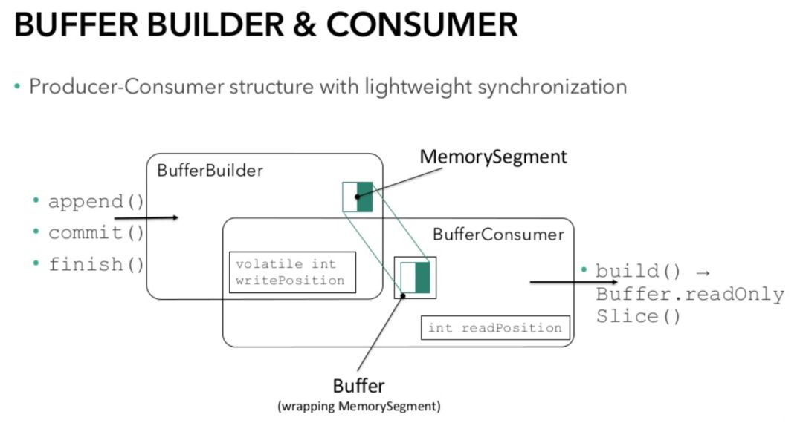

# Flink 传输机制与网络栈

## Flink 传输机制

数据传输涉及的两个对象：

1、JobManager：master 节点，负责任务调度，异常恢复，任务协调，并且通过 ExecutionGraph 这样的数据结构来保存一个作业的全景图。
2、TaskManager：工作节点(worker)，负责将多个任务在并行的线程中执行，每个 TM 中包含一个 CommunicationManager(在 tasks 之间共享) 和一个 MemoryManager (在 tasks 之间共享)。 TM 之间通过 TCP 连接来交换数据。

### Flink 数据传输方式

Flink 的数据传输可以分两种

1、**组件之间的通信消息传输**，即 Client、JobManager、TaskManager 之间的信息传递，采用 Akka 框架(主要用于组件之间的协同，如心跳检测、状态上报、指标统计、作业提交和部署)
2、**算子之间的数据传输**
    1、**本地线程之间的数据传输(同一个 SubTask 中)**：同一个 SubTask 内的两个 Operator(属于同一个 OperatorChain )之间的数据传输是方法调用，即上游算子处理完数据后，直接调用下游算子的 prcessElement 方法。
    2、**本地线程间的数据传输(同一个 TaskManager 的不同 SubTask中)**：即同一个 TaskManager (JVM 进程)中的不同 Task(线程，本质上 SubTask) 的算子之间的数据传输，通过本地内存进行数据传递，存在数据序列化和反序列化的过程。
    3、**跨网路数据传输(不同 TaskManager 的 SubTask 中)** : 采用 Netty 框架，通过 Socket 传递，也存在数据序列化和反序列化过程。

### 算子间的数据传输

算子间的数据传输其实就是上游算子产生输出数据 Intermediate Result（中间结果），下游算子消费 Intermediate Result 的过程。如下图所示。在实际运行时，Intermediate result 由多个 Intermediate Result Partition(IPR 结果分区) 组成，个数由当前算子的并行度决定，每个 ResultPartition 由一个 SubTask 组成；每个 ResultPartition 又由多个 ResultSubpartition（结果子分区）组成，个数由下游算子的并行度决定。每个下游 SubTask 会对应一个 InputGate(输入网管，在 runtime_jobgrap 那个章节我们提到 InputGate 对应ExecutionGraph 的 ExecutionEdge)，InputGate 包含多个 InputChannel(输入通道)，个数由上游算子并行度决定，每个 InputChannel 负责从上游算子对应的 ResultSubPartition 中 poll 数据。

#### 同一个 SubTask

本质是同一个 OperatorChain 中不同算子之间的数据传递。同一个 SubTask内的数据交换是最简单、效率最高的传递形式。如下图所示。
当处于上下游的两个算子处于同一个算子链中(OperatorChain), 在执行的时候就会被调度至同一个 SubTask 中。当上游算子(图中的 Source 算子)在处理完数据后，会通过 Collector 接口调用下游算子的 processElement() 方法继续处理数据。因此，同一个 SubTask 内的数据传输是直接通过调用 Java 方法实现的 ，是在一个线程内执行普通的 java  方法，不需要数据序列化写入共享内存、下游读取数据再反序列化的过程，节省了前程切换的开销。

#### 同一个 TaskManager 的不同 SubTask

同一个 TaskManager（JVM 进程）内部的不同 SubTask(线程)之间的数据流传输。两个 SubTask 之间共享同一个 Buffer Pool，通过 wait()/notifyAll() 来同步，InputGate 负责读取 Buffer。

1、没有 Buffer 可以消费时，下游算子的 SubTask A 线程被阻塞(通过 InputGate 中的 inputChannelWithData.wait() 方法阻塞)。
2、上游算子的 SubTask B 线程写入结果数据到 ResultPartition，并 flush 到 Buffer。
3、唤醒下游算子的 SubTask A 线程（通过 inputChannelWithData.notifyAll()方法唤醒）。
4、线程被唤醒后会从 Buffer 中读取数据，经过反序列化后，传递给 Operator 中的用户代码逻辑处理。

#### 不同 TaskManager 之间的 SubTask
不同的 TaskManager 之间的数据传输就用到了本章节下面要重点讲解的网络栈。概要图如下图所示：
 

每个 TaskManager 中都会有 Network Stack 这样一个网络栈，Flink 使用它来完成不同 TaskManager 之间的数据交互，所有的 Task 都会接入这样一个 Network Stack 进行数据交互，进而帮助上层的作业去实现物理层面的数据的交互，包括像执行一些 shuffle 的算子和一些 Reblance 的算子，这些算子都会将 Task 的数据路由到下游的不同的 Task 之间，这里就需要借助 Network Stack 进行网络上的交互

## Flink 网络栈

Flink 的网络栈是 flink-runtime 模块的核心组件之一，也是 Flink 作业的核心部分。所有来自 TaskManager 的工作单元(子任务)都要通过它来相互连接。你的流式传输数据都要经过网络栈，所以它对 Flink 作业的性能表现(包括吞吐量和延迟指标)至关重要。与通过 Akka 使用 RPC 的 TaskManager 和 JobManager 之间的控制通道相比，TaskManager 之间的网络依赖是更底层的，基于 Netty 的 API。

### 逻辑视图

Flink 的网络栈在相互通信时(例如在 keyBy() 要求的 Shuffle 期间) 对子任务的逻辑视图如下所示：

每个 Vertex 在执行层会被视为一个 Task，而一个 Task 对应多个 SubTask, SubTask 的数目既是用户对当前算子设置的并行度。SubTask 根据 Flink 的调度策略和具体的部署环境及配置，会被分发到相同或者不同的机器以及进程成。其中有上下游依赖关系的 SubTask 会有数据传输的需要，这是通过基于 Netty 的 Network Stack 来完成的。

Network Stack 主要包括三项内容，Subtask 的输出模式(数据集是否有界、阻塞或非阻塞)，调度类型(立即调度，等待上一个阶段完成和等待上一阶段有输出)和数据传输的具体实现(buffer 和 buffer timeout)

这三个基本概念的描述如下：
* 子任务输出类型(ResultPartitionType):
  * **Pipelined(有限或者无限)**：一旦产生数据就可以持续向下游发送优先数据流或者无限数据流。
  * Blocking：仅在生成完整结果后向下游发送数据。

* 调度策略：
  * **一次性(Eager)**：同时部署作业的所有子任务(用于流式作业)
  * **上游产生第一条记录部署下游(Lazy)**:一旦任何生产者完成任何输出，就立即部署下游任务
  * **上游完成完整数据部署**，下游：当任何或所有生产者生成完整数据后，部署下游任务。

* 数据传输
  * **高吞吐**：Flink 不是一个一个地发送记录，而是将若干记录缓冲到其网络缓冲区并一次性发送它们。这降低了每条记录发送的发送成本因此提高了吞吐量。
  * **低延迟**：当网络缓冲区超过一定的时间为被填满时会触发超时发送，通过减小超时时间，可以通过牺牲一定的吞吐来获取更低的延迟。

我们将在下面深入 FLink 网络协议栈的物理实现时看到有关吞吐延迟的优化。对于这一部分，我们详细说明输出类型与调度策略。首先，需要知道的子任务的输出类型和调度策略是紧密关联的，只有两者的一些特定组合才是有效的。

Pipelined 结果是流式输出，需要目标 Subtask 正在运行以便接收数据。因此需要在上游 Task 产生数据之前或者产生第一条数据的时候调度下游目标 Task 运行。批处理作业生成有界结果数据，而流式处理作业产生无限结果数据。

批处理作业也可能以阻塞的方式产生结果，具体取决于所使用的的算子和连接模式。在这种情况下，必须等待上游 Task 先产生完整的结果，然后才能调度下游的接收 Task 运行。这能够提高批处理作业的效率并且占用更少的资源。

下标总结了 Task 输出类型以及调度策略的有效组合

| 输出类型   |  调度类型   | 应用到.. |
| --------- | -----     | ------|
| 流水线，无界| 一次性    | 流式作业 |
|            |第一个输出的下个阶段 | N/A(1) |
| 流水线，有界| 一次性    | N/A(2) |
|           | 第一个输出的下个阶段  | 批处理作业 |
| 阻塞      | 完整输出的下一个阶段    | 批处理作业 |

* [1]目前 FLink 尚未使用
* [2] 批量/流式统一完成后可能对流式作业可用。

### Flink Network Buffer 的整体架构图及物理传输

#### 整体架构图

整体架构图如下所示：

从上图中可以看到 Network Stack 主要涉及一下几个组成部分：TaskManager 之间会建立相应的 TCP 连接，TCP 连接主要依赖 Netty 的通信框架，如果是TaskManagere 坐在节点是上游节点，在 TaskManager 内部会创建一个 NettyServer ，下游节点会创建一个 Netty Client 。TaskManager 里面所有的 Task 如果需要跟其他 TM 通信的话，都需要通过这样对对 Netty Server/Client 组合，也就是说 TM 之间通过 Netty 组件维护这样一个 TCP 通道，Task 与 Task 之间借助这个通道来进行相应的数据交互。
TaskManager 1 中有 Task A-1 任务和 Task A-2 任务两个 Task 节点。对于 Task A-1 节点，数据通过算子处理完成之后，通过 RecordWriter 这样一个组件写入 ResultPartition 中，ResultPartition 有 ResultSubpartition，上面已经提过了，TaskManager 中有 Local Buffer Pool 组件，而 ResultSubpartition 中有个一个 Buffer 的队列(应该是链表)，该队列所包含的 Buffer 的资源都是通过 Local Buffer Pool 申请而来。Local Buffer Pool 本身既是内存的一些资源，也即是后面会讲到的 Flink 的 MemorySegment(默认 32K 的大小)，RecordWriter 将数据序列化后写入这个一个 Buffer 中，当一个 Buffer 写满之后会加入 ResultSubpartition 的队列中，下游算子一旦可以去消费上游数据的时候，上游会有一个 Reader (新版本叫 InputOperator)到这个队列中消费和读取队列中 Buffer 数据，最终该数据会传输到下游的 Netty Client 中，Netty Client 对应了 Task Manager 中的 InputGate，InputGate 中包含了 InputChannel。InputChannel 跟 Netty 中的 Channel 是对应的，这里其实应该是通过零拷贝的方式将 Netty Channel 中数据拷贝的 InputChannel 中，此时下游的 Operator 的 StreamTaskInput 就会读取到上游所发送的消息。下游的节点也有一个 Local Buffer Pool ，下游 StreamTaskInput 去申请一个 Buffer 来存储接收到的二进制数据，然后传给相应的算子。

下面我们可以参考另外一副 Network Stack 的架构图，针对改图，我们从另一方面来看看 Network Stack 整体的架构

#### 物理数据传输

为了理解物理数据连接，请回想一下，在 Flink 中，不同的任务可以通过 Slotsharing Group 共享相同的 Slot。TaskManager 还可以提供多个 Slot，允许将同一个任务的多个子任务调度到同一个 TaskManager 上。

对于下图所示的示例，我们假设 2 个并发为 4 的任务部署在 2 个 Task Manager 上，每个 TaskManager 有 2 个 slot。 TaskManager1 执行子任务 A.1, A.2 和 B.1，B.2, TaskManager2 执行子任务A.3, A.4 和 B.3，B.4。在 A 和 B之间是 Shuffle 连接类型，比如来自 A 的 keyBy() 操作，在每个 TaskManager 上又会 2x4 个逻辑连接 (2 个 a1-a2 multi b1-4), 其中一些是本地的(本地的是怎么进行交互的，第一大章节有描述)，另一些是远程的：

| 输出类型   |  B.1/B.2  |  B.3/B.4|
| ---------| -----     | ------|
| A.1/A.2  | 本地      | 远程   |
| A.3/A.4  | 远程      | 本地   |

不同远程任务之间的每个网络连接将在 Flink 的网络堆栈中获得自己的 TCP 通道。但是，如果同一个任务的不同子任务被调度到同一个 TaskManager，则他们与同一个 TaskManager 的网络连接将多路复用的方式共享同一个 TCP 信道以减少资源使用。在我们的例子中，这适合于 A.1->B.3 和 A.1->B.4， 以及 A.2->B.3 和 A.2->B.4, 如下所示：

每个子任务的输出结果称为 ResultPartition，每个 ResultPartition 被分成多个单独的 ResultSubpartition-每个逻辑通道一个。Flink 的网络协议栈在这一点的处理上， 不再处理单个记录，而是把一组序列化的记录填充到网络缓冲区进行处理。

##### 造成背压(1)

物理层面 FLink 并不会维护 Subtask 级别的 TCP 连接，Flink 的 TCP 连接时 TaskManager 级别的。对于每个 SubTask 来说，根据 key 的不同，它可以输出数据到下游任意的 Subtask，因此 SubTask 在内部会维护下游 substak 数量的发送队列，相应地，下游 Subtask 也会维护上游 subtask 数目的接收队列 （这两个数目相等，都是等于算子的并行度）。一个 TaskManager 上的不同的 Subtask 的数据传输会通过 Netty 的多路复用和分用跑在一条 TCP 连接上。

每当子任务的发送缓冲池耗尽时————也就是缓存驻留在 ResultSubpartition 的缓存队列中或者更底层的基于 Netty 的网络栈时————生产者就被阻塞的了，无法继续工作，并承受背压(下游消费满，上游生产快，上游发送端的 netty buffer 都被占满又不能丢弃，所以就有背压)。接收器也是类似，较底层网络栈中传入的 Netty 缓存需要通过网络缓冲区提供给 Flink 的 InputGate。如果相应子任务的缓冲区没可用的网络缓存， Flink 将在缓存可用前停止从该 Netty Channel 中读取，直到 Buffer 可用。
通俗的来说就是 这种实现的问题在于当某个 SubTask 出现反压时，反压不仅会作用于该 Subtask 的 Channel，还回误伤到这个 TaskManager 上的其他 SubTask，因为整个 TCP 连接都被阻塞了。

这将反压多路复用上的所有发送子任务，因此也限制了其他接收子任务。
下图说明了过载的子任务 B.4, 它会导致多路复用的反压，也会导致子任务 B.3 无法接收和处理数据，即使 B.3 还有足够的处理能力。通俗来说就是因为 B.4 的一个 Channel 没有空闲的 Buffer，使用同一个连接的其他 3 个 Channel 也无法通信。

为了防止这种情况发送，Flink 1.5 引入了基于 Credit-based 流量控制机制。

#### Credit-based 流量控制

Credit-Based 流量控制可确保发送端已经发送的任何数据，接收端都有足够的能力(Buffer)来接收。新的流量控制截止基于网络缓冲区的可用性(被称为 credit),作为 Flink 之前机制的自然延伸。每个远程输入通道(RemoteInputChannel)现在都有自己的一组独占缓冲区(Exclusive buffer), 而不是只有一个共享的本地缓冲池(Local Buffer Pool)。与之前不同，本地缓冲池中的缓冲区被称为流动缓冲区(Floating buffer)，因为它们会在输入通道间流动并且可用于每个输入通道。

数据接收方会将自身的可用 Buffer 作为 Credit 告知数据发送方(1 个 buffer = 1 个 credit)。每个 Subpartition 会跟踪下游接收端的 Credit (也就是可用于接收数据的 Buffer 数量)。只有在相应的通道(Channel) 有 Credit 的时候 Flink 才会向更底层的网络协议栈发送数据 (以 Buffer 为粒度)，并且没发送一个 Buffer 的数据，相应的通道上的 Credit 会减1。除了发送数据本身外，数据发送端还回发送相应 Subpartition 中有多少正在排队发送的 Buffer 数(称之为 Backlog) 给下游。 下游数据接收端利用这一信息(Backlog) 去申请合适数量的 Floating Buffer 用于接收发送端的数据，这可以加快发送端堆积数据的处理。 接收端首先申请和 Backlog 数量相等的 Buffer，但可能无法申请到全部，甚至一个都申请不到，这时接收到会利用申请到的 Buffer 去进行数据接收，并监听是否有新的 Buffer 可用。

Credit-based 的流控使用 Buffers-per-channel 来指定每个 Channel有多少独占的 Buffer，使用 Floating-buffers-per-gate 来指定共享的本地缓冲池(Local Buffer pool)大小，通过共享本地缓冲池，Credit-based 流控可以使用的 Buffer 数目可以达到与原来非 Credit-based 流控相同的大小。这两个参数默认值是被精心选取的，以保证新的 Credit-based 流控在网络健康延迟正常的情况下至少可以达到与原策略相同的吞吐。可以根据实际的网络 RRT(round-trip-time)和带宽对这两个参数进行调整，示意图如下：

通俗地说，在接收端 Buffer 被划分成 Exclusive Buffer 和 Floating Buffer 两种，前者是固定分配到每个接收队列里面的，后者是在 SubTask 级别的 Buffer Pool 里供动态分配。发送队列里的数据称为 Backlog，而接收队列里的 Buffer 称为 Credit。Credit-Based 数据流控制原理的核心思想是根据接收端的空闲 Buffer 数(即 Credit)来控制发送速率，这和 TCP 的速率控制时分类似，不过是作用在应用层。

如上图所示，假设当前发送队列的 Backlog 的大小是 5，而接收队列有 2 个空闲 Credit。首先接收端会通知发送端可以发送 2 个Buffer，这个过程称为 Announce Credit。 随后发送端接收到请求后将 Channel Credit 设置为 2，并发送 1 个 Buffer（随后 Channel Credit 减为 1），并将剩余 4 个 Backlog 的信息随着数据一起发送给接收端，这两个过程分别称为 Send Buffer 和 Announce Backlog size。接收端收到 Backlog Size 之后会向 Buffer Pool 申请 Buffer 以将队列拓展至可容纳 Backlog Size 的数据，但不一定会全部拿到。因为队列目前有一个空闲 Buffer， 因此只需要向 Buffer Pool 申请 3 个 Buffer。假设 3 个Buffer都申请成功，他们称为 Unannounced Credit，并在下一轮请求中被 Announce。
当一条 Channel 的发送端的 Announced Credit 与接收端的 Unannounced Credit 之和不小于 Backlog Size 时，该 Channel 处于正常状态，否则处于反压状态。

#### 造成背压(2)

相比没有流量控制的接收器的被压机制，信用机制提供了更直接的控制；如果接收端的处理速度跟不上，最终它的 credit 会减少到 0 ，此时发送端就不会再向网络中发送数据(数据会被序列化到 Buffer 并缓存到发送端)。由于反压只发生在逻辑链路上(相对于 TM 的 Netty 物理链路)，也就不会影响其他的接收者接收和处理数据。

#### Credit-based 的优势与问题

通过流浪控制，多路复用链路中的信道就不会阻塞链路中的另一个逻辑信道，提升了整体的资源利用率。此外，我们还能通过完全控制正在发送的数据量来改善 checkpoint align 的情况，如果没有流量控制，通道需要一段时间内次才能填满网络堆栈的内部缓冲区，并广播接收器已经停止读取的消息。在这段时间里，大量的 Buffer 不会被处理，任何 Checkpoint barrier(触发 Checkpoint 的消息)都必须在这些数据 Buffer 后排队，因此必须等到所有这些数据都被处理后才能够触发 Checkpoint。

但是来自接收方的附加通告消息(向发送端 Announce Credit)可能会产生一些额外的开销，尤其是在使用 SSL 加密通信的场景中。此外，单个输入通道(Input Channel) 不能使用缓冲池中的所有 Buffer, 因为存在无法共享的 Exclusive Buffer。新的流控协议也有可能无法做到立即发送尽可能多的数据(如果生成数据的速度快于反馈 credit 的速度)，这时则可能增加发送时间。虽然这可能会影响作业的性能，但是由于其所拥有的优点，通常新的流控会表现的更好。可能会通过增加单个通道的 Exclusive Buffer 数量，这会增大内存开销。然后，与之前的实现相比，总体内存的使用可能仍然会降低，因为底层的网络协议栈不再缓存大量的数据，因为们总是可以立即将其传输到 Flink（一定有相应的 Buffer 接收数据）。

在使用新的 Credit-based 流量控制时，可能还会注意到另一件事：由于我们在发送方和接收方之间的缓冲较少数据，反压可能会来的更早。然后，这正是我们所期望了，因为缓存更多数据并没有真正获得任何好处。如果要缓存更多的数据并且保留 Credit-based 流量控制，可以考虑通过增加输入共享 Buffer 的数量。

从总体上讲，Credit-based 数据流控制避免了阻塞 TCP 连接，使得资源可以更加充分利用，另外通过动态分配 Buffer 和拓展队列长度，可以更好地适应生产环境中的不断变化的数据分布及其带来的 Channel 状态抖动，也有利于缓解部分 Subtask 遇到错误或者处理速率降低造成的木桶效应。然后在这个新的机制也会带来额外的成本，即每传输一个 Buffer 要额外一轮 Announce Credit 请求来协商资源，不过从官方的测试来开看，整体性能是有显著提升的。

**优势**

* 通过多路复用连接中的数据倾斜提升资源利用率
* 改善了 Checkpoint Align
* 减少内存占用(较底层网络中的数据更少)

**劣势**

* 额外的信用通知消息(announced credit request)
* 额外的 backlog 通知消息(缓存消息附带，几乎没有开销)
* 潜在的往返延迟
* 背压出现的更早

### Flink Network Buffer 的内部数据流转

本章节我们来详细描述下在 StreamTask 内部，数据流转是如何进行的

通过上图我们知道，不论是Netty 还是 Local 传输过来的数据，都是经过 StreamTaskNetworkInput 这个组件接入到 StreamTask 中，StreamTaskNetworkInput 是 StreamOneInputProcessor 的内部组件，当然还有 StreamTwoInputProcessor，都实现了 StreamInputProcessor 中，StreamTaskNetworkInput 包含了 InputGate 组件，在之间讲述 ExecutionGraph 的时候，我们知道 Flink 根据 ExectionEdge 创建出来 InputGate，里面包含了1-N InputChannel，这是根据下游的算子的并行去计算和生成的，InputChannel 接收 network 和 local 发送过来的数据，InputChannel 我们上面讲过，会向 Local Buffer Pool 申请 Buffer 空间，将数据写入 Buffer 后，将 Buffer 存储到 InputChannel 的队列中，达到了对相应数据的缓存，缓存的目的之一是为了避免上下游之间数据生成速率大于下游数据消费速率的时候出现反压的情况(这个在下文的关于反压的情况2 有进一步描述)，能尽可能地保证数据有效的传输。

Network Input 之后，会通过一个 NetworkOutput 组件，把 Input 中接收到的传输到 operator chain 的 head 节点上。整个组件被称为 StreamOneInputProcessor，同理同时接收两个管道数据的话就是 StreamTwoInputProcessor（？？）。
StreamOneInputProcessor  属于 StreamTask ，StreamTask 创建该组件后，该组件就会在 StreamTask 的线程模型中不断的轮询 InputChannel 中是否有数据写入，如果有数据写入，则通过 StreamTaskNetworkOutput 写入到 chained operator 中的 head operator。然后 chained operator 通过 chain output 进行处理和传递到下游，该操作是一个 push 的操作(个人认为就是 java 中的普通方法调用)，最终会通过 RecordWriterOutput 中 RecordWriter 序列化后写入网路，
每个 chained operator 都会包含 RecordWriter 组件。RecordWriter 将数据写入 前面提到的 ResultPartition，将数据写入 Buffer 中并将 buffer 缓存在 ResultSubPartition 的队列中，最后由 NettyServer 提供一个 Reader 去进行消费和处理，最后发送到 Network 或者本地环境中

总结：
以上就是整个 StreamTask 内部数据流转的过程，外部数据接入到 InputGate 中，通过 StreamTaskNetworkOutput 写入到 operator chain 中。 operator chain 经过 头结点以及其他下游节点的处理，最后通过 RecordWriter 写入到网络或者本地环境中。

### Flink Network Buffer 的数据交互详情

#### TM 之间数据交互详情
Task Manager 之间的数据交互详情如下图所示：

从图中我们可以看到 Task Manager 之间的 TCP 通道是通过 Netty 来构建的，上游是 Netty Server，下游是 Netty Client。上游 Operator 处理完成的数据，最终会通过 RecordWriter 写入到 ResultSubPartition 中，ResultSubpartition 本身维护了一个 Buffer 的队列，ResultPartition 跟之前我们提到的 ExecutionGraph 中的 IntermediateResult 是一一对应的，会生成和创建出来相应的 SubPartition，那么 SubPartition 的队列中的 Buffer 存储空间时从哪里来的，其实就是从 Local Buffer Pool 中申请来的，Local Buffer Pool 所需要的存储空间是来自于后面会讲述的 由 TaskManager 统一管理的 一个叫 Network Buffer Pool。Network Buffer Pool 会向 Local Buffer Pool 提供对应的存储空间，每一个 Task 内部都有一个自己的 Local Buffer Pool，会向 Network Buffer Pool 申请 Buffer。

Operator 的 RecordWriter 的序列化器生成的二进制数据，写入向 LocalBufferPool 申请的 Buffer 中，并最终加入 ResultSubPartition 的 队列中，此时数据并未发送到下游，下游的算子如果 ready 了的话，也就是具有 credit 信用值(空闲的 Buffer)的时候，会主动发起上文说的 Credit 请求。会在 Netty Server 中调用 ViewReader 。ViewReader 会到相应的 ResultSubPartition 中进行消费，将数据从队列中读取出来，通过 TCP 管道发送到下游。这个发送过程或涉及到 Buffer 数据的转换，该转换只是一个数据的迁移，从 ResultSubPartition 的队列中 迁移到 Netty 的 Netty Buffer Pool 中，Flink 的 Buffer Pool 和 Netty Buffer Pool 的底层实现方式一致，也会实现对应数据的零拷贝，他们之间是不需要经过序列化和反序列化。

一旦上游的 Buffer 数据完全消费并通过 TCP 管道发送出去，就会对上游的 Local Buffer Pool 里面所申请到  Buffer 空间进行释放，这就是一个对 Buffer 空间金回收的过程，回收之后空的 Buffer 会回收到 Local Buffer Pool 中，以供下一个算子的使用。

下游同样如此，通过 TCP 的 Netty 管道接收过来的时候，是一个 Netty Buffer，然后再进行零拷贝，转入到 Local Buffer Pool 所申请的 Buffer 空间中，此时的 Buffer 会加入 InputGate 的 InputChannel 的队列，此时 InputProcessor(StreamOneInputProcessor) 监听这个队列，将该队列中的数据进行 poll 拉取操作，一旦拉取完成，会将该 Buffer 空间进行回收。

从上述描述我们可以看出，从上游到下游之间的网络数据传输都是二进制的形式，是网络带宽占用最低的。InputPorcessor 里面会对数据进行反序列化操作，在 JVM 中就反序列化成对象或者用户自定的 POJO 对象，然后调用用户作业的 process 方法。

调用完 用户作业的 process 之后，会再次写入网络中，这就是整个 TM 之间网络数据交互的核心概念

#### 将记录写入网络缓冲区并再次读取它们

下面的视图比之前的级别更好一些，其中包含网络协议栈及其周边组件的更多详细信息，从发送算子发送记录(Record)到接收算子获取它：

在生成 record 并将其传递出去之后，例如通过 Collector#collect(), 它将被传递给 RecordWriter，RecordWriter 会将 Java 对象序列化成字节序列，最终存储在 Buffer 中，按照上面所描述的在网络协议栈中处理。RecordWriter 首先使用 SpanningRecordSerializer 将 Record 序列化为灵活的堆上字节数组。然后，它(serializer)尝试将这些字节写入目标网络 Channel 的 Buffer 中。

在接收方，网络底层协议栈(Netty)将接收到的 Buffer 写入相应的输入通道(就是上面提到的 InputGate 中的 Input Channel)。流任务的线程(InputProcessor)最终从这些队列中读取并尝试在 RecorderReader 的帮助下通过 SplilingAdaptiveSpanningRecordDeserializer 将累计的字节反序列化为 Java 对象。与序列号器类似，这个反序列化器还必须处理特殊情况，例如跨越多个网络 Buffer 的 Record，或者因为记录本身比网络缓冲区大(默认情况下为 32 KB，通过 taskmanager.memory.segment-size 设置)或者因为序列化 Record 时，目标 Buffer 中已经没有足够的剩余空间保存序列化后的字节数据，着这种情况下，Flink 将使用这些字节空间并继续将其余字节写入新的网络 Buffer 中。

##### 将网络 Buffer 写入 Netty

在上图中，Credit-based 流控机制实际上位于 "Netty Server" 和 ("Netty Client") 组件内部，RecordWriter 写入的 Buffer 始终以空状态(无数据)添加到 Subpartition 中，然后珠江向其中填写序列化后的记录。
但是 Netty 在什么时候真正的获取并发送这些 Buffer 那？显然，不能是 Buffer 只要有数据就发送，因为跨线程(写线程与发送线程，Worker Thread vs IO Thread）的数据交换与同步会造成大量的额外开销，并且会造成缓存本身失去意义(如果是这样的话，不如直接将序列化后的字节发送到网络上而不必引入中间的 buffer)。在 Flink 中，有三种情况可以使 netty  服务器端使用(发送)网络 Buffer：

* 写入 Record 时 Buffer 变满，或者
* Buffer 超时未被发送，或者
* 发送特殊消息，例如 Checkpoint barrier

**在 Buffer 满之后发送**

RecordWriter 将 Record 序列化到本地的序列化缓存中，并将这些序列化后的字节逐渐写入相应 Result subpartition 队列中的一个或多个网络 Buffer 中。虽然单个 RecordWriter 可以处理多个 Subpartition, 但是每个 Subpartition 只会有一个 RecordWriter 向其写入数据。另一方面，Netty 服务端线程会从多个 Result subpartion 中读取并像上面所说的那样将数据写入适当的多路复用信道。这是一个典型的生产者-消费者模型，网络缓冲区位于生产者和消费者之间，如下图所示。在(1) 序列化和 (2) 将数据写入 Buffer 之后，RecordWriter 会相应地更新 Buffer 的写入索引。一旦 Buffer 完全填满，RecordWriter 会 (3) 为当前 Record 剩余的字节或者下一个 Record 从其本地缓冲池中获取新的 Buffer，并将新的 Buffer 添加到相应的 Subpartition 的队列中。这将 （4）通知 Netty  服务端线程有心的数据可发送(如果 netty 还不知道有可用的数据的话 4)。每当 Netty 有能处理这些通知时，它将 （5）从队列中获取可用的 Buffer 并通过适当的 TCP 通道发送它。（就像我家瓜地的西瓜全部熟了，我通知收瓜贩子，收瓜贩子在有能力的时候，开卡车把我家瓜地里面成熟的西瓜通过高速公路发送走）。注意这里的第 5 步包含了上面说的 recycle 的过程，也即是 Netty Server 再将 Buffer 中的数据发送出去之后，会将 buffer 清空并重新放入 Local Buffer Pool 中，以供下一个算子使用。

**在Buffer 超时后发送**

为了支持低延迟应用，我们不能直等到 Buffer 满了才向下游发送数据。因为可能存在这种请看，某种通信信道没有太多数据，等到 Buffer 满了再发送会不必要地增加这些少量 Record 的处理延迟。因此， Flink 提供了一个定期 Flush 线程 (the output flusher) 每隔一段时间都会将任何缓存的数据全部写出。可以通过 StreamExecutionEnvironment#setBufferTimeout 配置 Flush 的间隔，并作为延迟 5 的上线(对于低吞吐量通道)。下图显示了它与其他组件的交互方式：RecordWriter 如前所述序列化数据并写入网络 Buffer，但同时，如果 Netty 还不知道有数据可以发送，Output Flusher 会(3,4) 通知 netty 服务端线程数据可读取（类似上面的“buffer已满”的场景）。当 Netty 处理此通知(5) 时，它将消费(获取并发送) Buffer 中的可用数据并更新 Buffer 的读索引。Buffer 会保留在队列中，下次读取从上次 Netty 服务器的上次读索引开始。(这里，我仍然觉得，如果如果 Buffer 已经被读取完毕，会被重新放入 local buffer pool 以供下个 Operator 使用)

严格来说，Output flusher 不提供任何保证——它只向 Netty 发送通知，而 Netty 线程会按照能力与意愿进行处理。这也意味着如果存在反压，则 Output flusher 是无效的。(我跟瓜贩子打电话说时间到了，你需要来收瓜，但是丫比较忙，暂时处理不了我的瓜，我的通知也是无效的)

**特殊消息后发送**

一些特殊的消息如果通过 RecordWriter 发送，也会触发立即 Flush 缓存的数据。其中最重要的消息包括 Checkpoint barrier 已经 end-of-partition 事件，这些事件应该尽快被发送，而不是应该等待 Buffer 被填满或者 output-flusher 的下一次刷新。

**Netty Server的处理**
以实时作业为例子，与 Netty 组件直接交互的是 StreamRecordWriter 和 StreamRecordReader(现已被 StreamWriter 和 StreamInputProcessor 代替），前者负责将 Subtask 最终输出用的 StreamRecord 包装的数据序列化为字节数组并交个 Netty Server，后者负责从 Netty Client 读取数据并反序列化为 StreamRecord。

Netty Server 会分配额外的线程来读取该 Buffer 到其已写的位置并将相关内容发送，其后未写满 Buffer 会及继续停留在 Channel 中等待后续的写入。

#### BufferBuilder 和 BufferConsumer

上述的 RecordWriter 和 OutputFlusher 主要有 2 个问题：
一是 OutputFlusher 和 StreamRecordWriter 主线程在 Buffer 上有竞争条件，因此需要同步操作，当 Channel 数量很多时这会带来性能上的损耗；二是当我们需要延迟尽可能小的时候，会将 timeout 设为 0 (实际上提供了 flushAlways 选项)，然后每写一条记录就 flush 一次，这样会带来很高的成本，最坏的情况下会造成 Netty Server 频繁触发线程来读取输入，相当于为每个 Buffer 设置了一个 event loop。一个简单的优化想法是，既然 Netty Server 本来就有 event loop, 为什么不让 Netty 线程自己去检测有没有新数据那？因此 Flink 1.5 版本重构了这部分架构，弃用了要求同步的 OutputFlusher 线程，改为用 StreamRecordWriter 和 Netty 线程间的非线程安全交互方式来提高效率，其中核心的设计是 BufferBuilder 和 BufferConsumer

BufferBuilder 和 BufferConsumer 以生产者消费者的模式协作，前者会被 StreamRecordWriter 调用来写入 Buffer，后者会被 Netty Server 线程调用，两者均通过 volatile int 类型的位置来交换信息。通过这种方式，StreamRecordWriter 不会被 OutputFlusher 阻塞，资源利用率很高，网络传输的吞吐量和延迟均可受益

## 结论

现在你了解了 ResultPartition、批处理和流式传输的各种网络连接和调度类型。你还了解了基于信用的流量控制以及网络栈的内部工作机制，知道怎么调整网络相关的参数，知道怎么判断某些作业行为。
后面的章节我们将基于这些知识探讨更多细节，比如需要查看相关指标，进一步的网络调整以及要避免的常见反模式。

## 参考文章

https://flink.apache.org/2019/06/05/a-deep-dive-into-flinks-network-stack/
https://www.infoq.cn/article/iDW_IgYKLy724YhKgQbk
https://cloud.tencent.com/developer/article/1485660
https://zhuanlan.zhihu.com/p/522166917
