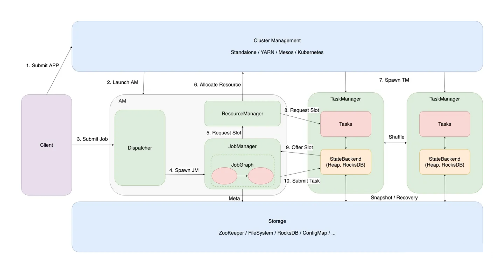

# Flink RunTime 整体架构

Flink 是一个分布式系统，需要有效分配和管理计算资源才能执行流式应用程序。它集成了所有常见的集群资源管理器，例如 Hadoop YARN，但也可以作为独立集群甚至库运行。

## 官方整体架构图

整体架构包含了 3 部分：
* Client
* JobManager(Master)
* TaskManager(Worker)

### 官方架构图解读

Client 的主要作用是对于我们用户编写的 Code ，也就是应用的代码会在客户端进行相应的优化和编译(Optimizer/Graph Builder) 产生 dataflow 的 graph, 也就是我们后面会提到的 Stream Graph ，Stream Graphy 会被编译成对应的 Job Graph，然后再通过 图中 Client 客户端。而上图中的客户端就是跟我我们集群中 Job Manager 相关联的客户端，该客户端的名称叫 Cluster Client, 它会通过 Actor System 进行 RPC 的远程通信，Akka 之间会进行这样一个远程连接，把对应的作业，也就是我们创建出来的 JobGraph 对象 提交到集群上面并且运行起来。
运行起来之后，会发现在整个 Job Manager 里面，一个 Job Graph 会绑定一个 Job Manager，下面的 Runtime 详情会更清楚地说明这点。Job Manager 会负责提交过来的整个 Job Graph 的管理，它里面会有相应的调度性的工作和 Checkpoint Coordinator 的协调性工作

Job Manager 会跟 Task Manager 交互，也是通过 Actor System 这样一种 RPC 远程通信的方式去做，Job Manager 会对轨交过来的作业进行资源的申请，而 Slot 就是每个 Task Manager 里面的计算计算资源，类似于 Hadoop Yarn 里面的 Container 一样，它其实是一个资源的卡槽。同时 Job Manager 会通过 Schedule 调度 Task，而被调度的 Task 会被分发到 指定的 Task Manager 的 slot 里面执行起来，这时会产生一个 Task Slot 的线程，这样我们就把 job graph 里面的作业拆分成更细粒度的 Task 去调度/执行起来, 最终完成 Job 的运行。

下面我们通过一个更详细的 Rumtime 整体架构设计图来分模块讲解：

## Rumtime 整体架构设计——按模块划分

整体架构图如下：

也可以参考 架构图2 ，跟上图不一样的地方在于下图增加了 MetaData 的存储和 checkpoint snapshot 的存储支持

这个架构图跟上面不一样的地方在于，我们这里把 Application Master (AM)进行了细化, 出列 Job Manager 之外还有 Dispatcher 和 ResourceManager ，而 Worker 节点就是 TaskManager 节点的管理
最下面的是 Cluster Management ，也就是我们的集群资源管理器，利用 Yarn Session Client 或者 Kubernetes Client 来提交对应的作业，这种模式就是我们说的 native 模式。也就是资源是按需分配的

这种作业在提交的时候，会先到 Cluster Management 上面进行启动，图中以 Session 集群为例，提交到 Cluster Managerment 上面进行资源的申请，这些都是在客户端完成的，比如连接到 Hadoop Yarn 上面的话，其实就是申请的 Yarn 里面的 Container 资源，如果是 Kubernetes 的话，就是申请的 K8s 的 Pod资源，这个申请资源的作用主要是为了去启动 Application Master ，也即是我们的管理节点。我们知道 Hadoop Yarn 里面也有一个 Application Master ，其实这里的 AM 跟 Hadoop Yarn 里面的原理是类似的，只是属于不同的系统而已。

对于 AM 中的 Dispatcher 组件和 Resource Manager 组件，是在集群 AM 启动的时候，就会被拉起来。 

Dispatcher 组件的作用是
接收客户端提交的作业，Dispatcher 有一套远程的 RPC 通信的机制，也即是第一张架构图的 Actor System，Dispatcher 会实现 RpcEndpoint 也就是我们接入的入口节点，Dispatcher 本身就是一个 RPC 节点，Client 连接到 Dispatcher 进行 JobGraph 的提交，然后 生成和实例化出来 JobManager。而 JobManager 是每个作业的管理节点，它负责把提交进来的 JobGraph 生成 ExecutionGraph 这个物理执行图，然后再根据 ExecutionGraph 里面的 Task 节点进行对应的调度，JobManager 里面有个 Scheduler 调度器，把 ExecutionGraph 里面的 Task 调度到 Task Manager 的 TaskSlot 上面

ResourceManager 组件负责了整个集群的资源管理，这个资源主要是 Slot 资源，而 Slot 资源都是 TaskManager 提供出来的，Resource Manager 就是一个资源的管理者，也叫管家。Task Manager 启动之后，会把自己包含多少 slot 的资源注册到 Resource Manager 里面，而 RM 里面有个一个 Slot Manager，它是统一管理 TaskManager 里面所有的 Slot 资源。 Job 提交之后，JobManager 会向 ResourceManager 请求 Slot 资源，而 Resource Manager 会根据当期那资源的分配状况，去决定是否直接给当前的 JobManager 分配 Slot 资源，如果说一个集群时非 native 的 (比如 Standalone) ，Task Manager 是事先先启动而非是按需启动的，然后注册到 ResourceManager ，此时如果取申请 Slot 资源的话，RM 会根据 已经注册获取到的资源直接分配给 JobManager ，然后 TaskManager 会把 slot 资源 offer 到 JobManager 上面。Job Manager 取到这个资源的话，会将相应的 Task 作业和它申请的 Slot 位置，根据申请的 Slot 位置，去提交 Task ，因为 Slot 本身携带了 TaskManager 信息。Task 线程会按照 slot 的资源去启动，去创建相应的一些内存资源 和 一些 CPU Core 的资源，然后整个 task 就可以运行起来

而 native 模式，比如我们 On Yarn 的时候，其实资源是按需分配的，也即是说我们不用的时候， TM 是不启动的， 此时 ResourceManager 只能到 Cluster Management 里面申请，也即是 Yarn Container 或者 Kubernetes Container 资源，资源一旦申请到之后，就会调用相应的脚本去启动 TaskManager，TM 就会在不同的 资源管理器上去启动相应的 TM 实例，启动之后会向 Resource Manager 注册 Slot 资源，后面的流程就跟 上面说的 非 Native 模式一样了

### Runtime 核心组件

* Dispatcher
  * 集群 Job 调度分发
  * 根据 JobGraph 去启动 JobManager(JobMaster是底层物理实现)

* Job Manager
  * 负责一个具体的 Job
  * Scheduler
    * 调度和执行该 Job 的所有 Task。底层叫 Scheduler NG
    * 发出 Slots 资源请求
  * Slot Pool
    * 将从 ResourceManager 申请过来的 slot，放入资源池，当 jobmanager 跑一些任务的时候，优先从本地的资源池获取资源。

* ResourceManager
  * 集群层面资源管理
  * 适配不同的资源管理，ig Yarn, Kubernetes 等
  * 核心组件：Slot Manager

* Task Manager
  * Slot 计算资源提供者

### 集群运行模式

如下图所示:

* Session 模式
  * Runtime组件共享，比如 Dispatcher 和 ResourceManager 以及 WebMonitorEndpoint 组件
  * 资源复用
  * Runtime 中有多个 JobManager，一个 Session 集群可以启动多个 Job Manager 跟 TaskManager 进行交互
  

* Per-Job 模式(现在叫 Flink Job模式)
  * Runtime 集群组件仅为单个 Job 服务
  * 资源相对独立
  * 不支持通过 Dispatcher 和 WebMonitorEndpoint 再去提交 JobGraph 。

### Runtime 各个组件的详细介绍如下

[1.Flink Client 实现原理](runtime_flink_client.md)

[2.Resource Manager 资源管理](runtime_resource_manager.md)

[3.Dispatcher 原理分析](runtime_dispatcher.md)

[4.Job Graph 的提交与运行](runtime_jobgraph.md)

[5.Task 执行与调度、重启与容错](runtime_task.md)

[6.Flink RPC 原理及源码解析](runtime_rpc.md)

// todo：webMonitorEndpoint 原理笔记