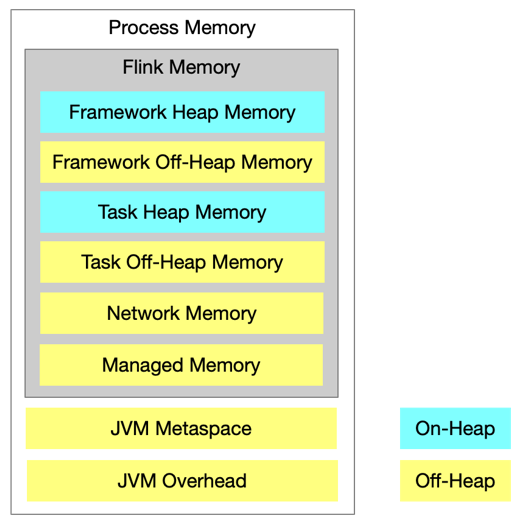
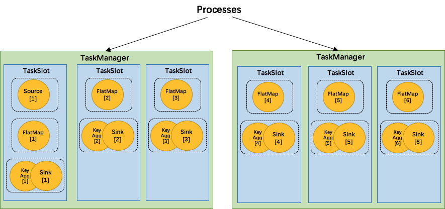

# Resource Manager 资源管理

Resource Manager 资源管理器是资源管理的大管家，对集群的 slot 资源进行集中管理。

## 1.基本概念
___

### 1.1 相关组件

一个 Flink Cluster 是由一个 Flink Master 和 多个 Task Manager 组成的，Flink Master 和 Task Manager 是进程级组件，其他的组件都是进程内组件。重新温故下总章里面的图

一个 Flink Master 中有一个 ResourceManager 及多个 JobManager，Flink Master 中每一个 JobManager 单独管理一个具体的 Job，JobManager 中的 Scheduler 组件负责调度执行该 Job 的 DAG 中的所有 Task，并发出资源请求给 Slot Pool，即整个资源调度的起点； Job Manager 中 Slot pool 组件持有该 Job 的所有资源。另外，Flink Master 中唯一的 ResourceManager 负责整个 Flink Cluster 的资源管理以及与外部调度系统对接，这里的外部调度系统是指 Kubernetes、Mesos、Yarn 等资源管理系统。

Task Manager 负责 Task 的执行，其中的 Slot 是 Task Manager 资源的一个子集，也是 Flink Resource Manager 管理的基本单位，Slot 的概念贯穿资源调度的始终。

### 1.2 逻辑层次

介绍完相关组件，我们需要了解下这些组件之间的逻辑关系，共分为一下 4 层，如下图所示

* Operator
  * 算子是最基本的数据处理单元
* Task
  * Flink Runtime 中真正去执行调度的最小单位
  * 由一些列算子链式组合而成(chained operators)
  (Node: 如果两个 Operator 属于同一个 Task，那么就不会出现一个 Operator 已经开始运行而另一个 Operator 还没被调度的情况。)

* Job
  * 对应一个 Job Graph
* Flink Cluster
  * 1 Flink Master + N Task Managers

资源调度的范畴，实际上是图 2 中红框的内容。刚刚介绍的与资源调度相关的组件中，JobManager、Scheduler 和 Slot Pool 对应于 Job 级别，而 Resource Manager、Slot Manager 和 Task Manager 对应于 Flink Cluster 级别。

在 Operator 和 Task 中间的 Chaining 是指如何用 Operator 组成 Task。在 Task 和 Job 中间的 Slot Sharing 是指多个 Task 如何共享一个 Slot 资源，这种情况不会发生在跨作业的情况中。在 Flink Cluster 和 Job 之间的 Slot Allocation 是指 Flink Cluster 中的 Slot 是如何分配给不同的 Slot 。

### 1.3 两层调度模型

Flink 的资源调度是一个经典的两层模型，其中从 Cluster 到 Job 的分配过程是由 Slot Manager 来完成，Job 内部分配给 Task 资源的过程则是由 Scheduler 来完成。如下图所示，Scheduler 向 Slot Pool 发出 Slot Request (资源请求)， Slot Pool 如果不能满足该资源需求则会进一步请求 Resource Manager，具体来满足该请求的组件是 Resource Manager 里面的 Slot Manager 。

Task 对 Slot 进行复用有两种方式：
* Slot Caching
  * 批处理作业
  * 流作业当中，当发生 Faliover的时候
  * 多个 task 先后/轮流使用 slot 资源
  
  上述 3 种情况，slot pool 是会有空闲的 slot，之前执行的 task 已经完成，退出并释放了这个 slot；或者之前的 job failed 掉，腾出了 slot 资源。这时候如果有有新的 slot 请求，可以直接用 Slot Pool 中已有的 Slot 而不需要向 ResourceManager 请求新的 Slot

* Slot Sharing
  * 多个 Task 在满足一定条件下可同时共享同一个 Slot 资源。下文有 Slot Sharing 的更详细描述

## 2 Flink 1.11.x 的机制与策略

FLink 1.11.x 的资源管理机制与策略是怎么样的？下面我们详细说明下

### 2.1 Task Manager 有哪些资源？

Task Manager 资源分布情况如下图所示：

* 资源类型
  * 内存
  * CPU
  * 其他扩展资源
  * GPU
* TM 资源由配置决定
  * Standalone 集群部署模式下， TM 的资源可能不同，因为 Standalone 所在的机器配置文件可能不一样，导致不同及其的TaskManager 有差异
  * 其他部署模式下，所有的 TM 资源相同

### 2.2 Slot 有哪些资源？

上面说过，资源调度的基本单位是 Slot，而 Slot 中的资源如下所示：

上图说明，Task Executor 中的 部分内存给到了 Slot，而 Framework Head 和 Off-heap 是 Task Manager 框架使用。

Task Manager 的内存分配在 Task Manager 那个章节会详细描述

Task Manager 中有固定数量的 Slot， Slot 的具体数量由配置决定。同一个 Task Manager 上的 Slot 之间没有差别，每一个 Slot 都一样大，即资源一样多。

#### Slot 的计算、管理、分配的总体流程

总体流程图如下

### 2.3 Flink Cluster 有多少 Task Manager

#### Standalone 部署模式

在 Standalone 部署模式下，此时 的 ResourceManager  实现类 为 StandaloneResourceManager。 Task Manager 的数量固定的，如果是 start-cluster.sh 脚本来启动集群，可以通过 手动增加 ${FLINK_DIR}/conf/slaves 来增加 TaskManager。
也可以通过 手动执行  taskmanager.sh 来启动一个 TM 。

#### Active Resource Manager 部署模式
此时的实现类为 ActiveResourceManager,子类包括 YarnResourceManager,KubernetesXXX,MesosXX。
为啥叫 ActiveResourceManager,也叫动态资源管理 ，因为整个集群中  Task Manager 的数量是由 Flink Job 来决定的，按需申请。当然前提我们的资源提供者能够满足所申请的资源。

* Kubernetes，Yarn，Mesos
* 由 SlotManager / ResourceManager 按需动态决定
* 当前 Slot 数量不满足新的 Slot Request 时，申请并启动新的 TaskManager
* TaskManager 空闲一段时间后，超时则释放

Note：On-Yarn  模式部署已经不再支持固定数量的 TM。

### 2.4 Cluster -> Job 资源调度的过程

整体资源调度的过程如下图所示:

* Slot Allocation （上图中的红色箭头）

Scheduler 向 Slot Pool 发送请求，如果 Slot 资源足够则直接分配，如果 Slot 资源不够，则由 Slot Pool 再向 Slot Manager 发送请求（此时即为 Job 向 Cluster 请求资源），**如果 Slot Manager 判断集群中有足够的资源可以满足需求，那么就向 Task Manager 发送 Assign 指令**，告知 Task Manager 其上面的 哪个 Slot 分配给了 Job Manager。然后 Task Manager 会主动提供 Slot 给 Slot Pool(这一步就是图中的 Offer 指令)，Slot Pool 再去满足 Scheduler 的资源请求

(PS: 为啥要设计成 Assign 和 Offer 的过程？这是因为当初设计的时候，想把 Resource Manager 独立出来而不是跟 Job Manager 在同一个进程，这样能够解耦。让 TaskManager 和 JobManager 在没有 ResourceManager 的情况下也能够通过心跳等方式保持通信)

* Starting TaskManagers(上图中的蓝色箭头)

在 Active Resource Manager 资源部署模式下，当 Resource Manager 判断 Flink Cluster 中没有足够的资源去满足需求时，它会进一步去底层的资源调度系统请求资源，由调度系统把新的 Task Manager 启动起来，并且 Task Manager 向 Resource Manager 注册，则完成了新的 Slot 的补充。

其他参考图如下：

根据这个参考图，我们可以得出如下结论：

* Submitting Flink Job 

绿色箭头所指既是 JobManager 的 Scheduler 申请到了slot pool 里面的资源后，Scheduler 将 Task 提交到所申请的 Slot 所在的 TaskManager 上所申请的那个 pool 上，最终返回一个 Task Status 。

总体上 Job 提交就是以上 3 个阶段。主要是对 slot 资源的申请、注册、分配以及整个作业的提交和执行。

### 2.5 Job -> Task  资源调度的过程

* Scheduler 
  * 根据 Execution Graph 和 前序 Task 的执行状态，决定接下来要调度的 Task
  * 发起 SlotRequest, 此时调度器已经将 Task和Slot 绑定在一起
    * Task + Slot > Allocate TaskSlot
  * 决定 Task / Slot 之间的分配，比如可能是 1:N  的关系

* Slot Sharing
  * 目前最主要的一个 调度策略 
  * Slot Sharing Group  中的任务可共用 Slot
  * 默认所有节点在一个 Slot Sharing Group 中
  * 一个 Slot 中的相同的任务(Task)只能有 1 个
* 优点
  * 运行一个作业所需的 Slot 数量为最大并发数(ps：我觉得是算子的最大并行度，我说的是对的)
  * 相对负载均衡；更容易获得更充分的资源利用。如果没有 Slot 共享，那么非密集型操作 source/flatmap 就会占用同密集型操作 keyAggregation/sink 一样多的资源。如果 Slot 共享，将并行度为 2 的 wordCount 的并行度增加到 6，能充分利用 slot 的资源，同时保证每个 TaskManager 能平均分配到不同的 subTasks。

### 2.6 Slot Sharing 过程

Flink 通过 Task Slots 来定义执行资源。每个 TaskManager 有 1 到多个 task slot，每个 task slot 可以运行一条由多个并行 task 组成的流水线(主要是由 slot 可共享的特性来决定的)。这样一条流水线可由多个连续的 task 组成，比如并行度为 n 的 MapFunction 和并行度为 n 的 ReduceFunction。需要注意的是 Flink 经常并发执行连续的 task，不仅在流式作业中，在批量作业中也很常见。

下图很好地阐释了这一点，一个由数据源，MapFunction 和 ReduceFunction 组成的 Flink 作业，其中数据源，其中数据源和 MapFunction 的并行度为 4，ReduceFunction 的并行度为 3。流水线由一些列的 Source-Map-Reduce 组成，运行在 2 个 TaskManager 组成的集群上，每个 TaskManager 包含 3 个 slot，整个作业的运行如下图所示：

Slot Sharing 过程如上图所示，（每一行分别是一个 task  的多个并发，自下而上分别是 A、B、C），A、B、C的并行度分别是 4、4、3，这些 Task 属于同一个 Slot Sharing Group 中（默认），所以不同的 Task 可以放在相同的 Slot 中运行，如上图 7 右侧所示，有 3 个 slot 放入了 ABC , 而 第四个 Slot 放入了 AB。 通过以上过程我们可以很容易推算出这个 Job 需要的 Slot 数是 4，也是最大并发数。

Flink 内部通过 SlotSharingGroup 来定义哪些 task 可以共享一个 slot，哪些 task 必须严格放到同一个 slot 中。

以 WordCount 为例来说明，如下图所示

我们将 WordCount 的并行度从之前的 2 增肌到 6(Source的并行度仍然为1)，并开启 slot 共享( 所有的 operator 都在 default 共享组)，将得到如上图所示的 slot 分布图。首先，我们不用去计算这个 job 会起多少个 task，粽子该任务最终会占用 6 个 slots(最高并行度为 6)。其次，我们可以看到密集型操作 keyAggregation/sink 被平均分配到各个 TaskManager。

`SlotSharpingGroup` 是 Flink 中用来实现 slot 共享的类，它尽可能地让 subtasks 共享一个 slot。相应地，还有一个 `CoLocationGroup` 类用来强制将 subtasks 放到同一个 slot 中。`CoLocationGroup` 主要用于迭代流中，这里我们不详细讨论该实现细节。

怎么判断 operator 属于哪个 slot 共享组那？默认情况下，所有 operator 都属于默认的共享组 `default` ，也就是说默认情况下所有的 operator 都是可以共享一个 slot 的。而当所有 input operators 具有相同的 slot 共享组时，该 operator 会继承这个共享组。最后，为了防止不合理的共享，用户也能通过 API 来强制指定 operator 的共享组，比如 `someStream.filter(...).slotSharingGroup("group1")`, 就强制制定了 fliter 的 slot 共享组为 `group1`。

### 2.7 资源调优

通过以上介绍的机制，我们很容易发现，Flink 采用的是自顶向下的资源管理，我们所配置的是 Job 整体的资源，而
 Flink 通过 Slot Sharing 机制控制 Slot 的数量和负载均衡，通过调整 Task Manager / Slot 的资源，以适应一个 Slot Sharing Group 的资源需求。 Flink 的资源管理配置简单，易用性强，适合拓扑结构或规模较小的作业，这些作业没有比较大的并发差异。

### 下节预告

下一章节，我们将讲述 JobManager 的 Dispatcher 详情
___

参考文档：

https://www.infoq.cn/article/tNQ4VYStLuqfkQzCZEsa
https://nightlies.apache.org/flink/flink-docs-master/zh/docs/internals/job_scheduling/

https://wuchong.me/blog/2016/05/09/flink-internals-understanding-execution-resources/#Operator-Chains