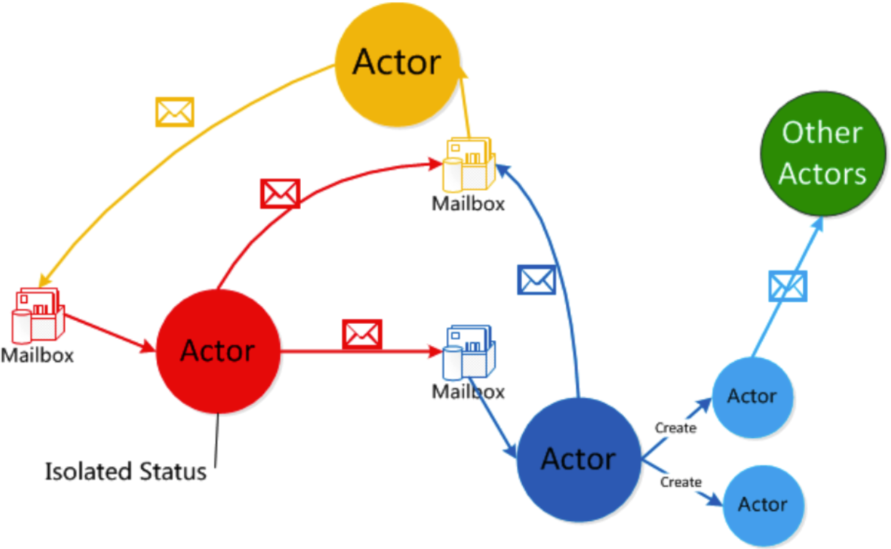
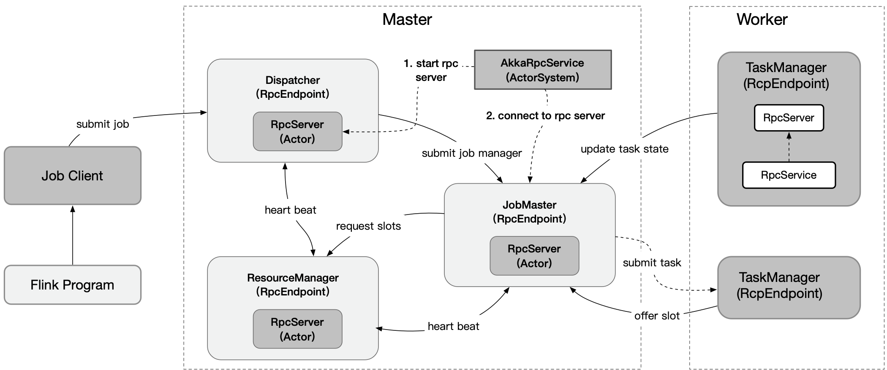

# 集群 RPC 通信机制

## 1. 前言

> 对于 Flink 中各个组件(JobMaster,TaskManager,Dispatcher等)，其底层 RPC 框架基于 Akka 实现，本章节着重分析 Flink 中的 RPC 框架实现机制及梳理通信流程。

## 2. Akka 介绍

> 由于 Flink 底层 Rpc 是基于 Akka 实现，我们先了解下 Akka 的基本使用

Akka 是一个开发并发、容错和和伸缩应用的框架。它是 Actor Model 的一个实现，和 Erlang 的并发模型很像。在 Actor 模型中，所有的实体都被认为是独立的 actors。actors 和其他 actors 通过发送异步消息通信。Actor 模型的强大来自于异步。它可以显式等待响应，这使得可以执行同步操作。但是，强烈不建议同步消息，因为它们限制了系统的伸缩性。每个 actor 有一个邮箱(mailbox), 它收到的消息存储在里面。另外，每一个 actor 维护自身单独的状态。一个 Actor 网路如下所示：




每个 actor 都是一个单一的线程，它不断地从其邮箱中poll(拉取)消息，并且连续不断地处理。对于已经处理过的消息结果，actor 可以他通过改变自身的内部状态或者发送一个消息或者产生一个新的 actor。尽管单个 actor 是自然有序的，但是一个包含若干个 actor 的系统却是高度并发的并且极具扩展性的。因为哪些处理线程是所有 actor 之间共享的。这也是为什么我们不应该在 actor 的线程里调用可能导致阻塞的“调用”。因为这样的调用可能会阻塞该线程使得它们无法替代其他 actor 处理消息

### 2.1 创建 Akka 系统

Akka 系统的核心 ActorSystem 和 Actor，若需构建一个 Akka 系统，首先需要创建 ActorSystem，创建完 ActorSystem后，可通过其创建 Actor（注意，Akka 不允许直接 new 一个 Actor，只能通过 Akka 提供的一些 API 才能创建或查找 actor，一般会通过 ActorSystem#actorOf 或者 ActionContext#actorOF 来创建 actor）,另外，我们只能通过 ActorRef (Actor 的引用，其对原生 Actor 实例做了良好的封装，外界不能随意修改其内部状态)来与 Actor 进行通信。如下代码展示了如何配置一个 Akka 系统。

```java
// 1. 构建ActorSystem
// 使用缺省配置
ActorSystem system = ActorSystem.create("sys");
// 也可显示指定appsys配置
// ActorSystem system1 = ActorSystem.create("helloakka", ConfigFactory.load("appsys"));

// 2. 构建Actor,获取该Actor的引用，即ActorRef
ActorRef helloActor = system.actorOf(Props.create(HelloActor.class), "helloActor");

// 3. 给helloActor发送消息
helloActor.tell("hello helloActor", ActorRef.noSender());

// 4. 关闭ActorSystem
system.terminate();
```

在 Akka 中，创建的每个 Actor 都有自己的路径，该路径遵循 ActorSystem 的层级结构，大致如下：

```sh
本地：akka://sys/user/helloActor
远程：akka.tcp://sys@l27.0.0.1:2020/user/remoteActor 
```
其中本地零的含义如下：

* sys，创建的 ActorSystem 的名字；
* user, 通过 ActorSystem#actorOf 或者 ActorContext#actorOf 方法创建的 Actor 都属于 /user 下，与 /user 对应的是 /system，是系统层面创建的，与系统整体有关，在开发阶段不需要对其过多关注；
* helloActor，我们创建的 HelloActor。

其中的远程部分路径含义如下：
* akka.tcp, 通信方式为 tcp;
* sys@127.0.0.1:2020， ActorSystem 名字及远程主机 ip 和端口号

### 2.2 根据 path 获取 Actor
若是提供了 Actor 的路径，可以通过路径获取到 ActorRef，然后与之通信，代码如下所示：

```java
ActorSystem system = ActorSystem.create("sys")；
ActorSelection as = system.actorSelection("/path/to/actor");

Timeout timeout = new Timeout(Duration.ofSeconds(2));
Future<ActorRef> fu = as.resolveOne(timeout);

fu.onSuccess(new OnSuccess<ActorRef>() {
    @Override
    public void onSuccess(ActorRef actor) {
        System.out.println("actor:" + actor);
        actor.tell("hello actor", ActorRef.noSender());
    }
}, system.dispatcher());

fu.onFailure(new OnFailure() {
    @Override
    public void onFailure(Throwable failure) {
        System.out.println("failure:" + failure);
    }
}, system.dispatcher());

```

由上可知，如果需要与远端 Actor 通信，路径中必须提供 ip:port

### 2.3 与 Actor 通信

#### 2.3.1 tell 方法

当使用 tell 方式时，表示仅仅使用异步方式给某个 actor 发送消息，无需等待 Actor 的响应结果，并且也不会阻塞后续代码的运行，如：
```java
helloActor.tell("hello helloActor", ActorRef.noSender());
```
其中，第一个参数为消息，它可以是任何可序列化的数据或者对象，第二个参数表示发送者，通常来说是另外一个 Actor 的引用，ActorRef.noSender() 表示无发送者(实际上是一个叫做 deadLetters 的 Actor)

#### 2.3.2 ask方式

当我们需要从 Actor 获取响应结果时，可以使用 ask 方法，ask 方法会将返回结果包装在 scala.concurrent.Future 中，然后通过异步回调返回结果。如调用方：

```java
// 异步发送消息给Actor，并获取响应结果
Future<Object> fu = Patterns.ask(printerActor, "hello helloActor", timeout);
fu.onComplete(new OnComplete<Object>() {
    @Override
    public void onComplete(Throwable failure, String success) throws Throwable {
         if (failure != null) {
             System.out.println("failure is " + failure);
         } else {
             System.out.println("success is " + success);
         }
    }
}, system.dispatcher());

```

HelloActor 处理消息方法的代码逻辑大致如下：
```java
private void handleMessage(Object object) {
    if (object instanceof String) {
      String str = (String) object;
      log.info("[HelloActor] message is {}, sender is {}", str, 	getSender().path().toString());
      // 给发送者发送消息
      getSender().tell(str, getSelf());
    }
  }

```

上面主要介绍了了 Akka 中的 ActorSystem，Actor 以及与 Actor 的通信；Flink 借此构建了底层通信系统。

## 3 Flink RPC 的底层原理、架构图以及原理分析

### 3.1 Flink Rpc 整体架构图

Flink RPC 的实现原理总体上来说就是 使用 Akka Actor 实现通讯和序列化，使用动态代理(客户端)和反射实现远程调用(服务端)。如下图所示：
用户需要自定义一个 CustomRpcGateway 接口，用户自定义接口需要继承 RpcGateway 接口(比如 Flink Rpc 中的 CheckpointCoordinatorGateway，DispatcherGateway，JobMasterGateway，ResourceManagerGateway，RestfulGateway，TaskExecutorGateway)，当前接口需要定义远程方法。服务端需要创建一个 自定义接口实现类 CustomEndpoint(比如 Dispatcher,JobMaster, TaskExecutor, ResourceManager)，继承自 RpcEndpoint 和 实现 CustomRpcGateway。RpcEndpoint 类会用到 AkkaRpcService 这个辅助类，该辅助类会为 RpcEndpoint 创建一个 AkkaRpcActor，AkkaRpcActor 会监听指定端口，当有请求到达之后会根据请求信息调用 CustomEndPoint 中对应的方法。
客户端同样需要创建一个 AkkaRpcService 辅助类实例(因为该辅助类会为客户端调用远程方法创建动态代理，就是这么屌)，并调用 connect 方法连接远程 CustomEndpoint，连接成功会创建一个 CustomEndpoint 的代理，客户端可以直接调用 CustomRpcGateway 中定义的方法，然后通过动态代理进入 AkkaInvocationHandler 中进行处理，AkkaInvocationHandler 被调用后，会通过 ActorRef 与远程的 actor (就是远程的 AkkaRpcActor实例)进行远程通信和调用。


框架图的解释如下：

1、Server 端创建 CustomRpcGateway 接口，继承 RpcGateway，编写 Server 端提供服务的 Rpc 接口
2、Server 创建对应的 RpcEndpoint 实现类 CustomRpcEndpoint ，继承 RpcEndpoint, 实现 CustomRpcGateway 接口中的方法，同时
利用 AkkaRpcService 启动 Rpc 服务的端口监听，创建 AkkaRpcActor 来实现接收客户端的调用请求，并解析请求解析并转化为通过反射的方式实现的目标方法调用 CustomRpcEndpoint 的具体实现方法
3、客户端也需要持有 AkkaRpcService , 通过调用该 Service 的 connect 方法，启动 客户端调用 Rpc 的动态代理 CustomRpcGatewayProx, 该匿名的动态代理将使用 ActorRef 将客户端对接口 CustomRpcGateway 中所有方法的调用请求发转发送给 服务端，通过 AkkaInvocationHandler 的 handle 方法，同时该代理也会判断是否是本地调用，如果是本地调用则直接反射调用本地方法，因此箭头是上下相互调用。

### 3.2 Flink Rpc 组件通信图

通过以上解释，我们应该能了解了 Flink RPC 的实现思路和调用过程，如果不理解没关系，下面我们还有源码分析。如果理解了，那么我们继续来看使用 Flink Rpc 相互通信的主键都主要进行哪方面的通信，如下图所示：


上述交互图，解释如下：

每一个 Endpoint 都包含一个 RpcServer， PpcServer 是有 RpcService 启动起来的，RpcService 的实现类是 AkkaRpcService ，AkkaRpcService 利用 ActorSystem 来启动 AkkaRpcActor 作为 Akka Actor 模型的 服务端 Actor 实例，也就是说每个 RpcEndpoint 组件都有这个 RpcServer ，同时每个 RpcEndpoint 又可以通过 connect 方法，跟其他 RpcEndpoint 通信。

ResourceManager、Dispatcher、JobMaster、TaskExecutor 都是继承了 Endpoint，因此上诉组件之间的 通信图如上所示，这样整个 Flink 集群的组件之间的 RPC 通信就建立起来了。

### 3.3 Flink Rpc 类和接口继承实现的关系图

相关涉及到的类图和接口之间的继承和实现关系如下图所示：



## 4.关键类的实现讲解

从上面的实现原理中，我们可以看到几个比较重要的实现类以及接口，RpcGetaway、RpcEndpoint、AkkaRpcService、AkkaRpcActor、AkkaInvocationHandler，下面将分别介绍这几个类的作用以及关键源码的讲解

### 4.1 RpcGateway

Flink 的 RPC 协议通过 RpcGateway 来定义；由前面可知，若想与远端 `Actor` 通信，则必须提供地址(ip和port), 在 Flink-on-yarn 模式下，JobMaster 会先启动 ActorSystem，此时 TaskExecutor 的 container 还未分配，后面与 TaskExecutor 通信时，必须让其提供对应的地址，从类的继承图可以看到基本所有的组件都实现了 RpcGateway 接口，其代码如下：

```java
public interface RpcGateway {

	/**
	 * Returns the fully qualified address under which the associated rpc endpoint is reachable.
	 *
	 * @return Fully qualified (RPC) address under which the associated rpc endpoint is reachable
	 */
	String getAddress();

	/**
	 * Returns the fully qualified hostname under which the associated rpc endpoint is reachable.
	 *
	 * @return Fully qualified hostname under which the associated rpc endpoint is reachable
	 */
	String getHostname();
}

// Dispatcher 组件提供的供远程调用的 rpc 方法
public interface DispatcherGateway extends FencedRpcGateway<DispatcherId>, RestfulGateway {

	/**
	 * Submit a job to the dispatcher.
	 *
	 * @param jobGraph JobGraph to submit
	 * @param timeout RPC timeout
	 * @return A future acknowledge if the submission succeeded
	 */
	CompletableFuture<Acknowledge> submitJob(
		JobGraph jobGraph,
		@RpcTimeout Time timeout);

	/**
	 * List the current set of submitted jobs.
	 *
	 * @param timeout RPC timeout
	 * @return A future collection of currently submitted jobs
	 */
	CompletableFuture<Collection<JobID>> listJobs(
		@RpcTimeout Time timeout);

	/**
	 * Returns the port of the blob server.
	 *
	 * @param timeout of the operation
	 * @return A future integer of the blob server port
	 */
	CompletableFuture<Integer> getBlobServerPort(@RpcTimeout Time timeout);

	/**
	 * Requests the {@link ArchivedExecutionGraph} for the given jobId. If there is no such graph, then
	 * the future is completed with a {@link FlinkJobNotFoundException}.
	 *
	 * <p>Note: We enforce that the returned future contains a {@link ArchivedExecutionGraph} unlike
	 * the super interface.
	 *
	 * @param jobId identifying the job whose AccessExecutionGraph is requested
	 * @param timeout for the asynchronous operation
	 * @return Future containing the AccessExecutionGraph for the given jobId, otherwise {@link FlinkJobNotFoundException}
	 */
	@Override
	CompletableFuture<ArchivedExecutionGraph> requestJob(JobID jobId, @RpcTimeout Time timeout);

	default CompletableFuture<Acknowledge> shutDownCluster(ApplicationStatus applicationStatus) {
		return shutDownCluster();
	}
}
```

### 4.2 RpcEndpoint

每个 RpcEndpoint 对应了一个路径(endpointId和actorSystem共同确定)，每个路径对应一个 Actor，其实现了 RpcGateway 接口。
该类是 Rpc 端点的基类，提供 Rpc 服务的类需要继承它并实现 用户 RpcGateway 中定义的接口，比如 Dispatcher类，该类是 Rpc 的入口，通过它可以启动 AkkaRpcService 以及相关的 AkkaRpcActor。代码位置：org.apache.flink.runtime.rpc.RpcEndpoint，其构造函数如下：
```java
	protected RpcEndpoint(final RpcService rpcService, final String endpointId) {
        // 保存 rpcService 和 endpointId
		this.rpcService = checkNotNull(rpcService, "rpcService");
		this.endpointId = checkNotNull(endpointId, "endpointId");
        // 通过 RPCService 启动 RpcServer
		this.rpcServer = rpcService.startServer(this);
        // 主线程执行器，所有调用在主线程中串行执行。
		this.mainThreadExecutor = new MainThreadExecutor(rpcServer, this::validateRunsInMainThread);
	}
```

在 RpcEndpoint 中还定义了一些方法如 `runAsync(Runnable)`、 `callAsync(Callable, Time)` 方法来执行 Rpc 的调用，值得注意的是在 Flink 的设计中，对同一个 EndPoint，所有的调用都运行在主线程，因此不会有并发问题，当启动 RpcEndpoint 进行 Rpc 调用的时候，会委托给 RpcServer 进行处理，而对 RpcServer 的调用又会被动态代理所代理。

### 4.3 RpcService

Rpc 辅助服务的接口，其主要作用如下：
* 根据提供的 RpcEndpoint 来启动 RpcServer(Actor) (startServer 方法)
* 根据提供的地址连接到 RPCServer，并返回一个 RpcGateway 的代理; (connect 方法)
* 延迟/立即调度 Runnable、Callable；(execute 和 scheduleRunnable 方法)
* 停止 RpcServer(Actor) 或自身服务(stopServer 方法)

其在 Flink 中的实现为 FlinkRpcService

#### 4.3.1 AkkaRpcService

Rpc服务和核心实现，其中包括创建用于接收远程调用的 Actor(FlinkAkkaActor) 和 连接远程 Actor并获取代理的逻辑( ActorRef )。代码位置 org.apache.flink.runtime.rpc.akka.AkkaRpcService。它封装了 ActorSystem, 并保存了 ActorRef 到 RpcEndPoint 的映射关系，在构造 RpcEndpoint 时会启动指定的 RpcEndpoint 上的 RpcServer，此时会根据 Endpoint 的类型(FencedEndpoint 或其他) 来创建不同的 Actor (AkkaRpcActor 或者  FencedAkkaRpcActor)，并将 RpcEndpoint 和 Actor 对应的 ActorRef 保存起来(这个用处不大)，然后使用动态代理创建 RpcServer，具体的代码如下：

##### 4.3.1.1 AkkaRpcService#startServer 方法

```java
// Flink 1.11.1 的源码
@VisibleForTesting
public AkkaRpcService(final ActorSystem actorSystem, final AkkaRpcServiceConfiguration configuration) {
    // 初始化 ActorSystem
    this.actorSystem = checkNotNull(actorSystem, "actor system");
    this.configuration = checkNotNull(configuration, "akka rpc service configuration");

    Address actorSystemAddress = AkkaUtils.getAddress(actorSystem);

    if (actorSystemAddress.host().isDefined()) {
        address = actorSystemAddress.host().get();
    } else {
        address = "";
    }

    if (actorSystemAddress.port().isDefined()) {
        port = (Integer) actorSystemAddress.port().get();
    } else {
        port = -1;
    }

    captureAskCallstacks = configuration.captureAskCallStack();

    internalScheduledExecutor = new ActorSystemScheduledExecutorAdapter(actorSystem);

    terminationFuture = new CompletableFuture<>();

    stopped = false;
    // 初始化 Actor 的监控者 supervisor，监控 Actor 的状态，是否运行
    supervisor = startSupervisorActor();
}

@Override
public <C extends RpcEndpoint & RpcGateway> RpcServer startServer(C rpcEndpoint) {
    checkNotNull(rpcEndpoint, "rpc endpoint");

    // 注册 AkkaRpcActor, 其实这个注册的方法非常深奥，我看了好久才明白是 AkkaRpcActor 是如何创建的
    // 关于注册方法的源码，后面有详细的描述。这里简化一下就是通过 SupervisorActor 的 ActorRef 发送 CreateAkkaRpcActor 的消息
    // 然后 SuperviActor 服务端处理该消息并生成 AkkaRpcActor 实例，之所以要套一层 Actor，作者说是为了监视 AkkaRpcActor
    // 毕竟这个类太重要了，具体怎么监视，本次就不深入细聊
    final SupervisorActor.ActorRegistration actorRegistration = registerAkkaRpcActor(rpcEndpoint);
    final ActorRef actorRef = actorRegistration.getActorRef();
    final CompletableFuture<Void> actorTerminationFuture = actorRegistration.getTerminationFuture();

    LOG.info("Starting RPC endpoint for {} at {} .", rpcEndpoint.getClass().getName(), actorRef.path());

    // 获取 Actor 路径
    final String akkaAddress = AkkaUtils.getAkkaURL(actorSystem, actorRef);
    final String hostname;
    Option<String> host = actorRef.path().address().host();
    if (host.isEmpty()) {
        hostname = "localhost";
    } else {
        hostname = host.get();
    }

    // 解析该 rpcEndpoint 实现类的实现的所有 RpcGateway 接口
    Set<Class<?>> implementedRpcGateways = new HashSet<>(RpcUtils.extractImplementedRpcGateways(rpcEndpoint.getClass()));

    // 添加额外的 RpcServer 接口和 AkkaBasedEndpoint 接口
    implementedRpcGateways.add(RpcServer.class);
    implementedRpcGateways.add(AkkaBasedEndpoint.class);

    final InvocationHandler akkaInvocationHandler;

    // 根据 rpcEndpoint 类型的不同，创建不同的 动态代理使用的 InvocationHandler 
    if (rpcEndpoint instanceof FencedRpcEndpoint) {
        // a FencedRpcEndpoint needs a FencedAkkaInvocationHandler
        akkaInvocationHandler = new FencedAkkaInvocationHandler<>(
            akkaAddress,
            hostname,
            actorRef,
            configuration.getTimeout(),
            configuration.getMaximumFramesize(),
            actorTerminationFuture,
            ((FencedRpcEndpoint<?>) rpcEndpoint)::getFencingToken,
            captureAskCallstacks);

        implementedRpcGateways.add(FencedMainThreadExecutable.class);
    } else {
        akkaInvocationHandler = new AkkaInvocationHandler(
            akkaAddress,
            hostname,
            actorRef,
            configuration.getTimeout(),
            configuration.getMaximumFramesize(),
            actorTerminationFuture,
            captureAskCallstacks);
    }

    // Rather than using the System ClassLoader directly, we derive the ClassLoader
    // from this class . That works better in cases where Flink runs embedded and all Flink
    // code is loaded dynamically (for example from an OSGI bundle) through a custom ClassLoader
    ClassLoader classLoader = getClass().getClassLoader();

    @SuppressWarnings("unchecked")
    // 通过动态代理生成 RPCServer 对象，而后对 RpcServer 的所有调用 都会进入 Handler 的 invoke 方法，
    // 而 Handler 实现了多个接口的方法
    RpcServer server = (RpcServer) Proxy.newProxyInstance(
        classLoader,
        implementedRpcGateways.toArray(new Class<?>[implementedRpcGateways.size()]),
        akkaInvocationHandler);

    return server;
}

private <C extends RpcEndpoint & RpcGateway> SupervisorActor.ActorRegistration registerAkkaRpcActor(C rpcEndpoint) {
		final Class<? extends AbstractActor> akkaRpcActorType;
        // 根据 RpcEndpoint 类型不同创建不同的 Actor 实例
		if (rpcEndpoint instanceof FencedRpcEndpoint) {
			akkaRpcActorType = FencedAkkaRpcActor.class;
		} else {
			akkaRpcActorType = AkkaRpcActor.class;
		}

        // 同步块，通过给 Supervisor Actor 发消息来创建 AkkaRpcActor 实例
		synchronized (lock) {
			checkState(!stopped, "RpcService is stopped");

			final SupervisorActor.StartAkkaRpcActorResponse startAkkaRpcActorResponse = SupervisorActor.startAkkaRpcActor(
				supervisor.getActor(),
				actorTerminationFuture -> Props.create(
					akkaRpcActorType,
					rpcEndpoint,
					actorTerminationFuture,
					getVersion(),
					configuration.getMaximumFramesize()),
				rpcEndpoint.getEndpointId());

			final SupervisorActor.ActorRegistration actorRegistration = startAkkaRpcActorResponse.orElseThrow(cause -> new AkkaRpcRuntimeException(
				String.format("Could not create the %s for %s.",
					AkkaRpcActor.class.getSimpleName(),
					rpcEndpoint.getEndpointId()),
				cause));
            // 获取 AkkaRpcActor 的 ActorRef 引用
			actors.put(actorRegistration.getActorRef(), rpcEndpoint);

			return actorRegistration;
		}
	}

class SupervisorActor extends AbstractActor {

	private static final Logger LOG = LoggerFactory.getLogger(SupervisorActor.class);

	private final Executor terminationFutureExecutor;

	private final Map<ActorRef, AkkaRpcActorRegistration> registeredAkkaRpcActors;

	SupervisorActor(Executor terminationFutureExecutor) {
		this.terminationFutureExecutor = terminationFutureExecutor;
		this.registeredAkkaRpcActors = new HashMap<>();
	}

    // Supervisor Actor 的服务端消息处理函数
	@Override
	public Receive createReceive() {
		return receiveBuilder()
			.match(StartAkkaRpcActor.class, this::createStartAkkaRpcActorMessage)
			.matchAny(this::handleUnknownMessage)
			.build();
	}
    //... 省略其他

    // 响应 StartAkkaRpcActor 的消息，创建 AkkaRpcActor
    private void createStartAkkaRpcActorMessage(StartAkkaRpcActor startAkkaRpcActor) {
		final String endpointId = startAkkaRpcActor.getEndpointId();
		final AkkaRpcActorRegistration akkaRpcActorRegistration = new AkkaRpcActorRegistration(endpointId);

		final Props akkaRpcActorProps = startAkkaRpcActor.getPropsFactory().create(akkaRpcActorRegistration.getInternalTerminationFuture());
        //打印要创建的 AkkaRpcActor 类的详情 
		LOG.debug("Starting {} with name {}.", akkaRpcActorProps.actorClass().getSimpleName(), endpointId);

		try {
            // 通过上文提到的 context.actorOf(...) 方式创建 AkkaRpcActor, props 都有什么东西那？
            // props 里面的东西在上述的 388-393 行的匿名函数实现中可以找到
			final ActorRef actorRef = getContext().actorOf(akkaRpcActorProps, endpointId);

			registeredAkkaRpcActors.put(actorRef, akkaRpcActorRegistration);
            // 给 Supervisor Actor 的客户端发送创建 AkkaRpcActor 实例成功的异步消息
			getSender().tell(StartAkkaRpcActorResponse.success(
				ActorRegistration.create(
					actorRef,
					akkaRpcActorRegistration.getExternalTerminationFuture())),
				getSelf());
            // 至此，AkkaRpcActor 实例创建完成
		} catch (AkkaException akkaException) {
			getSender().tell(StartAkkaRpcActorResponse.failure(akkaException), getSelf());
		}
	}
    // 在 AkkaRpcService 的构造函数中调用，初始化 Supervisor 的 ActorRef 引用
    public static ActorRef startSupervisorActor(ActorSystem actorSystem, Executor terminationFutureExecutor) {
		final Props supervisorProps = Props.create(SupervisorActor.class, terminationFutureExecutor).withDispatcher("akka.actor.supervisor-dispatcher");
		return actorSystem.actorOf(supervisorProps, getActorName());
	}
    public static String getActorName() {
		return AkkaRpcServiceUtils.SUPERVISOR_NAME;
	}

    // 在 Supverisor Actor 中启动 AkkaRpcActor
    public static StartAkkaRpcActorResponse startAkkaRpcActor(
			ActorRef supervisor,
			StartAkkaRpcActor.PropsFactory propsFactory,
			String endpointId) {
        // 启动方式为 通过 Supervisor ActorRef 发送 创建 AkkaRpcActor 的 ask 请求，该请求的目标类为 StartAkkaRpcActor
        // StartAkkaRpcActor 是一个封装类或者接口类，在 Supervisor 的客户端 能够使用，在 Supervisor 的服务端也能使用
        // 是创建 AkkaRpcActor 的必要属性的一个封装类。
        // 这里发送了请求，Supervisor Actor 接收到这个请求如何处理那并生成 AkkaRpcActor 那？请翻看上面 Supervisor 的消息处理函数 
		return Patterns.ask(
				supervisor,
				createStartAkkaRpcActorMessage(
					propsFactory,
					endpointId),
				RpcUtils.INF_DURATION).toCompletableFuture()
			.thenApply(SupervisorActor.StartAkkaRpcActorResponse.class::cast)
			.join();
	}

	public static StartAkkaRpcActor createStartAkkaRpcActorMessage(
			StartAkkaRpcActor.PropsFactory propsFactory,
			String endpointId) {
		return StartAkkaRpcActor.create(propsFactory, endpointId);
	}

    static final class StartAkkaRpcActor {
		private final PropsFactory propsFactory;
		private final String endpointId;

		private StartAkkaRpcActor(PropsFactory propsFactory, String endpointId) {
			this.propsFactory = propsFactory;
			this.endpointId = endpointId;
		}
        // 省略其他。。

		private static StartAkkaRpcActor create(PropsFactory propsFactory, String endpointId) {
			return new StartAkkaRpcActor(propsFactory, endpointId);
		}

		interface PropsFactory {
			Props create(CompletableFuture<Void> terminationFuture);
		}
	}
}
```

当启动 RPCServer 后，即出AG你按了相应的 Actor (注意此时 Actor 还处于停止状态)和动态代理对象，需要调用 RpcEndpoint#start 方法来启动 Actor，此时启动 RpcEndpoint 的流程如下（以非 FencedRpcEndpoint 为例）：

* 调用 RpcEndpoint#start
* 进而调用 RpcServer#start;
* 而 动态代理的匿名类代理了 RpcServer 的所有方法，因此 start 方法将会被代理到 AkkaInvocationHandler#invoke 方法中；在 invoke 方法的判断逻辑中，发现调用的是 StartStoppable#start(RpcSever 接口的 start 方法继承自 StartStoppable#start) 方法，则直接进行本地方法调用，其代码请参考 InvocationHandler 的解析
* 调用 AkkaInvocationHandler#start 方法
* 通过 ActorRef#tell 给自己的 Actor 发送消息 `rpcEndpoint.tell(ControlMessages.START, ActorRef.noSender());`
* 自身的 AkkaRpcActor 接收到该消息后调用 handleControlMessage 方法处理控制类消息；
* 在主线程中将自身状态变更为 Started 状态；源码请参考 AkkaRpcActor 的解析。
  
经过上述步骤就完成了 Actor 的启动过程，Actor 启动后便可与其他 Actor 通信让其执行代码(如 runSync/callSync 等) 或者处理 RPC 请求了。

##### 4.3.1.2 AkkaRpcService#connect 方法

```java
/**
 * 连接远程 Rpc Server
 * @param address Address of the remote rpc server
 * @param clazz<C> Class of the rpc gateway to return，远端的用于自定义的RpcGateway
 */
@Override
public <C extends RpcGateway> CompletableFuture<C> connect(
        final String address,
        final Class<C> clazz) {

    return connectInternal(
        address,
        clazz,
        (ActorRef actorRef) -> {
            Tuple2<String, String> addressHostname = extractAddressHostname(actorRef);

            return new AkkaInvocationHandler(
                addressHostname.f0,
                addressHostname.f1,
                actorRef,
                configuration.getTimeout(),
                configuration.getMaximumFramesize(),
                null,
                captureAskCallstacks);
        });
}

private <C extends RpcGateway> CompletableFuture<C> connectInternal(
			final String address,
			final Class<C> clazz,
			Function<ActorRef, InvocationHandler> invocationHandlerFactory) {
		checkState(!stopped, "RpcService is stopped");

		LOG.debug("Try to connect to remote RPC endpoint with address {}. Returning a {} gateway.",
			address, clazz.getName());

		final CompletableFuture<ActorRef> actorRefFuture = resolveActorAddress(address);
        //发送一个 握手消息 给远端
		final CompletableFuture<HandshakeSuccessMessage> handshakeFuture = actorRefFuture.thenCompose(
			(ActorRef actorRef) -> FutureUtils.toJava(
				Patterns
					.ask(actorRef, new RemoteHandshakeMessage(clazz, getVersion()), configuration.getTimeout().toMilliseconds())
					.<HandshakeSuccessMessage>mapTo(ClassTag$.MODULE$.<HandshakeSuccessMessage>apply(HandshakeSuccessMessage.class))));
// 利用上述两个 future 的参数 actorRef 和 HandshakeSuccessMessage 来创建动态代理，
// 来代理对远端自定义的RpcGateway 接口的所有调用
		return actorRefFuture.thenCombineAsync(
			handshakeFuture,
			(ActorRef actorRef, HandshakeSuccessMessage ignored) -> {
				InvocationHandler invocationHandler = invocationHandlerFactory.apply(actorRef);

				// Rather than using the System ClassLoader directly, we derive the ClassLoader
				// from this class . That works better in cases where Flink runs embedded and all Flink
				// code is loaded dynamically (for example from an OSGI bundle) through a custom ClassLoader
				ClassLoader classLoader = getClass().getClassLoader();

				@SuppressWarnings("unchecked")
				C proxy = (C) Proxy.newProxyInstance(
					classLoader,
					new Class<?>[]{clazz},
					invocationHandler);

				return proxy;
			},
			actorSystem.dispatcher());
	}
```

#### 4.3.2 InvocationHandler 解析

```java
class AkkaInvocationHandler implements InvocationHandler, AkkaBasedEndpoint, RpcServer {

    public Object invoke(Object proxy, Method method, Object[] args) throws Throwable {
		Class<?> declaringClass = method.getDeclaringClass();

		Object result;
// 先匹配指定类型(handler 已实现的接口方法)，若匹配成功，则直接进行本地方法调用；若匹配为FencedRpcGateway类型，则抛出异常（应该在FencedAkkaInvocationHandler中处理）；其他则进行远程 Rpc 的调用
		if (declaringClass.equals(AkkaBasedEndpoint.class) ||
			declaringClass.equals(Object.class) ||
			declaringClass.equals(RpcGateway.class) ||
			declaringClass.equals(StartStoppable.class) ||
			declaringClass.equals(MainThreadExecutable.class) ||
			declaringClass.equals(RpcServer.class)) {
			result = method.invoke(this, args);
		} else if (declaringClass.equals(FencedRpcGateway.class)) {
			throw new UnsupportedOperationException("AkkaInvocationHandler does not support the call FencedRpcGateway#" +
				method.getName() + ". This indicates that you retrieved a FencedRpcGateway without specifying a " +
				"fencing token. Please use RpcService#connect(RpcService, F, Time) with F being the fencing token to " +
				"retrieve a properly FencedRpcGateway.");
		} else {
			result = invokeRpc(method, args);
		}

		return result;
	}

    @Override
	public void start() { // 代理 RpcServer#start 方法
		rpcEndpoint.tell(ControlMessages.START, ActorRef.noSender());
	}

    /**
	 * Invokes a RPC method by sending the RPC invocation details to the rpc endpoint.
	 *
	 * @param method to call
	 * @param args of the method call
	 * @return result of the RPC
	 * @throws Exception if the RPC invocation fails
	 */
	private Object invokeRpc(Method method, Object[] args) throws Exception {
		String methodName = method.getName();
		Class<?>[] parameterTypes = method.getParameterTypes();
		Annotation[][] parameterAnnotations = method.getParameterAnnotations();
		Time futureTimeout = extractRpcTimeout(parameterAnnotations, args, timeout);

		final RpcInvocation rpcInvocation = createRpcInvocationMessage(methodName, parameterTypes, args);

		Class<?> returnType = method.getReturnType();

		final Object result;
        // 判断是否存在返回值，如果不存在，则直接调用
		if (Objects.equals(returnType, Void.TYPE)) {
			tell(rpcInvocation);

			result = null;
		} else {
			// Capture the call stack. It is significantly faster to do that via an exception than
			// via Thread.getStackTrace(), because exceptions lazily initialize the stack trace, initially only
			// capture a lightweight native pointer, and convert that into the stack trace lazily when needed.
			final Throwable callStackCapture = captureAskCallStack ? new Throwable() : null;

			// execute an asynchronous call。使用 ask 方式异步调用 
			final CompletableFuture<?> resultFuture = ask(rpcInvocation, futureTimeout);

			final CompletableFuture<Object> completableFuture = new CompletableFuture<>();
			resultFuture.whenComplete((resultValue, failure) -> {
				if (failure != null) {
					completableFuture.completeExceptionally(resolveTimeoutException(failure, callStackCapture, method));
				} else {
					completableFuture.complete(deserializeValueIfNeeded(resultValue, method));
				}
			});
            // 判断返回值类型是否是 CompletableFuture
			if (Objects.equals(returnType, CompletableFuture.class)) {
				result = completableFuture;
			} else {
				try {
					result = completableFuture.get(futureTimeout.getSize(), futureTimeout.getUnit());
				} catch (ExecutionException ee) {
					throw new RpcException("Failure while obtaining synchronous RPC result.", ExceptionUtils.stripExecutionException(ee));
				}
			}
		}

		return result;
	}
}
```

#### 4.3.3 AkkaRpcActor 解析

Flink Rpc 通过上述动态代理中的 InvocationHandler 的 invoke 方法的调用，使用 ActorRef 给远程的 Actor 发送了消息，那么这个远程的 Actor 是哪个那？正是 AkkaRpcActor，它是以个 Akka 的 Actor 实现，服务端用它来处理客户端的消息，看架构图我们知道，Flink Rpc 的 rpc 消息经过 Akka 床架处理后转发到 AkakRpcActor 中。而 AkakRpcActor 的主要方法有 ：createReceive(), handleHandshakeMessage(RemoteHandshakeMessage handshakeMessage),handleControlMessage(ControlMessages controlMessage, handleMessage(Object message) , 下面分别来说。

##### 4.3.3.1 AkkaRpcActor#createReceive()

```java
// 创建消息接收器
@Override
public Receive createReceive() {
    return ReceiveBuilder.create()
        // 处理我收消息
        .match(RemoteHandshakeMessage.class, this::handleHandshakeMessage)
        // 处理控制消息，如 启动、停止、中断，START、STOP、TERMINATE
        .match(ControlMessages.class, this::handleControlMessage)
        // 处理通用消息
        .matchAny(this::handleMessage)
        .build();
}
```

##### 4.3.3.2 AkkaRpcActor#handleHandshakeMessage()

```java
// 处理握手消息
private void handleHandshakeMessage(RemoteHandshakeMessage handshakeMessage) {、
        // 判断消息版本是否兼容，这也是呼应了为什么客户端在发 Rpc 请求前，先发我收消息的原因
		if (!isCompatibleVersion(handshakeMessage.getVersion())) {
            // 发送失败消息
			sendErrorIfSender(new AkkaHandshakeException(
				String.format(
					"Version mismatch between source (%s) and target (%s) rpc component. Please verify that all components have the same version.",
					handshakeMessage.getVersion(),
					getVersion())));
        // 判断握手消息的 RpcGateway 是否继承自 RpcGateway
		} else if (!isGatewaySupported(handshakeMessage.getRpcGateway())) {
			sendErrorIfSender(new AkkaHandshakeException(
				String.format(
					"The rpc endpoint does not support the gateway %s.",
					handshakeMessage.getRpcGateway().getSimpleName())));
		} else {
            // 发送我收成功的消息
			getSender().tell(new Status.Success(HandshakeSuccessMessage.INSTANCE), getSelf());
		}
	}
```

##### 4.3.3.3 AkkaRpcActor#handleControlMessage()

```java
// 处理控制消息
private void handleControlMessage(ControlMessages controlMessage) {
		try {
			switch (controlMessage) {
				case START:
					state = state.start(this);
					break;
				case STOP:
					state = state.stop();
					break;
				case TERMINATE:
					state = state.terminate(this);
					break;
				default:
					handleUnknownControlMessage(controlMessage);
			}
		} catch (Exception e) {
			this.rpcEndpointTerminationResult = RpcEndpointTerminationResult.failure(e);
			throw e;
		}
	}
```

```java
	private void handleMessage(final Object message) {
		if (state.isRunning()) {
			mainThreadValidator.enterMainThread();

			try {
				handleRpcMessage(message);
			} finally {
				mainThreadValidator.exitMainThread();
			}
		} else {
			log.info("The rpc endpoint {} has not been started yet. Discarding message {} until processing is started.",
				rpcEndpoint.getClass().getName(),
				message.getClass().getName());

			sendErrorIfSender(new AkkaRpcException(
				String.format("Discard message, because the rpc endpoint %s has not been started yet.", rpcEndpoint.getAddress())));
		}
	}
    protected void handleRpcMessage(Object message) {
		if (message instanceof RunAsync) {
            // 处理异步执行 Runnable 消息
			handleRunAsync((RunAsync) message);
		} else if (message instanceof CallAsync) {
            // 处理异步执行 Callable 消息
			handleCallAsync((CallAsync) message);
		} else if (message instanceof RpcInvocation) {
            // 处理 Rpc 调用
			handleRpcInvocation((RpcInvocation) message);
		} else {
			log.warn(
				"Received message of unknown type {} with value {}. Dropping this message!",
				message.getClass().getName(),
				message);

			sendErrorIfSender(new AkkaUnknownMessageException("Received unknown message " + message +
				" of type " + message.getClass().getSimpleName() + '.'));
		}
	}

    private Method lookupRpcMethod(final String methodName, final Class<?>[] parameterTypes) throws NoSuchMethodException {
            return rpcEndpoint.getClass().getMethod(methodName, parameterTypes);
        }
    /**
	 * Handle rpc invocations by looking up the rpc method on the rpc endpoint and calling this
	 * method with the provided method arguments. If the method has a return value, it is returned
	 * to the sender of the call.
	 *
	 * @param rpcInvocation Rpc invocation message
	 */
	private void handleRpcInvocation(RpcInvocation rpcInvocation) {
		Method rpcMethod = null;

		try {
            // 获取方法信息
			String methodName = rpcInvocation.getMethodName();
			Class<?>[] parameterTypes = rpcInvocation.getParameterTypes();
            // 在 RpcEndpoint 中查找目标方法
			rpcMethod = lookupRpcMethod(methodName, parameterTypes);
		} catch (ClassNotFoundException e) {
			log.error("Could not load method arguments.", e);
            // 异常处理
			RpcConnectionException rpcException = new RpcConnectionException("Could not load method arguments.", e);
			getSender().tell(new Status.Failure(rpcException), getSelf());
		} catch (IOException e) {
			log.error("Could not deserialize rpc invocation message.", e);
            // 异常处理
			RpcConnectionException rpcException = new RpcConnectionException("Could not deserialize rpc invocation message.", e);
			getSender().tell(new Status.Failure(rpcException), getSelf());
		} catch (final NoSuchMethodException e) {
			log.error("Could not find rpc method for rpc invocation.", e);
            // 异常处理
			RpcConnectionException rpcException = new RpcConnectionException("Could not find rpc method for rpc invocation.", e);
			getSender().tell(new Status.Failure(rpcException), getSelf());
		}

		if (rpcMethod != null) {
			try {
				// this supports declaration of anonymous classes
				rpcMethod.setAccessible(true);
                // 方法的返回值为空
				if (rpcMethod.getReturnType().equals(Void.TYPE)) {
					// No return value to send back
					rpcMethod.invoke(rpcEndpoint, rpcInvocation.getArgs());
				}
				else {
					final Object result;
					try {
						result = rpcMethod.invoke(rpcEndpoint, rpcInvocation.getArgs());
					}
					catch (InvocationTargetException e) {
						log.debug("Reporting back error thrown in remote procedure {}", rpcMethod, e);

						// tell the sender about the failure
						getSender().tell(new Status.Failure(e.getTargetException()), getSelf());
						return;
					}

					final String methodName = rpcMethod.getName();
                    // 方法的范围类型为 ComputableFuture
					if (result instanceof CompletableFuture) {
						final CompletableFuture<?> responseFuture = (CompletableFuture<?>) result;
                        // 发送结果（使用 Patterns 发送结果给调用者，并会进行序列化验证字节大小）
						sendAsyncResponse(responseFuture, methodName);
					} else {
                        // 非 CompletableFuture 类型，使用 tell 方式发送结果，并进行序列化和验证字节大小
						sendSyncResponse(result, methodName);
					}
				}
			} catch (Throwable e) {
				log.error("Error while executing remote procedure call {}.", rpcMethod, e);
				// tell the sender about the failure
				getSender().tell(new Status.Failure(e), getSelf());
			}
		}
	}
```

## 总结并手动实现一个基于 Flink Rpc 的demo

### 总结

Rpc 框架是 Flink 任务运行的基础，Flink 整个 RPC 框架基于 Akka 实现，并对 Akka 中的 ActorSystem、Actor 进行了封装和使用。本章节主要分析了 Flink 底层 RPC 通信框架的实现和相关流程，Flink 整个通信框架的组件主要由 RpcEndpoint、RPCService、RpcServer、AkkaInvocationHandler、AkkaRpcActor 等构成。RpcEndpoint 定义了一个 Actor 路径；RpcService 提供了启动 RpcServer，执行 代码题等方法；RpcServer/AkkaInvocationHandler 提供了与 Actor 通信的基础实现；AkkaRpcActor 为 Flink 封装的 Actor。


### 参考网站

https://www.cnblogs.com/leesf456/p/11120045.html
https://blog.csdn.net/shirukai/article/details/121406709
