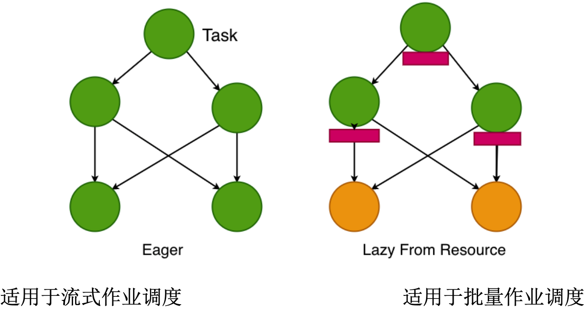

## Task 调度策略

### Task 调度策略结构图

task 调度策略如下图所示：



Eagle 调度类型适用于流式作业，一旦获取 Slot 资源，Task 都会被拉起

Task 组成部分如下图所示：


### Task  设计与实现

task 设计与实现，如下图所示：


Task 就是一个 Class 的对象，事项了上图中的接口，实现了 Runnable 接口，表明它本身是一个可执行的任务。在 TaskManager 里面可以直接通过 ExecutorService 给运行起来，线程用到的参数都是通过 slot 进行相应的配置。Slot 在下面讲述 TaskManager 的内存会了解到，对 CPU 没有做过多的隔离，对使用到的内存会进行一定的隔离。Task 做 Checkpoint 的时候会通过 CheckpointListener 传递给 JobManager 


### StreamTask 的触发与执行

#### 流程图他视角
如下图所示：
 


首先 Task(Runnable Thread) 会通过 反射的方式调用 AbstractInvokable 的实现类, 上面 StreamGraph 的脑图中的拓扑关系配置提到，「Class<? extends AbstractInvokable> jobVertexClass」这里的实现类主要是封装了用户的相关作业逻辑的代码的实现类。
AbstractInvokable 底层实现是 StreamTask 和 BatchTask
StreamTask 包含了 OperatorChain 这个组件，也即是我们 ExecutionGraph 中所设计到的每一个单独的 ExecutionVertex 所包含的节点，而 StreamTask 所依赖的环境信息会通过 environment 参数传递进来。

SourceStreamTask,OneInputStreamTask,TwoInputStreamTask 由于所依赖输入的 Task 类型不同而进行区别。TwoInputStreamTask 的边的输入有 2 条边的输入

#### 源码视角：

源码视角如下图所示：


从源码上看，StreamTask 继承了 AbstractInvokable 抽象类，这个抽象类位于 Flink Runtime 中，跟我们的作业没有关系，每个 StreamTask 继承不同的子类

### Task 运行状态

在整个 ExecutionGraph 执行期间，每个并行 Task都会经历多个节点，从 created 到 finished 或 failed。下图就展示了各种状态以及他们之间的转换关系。由于一个 task 可能会被执行多次(比如在异常恢复时)，ExecutionVertex 的执行是由 Execution 来跟踪的，每个 ExecutionVertex 会记录当前的执行，以及之前的执行。


### Flink 作业状态


Flink 作业刚开始会处于 created 状态，然后切换到 running 状态，当所有任务都执行完毕之后会切换到 finished 状态。如果遇到失败的话，作业首先切换到 failing 状态以便取消所有正在运行的 task。如果所有 job 节点都达到最终状态并且 job 无法重启，那么 job 进入 failed 状态。如果作业可以重启， 那么就进入到 restarting 状态，当作业彻底重启之后会进入 created 状态。

如果用户取消了 job 的话，它会进入 cancelling 状态，并取消所有正在运行的 task。当所有正在运行的 task 进入最终状态的时候，job 进入 cancelled 状态。

Finished、Canceled(cancel 的过去式可以是 Cancelled 或者 Canceled) 和 failed 会导致全局的终结状态，并且会触发作业的清理。跟这些状态不同，suspended 状态只是一个局部的中介状态。局部的终结意味着作业已经被对应的 JobManager 终结，但是集群中另外的 JobManager 依然可以从高可用存储里面获取作业信息并重启。因此一个处于 suspended 状态的作业不会被彻底清理掉。


## Task 的生命周期

Task 是 Flink 的基本执行单元。算子的每个并行实例都在 task 里面执行。例如，一个并行度为 5 的算子，它的每个实例都由一个但单独的 task 来执行（反过来，如果该 operator 在一个多算自的  chained operators  task 中，则 task 执行完该 operator 后继续执行后面的 operator）。

StreamTask 是 Flink 流式计算引擎中所有不同 task 子类的基础。本章节会深入讲解 StreamTask 生命周期的不同阶段，并阐述每个阶段的主要方法。

### 算子生命周期简介

因为 task 是算子并行实例的执行实体，所以它的生命周期跟算子的生命周期紧密联系在一起。因此，在深入介绍 StreamTask 生命周期之前，先简要介绍下代表算子生命周期的基本方法。这些方法按调用的先后顺序如下所示。考虑到算子可能是用户自定义函数（UDF），因此我们在每个算子下也展示了 UDF 生命周期中调用的各个方法。AbstractUdfStreamOperator 是所有执行 UDF 的算子的基类，如果算子继承了 AbstractUdfStreamOperator ，那么这些方法时可用的。

```text
// 初始化阶段
OPERATOR::setup
  UDF::setRuntimeContext
OPERATOR::initializeState
OPERATOR::open
  UDF::open
// 处理阶段(对每个 element 或 watermark 调用)
OPERATOR::processElement
  UDF:run
OPERATOR::processWatermark
// checkpointing 阶段(没给个 checkpoint 异步调用)
OPERATOR::snapshotState
// 通知 operator 处理记录的过程结束
OPERATOR::finish
// 结束阶段
OPERATOR::close
  UDF::close
```
简而言之，在算子初始化的时候调用 setup() 来初始化算子的特定设置，比如 RuntimeContext 和指标书籍的数据结构。在这之后，算子通过 initialzieState() 初始化状态，算子的所有初始化工作在 open() 方法中执行，比如在继承 AbstractUdfStreamOperator 的情况下，初始化用户自定义函数。

> initializeState() 既包含在初始化过程中算子的初始化逻辑(比如注册 keyed 状态：context.getState(desc))，又包含异常后从 checkpoint 中恢复原有的状态的逻辑.

当所有的初始化都完成之后，算子开始处理流入的数据。流入的数据可以分为三种类型：用户数据、watermark和 checkpoint barrier。每种类型的数据都有单独的方法来处理。用户数据通过 processElement() 方法来处理，watermark 通过 processWatermark() 来处理，checkpoint barrier 会调用(异步) snapshotState() 方法触发 checkpoint. 对于每个流入的数据，根据类型类型调用上述相应的方法。注意，processElement() 方法也是用户自定义函数逻辑执行的地方，比如用户自定义 MapFunction 里面的 map() 方法??

最后，在算子正常无故障的情况下(比如，如果流式数据是有限的，并且最后一个数据已到达)，会调用 finish() 方法结束算子并进行必要的清理工作(比如刷新所有缓冲数据，或发送处理结束的标记数据)。在这之后回到用 close() 方法释放算子持有的资源(比如算子数据持有的本地内存)。

在作业失败或者手动取消的情况下，会略过算子异常位置到 close() 中间的所有步骤，直接跳到 close() 方法结束算子。

**Checkpoints**: 算子的 snasphot() 方法在收到 checkpoint barrier 后异步调用的。Checkpoint 在处理阶段执行，即算子打开之后，结束之前的这个阶段。这个方法的职责是存储算子的当前状态到一定的状态后端，当作业失败后恢复执行时会从这个状态后端恢复状态数据。

### Task 生命周期

上文对算子的主要阶段简介之后，本章节将详细介绍 task 在集群执行期间是如何调用相关方法的。这里所说的阶段你主要包括在 StreamTask 类的 invoke() 方法里。本章节将内容分成两个子章节，一节描述了 task 在正常无故障情况下的执行阶段，另一章节描述了 task 取消之后的执行阶段，不管是手动取消还是其他原因(比如执行期间遇到了异常)导致的取消。

#### 常规执行

Task 在没有中断的情况下执行到结束的阶段如下所示：

```java
TASK::setInitialState
TASK::invoke
  create basic utils(config,etc) and load chain of operators
  setup-operators
  task-specific-init
  initialize-operator-states
  open-operators
  run
  finish-operators
  wait for the final checkpoint completed(if enabled)
  close-operators
  task-specific-cleanup
  common-cleanup
```
如上所示，在恢复 task 配置(并行度，内存等)和初始化一些重要的运行时参数之后，task 的下一步就是读取 task 级别的初始状态。这一步在 setInitialize() 方法里完成，在下面两种情况尤其重要：
1、当 Task 从失败中恢复并从最近一次成功的 checkpoint 重启的试试
2、当 Task 从 savepoint 恢复的时候

如果 task 是第一次执行的话，它的初始状态为空。

在恢复初始状态之后，task 进入到 invoke() 方法中。在这，首先调用 setup() 方法来初始化本地计算涉及到的每个算子，然后调用本地的 init() 方法来做特定 task 的初始化。这里所说的特定 task, 取决于 task 的类型(SourceTask,OneInputeStreamTask 或 TwoInputStreamTask 等)。这一步可能会有所不同，但无论如何这是获取 task 范围内所需资源的地方。例如, OneInputStreamTask, 代表期望一个单一输入流的 task，初始化与本地任务相关输入流的不同分区位置的连接。

在申请到资源之后，不同算子和用户定义函数开始从上面读到的 task 范围状态数据里获取他们各自的状态值。这一部分是算子调用 initializeState() 来完成的。每个有状态的算子都应重写该方法，包含状态的初始化逻辑。既适用于作业第一次执行的场景，又适用于 task 从 checkpoint 或 savepoint 中恢复的场景。

现在 task 里所有的算子都已经被初始化了，每个算子里的 open() 方法也通过 StreamTask 的 openAllOperators() 方法调用了。这个方法执行所有操作的初始化，比如在定时器服务里注册获取到的定时器。一个 task 可能会执行多个算子，即一个算子消费它上游算子的输出数据流。在这种情况下，open()方法从最后一个算子调用到第一个算子，即最后一个算子的输出刚好也是整个 task 的输出(逆着调用)。这样做是为了当第一个算子开始处理 task 的输入数据流时，所有下游算子已经准备接收它的输出数据了。

> task 里多个连续算子的开启是从后往前依次执行。

现在 task 可以恢复执行，算子可以开始处理新输入的数据。在这里，特定 task 的 run() 方法会被调用。这个方法会一直运行直到没有跟多数据进来(有限的数据流)或者 task 被取消了(认为的或者其他的原因)。这里也是算子定义的 processElement() 方法和 processWater() 方法执行的地方。

在运行到完成的情况下，即没有更多的输入数据要处理，从 run() 方法退出后，task 进入关闭阶段。首先定时器服务停止注册任何新的定时器，清理到所有还未启动的定时器，并等待当前执行中的定时器运行结束。然后通过调用 finishAllOperators() 方法调用每个算子的 finish() 方法来通知所有参与计算的算子。然后所有缓存的数据会刷出去以便下游 task 处理。如果开启了部分任务结束后继续 checkpoint 功能，任务将等待下一个 checkpoint 结束来保证使用两阶段提交的算子最终提交所有的记录。最终 task 通过调用每个算子的 close() 方法来尝试清理掉算子持有的所有资源。与我们之前提到的开启算子不同的是，开启是从后往前依次调用 open(); 而关闭时刚好相反，从前往后一次调用 close()

> task 里的多个连续算子的关闭是从前往后依次执行。

最后，当所有算子都已关闭，所有资源都以被释放时，task 关掉它的定时器服务，进入特定 task 的清理操作，例如清理到所有的内存缓存，然会进行常规的 task 清理操作，包括关闭所有的输入通道，清理所有的输出缓存等。

**Checkpoints**: 之前我们看到在执行 initialzieState() 方法期间，在从异常失败中恢复的情况下，task 和它内部的所有算子函数都从最后一次成功的 checkpoint 数据里获取对应的状态信息。Flink 里的 checkpoint 是根据用户自定义的时间间隔执行的，并且在一个与主 task 线程不同的单独线程里面执行。这也是我们没有把 checkpoint 过程涵盖在 task 生命周期的主要阶段的原因。简而言之，Flink 作业的输入数据 Source Task 会定时插入一种叫 checkpoint barrier 的特殊数据，并跟整数数据一起从 source 流转到 sink。source task 在处于运行模式后发送这些 barrier，同时会假设 CheckpointCoordinator 也在运行。当 task 收到这样的 barrier 后，会通过 task 算子的 snapshotState() 方法调度 checkpoint 线程执行具体任务。在 checkpoint 处理期间，task 依然可以接收输入数据，但是数据会被缓存起来，当 checkpoint 执行成功之后才会被处理和发送到下游算子。

#### 中断执行

在前面的章节，我们描述的是运行知道完成 task 生命周期。在任意时间点取消 task 的话，正常的执行过程会被中断，从这个时候开始只会进行一下操作，关闭定时器服务、执行特定 task 的清理、执行所有算子的的关闭、执行常规 task 的清理。


## Task 重启策略和容错策略

### Task 重启策略

#### Task Failover 情况

集群层面，我们可通过配置高可用，来提高集群的容错能力
而对于 TaskManager 里面的 Task 任务，通过前面的章节，我们知道它是一个线程在运行，这个线程中又包含了 StreamTask 所执行的业务代码。Task 执行的过程中，它本身也会出现一些 Failover 的情况，那么我么那如何去保证每个 Task 节点的容错，主要分为 如下 2 种情况：

* 单个 Task 执行失败
* TaskManager 出错退出。此时会影响上游的 Task 运行，会导致上游 Task 出错或者运行失败。

对于上述两种情况，Flink 支持了多种恢复策略，后面的恢复章节会更进一步讨论。


#### Task Failover 的恢复

Task Failover 的 恢复主要有 2 种情况：
第一种叫做重启策略，第二种叫容错策略，当然也可以交故障转移策略。

* Task Restart 策略：
  * Fixed Delay Restart Strategy
    固定时延的重启策略
  * Failure Rate Restart Strategy
    固定容错率的重启策略
  * No Restart Strategy
    不建议生产环境配置

重启策略分为以上 3 种策略，主要是重启的频率和方式
重启范围分为以下 2 种

* Failover Strategies
  * Restart all
  * Restart pipelined region

Restart all : 当一个任务失败的时候，会对整个拓扑里面的所有 task 进行重启
Restart pipelined region，按照不同的区域进行划分，如果有一个 Task 出现了失败，仅会将相关的 Task 进行重启

详情参考 [Flink-Task 故障与恢复](../checkpoint/task_failure_recovery.md)


#### Restart Strategy 的配置

##### Fixed Delay Restart Strategy

通过在 flink.conf.yaml 文件中设置参数，Flink 集群默认启用此策略

```yml
restart-strategy: fixed-delay
restart-strategy.fixed-delay.attempts: 3
restart-strategy.fixed-delay.delay: 10 s
```

也可以在代码中指定


```java
StreamExecutionEnvironment env = StreamExecutionEnvironment.getExecutionEnvironment();
env.setRestartStrategy(
          RestartStrategies.fixedDelayRestart(3,// 重启次数
           org.apache.flink.api.common.time.Time.seconds(10)) // 重启延时
           );
```

上述重试策略的意思是说，任务失败，重启的总次数最大为 3 次，超过 3 次，Task 就不会再重启。
是一个比较虽然暴力但是简单的策略

##### Failure Rate Restart Strategy

```yml
restart-strategy: failure-rate
# 每个时间间隔的最大故障次数
restart-strategy.failure-rate.max-failure-per-interval: 3
# 时间间隔。这两个参数合在一起的意思是，5 min 内最大重启次数为 3 
restart-strategy.failure-rate.failure-rate-interval: 5 min
# 配置重启Delay 时间
restart-strategy.failure-rate.delay: 10 s
```

也可以在代码中指定


```java
StreamExecutionEnvironment env = StreamExecutionEnvironment.getExecutionEnvironment();
env.setRestartStrategy(
          RestartStrategies.failureRateRestart(3,// 重启次数
           org.apache.flink.api.common.time.Time.minutes(5),// 检测故障率的 重启间隔
           org.apache.flink.api.common.time.Time.seconds(10) ) // 重启延时
           );
```

failure-rate 的重启策略 可以更加灵活的控制重启策略

### Task 的容错策略

#### 重启全部 Task

重启全部 Task 的示意图如下所示：


从这张示意图中可以看出，在整个 flink 作业运行期间，一旦 B1 这个 Task 出现了问题，就会导致整个作业里面所有的 Task 节点全部都进行重启，然后恢复。
同时在 HA 模式下，会通过 checkpoint 里面的数据对每一个 Task 的状态进行恢复，然后重新形成一个新的拓扑计算关系。

上述重启策略的代价会比较高些，整个作业的所有 Task 都要重启，进而会导致整个作业会停止执行一些相应的数据处理操作，最终会对上层业务会有一定的影响

#### Task Failure ： Restart Region

* 重启 Pipeline Region
  * Blocking 数据落盘，可直接读取
  * 仅重启 Pipeline 关联的 Task

这种重启策略，会将作业的所有 Task 划分成多个 Region 区域，当一个 Task 出现故障的时候，它就会尝试找出故障恢复所需要重启的最小 Region 的集合，跟 Spark RDD 的血缘关系类似，尽可能的重启上游的 RDD / 父 RDD 或者 上游 RDD 里面的部分分区，来保证整个作业的一些数据处理。此处的处理也是类似机制，flink 会判断出来故障 Task 所涉及的 region 是什么样的，这个取余划分出来之后，然后再去对上游的 Task 进行恢复，只是对当前 Region 里面所涉及到的 Task 进行重启，而不是整个作业进行重启，因此相对来说，整个故障恢复的成本会更低一些。这样既满足了对于整个容错的保证，同样满足了对整个作业的影响最小化，其他的跟失败的 Task 没有关系的 Task 可以继续去运行和处理一些作业。

另一方面 Task 出现失败，它会对整个前面的作业的数据写入进行 blocking ，等到作业完全恢复，才会进行相应的后续数据处理，这就保证了数据的一致性

* 两种错误类型
  * 作业自身执行失败
  * 作业读取上游数据失败
  
Restart-Region 仅会出现在两种错误类型，第一就是作业自身执行失败；另外一个就是作业读取上游数据时失败

#### Pipelined Region Failover Strategy

* 需要重启的 Region 的判断逻辑如下：
  * 出错 Task 所在 Region 需要重启
  * 如果要重启的 Region 需要消费的数据有部分无法访问(丢失或损坏)，产出该部分数据的 Region 也需要重启。(上游的 region 也需要重启)
  * 当需要重启的 Region 的下游 Region 也需要重启。这是出于保障数据一致性的考虑，因为一些非确定性的计算或者分发会导致同一个 Result Partition 每次产生时包含的数据都不同

  


