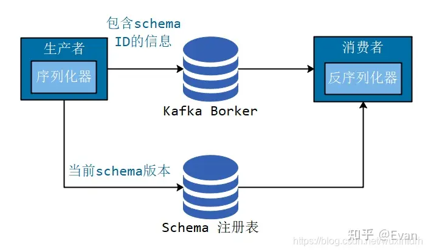
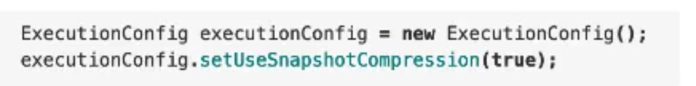

## docker compose 部署的坑
___
1、如果我们只使用别人已经编好的 docker 镜像， 可以不用编写 Dockerfile。如果我们想将自己的项目打包进 docker 容器并运行
则需要编写 Dockerfile 文件，并在 docker-compose.yml 文件中引用这个 Dockerfile 
2、docker compose 运行过程中不停提示 volumes type 没有设置，经过 google 说是 volumes 的配置中不能有空格，需要在底层添加
volumes:
  backend:

3、最大的一个坑就是配置 flink sql-client 的时候 Dockerfile 中配置的 ENTRYPOINT; ["/docker-entrypoint.sh"] 在进入 docker 后始终提示 Error response from daemon: failed to create shim task: OCI runtime create failed: runc create failed: unable to start container process: exec: "/docker-entrypoint.sh": permission denied: unknown
经过 google 查询说是这个文件没有权限，后来仔细观察说是在 本机上该文件就没有 x 执行权限
因此在 docker-compose.yml 增加命令 RUN chmod +x /docker-entrypoint.sh。增加这个命令后，仍然不管用，就继续 google
后来在 docker 官网的论坛上发现一个帖子 https://forums.docker.com/t/entrypoint-sh-permission-denied-issue/91473
要用命令 docker-compose build --no-cache 重新 build 下 docker-compose ，终于解决问题
其实如果不增加   RUN chmod +x /docker-entrypoint.sh 这个命令 , docker-entrypoint.sh 如果在本机是 可执行的或者通过 chmod +x /docker-entrypoint.sh 改为可执行，然后重新 docker-compose build --no-cache 也可以

## 有关 Kafka 镜像

wurstmeister/kafka、confluentinc/cp-kafka 和 bitnami/kafka 是三个常见的Docker镜像，用于在Docker容器中运行Apache Kafka。

* wurstmeister/kafka: 这个镜像由wurstmeister团队维护，提供了一个简化的Kafka部署方案。它是基于开源项目wurstmeister/kafka-docker构建的，适用于开发和测试环境。该镜像的特点是易于使用和快速启动，但可能在生产环境中缺乏某些高级功能和优化。

* confluentinc/cp-kafka: 这个镜像由Confluent公司维护，是Kafka的官方镜像之一。Confluent是一个提供企业级Kafka解决方案的公司，他们的镜像提供了更全面和功能齐全的Kafka部署。该镜像包含了Confluent平台的其他组件，例如Schema Registry、Kafka Connect等，适合构建复杂的Kafka集群和生产环境。

* bitnami/kafka: 这个镜像由Bitnami维护，Bitnami是一个提供各种流行应用的Docker镜像和软件包的公司。bitnami/kafka镜像提供了一个简单且易于使用的Kafka部署。它包括了Kafka和ZooKeeper，并且具有与Bitnami其他镜像一样的一致性和易用性。

这些镜像都提供了方便的方法来在Docker容器中部署和运行Kafka。选择使用哪个镜像取决于你的需求和使用场景。如果你需要一个简单且轻量级的Kafka部署，可以选择wurstmeister/kafka。如果你需要一个功能齐全且适用于生产环境的Kafka解决方案，可以选择confluentinc/cp-kafka。如果你想要一个易于使用和快速启动的Kafka镜像，可以选择bitnami/kafka。

### kafka Schema Registry
一、为什么需要Schema-Registry

1.1、注册表

无论是 使用传统的Avro API自定义序列化类和反序列化类 还是 使用Twitter的Bijection类库实现Avro的序列化与反序列化，这两种方法都有一个缺点：在每条Kafka记录里都嵌入了schema，这会让记录的大小成倍地增加。但是不管怎样，在读取记录时仍然需要用到整个 schema，所以要先找到 schema。有没有什么方法可以让数据共用一个schema？

Confluent 公司为了能让 Kafka 支持 Avro 序列化，创建了 Kafka Schema Registry 项目，项目地址为 https://github.com/confluentinc/schema-registry 。对于存储大量数据的 kafka 来说，使用 Avro 序列化，可以减少数据的存储空间提高了存储量，减少了序列化时间提高了性能。 Kafka 有多个topic，里面存储了不同种类的数据，每种数据都对应着一个 Avro schema 来描述这种格式。Registry 服务支持方便的管理这些 topic 的schema，它还对外提供了多个 restful 接口，用于存储和查找。

我们遵循通用的结构模式并使用"schema注册表"来达到目的。"schema注册表"的原理如下：

1、把所有写入数据需要用到的 schema 保存在注册表里，然后在记录里引用 schema ID。

2、负责读取数据的应用程序使用 ID 从注册表里拉取 schema 来反序列化记录。

3、序列化器和反序列化器分别负责处理 schema 的注册和拉取。

schema注册表并不属于Kafka，现在已经有一些开源的schema 注册表实现。比如 docker 镜像使用到的 Confluent Schema Registry。

1.2、为什么使用 Avro

Avro 序列化相比常见的序列化（比如 json）会更快，序列化的数据会更小。相比 protobuf ，它可以支持实时编译，不需要像 protobuf 那样先定义好数据格式文件，编译之后才能使用。

1.3、Confluent Schema-Registry

Confluent公司为了能让 Kafka 支持 Avro 序列化，创建了 Kafka Schema Registry 项目，项目地址为 https://github.com/confluentinc/schema-registry 。对于存储大量数据的 kafka 来说，使用 Avro 序列化，可以减少数据的存储空间提高了存储量，减少了序列化时间提高了性能。 Kafka 有多个topic，里面存储了不同种类的数据，每种数据都对应着一个 Avro schema 来描述这种格式。Registry 服务支持方便的管理这些 topic 的schema，它还对外提供了多个 `restful` 接口，用于存储和查找。

## RocksDBState 使用建议

#### 不要创建过多的 state

* 每个 state 都占用 rocksdb 的一个 column family, 独占 write buffer, 过多的 state 会导致占据过多的 write buffer
* 根本上还是 RocksDB Statebackend 的 native 内存无法直接管理.

大致上 rocksdb 的内存使用分为一下三个部分：

block cache（rocksdb 的读缓存，整个db 共享） + writebuffer_num * writebuffer_size + index*filter

## Checkpoint 使用建议：

#### Checkpoint 间隔不要太短

* 一般 5min 级别足够
  * 虽然 flink 支持 秒级的 checkpoint, 但是频繁的 checkpoint 会导致集群不稳定
* Checkpoint 与 record 处理共抢一把锁，Checkpoint 的同步阶段会影响 record 的处理，进而影响 tps 

#### 合理设置超时时间

* 默认的超时时间是 10 分钟，如果 state 规模大 或者有 反压的请，则需要合理配置，最坏的情况是创建速度大于删除速度，导致磁盘空间不可用

#### FsStateBackend 可以考虑文件压缩

* 对于刷出去的文件可以考虑使用压缩来减少 Checkpoint 体积

