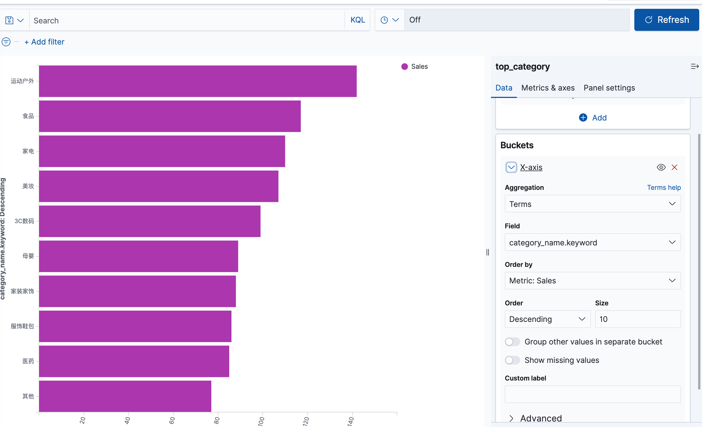

## Flink Sql 用户行为统计实战

根据阿里天池用户行为数据集(https://tianchi.aliyun.com/dataset/649, 将用户行为数据写入 kafka, 然后通过 flinkSql 的各种sql 语句实时统计用户行为。参考了 如下源码 https://gitee.com/geektime-geekbang/geektime-Flink/blob/master/project-3-table-and-sql/src/main/resources/project-sql

相关的官方 blog 如下：

https://flink.apache.org/2020/07/28/flink-sql-demo-building-an-end-to-end-streaming-application/

### 通过 python 脚本将数据导入 Kafka 中

```python

import pandas as pd
import json
import sys
from datetime import datetime
from pandas.core.frame import DataFrame


def main():
    # 第一个参数
    file_path = sys.argv[1]
    headN = True
    exportSql = False
    if (len(sys.argv) > 2):
        headN = strToBool(sys.argv[2])
    if (len(sys.argv) > 3):
        exportSql = strToBool(sys.argv[3])
    df = pd.read_csv(file_path, header=None)
    max = 10
    i = 0
    if (exportSql == True):
        exportMysql(df, headN, max)
        return

    for row in df.itertuples():
        # datetime.strptime str parse time, datetime.strftime datetime's format
        # 由于第 5 列就是 timestamp ，因此用不上 string datetime 到 timestamp 的转换了
        # int(datetime.strptime(row[6],"%Y/%m/%d %H:%M").timestamp()*1000)
        if (row[1] == None or row[1] <= 0):
            continue

        userBehavior = {
            "user_id": row[1],
            "item_id": row[2],
            "category_id": row[3],
            "behavior": str(row[4]),
            "event_ts": row[5],
            "event_time": str(row[6])
        }
        print(json.dumps(userBehavior))
        i = i+1
        if (i >= max):
            break


def exportMysql(df: DataFrame, headN: bool, max: int):
    ...


def strToBool(str):
    return True if str.lower() == 'true' else False


if __name__ == "__main__":
    main()
```
### Flink Sql 用户行为分析：统计每小时的成交量

主要的 UserBehavior 表的 DDL 如下：
```sql
CREATE TABLE user_behavior (
    user_id BIGINT,
    item_id BIGINT,
    category_id BIGINT,
    behavior STRING,
    event_ts BIGINT,
    ts AS TO_TIMESTAMP(FROM_UNIXTIME(event_ts, 'yyyy-MM-dd HH:mm:ss')), -- 定义事件时间
    proctime as PROCTIME(),
    WATERMARK FOR ts AS ts - INTERVAL '5' SECOND
) WITH (
    'connector.type' = 'kafka',
    'connector.version' = '0.11',
    'connector.topic' = 'user_behavior_full',
    'connector.startup-mode' = 'latest-offset',
    'connector.properties.zookeeper.connect' = 'localhost:2181',
    'connector.properties.bootstrap.servers' = 'localhost:9092',
    'update-mode' = 'append',
    'format.type' = 'json'
);

```

请参考 project.sql


### 提交作业

这个过程仍然是很辛苦，各种 jar 包缺失
最先提示 flink-connector-elasticsearch 确实，我把这个包 cp 到 flink/lib 目录下，提示缺少 类 XContentType，再把 ES 的包扔进去
但是 ES 的包又依赖 HttpCode，以及 Luccen 的一大堆包，这谁受得了。我把我的 Table API 的包直接放到 lib 下，发现都根本启动不起来 sql-client
后面我又专门建立了一个子模块，专门用来将 3 大 flink-connector 打包，主要包括 connetor-jdbc, connector-kafka, connector-elasticsearch

这个子模块命名为 flink-connector-packages. 将该模块打 shade 包，并拷贝到 flink/bin 目录下，仍然提示 如下错误
```text
[ERROR] Could not execute SQL statement. Reason:
org.apache.flink.table.api.NoMatchingTableFactoryException: Could not find a suitable table factory for 'org.apache.flink.table.factories.TableSinkFactory' in
the classpath.

Reason: Required context properties mismatch.

The matching candidates:
org.apache.flink.table.sinks.CsvAppendTableSinkFactory
Mismatched properties:
'connector.type' expects 'filesystem', but is 'elasticsearch'
'format.type' expects 'csv', but is 'json'
```
没办法了，我都崩溃了，我的 connector-packages 里面明明有这个类，我还用 /jar tvf connector-package.jar | grep ElasticSearch 发现相关的类全部都在

这时候我只能死马当活马医了，把原来的 flink-connector-elasticsearch7_2.11-1.11.1.jar 重新拷贝回 flink/lib 目录

重启 sql-client，重新执行插入语句，提交作业，卧槽。。。。。成功了居然。。。。

虽然看日志，TaskManager 执行失败，但是我已经看到了胜利的曙光。。。。

查看 taskmanager 的日志，发现居然是 apache common 的一个类 CommandBuilder.option 类未找到，于是重启 flink 集群单机版，重新建表，重新提交 insert sql 的任务，
卧槽。。。。成功过了，我都哭了，太不容易了，搞了 2-3 天了，精美图附上：


作业提交以后，通过 python 命令，向 kafka 提交数据源。


### 寻找 用户行为天池数据集

天池数据集的官方地址是 https://tianchi.aliyun.com/dataset/649，
可能是阿里出于数据安全的考虑，不让下载，反着我死活下载不下来
最后 google 了 1 个小时左右，发现了一个大佬的文章，从他推荐的 github 下载地址 github(https://raw.githubusercontent.com/zq2599/blog_download_files/master/files/UserBehavior.7z?spm=a2c6h.12873639.article-detail.9.2de457b7BX1F8s&file=UserBehavior.7z) 下载了 50M 的数据,原始数据 900 多M)，基本能使用了。

ps: 后来继续参考 吴翀的 blog，发现他更牛，把这个数据 300 多M 放到他的 open google drive 上。地址如下：
https://github.com/wuchong/flink-sql-demo/blob/master/README.md 数据源说明地址
https://drive.google.com/file/d/1P4BAZnpCY-knMt5HFfcx3onVjykYt3et/view?usp=sharing 数据源地址

最后的结果图如下：


## 10 分钟内的 pv 统计

有了前面的步骤，我们这里就只需复制粘贴 相关的 pv 创建的 Flink SQL DDL 语句，提交作业了。

但是这里有个问题，就是 PV 统计 的效果不怎么好，根据 上述的官方博客的截图，跟我对比差距很大，不知道是不是我数据源少的原因，后面按照官方的步骤，在 docker 环境中重新部署一套，然后使用最新的数据集进行比对。
我本机的运行图如下：


## Flink Sql TopN 类目统计

TopN 的类目统计，用到了 维表的 join 查询，有关 维表的 join 查询的解释说明，请参考官方文档
https://nightlies.apache.org/flink/flink-docs-release-1.11/zh/dev/table/streaming/joins.html

为了能跑通 Flink-Sql 和 MySql ，我就先手工创建了 category 表，然后 直接在 flink-sql 的客户端进行查询

这个过程 也耗费了我不少时间。总结一下就是，主要有如下 3 点 需要注意的地方：
* 1、flink-connector-jdbc 这个jar 包要放到 flink/lib 目录下
* 2、因为我本机的 mysql 版本是 8.0, 因此之前常用的驱动类 "com.mysql.jdbc.Driver" 已经不存在了，Mysql 8.0 的驱动类是 "com.mysql.cj.jdbc.Driver" 相关的 驱动的 jar 包也要放到 flink/lib 目录下，而且 Flink Sql DDL 的 with 语句的驱动类也要修改
* 3、MySql DDL 的 with 子句中的 'connector.type' = 'jdbc' 而不是 'connector.type' = 'mysql', 这是我手误了，也排查了一段时间。

### 创建 mysql 的维表

```sql
-- 使用 root账户创建 flink 数据库和数据表
create database flink;
create user 'flink'@'localhost' identified by '123456';
--授权
grant all on flink.* to 'flink'@'localhost'

--退出登录，用 flink 登录
mysql -uflink -p

mysql> show databases;
+--------------------+
| Database           |
+--------------------+
| flink              |
| information_schema |
+--------------------+

-- 用 flink 账户创建 维表 category

create table category (
    sub_category_id bigint not null primary key,
    parent_category_id bigint not null,
    create_time DATETIME NOT NULL DEFAULT CURRENT_TIMESTAMP
)
```

### 编写 python 脚本文件 生成 sql 数据, 并执行导入命令

``` python
def exportMysql(df: DataFrame, headN: bool, max: int):
    i = 0
    sql = "insert into category(sub_category_id,parent_category_id) select {cat_id}, {cat_pid} on duplicate key update create_time = now();"
    for row in df.itertuples():
        print(sql.format(cat_id=row[3], cat_pid=row[3] % 10))
        i = i+1
        if (headN == True and i >= max):
            break
```

执行导入命令

```sh
python3 exportUserBehavior.py UserBehavior.csv False True | mysql -u flink -p -h localhost -P 3306 -D flink
```
查看导入条数

```sql
mysql> select count(1) from category;
+----------+
| count(1) |
+----------+
|     5859 |
+----------+
```

### Lookup Join 说明

lookup join 通常用于从外部系统查的数据来丰富表。join 要求一个表具有处理时间属性，另一个表由查找数据源连接器(lookup source connector) 支持。
lookup join 使用**右表** 作为查找源的连接器。下面的例子展示了 Lookup join 的语法：

```sql
-- Customers is backed by the JDBC connector and can be used for lookup joins
CREATE TEMPORARY TABLE Customers (
  id INT,
  name STRING,
  country STRING,
  zip STRING
) WITH (
  'connector' = 'jdbc',
  'url' = 'jdbc:mysql://mysqlhost:3306/customerdb',
  'table-name' = 'customers'
);

-- enrich each order with customer information
SELECT o.order_id, o.total, c.country, c.zip
FROM Orders AS o
  JOIN Customers FOR SYSTEM_TIME AS OF o.proc_time AS c
    ON o.customer_id = c.id;
```

在上面的示例中，Orders 表由保存在 Mysql 数据库中的 Customers 来丰富。带有后续 process time 属性的 FOR SYSTEM_TIME AS OF 子句确保在联接运算符处理 Orders 行时，Orders 的每一行都与 join 条件的 匹配的 Customer 行连接。它还防止连接的 Customer 表在未来发生便跟时更新连接结果。lookup join 还需要一个强制的相等连接条件，在上面的示例中是 o.customer_id = c.id。

其他说明：

与 regular joins 相比，就算 build side（例子中的 currency_rates 表）发生变更了，之前的 temporal table 的结果也不会被影响。
(对我们当前的例子来说，就是就算 user_behavior 发生变更，flink 的 category 视图也不会发生变更) 与 interval joins 对比，temporal join没有定义join的时间窗口。 Probe side （例子中的 orders 表）的记录总是在 time 属性指定的时间与 build side 的版本行进行连接。因此，build side 表的行可能已经过时了。 随着时间的推移，不再被需要的记录版本（对于给定的主键）将从状态中删除。

参考 fink 官方文档 对 join 的描述

https://nightlies.apache.org/flink/flink-docs-release-1.18/zh/docs/dev/table/sql/queries/joins/


### 创建分类视图，提交作业

通过上面对 Lookup join 的描述，我们能知道 flink sql 里面 join 的含义，跟 mysql 的 join 确实还有些不同的。接下来我们用 Flink Sql 的 join 关键字来实现 Flink Sql 和 MySql 的维表关联

```sql
CREATE VIEW view_rich_user_behavior AS
SELECT u.user_id,u.item_id, u.behavior,
CASE c.parent_category_id
    WHEN 0 THEN '服饰鞋包'
    WHEN 1 THEN '家装家饰'
    WHEN 2 THEN '家电'
    WHEN 3 THEN '美妆'
    WHEN 4 THEN '母婴'
    WHEN 5 THEN '3C数码'
    WHEN 6 THEN '运动户外'
    WHEN 7 THEN '食品'
    WHEN 8 THEN '医药'
    ELSE '其他'
END AS category_name
FROM user_behavior AS u LEFT JOIN category_dim FOR SYSTEM_TIME AS OF u.proctime AS c
ON u.category_id = c.sub_category_id;
```
通过第一个步的 python 脚本，我们了解到 我生成 parent_category_id 的原则是个位数取余，而 吴翀 的 github 里面(在上面天池数据收集的地方有提到)，直接给出一个 上万行的 sql , 我看了下，里面的规律是每 10 个的 pid 编号分别是 1...8,1,10 这样，等于 1 这个编号就人为的多了，这个只是构造方式的不同，我这里认为我的更合理。


最后是提交作业，然后在 kibana 中查看

```sql
INSERT INTO top_category
SELECT category_name, COUNT(*) AS buy_cnt
FROM view_rich_user_behavior
WHERE behavior = 'buy'
GROUP BY category_name;
```

提交作业之后，就可以在 kibana 中查看，如下图所示：




## 参考文档

https://blog.csdn.net/appleyuchi/article/details/111291084
这个参考文档在我看到 吴翀 的 java sql datatime 格式生成之前，ts 的 bitint 格式转成 flink sql 的 timestamp 费了我好长时间，不是不知道怎么转化，而是 Flink Sql 的语法太骚，直接将原字段上声明为 TIMESTAMP(3), 而我拿到的这个数据确实是秒级别的时间戳，我以为 Flink Sql 会自动转换，后来在官方发现了说 Flink SQL 根本不支持 bigint 直接转换成 timestamp。既然不支持，那我就用官方示例的 用 bigint 直接转换成 timestamp_ltz 功能，timestamp_ltz 在 Flink 1.11.1 不支持，又吐了，最后找到上面这篇文章，是 Flink Sql 1.12 版本的，里面明确提出了在 DDL 中新增一个逻辑字段，并且应用相关 TIMESTAMP 函数将 bigint 转换成 timestamp 字段，解决了我 第一个 作业一旦运行就失败的问题，这个问题也困扰了我一段时间。

https://learn.microsoft.com/en-us/azure/hdinsight-aks/flink/create-kafka-table-flink-kafka-sql-connector

参考这个文档，我写出了 python 导入数据的脚本，另外这个文档复盘说明也在 connector.md 有表述，虽然误导了我很多地方，但是 写 python 脚本 通过重定向 方式 导入到 kafka-console-producer 的方式我还是第一次用，挺新奇的，比 吴翀博客里面用 java 的 kafka producer 客户端高级多了；而且后来的用 python 脚本生成 sql 语句，然后重定向到 mysql 也是这种方式，完全无压力，牛！

https://nightlies.apache.org/flink/flink-docs-release-1.11/zh/dev/table/sql/create.html

第三篇文章就是 FLink Sql 1.11.1 的官方文档了，毕竟是官方的，还是需要经常翻阅，里面的知识点很多，需要经常翻看


https://flink.apache.org/2020/07/28/flink-sql-demo-building-an-end-to-end-streaming-application/
https://github.com/wuchong/flink-sql-demo/blob/master/README.md
https://wuchong.me/blog/2020/02/25/demo-building-real-time-application-with-flink-sql/

这三篇文章就是本次 Flink Sql 学习的终极参考文章，也是都是吴翀大佬的博客，第一篇应该是他发表在flink 官网的，中间一篇是他的 这个小项目的 github 源码，最后一篇文章是他的这篇文章的中文翻译版本，都很吊